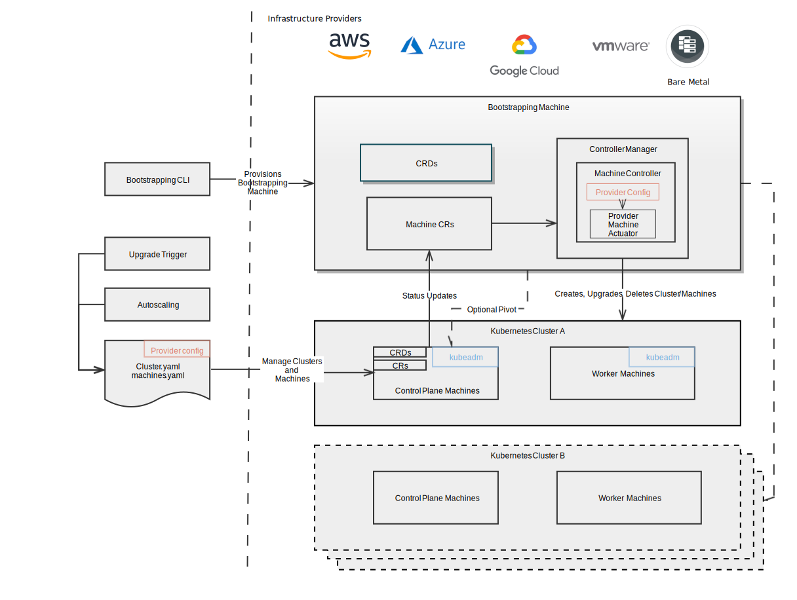

# Cluster API
## What is the Cluster API?

The Cluster API is a Kubernetes project to bring declarative, Kubernetes-style
APIs to cluster creation, configuration, and management. It provides optional,
additive functionality on top of core Kubernetes.

Note that Cluster API effort is still in the prototype stage while we get
feedback on the API types themselves. All of the code here is to experiment with
the API and demo its abilities, in order to drive more technical feedback to the
API design. Because of this, all of the prototype code is rapidly changing.

To learn more, see the [Cluster API KEP][cluster-api-kep].

## Get involved!

* Join the [sig-cluster-lifecycle](https://groups.google.com/forum/#!forum/kubernetes-sig-cluster-lifecycle)
Google Group for access to documents and calendars.

* Join our Cluster API working group sessions
  * Weekly on Wednesdays @ 10:00 PT on [Zoom][zoomMeeting]
  * Previous meetings: \[ [notes][notes] | [recordings][recordings] \]

* Provider implementer office hours
  * Weekly on Tuesdays @ 12:00 PT ([Zoom][providerZoomMeetingTues]) and Wednesdays @ 15:00 CET ([Zoom][providerZoomMeetingWed])
  * Previous meetings: \[ [notes][implementerNotes] \]

* Chat with us on [Slack](http://slack.k8s.io/): #cluster-api

## Provider Implementations

The code in this repository is independent of any specific deployment environment.
Provider specific code is being developed in separate repositories, some of which
are also sponsored by SIG-cluster-lifecycle:

  * AWS, https://github.com/kubernetes-sigs/cluster-api-provider-aws
  * AWS/Openshift, https://github.com/openshift/cluster-operator
  * Azure, https://github.com/kubernetes-sigs/cluster-api-provider-azure
  * Baidu Cloud, https://github.com/baidu/cluster-api-provider-baiducloud
  * DigitalOcean, https://github.com/kubernetes-sigs/cluster-api-provider-digitalocean
  * GCE, https://github.com/kubernetes-sigs/cluster-api-provider-gcp
  * OpenStack, https://github.com/kubernetes-sigs/cluster-api-provider-openstack
  * Tencent Cloud, https://github.com/TencentCloud/cluster-api-provider-tencent
  * vSphere, https://github.com/kubernetes-sigs/cluster-api-provider-vsphere

## API Adoption

Following are the implementations managed by third-parties adopting the standard cluster-api and/or machine-api being developed here.

  * Kubermatic machine-controller, https://github.com/kubermatic/machine-controller/tree/master
  * Machine API Operator, https://github.com/openshift/machine-api-operator/tree/master
  * Machine-controller-manager, https://github.com/gardener/machine-controller-manager/tree/cluster-api

## Getting Started

### Resources

* GitBook: [kubernetes-sigs.github.io/cluster-api](https://kubernetes-sigs.github.io/cluster-api)

### Prerequisites
* `kubectl` is required, see [here](http://kubernetes.io/docs/user-guide/prereqs/).
* `clusterctl` is a SIG-cluster-lifecycle sponsored tool to manage Cluster API clusters. See [here](cmd/clusterctl)

[cluster-api-kep]: https://github.com/kubernetes/enhancements/blob/master/keps/sig-cluster-lifecycle/0003-cluster-api.md
[notes]: https://docs.google.com/document/d/1Ys-DOR5UsgbMEeciuG0HOgDQc8kZsaWIWJeKJ1-UfbY/edit
[recordings]: https://www.youtube.com/playlist?list=PL69nYSiGNLP29D0nYgAGWt1ZFqS9Z7lw4
[zoomMeeting]: https://zoom.us/j/861487554
[implementerNotes]: https://docs.google.com/document/d/1IZ2-AZhe4r3CYiJuttyciS7bGZTTx4iMppcA8_Pr3xE/edit
[providerZoomMeetingTues]: https://zoom.us/j/140808484
[providerZoomMeetingWed]: https://zoom.us/j/424743530
