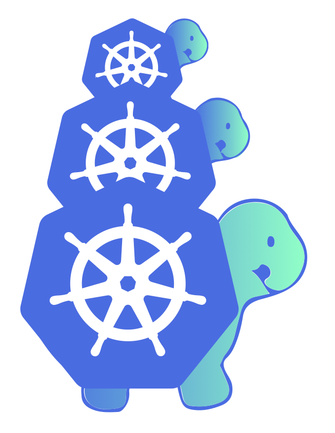

# Cluster API

### 👋 Welcome to our project! Our [Book](https://cluster-api.sigs.k8s.io) can help you get started and provides lots of in-depth information.

#### Useful links
- [Scope, objectives, goals and requirements](./docs/scope-and-objectives.md)
- [Feature proposals](./docs/proposals)
- [Reference use cases](./docs/staging-use-cases.md)
- [Quick Start](https://cluster-api.sigs.k8s.io/user/quick-start.html)

## ✨ What is the Cluster API?

Cluster API is a Kubernetes sub-project focused on providing declarative APIs and tooling to simplify provisioning, upgrading, and operating multiple Kubernetes clusters.

Started by the Kubernetes Special Interest Group (SIG) Cluster Lifecycle, the Cluster API project uses Kubernetes-style APIs and patterns to automate cluster lifecycle management for platform operators. The supporting infrastructure, like virtual machines, networks, load balancers, and VPCs, as well as the Kubernetes cluster configuration are all defined in the same way that application developers operate deploying and managing their workloads. This enables consistent and repeatable cluster deployments across a wide variety of infrastructure environments.

### ⚙️ Providers

Cluster API can be extended to support any infrastructure (AWS, Azure, vSphere, etc.), bootstrap or control plane (kubeadm is built-in) provider. There is a growing list of [supported providers](https://cluster-api.sigs.k8s.io/reference/providers.html) available.

<!-- ANCHOR: Community -->

## 🤗 Community, discussion, contribution, and support

Cluster API is developed in the open, and is constantly being improved by our users, contributors, and maintainers. It is because of you that we are able to automate cluster lifecycle management for the community. Join us!

If you have questions or want to get the latest project news, you can connect with us in the following ways:

- Chat with us on the Kubernetes [Slack](http://slack.k8s.io/) in the [#cluster-api][#cluster-api slack] channel
- Subscribe to the [SIG Cluster Lifecycle](https://groups.google.com/forum/#!forum/kubernetes-sig-cluster-lifecycle) Google Group for access to documents and calendars
- Participate in the conversations on [Kubernetes Discuss][kubernetes discuss]
- Join our Cluster API working group sessions where we share the latest project news, demos, answer questions, and triage issues
    - Weekly on Wednesdays @ 10:00 PT on [Zoom][zoomMeeting]
    - Previous meetings: \[ [notes][notes] | [recordings][recordings] \]

Pull Requests and feedback on issues are very welcome!
See the [issue tracker] if you're unsure where to start, especially the [Good first issue] and [Help wanted] tags, and
also feel free to reach out to discuss.

See also our [contributor guide](CONTRIBUTING.md) and the Kubernetes [community page] for more details on how to get involved.

### Code of conduct

Participation in the Kubernetes community is governed by the [Kubernetes Code of Conduct](code-of-conduct.md).

[community page]: https://kubernetes.io/community
[notes]: https://docs.google.com/document/d/1LdooNTbb9PZMFWy3_F-XAsl7Og5F2lvG3tCgQvoB5e4
[recordings]: https://www.youtube.com/playlist?list=PL69nYSiGNLP29D0nYgAGWt1ZFqS9Z7lw4
[zoomMeeting]: https://zoom.us/j/861487554
[implementerNotes]: https://docs.google.com/document/d/1IZ2-AZhe4r3CYiJuttyciS7bGZTTx4iMppcA8_Pr3xE/edit
[providerZoomMeetingTues]: https://zoom.us/j/140808484
[providerZoomMeetingWed]: https://zoom.us/j/424743530
[issue tracker]: https://github.com/kubernetes-sigs/cluster-api/issues
[#cluster-api slack]: https://kubernetes.slack.com/archives/C8TSNPY4T
[kubernetes discuss]: https://discuss.kubernetes.io/c/contributors/cluster-api
[Good first issue]: https://github.com/kubernetes-sigs/cluster-api/issues?q=is%3Aopen+is%3Aissue+label%3A%22good+first+issue%22
[Help wanted]: https://github.com/kubernetes-sigs/cluster-api/issues?utf8=%E2%9C%93&q=is%3Aopen+is%3Aissue+label%3A%22help+wanted%22+

<!-- ANCHOR_END: Community -->
