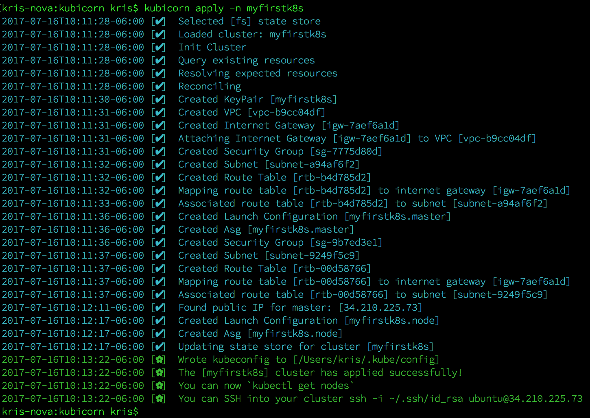

# Setting up Kubernetes in AWS

In the following, we're going to show you how to use `kubicorn` to ramp up a Kubernetes cluster in AWS, use it and tear it down again.

As a prerequisite, you need to have `kubicorn` installed. Since we don't have binary releases yet, we assume you've got Go installed and simply do:

#### Installing

```
$ go get github.com/kris-nova/kubicorn
```

The first thing you will do now is to define the cluster resources.
For this, you need to select a certain profile. Of course, once you're more familiar with `kubicorn`, you can go ahead and extend existing profiles or create new ones.
In the following we'll be using an existing profile called `aws`, which is—surprise, surprise—a profile for a cluster in AWS.

#### Creating

Now execute the following command:

```
$ kubicorn create myfirstk8s --profile aws
```

Verify that `kubicorn create` did a good job by executing:

```
$ cat _state/myfirstk8s/cluster.yaml
```

#### Authenticating

We're now in a position to have the cluster resources defined, locally, based on the selected profile.
Next we will apply the so defined resources using the `apply` command, but before we do that we'll set up the access to AWS.
You might want to create a new [IAM user](http://docs.aws.amazon.com/IAM/latest/UserGuide/id_users_create.html) for this with the following permissions:


Next, export the two environment variables `AWS_ACCESS_KEY_ID` and `AWS_SECRET_ACCESS_KEY` so that `kubicorn` can pick it up in the next step:

```
$ export AWS_ACCESS_KEY_ID=***************
$ export AWS_SECRET_ACCESS_KEY=*****************************************
```

Also, make sure that the public SSH key for your AWS account is called `id_rsa.pub`, which is the default in above profile:

```
$ ls -al ~/.ssh/id_rsa.pub
-rw-------@ 1 mhausenblas  staff   754B 20 Mar 04:03 /Users/mhausenblas/.ssh/id_rsa.pub
```

#### Applying

With the access set up, we can now apply the resources we defined in the first step. 
This actually creates resources in AWS. Up to now we've only been working locally.

So, execute:

```
$ kubicorn apply myfirstk8s
```

Now `kubicorn` will reconcile your intended state against the actual state in the cloud, thus creating a Kubernetes cluster.
A `kubectl` configuration file (kubeconfig) will be created or appended for the cluster on your local filesystem.
You can now `kubectl get nodes` and verify that Kubernetes 1.7.0 is now running.
You can also `ssh` into your instances using the example command found in the output from `kubicorn`



#### Deleting

To delete your cluster run:

```
$ kubicorn delete myfirstk8s
```

Congratulations, you're an official `kubicorn` user now and might want to dive deeper,
for example, learning how to define your own [profiles](https://github.com/kris-nova/kubicorn/tree/master/profiles).
