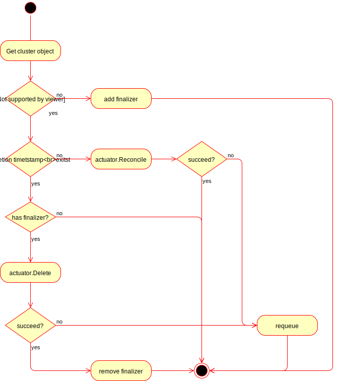
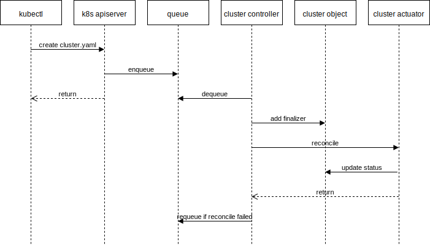

# Cluster Resources

A `Cluster` represents the global configuration of a Kubernetes cluster.


## Cluster

Cluster has 4 fields:

`Spec` contains the desired cluster state specified by the object. While much
of the `Spec` is defined by users, unspecified parts may be filled in with
defaults or by Controllers such as autoscalers.

`Status` contains only observed cluster state and is only written by
controllers. `Status` is not the source of truth for any information, but
instead aggregates and publishes observed state.

`TypeMeta` contains metadata about the API itself - such as Group, Version,
Kind.

`ObjectMeta` contains metadata about the specific object instance, for example,
it's name, namespace, labels, and annotations, etc. `ObjectMeta` contains data
common to most objects.


[import:'Cluster'](../../../pkg/apis/cluster/v1alpha1/cluster_types.go)



## ClusterSpec

The `ClusterNetwork` field includes the information necessary to configure
kubelet networking for `Pod`s and `Service`s.

The `ProviderSpec` is recommended to be a serialized API object in a format
owned by that provider. This will allow the configuration to be strongly typed,
versioned, and have as much nested depth as appropriate. These provider-specific
API definitions are meant to live outside of the Cluster API, which will allow
them to evolve independently of it.


[import:'ClusterSpec'](../../../pkg/apis/cluster/v1alpha1/cluster_types.go)



## ClusterStatus

Like `ProviderSpec`, `ProviderStatus` is recommended to be a serialized API
object in a format owned by that provider.

Some providers use the `APIEndpoint` field to determine when one or more
control plane machines have been provisioned. This may be necessary before worker nodes
can be provisioned. For example, `cluster-api-provider-gcp` does [this](
https://github.com/kubernetes-sigs/cluster-api-provider-gcp/blob/f3145d8810a5c7fc434ddb5577699b4deb1b5fa6/pkg/cloud/google/metadata.go#L43):

```go
	if len(cluster.Status.APIEndpoints) == 0 {
		return nil, fmt.Errorf("control plane endpoint not found in apiEndpoints for cluster %v", cluster)
	}
```

**TODO**: Provide examples of how `ErrorReason` and `ErrorMessage` are
used in practice.


[import:'ClusterStatus'](../../../pkg/apis/cluster/v1alpha1/cluster_types.go)



## Cluster Actuator Interface

All methods should be idempotent.

`Reconcile()` will be called whenever there is a change to the `Cluster`
`Spec`, or after every resync period.

If a `Cluster` resource is deleted, the controller will call the actuator's
`Delete()` method until it succeeds, or the [finalizer](
 https://kubernetes.io/docs/tasks/access-kubernetes-api/custom-resources/custom-resource-definitions/#finalizers) is removed (see below).

**TODO**: Determine what the current resync period is.


[import:'Actuator'](../../../pkg/controller/cluster/actuator.go)


## Cluster Controller Semantics

0. If the `Cluster` hasn't been deleted and doesn't have a finalizer, add one.
- If the `Cluster` is being deleted, and there is no finalizer, we're done.
- Call the provider specific `Delete()` method.
  - If the `Delete()` method returns true, remove the finalizer, we're done.
- If the `Cluster` has not been deleted, call the `Reconcile()` method.

[cluster_source]: https://github.com/kubernetes-sigs/cluster-api/blob/master/pkg/apis/cluster/v1alpha1/cluster_types.go

#### cluster object reconciliation logic



#### cluster object creation sequence



#### cluster object deletion sequence


