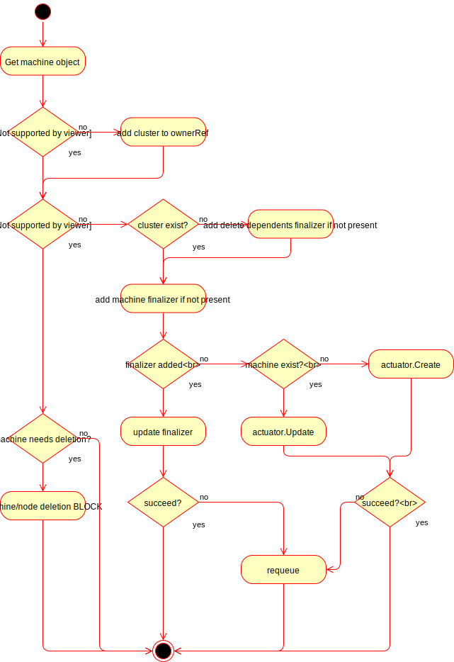
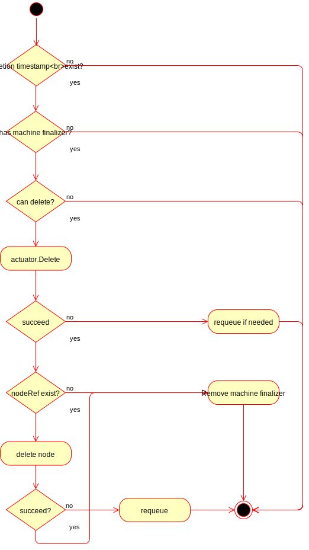
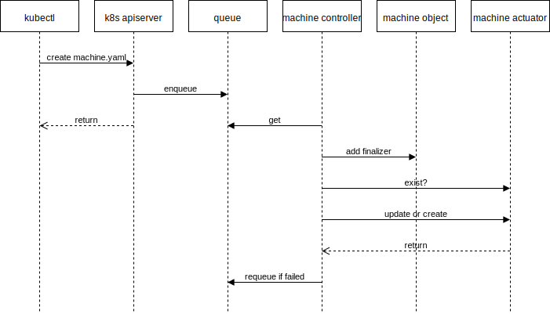

# Machine Controller

A `Machine` is the declarative spec for a `Node`, as represented in Kubernetes
core. If a new Machine object is created, a provider-specific controller will
handle provisioning and installing a new host to register as a new `Node`
matching the Machine spec. If the `Machine`s spec is updated, a provider-
specific controller is responsible for updating the Node in-place or replacing
the host with a new one matching the updated spec. If a `Machine` object is
deleted, the corresponding `Node` should have its external resources released by
the provider-specific controller, and should be deleted as well.

Machines can be associated with a Cluster using a custom label
`cluster.k8s.io/cluster-name`. When the label is set and non-empty,
then it must reference the name of a cluster residing in the same namespace.
The label must be set only once and updates are not permitted,
an admission controller is going to enforce the change in a future version.


## Machine

`Machine` has 4 fields:

`Spec` contains the desired machine state specified by the object. While much
of the `Spec` is defined by users, unspecified parts may be filled in with
defaults or by Controllers such as autoscalers.

`Status` contains only observed machine state and is only written by
controllers. `Status` is not the source of truth for any information, but
instead aggregates and publishes observed state.

`TypeMeta` contains metadata about the API itself - such as Group, Version,
Kind.

`ObjectMeta` contains metadata about the specific object instance, for
example, it's name, namespace, labels, and annotations, etc. `ObjectMeta`
contains data common to most objects.


[import:'Machine'](../../../pkg/apis/cluster/v1alpha1/machine_types.go)



## MachineSpec

The `ProviderSpec` is recommended to be a serialized API object in a format
owned by that provider. This will allow the configuration to be strongly typed,
versioned, and have as much nested depth as appropriate. These provider-specific
API definitions are meant to live outside of the Machine API, which will allow
them to evolve independently of it. Attributes like instance type, which
network to use, and the OS image all belong in the `ProviderSpec`.

Some providers and tooling depend on an annotation to be set on the `Machine`
to determine if provisioning has completed. For example, the `clusterctl`
command does this [here](https://github.com/kubernetes-sigs/cluster-api/blob/a30de81123009a5f91ade870008c1a35f7ce4b35/cmd/clusterctl/clusterdeployer/clusterclient/clusterclient.go#L555):
```go
		// TODO: update once machine controllers have a way to indicate a machine has been provisoned. https://github.com/kubernetes-sigs/cluster-api/issues/253
    // Seeing a node cannot be purely relied upon because the machine running the control plane
    // will not be registering with the stack that provisions it.
		ready := m.Status.NodeRef != nil || len(m.Annotations) > 0
		return ready, nil
```


[import:'MachineSpec'](../../../pkg/apis/cluster/v1alpha1/machine_types.go)



## MachineStatus

Like `ProviderSpec`, `ProviderStatus` is recommended to be a serialized API
object in a format owned by that provider.

Note that `NodeRef` may not be set. This can happen if the `Machine` and
corresponding `Node` are not within the same cluster. Two reasons this might be
the case are:

- During bootstrapping, the control plane `Machine` will initially not be in the same
cluster which is being created.
- Some providers distinguish between _manager_ and _managed_ clusters. For
these providers a `Machine` and it's corresponding `Node` may never be within
the same cluster. **TODO**: There are open issues to address this.


[import:'MachineStatus'](../../../pkg/apis/cluster/v1alpha1/machine_types.go)



## Machine Actuator Interface

All methods should be idempotent. Each time the Machine controller attempts
to reconcile the state it will call one or more of the following actuator
methods.

`Create()` will only be called when `Exists()` returns false.

`Update()` will only be called when `Exists()` returns true.

`Delete()` will only be called when the `Machine` is in the process of being
deleted.

The definition of `Exists()` is determined by the provider.

**TODO**: Provide more guidance on `Exists()`.


[import:'Actuator'](../../../pkg/controller/machine/actuator.go)


## Machine Controller Semantics

0. Determine the `Cluster` associated with the `Machine` from its `cluster.k8s.io/cluster-name` label.
- If the `Machine` hasn't been deleted and doesn't have a finalizer, add one.
- If the `Machine` is being deleted, and there is no finalizer, we're done
  - Check if the `Machine` is allowed to be deleted. [^1]
  - Call the provider specific actuators `Delete()` method.
    - If the `Delete()` method returns true, remove the finalizer.
- Check if the `Machine` exists by calling the provider specific `Exists()`
method.
  - If it does, call the `Update()` method.
  - If the `Update()` fails and returns a retryable error:
    - Retry the `Update()` after N seconds.
- If the machine does not exist, attempt to create machine by calling
  actuator `Create()` method.


The Machine actuator methods expect both a `Cluster` and a `Machine` to be
passed in. While there is not a strong link between `Cluster`s and `Machine`s,
the machine controller will determine which cluster to pass by looking for a
`Cluster` in the same namespace as the `Machine`

There are two consequences of this:
 - The machine actuator assumes there will be exactly one `Cluster` in the
   same namespace as any `Machine`s it reconciles. See [`getCluster()`](
   https://github.com/kubernetes-sigs/cluster-api/blob/2d88aefcf94fcffbf647fcc1127a642112714b2f/pkg/controller/machine/controller.go#L216) for the details.
 - If the `Cluster` is deleted before the `Machine` it will not be possible to
   delete the `Machine`. Therefore `Machine`s must be deleted before `Cluster`s.


#### machine reconciliation logic


#### machine deletion block


#### machine object creation sequence



#### machine object deletion sequence


---

[^1] One reason a `Machine` may not be deleted is if it corresponds to the
node running the Machine controller.

[machine_types_source]: https://github.com/kubernetes-sigs/cluster-api/blob/master/pkg/apis/cluster/v1alpha1/machine_types.go
