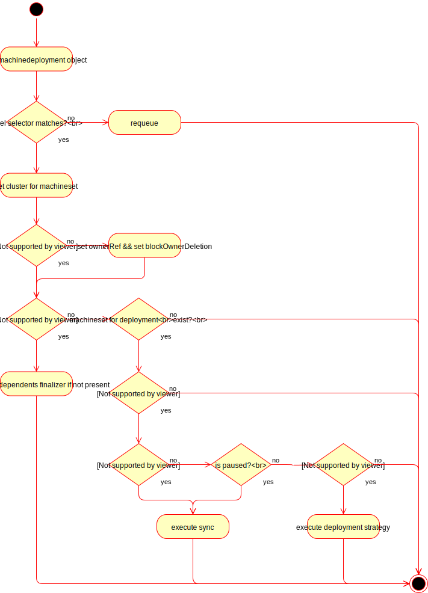

# MachineDeployment Controller


## MachineDeployment


[import:'MachineDeployment'](../../../pkg/apis/cluster/v1alpha1/machinedeployment_types.go)



## MachineDeploymentSpec


[import:'MachineDeploymentSpec'](../../../pkg/apis/cluster/v1alpha1/machinedeployment_types.go)



## MachineDeploymentStrategy


[import:'MachineDeploymentStrategy'](../../../pkg/apis/cluster/v1alpha1/machinedeployment_types.go)



## MachineRollingUpdateDeployment


[import:'MachineRollingUpdateDeployment'](../../../pkg/apis/cluster/v1alpha1/machinedeployment_types.go)




## MachineDeploymentStatus


[import:'MachineDeploymentStatus'](../../../pkg/apis/cluster/v1alpha1/machinedeployment_types.go)


## MachineDeployment Controller Semantics

