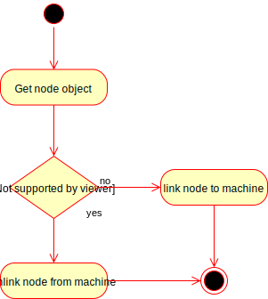

# Node Controller

The node controller has one simple job.  It links or unlinks a `Machine` to the underlying
core k8s `Node` object if an optional annotation `cluster.k8s.io/machine` is present on the `Node`.  The
decision to add the annotation is left to each infrastructure-specific provider.  When the
controller links a `Machine`, it assigns the machine's `Status.NodeRef` to the `Node`'s
objectRef.

The simplest way for Infrastructure-specific providers to add this support is to annotate
nodes in their node bootup script as part of the `kubeadm join` operation (via a commandline
parameter). 

## Node Controller Semantics

The node controller is very simple.  In the current design, a `Machine` will exist before the
backing `Node` is created.  When a node is created and ready, the controller checks if the
annotation exist.  If it does, it links `Node` to the `Machine`.  If the `Node` is slated for
deletion, it unlinks the `Node` from the `Machine`.

#### node reconciliation logic

