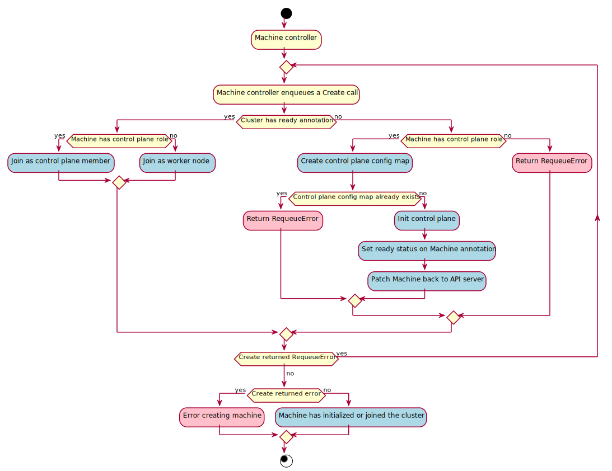

# Machine  Controller



The Machine controller's main responsibilities are:

* Setting an OwnerReference on:
    * Each Machine object to the Cluster object.
    * The associated BootstrapConfig object.
    * The associated InfrastructureMachine object.
* Copy data from `BootstrapConfig.Status.BootstrapData` to `Machine.Spec.Bootstrap.Data` if
`Machine.Spec.Bootstrap.Data` is empty.
* Setting NodeRefs to be able to associate machines and kubernetes nodes.
* Deleting Nodes in the target cluster when the associated machine is deleted.
* Cleanup of related objects.
* Keeping the Machine's Status object up to date with the InfrastructureMachine's Status object.

## Contracts

### Cluster API

Cluster associations are made via labels.

#### Expected labels

| what | label | value | meaning |
| --- | --- | --- | --- |
| Machine | `cluster.x-k8s.io/cluster-name` | `<cluster-name>` | Identify a machine as belonging to a cluster with the name `<cluster-name>`|
| Machine | `cluster.x-k8s.io/control-plane` | `true` | Identifies a machine as a control-plane node |

### Bootstrap provider

The BootstrapConfig object **must** have a `status` object.

To override the bootstrap provider, a user (or external system) can directly set the `Machine.Spec.Bootstrap.Data`
field. This will mark the machine as ready for bootstrapping and no bootstrap data will be copied from the
BootstrapConfig object.

#### Required `status` fields

The `status` object **must** have several fields defined:

* `ready` - a boolean field indicating the bootstrap config data is generated and ready for use.
* `dataSecretName` - a string field referencing the name of the secret that stores the generated bootstrap data.

#### Optional `status` fields

The `status` object **may** define several fields that do not affect functionality if missing:

* `failureReason` - a string field explaining why a fatal error has occurred, if possible.
* `failureMessage` - a string field that holds the message contained by the error.

Example:

```yaml
kind: MyBootstrapProviderConfig
apiVersion: bootstrap.cluster.x-k8s.io/v1alpha3
status:
    ready: true
    dataSecretName: "MyBootstrapSecret"
```

### Infrastructure provider

The InfrastructureMachine object **must** have a `status` object.

#### Required `status` fields

The `status` object **must** have several fields defined:

* `ready` - a boolean field indicating if the infrastructure is ready to be used or not.
* `providerID` - a cloud provider ID identifying the machine. This is often set by the cloud-provider-controller.

#### Optional `status` fields

The `status` object **may** define several fields that do not affect functionality if missing:

* `failureReason` - is a string that explains why a fatal error has occurred, if possible.
* `failureMessage` - is a string that holds the message contained by the error.

Example:
```yaml
kind: MyMachine
apiVersion: infrastructure.cluster.x-k8s.io/v1alpha3
status:
    ready: true
    providerID: cloud:////my-cloud-provider-id
```

### Secrets

The Machine controller will create a secret or use an existing secret in the following format:

| secret name | field name | content |
|:---:|:---:|---|
|`<cluster-name>-kubeconfig`|`value`|base64 encoded kubeconfig that is authenticated with the child cluster|


