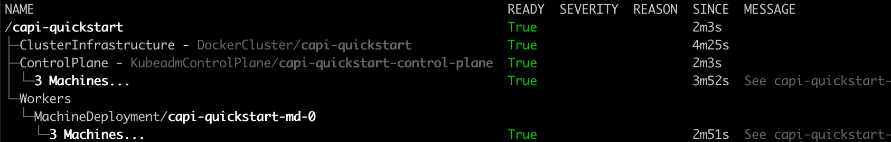
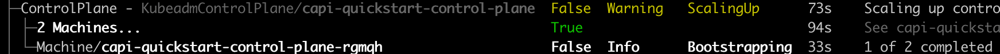
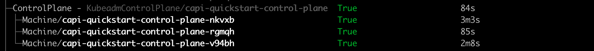
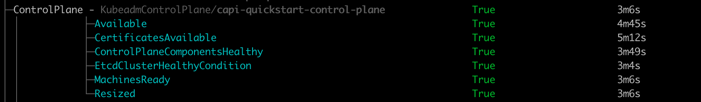

# clusterctl describe cluster

The `clusterctl describe cluster` command provides an "at glance" view of a Cluster API cluster designed
to help the user in quickly understanding if there are problems and where.

For example `clusterctl describe cluster capi-quickstart` will provide an output similar to:

The "at glance" view is based on the idea that clusterctl should avoid to overload the user with information,
but instead surface problems, if any.

In practice, if you look at the `ControlPlane` node, you might notice that the underlying machines
are grouped together, because all of them have the same state (Ready equal to True), so it is not
necessary to repeat the same information three times.

If this is not the case, and machines have different states, the visualization is going to use different lines:

You might also notice that the visualization does not represent the infrastructure machine or the
bootstrap object linked to a machine, unless their state differs from the machine's state.

## Customizing the visualization

By default the visualization generated by `clusterctl describe cluster` hides details for the sake
of simplicity and shortness. However, if required, the user can ask for showing all the detail:

By using the `--disable-grouping` flag, the user can force the visualization to show all the machines
on separated lines, no matter if they have the same state or not:

By using the `--disable-no-echo` flag, the user can force the visualization to show infrastructure machines and
bootstrap objects linked to machines, no matter if they have the same state or not:

It is also possible to force the visualization to show all the conditions for an object (instead of showing
only the ready condition). e.g. with `--show-conditions KubeadmControlPlane` you get:

Please note that this option is flexible, and you can pass a comma separated list of `kind` or `kind/name` for
which the command should show all the object's conditions (use 'all' to show conditions for everything).
