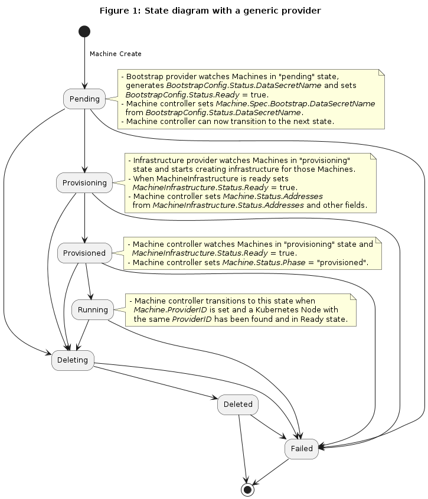

# Bootstrap Controller
<!-- TODO -->
Bootstrapping is the process in which:

1. A cluster is bootstrapped
1. A machine is bootstrapped and takes on a role within a cluster

[CABPK](https://github.com/kubernetes-sigs/cluster-api/tree/main/bootstrap/kubeadm) is the reference bootstrap provider and is based on `kubeadm`. CABPK codifies the steps for [creating a cluster](https://kubernetes.io/docs/setup/production-environment/tools/kubeadm/create-cluster-kubeadm/) in multiple configurations.

See [proposal](https://github.com/kubernetes-sigs/cluster-api/blob/main/docs/proposals/20190610-machine-states-preboot-bootstrapping.md) for the full details on how the bootstrap process works.

### Implementations

* [Kubeadm](https://github.com/kubernetes-sigs/cluster-api/tree/main/bootstrap/kubeadm) (Reference Implementation)
