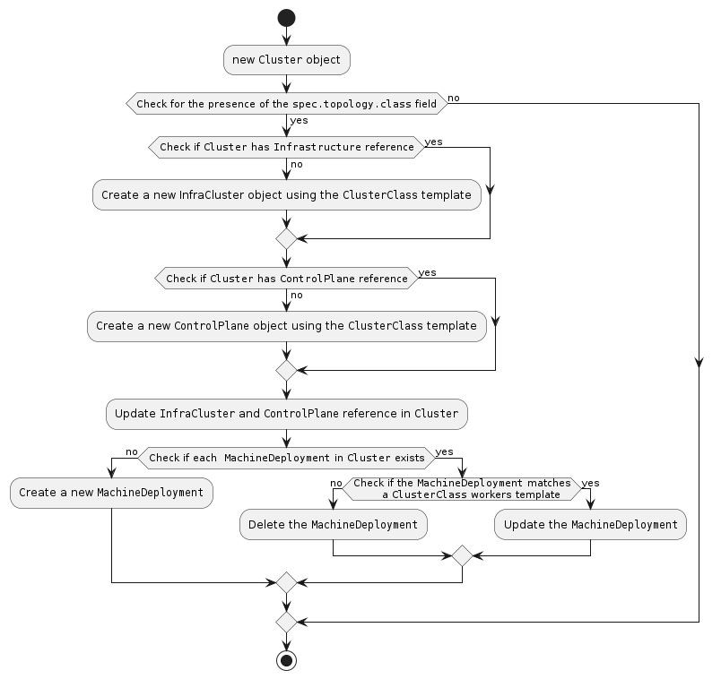
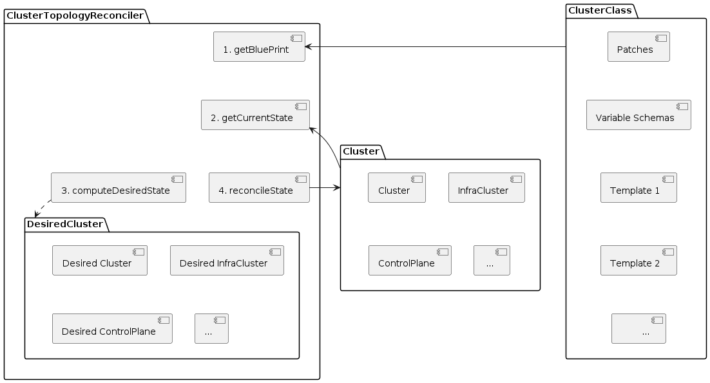

# `ClusterTopology` Controller

The `ClusterTopology` controller reconciles the managed topology of a Cluster, as
shown in the following diagram.

Its main responsibilities are to:
1. Reconcile Clusters based on templates defined in a ClusterClass and managed topology.
2. Create, update, delete managed topologies by continuously reconciling the topology managed resources.
3. Reconcile Cluster-specific customizations of a ClusterClass

The high level workflow of ClusterTopology reconciliation is shown below.

### Additional information

* See ClusterClass [proposal](https://github.com/kubernetes-sigs/cluster-api/blob/main/docs/proposals/20210526-cluster-class-and-managed-topologies.md#basic-behaviors)
