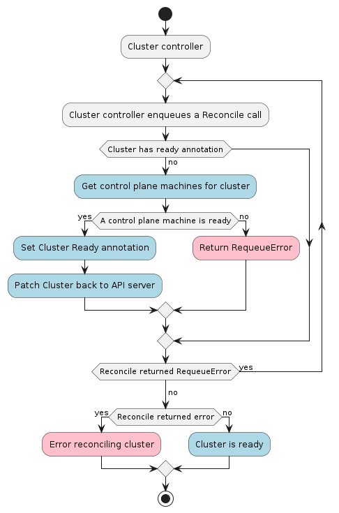

# Cluster Controller



The Cluster controller's main responsibilities are:

* Setting an OwnerReference on the infrastructure object referenced in `Cluster.Spec.InfrastructureRef`.
* Cleanup of all owned objects so that nothing is dangling after deletion.
* Keeping the Cluster's status in sync with the infrastructure Cluster's status.
* Creating a kubeconfig secret for [workload clusters](../../../reference/glossary.md#workload-cluster).

## Contracts

### Infrastructure Provider

The general expectation of an infrastructure provider is to provision the necessary infrastructure components needed to
run a Kubernetes cluster. As an example, the AWS infrastructure provider, specifically the AWSCluster reconciler, will
provision a VPC, some security groups, an ELB, a bastion instance and some other components all with AWS best practices
baked in. Once that infrastructure is provisioned and ready to be used the AWSMachine reconciler takes over and
provisions EC2 instances that will become a Kubernetes cluster through some bootstrap mechanism.

#### Required `status` fields

The InfrastructureCluster object **must** have a `status` object.

The `spec` object **must** have the following fields defined:

- `controlPlaneEndpoint` - identifies the endpoint used to connect to the target's cluster apiserver.

The `status` object **must** have the following fields defined:

- `ready` - a boolean field that is true when the infrastructure is ready to be used.

#### Optional `status` fields

The `status` object **may** define several fields that do not affect functionality if missing:

* `failureReason` - is a string that explains why a fatal error has occurred, if possible.
* `failureMessage` - is a string that holds the message contained by the error.

Example:
```yaml
kind: MyProviderCluster
apiVersion: infrastructure.cluster.x-k8s.io/v1alpha3
spec:
  controlPlaneEndpoint:
    host: example.com
    port: 6443
status:
    ready: true
```

### Secrets

If you are using the kubeadm bootstrap provider you do not have to provide any Cluster API secrets. It will generate
all necessary CAs (certificate authorities) for you.

However, if you provide a CA for the cluster then Cluster API will be able to generate a kubeconfig secret.
This is useful if you have a custom CA or do not want to use the bootstrap provider's generated self-signed CA.

| Secret name | Field name | Content |
|:---:|:---:|:---:|
|`<cluster-name>-ca`|`tls.crt`|base64 encoded TLS certificate in PEM format|
|`<cluster-name>-ca`|`tls.key`|base64 encoded TLS private key in PEM format|

Alternatively can entirely bypass Cluster API generating a kubeconfig entirely if you provide a kubeconfig secret
formatted as described below.

| Secret name | Field name | Content |
|:---:|:---:|:---:|
|`<cluster-name>-kubeconfig`|`value`|base64 encoded kubeconfig|
