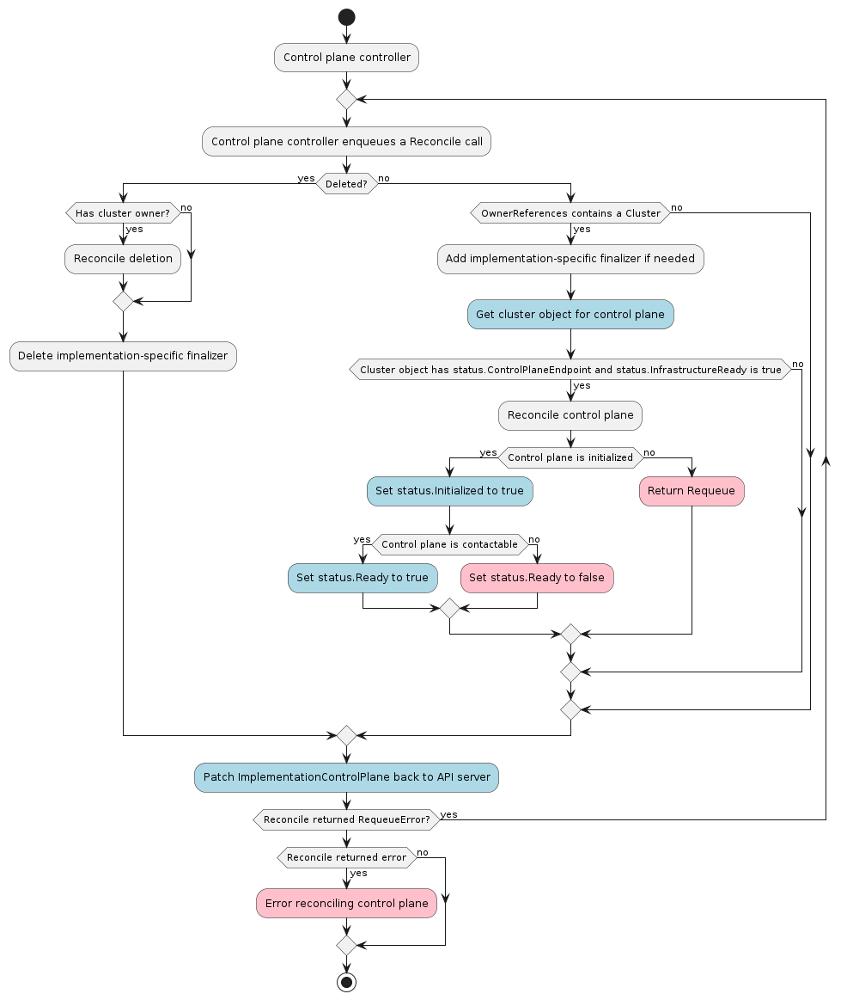

# Control Plane Controller



The Control Plane controller's main responsibilities are:

* Managing a set of machines that represent a Kubernetes control plane.
* Provide information about the state of the control plane to downstream
  consumers.
* Create/manage a secret with the kubeconfig file for accessing the workload cluster.

A reference implementation is managed within the core Cluster API project as the
Kubeadm control plane controller (`KubeadmControlPlane`). In this document,
we refer to an example `ImplementationControlPlane` where not otherwise specified.

## Contracts

### Control Plane Provider

The general expectation of a control plane controller is to instantiate a
Kubernetes control plane consisting of the following services:

#### Required Control Plane Services

* etcd
* Kubernetes API Server
* Kubernetes Controller Manager
* Kubernetes Scheduler

#### Optional Control Plane Services

* Cloud controller manager
* Cluster DNS (e.g. CoreDNS)
* Service proxy (e.g. kube-proxy)

#### Prohibited Services

* CNI - should be left to user to apply once control plane is instantiated.

### Relationship to other Cluster API types

The `ImplementationControlPlane` *must* rely on the existence of
`status.controlplaneEndpoint` in its parent [Cluster](./cluster.md) object.

### CRD contracts

#### Required `spec` fields for implementations using replicas

* `replicas` - is an integer representing the number of desired
  replicas. In the KubeadmControlPlane, this represents the desired
  number of desired control plane machines.

* `scale` subresource with the following signature:

``` yaml
scale:
  labelSelectorPath: .status.selector
  specReplicasPath: .spec.replicas
  statusReplicasPath: .status.replicas
status: {}
```

More information about the [scale subresource can be found in the Kubernetes
documentation][scale].

#### Required `status` fields

The `ImplementationControlPlane` object **must** have a `status` object.

The `status` object **must** have the following fields defined:

<table>
  <tr>
    <th> Field </th>
    <th> Type </th>
    <th> Description </th>
    <th> Implementation in Kubeadm Control Plane Controller </th>
  </tr>
  <tr>
    <td><code>initialized</code>
    <td>Boolean</td>
    <td>
      a boolean field that is true when the target cluster has
      completed initialization such that at least once, the
      target's control plane has been contactable.
    </td>
    <td>
      Transitions to initialized when the controller detects that kubeadm has uploaded
      a kubeadm-config configmap, which occurs at the end of kubeadm provisioning.
    </td>
  </tr>
  <tr>
    <td><code>ready</code></td>
    <td>Boolean</td>
    <td>
      Ready denotes that the target API Server is ready to receive requests.
    </td>
    <td />
  </tr>
  <tr>
</table>

#### Required `status` fields for implementations using replicas

Where the `ImplementationControlPlane` has a concept of replicas, e.g. most
high availability control planes, then the `status` object **must** have the
following fields defined:

<table>
  <tr>
    <th> Field </th>
    <th> Type </th>
    <th> Description </th>
    <th> Implementation in Kubeadm Control Plane Controller </th>
  </tr>
  <tr>
    <td><code>readyReplicas</code></td>
    <td>Integer</td>
    <td>Total number of fully running and ready control plane instances.</td>
    <td>Is equal to the number of fully running and ready control plane machines</td>
    <td />
  </tr>
  <tr>
    <td><code>replicas</code></td>
    <td>Integer</td>
    <td>Total number of non-terminated control plane instances,
      i.e. the state machine for this instance
      of the control plane is able to transition to ready.</td>
    <td>Is equal to the number of non-terminated control plane machines</td>
    <td />
  </tr>
  <tr>
    <td><code>selector</code></td>
    <td>String</td>
    <td>`selector` is the label selector in string format to avoid
      introspection by clients, and is used to provide the CRD-based integration
      for the scale subresource and additional integrations for things like
      kubectl describe. The string will be in the same format as the query-param
      syntax. More info about label selectors: http://kubernetes.io/docs/user-guide/labels#label-selectors
    </td>
    <td />
  </tr>
  <tr>
    <td><code>unavailableReplicas</code></td>
    <td>Integer</td>
    <td>
      Total number of unavailable control plane instances targeted by this control plane, equal
      to the desired number of control plane instances - ready instances.
    </td>
    <td>
      Total number of unavailable machines targeted by this control
      plane. This is the total number of machines that are still required
      for the deployment to have 100% available capacity. They may either
      be machines that are running but not yet ready or machines that still
      have not been created.
    </td>
  </tr>
  <tr>
    <td>
      <code>updatedReplicas</code>
    </td>
    <td>integer</td>
    <td>
      Total number of non-terminated machines targeted by this
      control plane that have the desired template spec.
    </td>
    <td>
      Total number of non-terminated machines targeted by this
      control plane that have the desired template spec.
    </td>
  </tr>
  </tr>
</table>

#### Optional `status` fields

The `status` object **may** define several fields:

* `failureReason` - is a string that explains why an error has occurred, if possible.
* `failureMessage` - is a string that holds the message contained by the error.
* `externalManagedControlPlane` - is a bool that should be set to true if the Node objects do not
  exist in the cluster. For example, managed control plane providers for AKS, EKS, GKE, etc, should
  set this to `true`. Leaving the field undefined is equivalent to setting the value to `false`.

## Example usage

``` yaml
kind: KubeadmControlPlane
apiVersion: cluster.x-k8s.io/v1alpha3
metadata:
  name: kcp-1
  namespace: default
spec:
  infrastructureTemplate:
    name: kcp-infra-template
    namespace: default
  kubeadmConfigSpec:
    clusterConfiguration:
  version: v1.16.2
```

[scale]: https://kubernetes.io/docs/tasks/access-kubernetes-api/custom-resources/custom-resource-definitions/#scale-subresource

## Kubeconfig management

Control Plane providers are expected to create and maintain a Kubeconfig
secret for operators to gain initial access to the cluster. If a provider uses
client certificates for authentication in these Kubeconfigs, the client
certificate should be kept with a reasonably short expiration period and
periodically regenerated to keep a valid set of credentials available. As an
example, the Kubeadm Control Plane provider uses a year of validity and
refreshes the certificate after 6 months.
