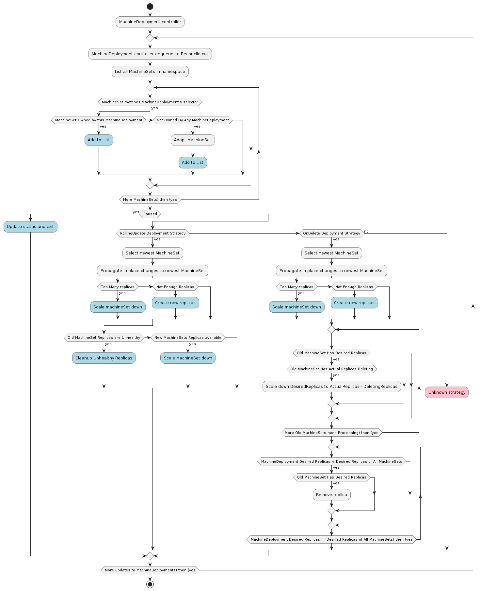

# MachineDeployment

A MachineDeployment orchestrates deployments over a fleet of [MachineSets](./machine-set.md).

Its main responsibilities are:
* Adopting matching MachineSets not assigned to a MachineDeployment
* Adopting matching MachineSets not assigned to a Cluster
* Managing the Machine deployment process
  * Scaling up new MachineSets when changes are made
  * Scaling down old MachineSets when newer MachineSets replace them
* Updating the status of MachineDeployment objects

