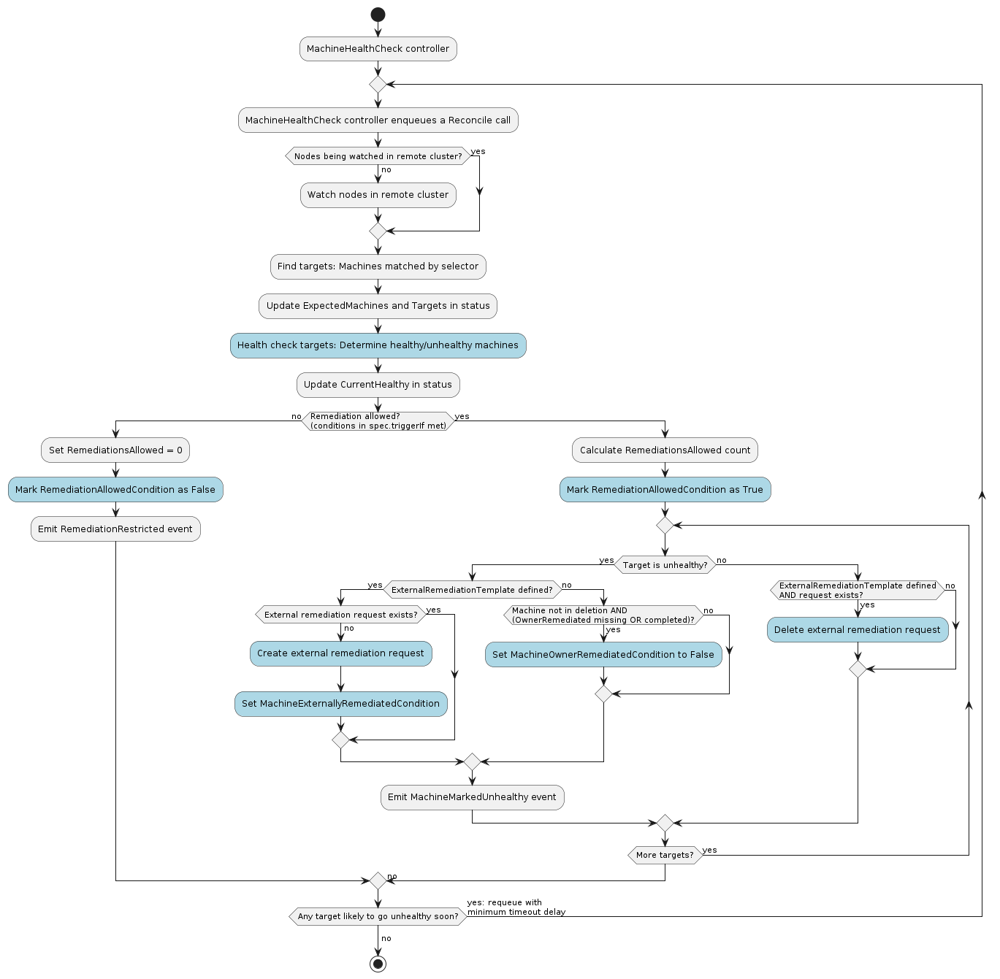

# MachineHealthCheck

A MachineHealthCheck is responsible for remediating unhealthy [Machines](./machine.md).

Its main responsibilities are:
* Checking the health of Nodes in the [workload clusters] against a list of unhealthy conditions
* Remediating Machine's for Nodes determined to be unhealthy

<!-- links -->
[workload clusters]: ../../../reference/glossary.md#workload-cluster
