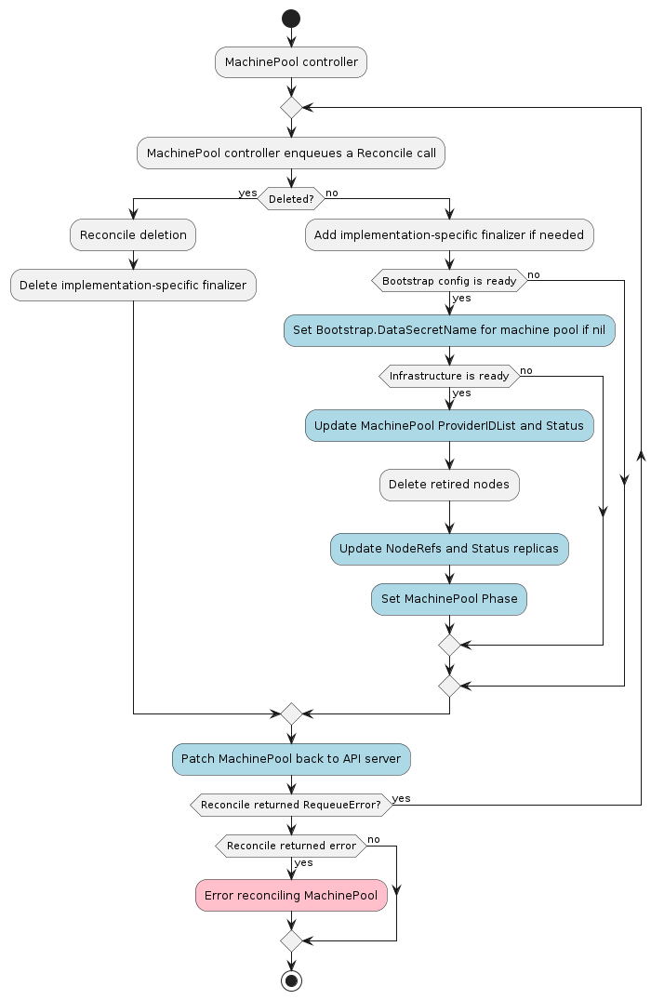

# MachinePool  Controller



The MachinePool controller's main responsibilities are:

* Setting an OwnerReference on each MachinePool object to:
    * The associated Cluster object.
    * The associated BootstrapConfig object.
    * The associated InfrastructureMachinePool object.
* Copy data from `BootstrapConfig.Status.DataSecretName` to `MachinePool.Spec.Template.Spec.Bootstrap.DataSecretName` if
`MachinePool.Spec.Template.Spec.Bootstrap.DataSecretName` is empty.
* Setting NodeRefs on MachinePool instances to be able to associate them with Kubernetes nodes.
* Deleting Nodes in the target cluster when the associated MachinePool instance is deleted.
* Keeping the MachinePool's Status object up to date with the InfrastructureMachinePool's Status object.
* Finding Kubernetes nodes matching the expected providerIDs in the workload cluster.

After the machine pool controller sets the OwnerReferences on the associated objects, it waits for the bootstrap
and infrastructure objects referenced by the machine to have the `Status.Ready` field set to `true`. When
the infrastructure object is ready, the machine pool controller will attempt to read its `Spec.ProviderIDList` and
copy it into `MachinePool.Spec.ProviderIDList`.

The machine pool controller uses the kubeconfig for the new workload cluster to watch new nodes coming up.
When a node appears with a `Node.Spec.ProviderID` in `MachinePool.Spec.ProviderIDList`, the machine pool controller
increments the number of ready replicas. When all replicas are ready and the infrastructure ref is also
`Ready`, the machine pool controller marks the machine pool as `Running`.

## Contracts

### Cluster API

Cluster associations are made via labels.

#### Expected labels

| what | label | value | meaning |
| --- | --- | --- | --- |
| MachinePool | `cluster.x-k8s.io/cluster-name` | `<cluster-name>` | Identify a machine pool as belonging to a cluster with the name `<cluster-name>`|

### Bootstrap provider

The BootstrapConfig object **must** have a `status` object.

The CRD name must have the format produced by `sigs.k8s.io/cluster-api/util/contract.CalculateCRDName(Group, Kind)`.

To override the bootstrap provider, a user (or external system) can directly set the `MachinePool.Spec.Bootstrap.DataSecretName`
field. This will mark the machine as ready for bootstrapping and no bootstrap data secret name will be copied from the
BootstrapConfig object.

#### Required `status` fields

The `status` object **must** have several fields defined:

* `ready` - a boolean field indicating the bootstrap config data is generated and ready for use.
* `dataSecretName` - a string field referencing the name of the secret that stores the generated bootstrap data.

#### Optional `status` fields

The `status` object **may** define several fields that do not affect functionality if missing:

* `failureReason` - a string field explaining why a fatal error has occurred, if possible.
* `failureMessage` - a string field that holds the message contained by the error.

Example:

```yaml
kind: MyBootstrapProviderConfig
apiVersion: bootstrap.cluster.x-k8s.io/v1alpha3
status:
    ready: true
    dataSecretName: "MyBootstrapSecret"
```

### Infrastructure provider

The InfrastructureMachinePool object **must** have both `spec` and `status` objects.

The CRD name must have the format produced by `sigs.k8s.io/cluster-api/util/contract.CalculateCRDName(Group, Kind)`.

#### Required `spec` fields

The `spec` object **must** have at least one field defined:

* `providerIDList` - the list of cloud provider IDs identifying the instances.

#### Required `status` fields

The `status` object **must** have at least one field defined:

* `ready` - a boolean field indicating if the infrastructure is ready to be used or not.

#### Optional `status` fields

The `status` object **may** define several fields that do not affect functionality if missing:

* `failureReason` - is a string that explains why a fatal error has occurred, if possible.
* `failureMessage` - is a string that holds the message contained by the error.

Example:
```yaml
kind: MyMachinePool
apiVersion: infrastructure.cluster.x-k8s.io/v1beta1
spec:
    providerIDList:
      - cloud:////my-cloud-provider-id-0
      - cloud:////my-cloud-provider-id-1
status:
    ready: true
```

#### Externally Managed Autoscaler

A provider may implement an InfrastructureMachinePool that is externally managed by an autoscaler. For example, if you are using a Managed Kubernetes provider, it may include its own autoscaler solution. To indicate this to Cluster API, you would decorate the MachinePool object with the following annotation:

`"cluster.x-k8s.io/replicas-managed-by": ""`

Cluster API treats the annotation as a "boolean", meaning that the presence of the annotation is sufficient to indicate external replica count management, with one exception: if the value is `"false"`, then that indicates to Cluster API that replica enforcement is nominal, and managed by Cluster API.

Providers may choose to implement the `cluster.x-k8s.io/replicas-managed-by` annotation with different values (e.g., `external-autoscaler`, or `karpenter`) that may inform different provider-specific behaviors, but those values will have no effect upon Cluster API.

The effect upon Cluster API of this annotation is that during autoscaling events (initiated externally, not by Cluster API), when more or fewer MachinePool replicas are observed compared to the `Spec.Replicas` configuration, it will update its `Status.Phase` property to the value of `"Scaling"`.

Example:
```yaml
kind: MyMachinePool
apiVersion: infrastructure.cluster.x-k8s.io/v1alpha3
spec:
    providerIDList:
      - cloud:////my-cloud-provider-id-0
      - cloud:////my-cloud-provider-id-1
      - cloud:////my-cloud-provider-id-2
    replicas: 1
status:
    ready: true
    phase: Scaling
```

It is the provider's responsibility to update Cluster API's `Spec.Replicas` property to the value observed in the underlying infra environment as it changes in response to external autoscaling behaviors. Once that is done, and the number of providerID items is equal to the `Spec.Replicas` property, the MachinePools's `Status.Phase` property will be set to `Running` by Cluster API.

### Secrets

The machine pool controller will use a secret in the following format:

| secret name | field name | content |
|:---:|:---:|---|
|`<cluster-name>-kubeconfig`|`value`|base64 encoded kubeconfig that is authenticated with the workload cluster|
