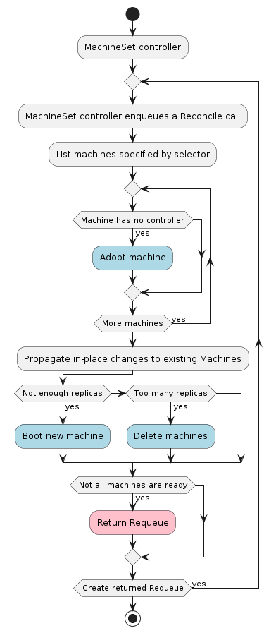

# MachineSet

A MachineSet is an immutable abstraction over [Machines](./machine.md).

Its main responsibilities are:
* Adopting unowned Machines that aren't assigned to a MachineSet
* Adopting unmanaged Machines that aren't assigned a Cluster
* Booting a group of N machines
  * Monitoring the status of those booted machines

