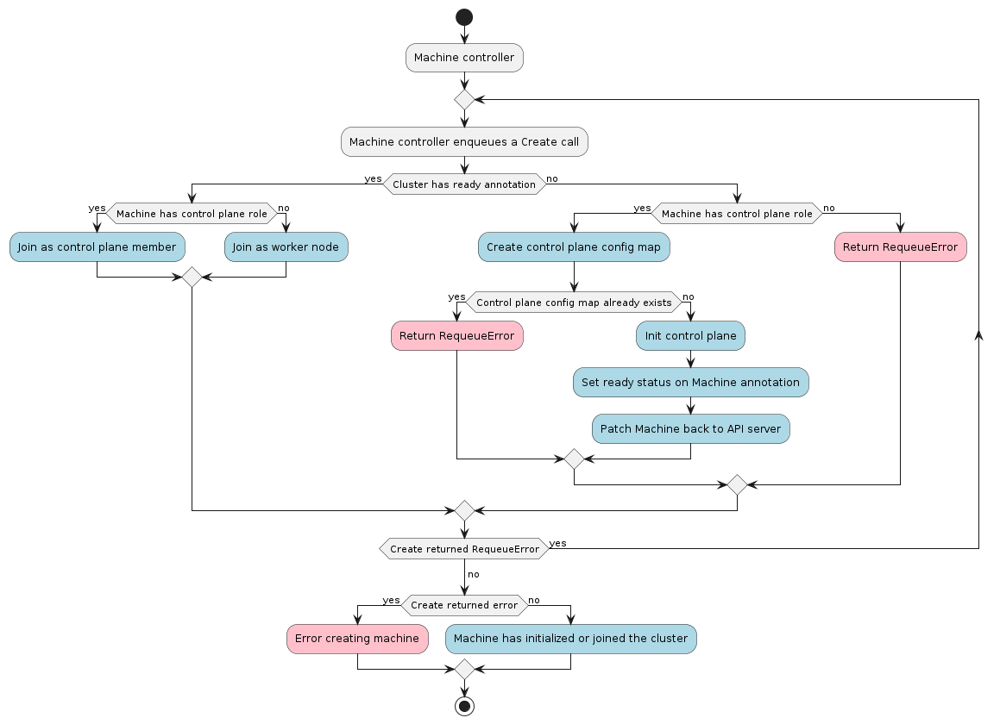

# Machine  Controller



The Machine controller's main responsibilities are:

* Setting an OwnerReference on:
    * Each Machine object to the Cluster object.
    * The associated BootstrapConfig object.
    * The associated InfrastructureMachine object.
* Copy data from `BootstrapConfig.Status.BootstrapData` to `Machine.Spec.Bootstrap.Data` if
`Machine.Spec.Bootstrap.Data` is empty.
* Setting NodeRefs to be able to associate machines and kubernetes nodes.
* Deleting Nodes in the target cluster when the associated machine is deleted.
* Cleanup of related objects.
* Keeping the Machine's Status object up to date with the InfrastructureMachine's Status object.
* Finding Kubernetes nodes matching the expected providerID in the workload cluster.

After the machine controller sets the OwnerReferences on the associated objects, it waits for the bootstrap
and infrastructure objects referenced by the machine to have the `Status.Ready` field set to `true`. When 
the infrastructure object is ready, the machine controller will attempt to read its `Spec.ProviderID` and
copy it into `Machine.Spec.ProviderID`.

The machine controller uses the kubeconfig for the new workload cluster to watch new nodes coming up.
When a node appears with `Node.Spec.ProviderID` matching `Machine.Spec.ProviderID`, the machine controller
transitions the associated machine into the `Provisioned` state. When the infrastructure ref is also  
`Ready`, the machine controller marks the machine as `Running`.

## Contracts

### Cluster API

Cluster associations are made via labels.

#### Expected labels

| what | label | value | meaning |
| --- | --- | --- | --- |
| Machine | `cluster.x-k8s.io/cluster-name` | `<cluster-name>` | Identify a machine as belonging to a cluster with the name `<cluster-name>`|
| Machine | `cluster.x-k8s.io/control-plane` | `true` | Identifies a machine as a control-plane node |

### Bootstrap provider

The BootstrapConfig object **must** have a `status` object.

To override the bootstrap provider, a user (or external system) can directly set the `Machine.Spec.Bootstrap.Data`
field. This will mark the machine as ready for bootstrapping and no bootstrap data will be copied from the
BootstrapConfig object.

#### Required `status` fields

The `status` object **must** have several fields defined:

* `ready` - a boolean field indicating the bootstrap config data is generated and ready for use.
* `dataSecretName` - a string field referencing the name of the secret that stores the generated bootstrap data.

#### Optional `status` fields

The `status` object **may** define several fields that do not affect functionality if missing:

* `failureReason` - a string field explaining why a fatal error has occurred, if possible.
* `failureMessage` - a string field that holds the message contained by the error.

Example:

```yaml
kind: MyBootstrapProviderConfig
apiVersion: bootstrap.cluster.x-k8s.io/v1alpha3
status:
    ready: true
    dataSecretName: "MyBootstrapSecret"
```

### Infrastructure provider

The InfrastructureMachine object **must** have both `spec` and `status` objects.

#### Required `spec` fields

The `spec` object **must** at least one field defined:

* `providerID` - a cloud provider ID identifying the machine.

#### Required `status` fields

The `status` object **must** at least one field defined:

* `ready` - a boolean field indicating if the infrastructure is ready to be used or not.

#### Optional `status` fields

The `status` object **may** define several fields that do not affect functionality if missing:

* `failureReason` - is a string that explains why a fatal error has occurred, if possible.
* `failureMessage` - is a string that holds the message contained by the error.

Example:
```yaml
kind: MyMachine
apiVersion: infrastructure.cluster.x-k8s.io/v1alpha3
spec:
    providerID: cloud:////my-cloud-provider-id
status:
    ready: true
```

### Secrets

The Machine controller will create a secret or use an existing secret in the following format:

| secret name | field name | content |
|:---:|:---:|---|
|`<cluster-name>-kubeconfig`|`value`|base64 encoded kubeconfig that is authenticated with the child cluster|


