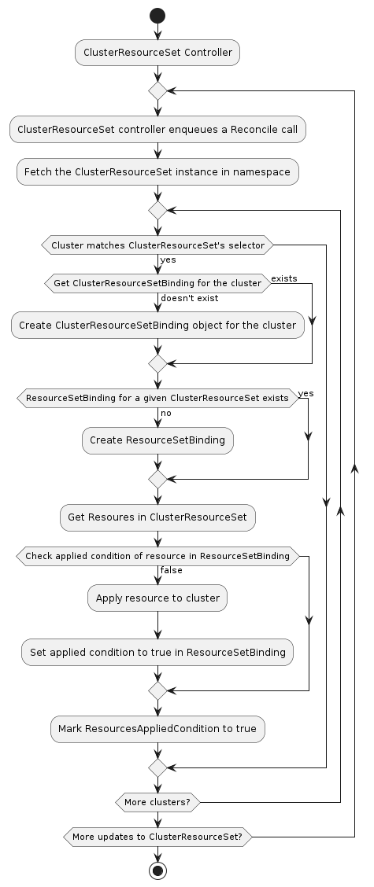

# `ClusterResourceSet` Controller

The `ClusterResourceSet` provides a mechanism for applying resources - e.g. pods, deployments, daemonsets, secrets, configMaps - to a cluster once it is created.

Its main responsibility is to automatically apply a set of resources to newly-created and existing Clusters. Resources will be applied only once.

### Additional information

* See ClusterResourceSet [proposal](https://github.com/kubernetes-sigs/cluster-api/blob/main/docs/proposals/20200220-cluster-resource-set.md)
