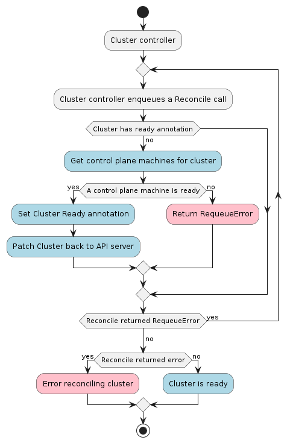

# Cluster Controller

The Cluster controller is responsible for reconciling the Cluster resource.

In order to allow Cluster provisioning on different type of infrastructure, The Cluster resource references
an InfraCluster object, e.g. AWSCluster, GCPCluster etc.

The [InfraCluster resource contract](../../providers/contracts/infra-cluster.md) defines a set of rules a provider is expected to comply with in order to allow
the expected interactions with the Cluster controller. 

Among those rules:
- InfraCluster SHOULD report a [controlplane endpoint](../../providers/contracts/infra-cluster.md#infracluster-control-plane-endpoint) for the Cluster
- InfraCluster SHOULD report available [failure domains](../../providers/contracts/infra-cluster.md#infracluster-failure-domains) where machines should be placed in
- InfraCluster MUST report when Cluster's infrastructure is [fully provisioned](../../providers/contracts/infra-cluster.md#infracluster-initialization-completed) 
- InfraCluster SHOULD report [conditions](../../providers/contracts/infra-cluster.md#infracluster-conditions)
- InfraCluster SHOULD report [terminal failures](../../providers/contracts/infra-cluster.md#infracluster-terminal-failures)

Similarly, in order to support different solutions for control plane management, The Cluster resource references
an ControlPlane object, e.g. KubeadmControlPlane, EKSControlPlane etc.

Among those rules:
- ControlPlane SHOULD report a [controlplane endpoint](../../providers/contracts/control-plane.md#controlplane-endpoint) for the Cluster
- ControlPlane MUST report when Cluster's control plane is [fully provisioned](../../providers/contracts/control-plane.md#controlplane-initialization-completed)
- ControlPlane MUST manage a [KubeConfig secret](../../providers/contracts/control-plane.md#cluster-kubeconfig-management)
- ControlPlane SHOULD report [conditions](../../providers/contracts/control-plane.md#controlplane-conditions)
- ControlPlane SHOULD report [terminal failures](../../providers/contracts/control-plane.md#controlplane-terminal-failures)

Considering all the info above, the Cluster controller's main responsibilities are:

* Setting an OwnerReference on the infrastructure object referenced in `Cluster.spec.infrastructureRef`.
* Setting an OwnerReference on the control plane object referenced in `Cluster.spec.controlPlaneRef`.
* Keeping the Cluster's status in sync with the InfraCluster and ControlPlane's status.
* If no ControlPlane object is referenced, create a kubeconfig secret for [workload clusters](../../../reference/glossary.md#workload-cluster).
* Cleanup of all owned objects so that nothing is dangling after deletion.

### Kubeconfig Secrets

In order to create a kubeconfig secret, it is required to have a certificate authority (CA) for the cluster.

If you are using the kubeadm bootstrap provider you do not have to provide any Cluster API secrets. It will generate
all necessary CAs for you.

As alternative users can provide custom CA as described in [Using Custom Certificates](../../../tasks/certs/using-custom-certificates.md).

Last option, is to entirely bypass Cluster API kubeconfig generation by providing a kubeconfig secret
formatted as described below.

|         Secret name         | Field name |          Content          |
|:---------------------------:|:----------:|:-------------------------:|
| `<cluster-name>-kubeconfig` |  `value`   | base64 encoded kubeconfig |

Notes: 
- Also renewal of the above certificate should be taken care out of band.
- This option does not prevent from providing a cluster CA which is required also for other purposes.
