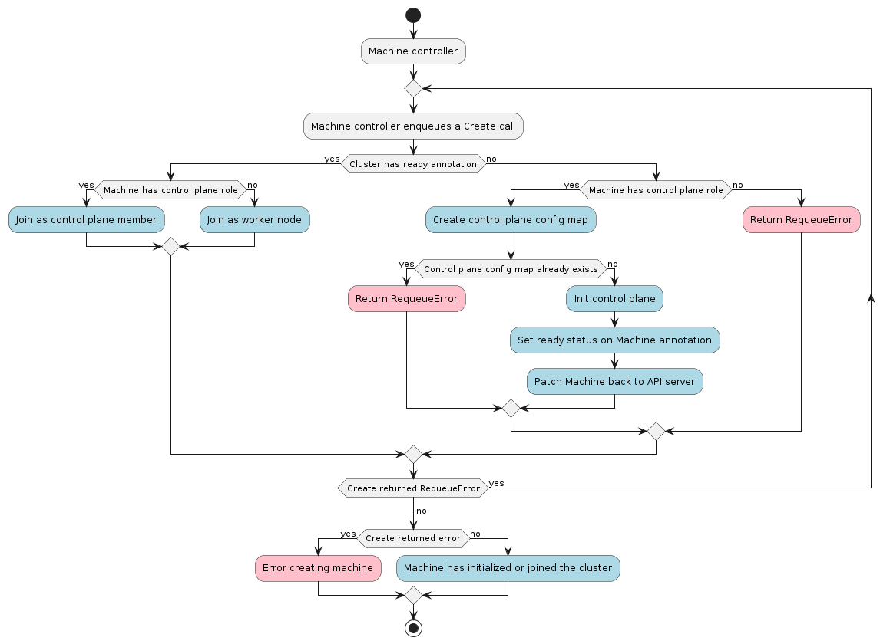

# Machine Controller

The Machine controller is responsible for reconciling the Machine resource.

In order to allow Machine provisioning on different type of infrastructure, The Machine resource references
an InfraMachine object, e.g. AWSMachine, GCMachine etc.

The [InfraMachine resource contract](../../providers/contracts/infra-machine.md) defines a set of rules a provider is expected to comply with in order to allow
the expected interactions with the Machine controller.

Among those rules:
- InfraMachine MUST report a [provider ID](../../providers/contracts/infra-machine.md#inframachine-provider-id) for the Machine
- InfraMachine SHOULD take into account the [failure domain](../../providers/contracts/infra-machine.md#inframachine-failure-domain) where machines should be placed in
- InfraMachine SHOULD surface machine's [addresses](../../providers/contracts/infra-machine.md#inframachine-addresses) to help operators when troubleshooting issues
- InfraMachine MUST report when Machine's infrastructure is [fully provisioned](../../providers/contracts/infra-machine.md#inframachine-initialization-completed)
- InfraMachine SHOULD report [conditions](../../providers/contracts/infra-machine.md#inframachine-conditions)
- InfraMachine SHOULD report [terminal failures](../../providers/contracts/infra-machine.md#inframachine-terminal-failures)

Similarly, in order to support different machine bootstrappers, The Machine resource references
a BootstrapConfig object, e.g. KubeadmBoostrapConfig etc.

The [BootstrapConfig resource contract](../../providers/contracts/bootstrap-config.md) defines a set of rules a provider is expected to comply with in order to allow
the expected interactions with the Machine controller.

Among those rules:
- BootstrapConfig MUST create a [bootstrap data secret](../../providers/contracts/bootstrap-config.md#bootstrapconfig-data-secret) where machines should be placed in
- BootstrapConfig MUST report when Machine's bootstrap data secret is [fully provisioned](../../providers/contracts/bootstrap-config.md#bootstrapconfig-initialization-completed)
- BootstrapConfig SHOULD report [conditions](../../providers/contracts/bootstrap-config.md#bootstrapconfig-conditions)
- BootstrapConfig SHOULD report [terminal failures](../../providers/contracts/bootstrap-config.md#bootstrapconfig-terminal-failures)
- BootstrapConfig SHOULD report [taint Nodes at creation](../../providers/contracts/bootstrap-config.md#taint-nodes-at-creation)
- BootstrapConfig SHOULD create a [sentinel file](../../providers/contracts/bootstrap-config.md#sentinel-file) on machines

Considering all the info above, the Machine controller's main responsibilities are:

* Setting an OwnerReference on the infrastructure object referenced in `Machine.spec.infrastructureRef`.
* Setting an OwnerReference on the bootstrap object referenced in `Machine.spec.bootstrap.configRef`.
* Keeping the Machine's status in sync with the InfraMachine and BootstrapConfig's status.
  * Finding Kubernetes nodes matching the expected providerID in the workload cluster.
  * Setting NodeRefs to be able to associate machines and Kubernetes nodes.
  * Monitor Kubernetes nodes and propagate labels to them.
* Cleanup of all owned objects so that nothing is dangling after deletion.
  * Drain nodes and wait for volumes being detached by CSI plugins.

After the machine controller sets the OwnerReferences on the associated objects, it waits for the bootstrap
and infrastructure objects referenced by the machine to have the `Status.Ready` field set to `true`. When
the infrastructure object is ready, the machine controller will attempt to read its `Spec.ProviderID` and
copy it into `Machine.Spec.ProviderID`.

The machine controller uses the kubeconfig for the new workload cluster to watch new nodes coming up.
When a node appears with `Node.Spec.ProviderID` matching `Machine.Spec.ProviderID`, the machine controller
transitions the associated machine into the `Provisioned` state. When the infrastructure ref is also
`Ready`, the machine controller marks the machine as `Running`.

The following schema goes through machine phases and interactions with InfraMachine and BootstrapConfig
happening at each step.

