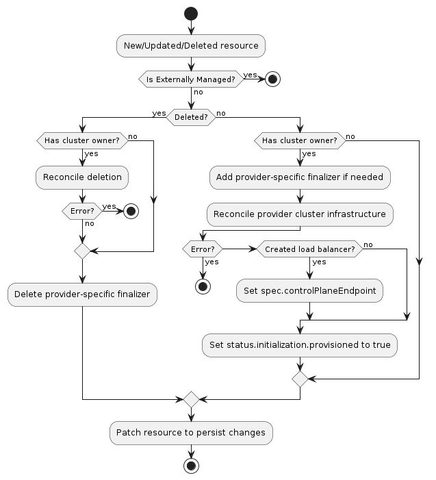

# Cluster Infrastructure Provider Specification

## Overview

A cluster infrastructure provider supplies whatever prerequisites are necessary for running machines.
Examples might include networking, load balancers, firewall rules, and so on.

## Data Types

A cluster infrastructure provider must define an API type for "infrastructure cluster" resources. The type:

1. Must belong to an API group served by the Kubernetes apiserver
2. May be implemented as a CustomResourceDefinition, or as part of an aggregated apiserver
3. Must be namespace-scoped
4. Must have the standard Kubernetes "type metadata" and "object metadata"
5. Must have a `spec` field with the following:
    1. Required fields:
        1. `controlPlaneEndpoint` (`apiEndpoint`): the endpoint for the cluster's control plane. `apiEndpoint` is defined
            as:
            - `host` (string): DNS name or IP address
            - `port` (int32): TCP port
6. Must have a `status` field with the following:
    1. Required fields:
        1. `ready` (boolean): indicates the provider-specific infrastructure has been provisioned and is ready
    2. Optional fields:
        1. `failureReason` (string): indicates there is a fatal problem reconciling the provider's infrastructure;
            meant to be suitable for programmatic interpretation
        2. `failureMessage` (string): indicates there is a fatal problem reconciling the provider's infrastructure;
            meant to be a more descriptive value than `failureReason`
        3. `failureDomains` (`failureDomains`): the failure domains that machines should be placed in. `failureDomains`
            is a map, defined as `map[string]FailureDomainSpec`. A unique key must be used for each `FailureDomainSpec`.
            `FailureDomainSpec` is defined as:
            - `controlPlane` (bool): indicates if failure domain is appropriate for running control plane instances.
            - `attributes` (`map[string]string`): arbitrary attributes for users to apply to a failure domain.

## Behavior

A cluster infrastructure provider must respond to changes to its "infrastructure cluster" resources. This process is
typically called reconciliation. The provider must watch for new, updated, and deleted resources and respond
accordingly.

The following diagram shows the typical logic for a cluster infrastructure provider:



### Normal resource

1. If the resource does not have a `Cluster` owner, exit the reconciliation
    1. The Cluster API `Cluster` reconciler populates this based on the value in the `Cluster`'s `spec.infrastructureRef`
       field.
1. Add the provider-specific finalizer, if needed
1. Reconcile provider-specific cluster infrastructure
    1. If any errors are encountered, exit the reconciliation
1. If the provider created a load balancer for the control plane, record its hostname or IP in `spec.controlPlaneEndpoint`
1. Set `status.ready` to `true`
1. Set `status.failureDomains` based on available provider failure domains (optional)
1. Patch the resource to persist changes

### Deleted resource

1. If the resource has a `Cluster` owner
    1. Perform deletion of provider-specific cluster infrastructure
    1. If any errors are encountered, exit the reconciliation
1. Remove the provider-specific finalizer from the resource
1. Patch the resource to persist changes

## RBAC

### Provider controller

A cluster infrastructure provider must have RBAC permissions for the types it defines. If you are using `kubebuilder` to
generate new API types, these permissions should be configured for you automatically. For example, the AWS provider has
the following configuration for its `AWSCluster` type:

```
// +kubebuilder:rbac:groups=infrastructure.cluster.x-k8s.io,resources=awsclusters,verbs=get;list;watch;create;update;patch;delete
// +kubebuilder:rbac:groups=infrastructure.cluster.x-k8s.io,resources=awsclusters/status,verbs=get;update;patch
```

A cluster infrastructure provider may also need RBAC permissions for other types, such as `Cluster`. If you need
read-only access, you can limit the permissions to `get`, `list`, and `watch`. The AWS provider has the following
configuration for retrieving `Cluster` resources:

```
// +kubebuilder:rbac:groups=cluster.x-k8s.io,resources=clusters;clusters/status,verbs=get;list;watch
```

### Cluster API controllers

The Cluster API controller for `Cluster` resources is configured with full read/write RBAC
permissions for all resources in the `infrastructure.cluster.x-k8s.io` API group. This group
represents all cluster infrastructure providers for SIG Cluster Lifecycle-sponsored provider
subprojects. If you are writing a provider not sponsored by the SIG, you must grant full read/write
RBAC permissions for the "infrastructure cluster" resource in your API group to the Cluster API
manager's `ServiceAccount`. `ClusterRoles` can be granted using the [aggregation label]
`cluster.x-k8s.io/aggregate-to-manager: "true"`. The following is an example `ClusterRole` for a
`FooCluster` resource:

```yaml
apiVersion: rbac.authorization.k8s.io/v1
kind: ClusterRole
metadata:
  name: capi-foo-clusters
  labels:
    cluster.x-k8s.io/aggregate-to-manager: "true"
rules:
- apiGroups:
  - infrastructure.foo.com
  resources:
  - fooclusters
  verbs:
  - create
  - delete
  - get
  - list
  - patch
  - update
  - watch
```

Note, the write permissions allow the `Cluster` controller to set owner references and labels on the
"infrastructure cluster" resources; they are not used for general mutations of these resources.

[aggregation label]: https://kubernetes.io/docs/reference/access-authn-authz/rbac/#aggregated-clusterroles
