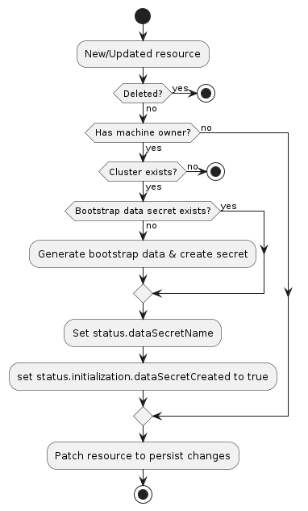

# Contract rules for BootstrapConfig

Bootstrap providers SHOULD implement a BootstrapConfig resource using Kubernetes' CustomResourceDefinition (CRD).

The goal of a BootstrapConfig resource is to generates bootstrap data that is used to bootstrap a Kubernetes node.
These may be e.g. [cloud-init] scripts.

The BootstrapConfig resource will be referenced by one of the Cluster API core resources, Machine.

The [Machine's controller](../../core/controllers/machine.md) will be responsible to coordinate operations of the BootstrapConfig,
and the interaction between the Machine's controller and the BootstrapConfig resource is based on the contract
rules defined in this page.

Once contract rules are satisfied by a BootstrapConfig implementation, other implementation details
could be addressed according to the specific needs (Cluster API is not prescriptive).

Nevertheless, it is always recommended to take a look at Cluster API controllers,
in-tree providers, other providers and use them as a reference implementation (unless custom solutions are required
in order to address very specific needs).

In order to facilitate the initial design for each BootstrapConfig resource, a few [implementation best practices]
are explicitly called out in dedicated pages.

<aside class="note warning">

<h1>Never rely on Cluster API behaviours not defined as a contract rule!</h1>

When developing a provider, you MUST consider any Cluster API behaviour that is not defined by a contract rule
as a Cluster API internal implementation detail, and internal implementation details can change at any time.

Accordingly, in order to not expose users to the risk that your provider breaks when the Cluster API internal behavior
changes, you MUST NOT rely on any Cluster API internal behaviour when implementing a BootstrapConfig resource.

Instead, whenever you need something more from the Cluster API contract, you MUST engage the community.

The Cluster API maintainers welcome feedback and contributions to the contract in order to improve how it's defined,
its clarity and visibility to provider implementers and its suitability across the different kinds of Cluster API providers.

To provide feedback or open a discussion about the provider contract please [open an issue on the Cluster API](https://github.com/kubernetes-sigs/cluster-api/issues/new?assignees=&labels=&template=feature_request.md)
repo or add an item to the agenda in the [Cluster API community meeting](https://git.k8s.io/community/sig-cluster-lifecycle/README.md#cluster-api).

</aside>

## Rules (contract version v1beta2)

| Rule                                                                       | Mandatory | Note                                 |
|----------------------------------------------------------------------------|-----------|--------------------------------------|
| [All resources: scope]                                                     | Yes       |                                      |
| [All resources: `TypeMeta` and `ObjectMeta`field]                          | Yes       |                                      |
| [All resources: `APIVersion` field value]                                  | Yes       |                                      |
| [BootstrapConfig, BootstrapConfigList resource definition]                 | Yes       |                                      |
| [BootstrapConfig: data secret]                                             | Yes       |                                      |
| [BootstrapConfig: initialization completed]                                | Yes       |                                      |
| [BootstrapConfig: conditions]                                              | No        |                                      |
| [BootstrapConfig: terminal failures]                                       | No        |                                      |
| [BootstrapConfig: support for in-place changes]                            | No        |                                      |
| [BootstrapConfigTemplate, BootstrapConfigTemplateList resource definition] | Yes       |                                      |
| [BootstrapConfigTemplate: support for SSA dry run]                         | No        | Mandatory for ClusterClasses support |
| [Sentinel file]                                                            | No        |                                      |
| [Taint Nodes at creation]                                                  | No        |                                      |
| [Support for running multiple instances]                                   | No        | Mandatory for clusterctl CLI support |
| [Clusterctl support]                                                       | No        | Mandatory for clusterctl CLI support |
| [BootstrapConfig: pausing]                                                 | No        |                                      |

Note:
- `All resources` refers to all the provider's resources "core" Cluster API interacts with;
  In the context of this page: `BootstrapConfig`, `BootstrapConfigTemplate` and corresponding list types

### All resources: scope

All resources MUST be namespace-scoped.

### All resources: `TypeMeta` and `ObjectMeta` field

All resources MUST have the standard Kubernetes `TypeMeta` and `ObjectMeta` fields.

### All resources: `APIVersion` field value

In Kubernetes `APIVersion` is a combination of API group and version.
Special consideration MUST applies to both API group and version for all the resources Cluster API interacts with.

#### All resources: API group

The domain for Cluster API resources is `cluster.x-k8s.io`, and bootstrap providers under the Kubernetes SIGS org
generally use `bootstrap.cluster.x-k8s.io` as API group.

If your provider uses a different API group, you MUST grant full read/write RBAC permissions for resources in your API group
to the Cluster API core controllers. The canonical way to do so is via a `ClusterRole` resource with the [aggregation label]
`cluster.x-k8s.io/aggregate-to-manager: "true"`.

The following is an example ClusterRole for a `FooConfig` resource in the `bootstrap.foo.com` API group:

```yaml
apiVersion: rbac.authorization.k8s.io/v1
kind: ClusterRole
metadata:
    name: capi-foo-clusters
    labels:
      cluster.x-k8s.io/aggregate-to-manager: "true"
rules:
- apiGroups:
    - bootstrap.foo.com
  resources:
    - fooconfig
    - fooconfigtemplates
  verbs:
    - create
    - delete
    - get
    - list
    - patch
    - update
    - watch
```

Note: The write permissions are required because Cluster API manages BootstrapConfig generated from BootstrapConfigTemplates;
when using ClusterClass and managed topologies, also BootstrapConfigTemplates are managed directly by Cluster API.

#### All resources: version

The resource Version defines the stability of the API and its backward compatibility guarantees.
Examples include `v1alpha1`, `v1beta1`, `v1`, etc. and are governed by the [Kubernetes API Deprecation Policy].

Your provider SHOULD abide by the same policies.

Note: The version of your provider does not need to be in sync with the version of core Cluster API resources.
Instead, prefer choosing a version that matches the stability of the provider API and its backward compatibility guarantees.

Additionally:

Providers MUST set `cluster.x-k8s.io/<version>` label on the BootstrapConfig Custom Resource Definitions.

The label is a map from a Cluster API contract version to your Custom Resource Definition versions.
The value is an underscore-delimited (_) list of versions. Each value MUST point to an available version in your CRD Spec.

The label allows Cluster API controllers to perform automatic conversions for object references, the controllers will pick
the last available version in the list if multiple versions are found.

To apply the label to CRDs it’s possible to use labels in your `kustomization.yaml` file, usually in `config/crd`:

```yaml
labels:
- pairs:
    cluster.x-k8s.io/v1beta1: v1beta1
    cluster.x-k8s.io/v1beta2: v1beta2
```

An example of this is in the [Kubeadm Bootstrap provider](https://github.com/kubernetes-sigs/cluster-api/blob/release-1.1/controlplane/kubeadm/config/crd/kustomization.yaml).

<aside  class="note warning">

<h1>Important</h1>

If the provider implements the [clusterctl provider contract], the contract version defined in the
label above must be consistent with the contract version defined in the `metadata.yaml` file.

</aside>

### BootstrapConfig, BootstrapConfigList resource definition

You MUST define a BootstrapConfig resource.
The BootstrapConfig resource name must have the format produced by `sigs.k8s.io/cluster-api/util/contract.CalculateCRDName(Group, Kind)`.

Note: Cluster API is using such a naming convention to avoid an expensive CRD lookup operation when looking for labels from
the CRD definition of the BootstrapConfig resource.

It is a generally applied convention to use names in the format `${env}Config`, where ${env} is a, possibly short, name
for the bootstrapper in question. For example `KubeadmConfig` is an implementation for kubeadm.

```go
// +kubebuilder:object:root=true
// +kubebuilder:resource:path=fooconfig,scope=Namespaced,categories=cluster-api
// +kubebuilder:storageversion
// +kubebuilder:subresource:status

// FooConfig is the Schema for fooconfig.
type FooConfig struct {
    metav1.TypeMeta `json:",inline"`
	metav1.ObjectMeta `json:"metadata,omitempty"`
    Spec FooConfigSpec `json:"spec,omitempty"`
    Status FooConfigStatus `json:"status,omitempty"`
}

type FooConfigSpec struct {
    // See other rules for more details about mandatory/optional fields in BootstrapConfig spec.
    // Other fields SHOULD be added based on the needs of your provider.
}

type FooConfigStatus struct {
    // See other rules for more details about mandatory/optional fields in BootstrapConfig status.
    // Other fields SHOULD be added based on the needs of your provider.
}
```

For each BootstrapConfig resource, you MUST also add the corresponding list resource.
The list resource MUST be named as `<BootstrapConfig>List`.

```go
// +kubebuilder:object:root=true

// FooConfigList contains a list of fooconfig.
type FooConfigList struct {
    metav1.TypeMeta `json:",inline"`
    metav1.ListMeta `json:"metadata,omitempty"`
    Items           []FooConfig `json:"items"`
}
```

### BootstrapConfig: data secret

Each BootstrapConfig MUST store generated bootstrap data into a Kubernetes Secret and surface the secret name in .status.dataSecretName.

```go
type FooConfigStatus struct {
    // dataSecretName is the name of the secret that stores the bootstrap data script.
    // +optional
    // +kubebuilder:validation:MinLength=1
    // +kubebuilder:validation:MaxLength=253
    DataSecretName string `json:"dataSecretName,omitempty"`

    // See other rules for more details about mandatory/optional fields in BootstrapConfig status.
    // Other fields SHOULD be added based on the needs of your provider.
}
```

The Secret containing bootstrap data must:

1. Use the API resource's `status.dataSecretName` for its name
1. Have the label `cluster.x-k8s.io/cluster-name` set to the name of the cluster
1. Have a controller owner reference to the API resource
1. Have a single key, `value`, containing the bootstrap data

Note: because the `dataSecretName` is part of `status`, this value must be deterministically recreatable from the data in the
`Cluster`, `Machine`, and/or bootstrap resource. If the name is randomly generated, it is not always possible to move
the resource and its associated secret from one management cluster to another.

When the Secret is created its name MUST surface in the `status.dataSecretName` field of the BootstrapConfig resource;
the Machine controller will surface this info in Machine's `spec.boostrap.dataSecretName` when [BootstrapConfig: initialization completed].

### BootstrapConfig: initialization completed

Each BootstrapConfig MUST report when the bootstrap data secret is fully provisioned (initialization) by setting
`status.initialization.dataSecretCreated` in the BootstrapConfig resource.

```go
type FooConfigStatus struct {
    // initialization provides observations of the FooConfig initialization process.
    // NOTE: Fields in this struct are part of the Cluster API contract and are used to orchestrate initial Machine provisioning.
    // +optional
    Initialization FooConfigInitializationStatus `json:"initialization,omitempty,omitzero"`
    
    // See other rules for more details about mandatory/optional fields in BootstrapConfig status.
    // Other fields SHOULD be added based on the needs of your provider.
}

// FooConfigInitializationStatus provides observations of the FooConfig initialization process.
// +kubebuilder:validation:MinProperties=1
type FooConfigInitializationStatus struct {
    // dataSecretCreated is true when the Machine's boostrap secret is created.
    // NOTE: this field is part of the Cluster API contract, and it is used to orchestrate initial Machine provisioning.
    // +optional
    DataSecretCreated *bool `json:"dataSecretCreated,omitempty"`
}
```

Once `status.initialization.dataSecretCreated` the Machine "core" controller will bubble up this info in Machine's 
`status.initialization.bootstrapDataSecretCreated`; also BootstrapConfig's `status.dataSecretName` will be surfaced 
on Machine's corresponding fields at the same time.

<aside class="note warning">

<h1>Compatibility with the deprecated v1beta1 contract</h1>

In order to ease the transition for providers, the v1beta2 version of the Cluster API contract _temporarily_
preserves compatibility with the deprecated v1beta1 contract; compatibility will be removed tentatively in August 2026.

With regards to initialization completed:

Cluster API will continue to temporarily support BootstrapConfig resources using the `status.ready` field to
report initialization completed.

After compatibility with the deprecated v1beta1 contract will be removed, `status.ready` field in 
the BootstrapConfig resource will be ignored.

</aside>

### BootstrapConfig: conditions

According to [Kubernetes API Conventions], Conditions provide a standard mechanism for higher-level
status reporting from a controller.

Providers implementers SHOULD implement `status.conditions` for their BootstrapConfig resource.
In case conditions are implemented on a BootstrapConfig resource, Cluster API will only consider conditions providing the following information:
- `type` (required)
- `status` (required, one of True, False, Unknown)
- `reason` (optional, if omitted a default one will be used)
- `message` (optional, if omitted an empty message will be used)
- `lastTransitionTime` (optional, if omitted time.Now will be used)
- `observedGeneration` (optional, if omitted the generation of the BootstrapConfig resource will be used)

Other fields will be ignored.

If a condition with type `Ready` exist, such condition will be mirrored in Machine's `BootstrapConfigReady` condition.

Please note that the `Ready` condition is expected to surface the status of the BootstrapConfig during its own entire lifecycle,
including initial provisioning, but not limited to that.

See [Improving status in CAPI resources] for more context.

<aside class="note warning">

<h1>Compatibility with the deprecated v1beta1 contract</h1>

In order to ease the transition for providers, the v1beta2 version of the Cluster API contract _temporarily_
preserves compatibility with the deprecated v1beta1 contract; compatibility will be removed tentatively in August 2026.

With regards to conditions:

Cluster API will continue to read conditions from providers using deprecated Cluster API condition types.

Please note that provider that will continue to use deprecated Cluster API condition types MUST carefully take into account
the implication of this choice which are described both in the [Cluster API v1.11 migration notes] and in the [Improving status in CAPI resources] proposal.

</aside>

### BootstrapConfig: terminal failures

Starting from the v1beta2 contract version, there is no more special treatment for provider's terminal failures within Cluster API.

In case necessary, "terminal failures" should be surfaced using conditions, with a well documented type/reason; 
it is up to consumers to treat them accordingly. 

See [Improving status in CAPI resources] for more context.

<aside class="note warning">

<h1>Compatibility with the deprecated v1beta1 contract</h1>

In order to ease the transition for providers, the v1beta2 version of the Cluster API contract _temporarily_
preserves compatibility with the deprecated v1beta1 contract; compatibility will be removed tentatively in August 2026.

With regards to terminal failures:

In case a Bootstrap provider reports that a BootstrapConfig resource is in a state that cannot be recovered (terminal failure) by
setting `status.failureReason` and `status.failureMessage` as defined by the deprecated v1beta1 contract, 
the "core" Machine controller will surface those info in the corresponding fields within in Machine's `status.deprecated.v1beta1` struct.

However, those info won't have any impact on the Machine lifecycle as before (the Machine controller won't consider the
presence of `status.failureReason` and `status.failureMessage` info as "terminal failures"; similarly, the
MachineHealthCheck controller won't consider the presence of `status.failureReason` and `status.failureMessage` to
determine when a Machine needs remediation).

After compatibility with the deprecated v1beta1 contract will be removed, `status.failureReason` and `status.failureMessage`
fields in the BootstrapConfig resource will be ignored and Machine's `status.deprecated.v1beta1` struct will be dropped.

</aside>

### BootstrapConfig: support for in-place changes

In case you are developing an bootstrap config provider with support for in-place updates of the Machine configuration,
you should consider following recommendations during implementation.

- The `Update Extension` is the component responsible for orchestrating in-place changes on Machines.
  Accordingly, the BootstrapConfig controller should ignore in-place changes and do not re-generate the bootstrap config.
- It might be useful to start thinking about the BootstrapConfig API surface as a set of fields with one of the following behaviors:
    - "Immutable" fields that can only be changed by performing a rollout.
    - "Mutable" fields that will be “reconciled” by the `Update Extension`.
- The validation webhook for the BootstrapConfig CR should allow changes to "mutable" fields; in case a bootstrap config provider
  wants to allow this change selectively, e.g. only when applied by core CAPI, please reach out to maintainers to discuss options.
- Please note that the above field classification do not apply to the BootstrapConfigTemplate object.

See [Proposal](https://github.com/kubernetes-sigs/cluster-api/blob/main/docs/proposals/20240807-in-place-updates.md).

### BootstrapConfigTemplate, BootstrapConfigTemplateList resource definition

For a given BootstrapConfig resource, you MUST also add a corresponding BootstrapConfigTemplate resources in order to use it
when defining set of machines, e.g. MachineDeployments.

The template resource MUST be named as `<BootstrapConfig>Template`.

```go
// +kubebuilder:object:root=true
// +kubebuilder:resource:path=fooconfigtemplates,scope=Namespaced,categories=cluster-api
// +kubebuilder:storageversion

// FooConfigTemplate is the Schema for the fooconfigtemplates API.
type FooConfigTemplate struct {
    metav1.TypeMeta   `json:",inline"`
    metav1.ObjectMeta `json:"metadata,omitempty"`

    Spec FooConfigTemplateSpec `json:"spec,omitempty"`
}

type FooConfigTemplateSpec struct {
    Template FooConfigTemplateResource `json:"template"`
}

type FooConfigTemplateResource struct {
    // Standard object's metadata.
    // More info: https://git.k8s.io/community/contributors/devel/sig-architecture/api-conventions.md#metadata
    // +optional
    ObjectMeta clusterv1.ObjectMeta `json:"metadata,omitempty,omitzero"`
    Spec FooConfigSpec `json:"spec"`
}
```

NOTE: in this example BootstrapConfigTemplate's `spec.template.spec` embeds `FooConfigSpec` from BootstrapConfig. This might not always be
the best choice depending of if/how BootstrapConfig's spec fields applies to many machines vs only one.

For each BootstrapConfigTemplate resource, you MUST also add the corresponding list resource.
The list resource MUST be named as `<BootstrapConfigTemplate>List`.

```go
// +kubebuilder:object:root=true

// FooConfigTemplateList contains a list of FooConfigTemplates.
type FooConfigTemplateList struct {
    metav1.TypeMeta `json:",inline"`
    metav1.ListMeta `json:"metadata,omitempty"`
    Items           []FooConfigTemplate `json:"items"`
}
```

### BootstrapConfigTemplate: support for SSA dry run

When Cluster API's topology controller is trying to identify differences between templates defined in a ClusterClass and
the current Cluster topology, it is required to run [Server Side Apply] (SSA) dry run call.

However, in case you immutability checks for your BootstrapConfigTemplate, this can lead the SSA dry run call to errors.

In order to avoid this BootstrapConfigTemplate MUST specifically implement support for SSA dry run calls from the topology controller.

The implementation requires to use controller runtime's `CustomValidator`, available in CR versions >= v0.12.3.

This will allow to skip the immutability check only when the topology controller is dry running while preserving the
validation behavior for all other cases.

See [the DockerMachineTemplate webhook] as a reference for a compatible implementation.

### Sentinel file

A bootstrap provider's bootstrap data must create `/run/cluster-api/bootstrap-success.complete` 
(or `C:\run\cluster-api\bootstrap-success.complete` for Windows machines) upon successful bootstrapping of a Kubernetes node. 
This allows infrastructure providers to detect and act on bootstrap failures.

### Taint Nodes at creation

A bootstrap provider can optionally taint worker nodes at creation with `node.cluster.x-k8s.io/uninitialized:NoSchedule`.
This taint is used to prevent workloads to be scheduled on Nodes before the node is initialized by Cluster API.
As of today the Node initialization consists of syncing labels from Machines to Nodes. Once the labels have been
initially synced the taint is removed from the Node.

### Support for running multiple instances

Cluster API does not support running multiples instances of the same provider, which someone can
assume an alternative solution to implement multi tenancy; same applies to the clusterctl CLI.

See [Support running multiple instances of the same provider] for more context.

However, if you want to make it possible for users to run multiples instances of your provider, your controller's SHOULD:

- support the `--namespace` flag.
- support the `--watch-filter` flag.

Please, read carefully the page linked above to fully understand implications and risks related to this option.

### Clusterctl support

The clusterctl command is designed to work with all the providers compliant with the rules defined in the [clusterctl provider contract].

### BootstrapConfig: pausing

Providers SHOULD implement the pause behaviour for every object with a reconciliation loop. This is done by checking if `spec.paused` is set on the Cluster object and by checking for the `cluster.x-k8s.io/paused` annotation on the BootstrapConfig object.

If implementing the pause behavior, providers SHOULD surface the paused status of an object using the Paused condition: `Status.Conditions[Paused]`.

## Typical BootstrapConfig reconciliation workflow

A bootstrap provider must respond to changes to its BootstrapConfig resources. This process is
typically called reconciliation. The provider must watch for new, updated, and deleted resources and respond
accordingly.

As a reference you can look at the following workflow to understand how the typical reconciliation workflow
is implemented in BootstrapConfig controllers:

## Behavior

A bootstrap provider must respond to changes to its bootstrap resources. This process is
typically called reconciliation. The provider must watch for new, updated, and deleted resources and respond
accordingly.

The following diagram shows the typical logic for a bootstrap provider:



1. If the resource does not have a `Machine` owner, exit the reconciliation
    1. The Cluster API `Machine` reconciler populates this based on the value in the `Machine`'s `spec.bootstrap.configRef`
       field.
1. If the `Cluster` to which this resource belongs cannot be found, exit the reconciliation
1. Deterministically generate the name for the bootstrap data secret
1. Try to retrieve the `Secret` with the name from the previous step
    1. If it does not exist, generate bootstrap data and create the `Secret`
1. Set `status.dataSecretName` to the generated name
1. Set `status.initialization.dataSecretCreated` to true
1. Patch the resource to persist changes

[cloud-init]: https://cloudinit.readthedocs.io/en/latest/
[All resources: Scope]: #all-resources-scope
[All resources: `TypeMeta` and `ObjectMeta`field]: #all-resources-typemeta-and-objectmeta-field
[All resources: `APIVersion` field value]: #all-resources-apiversion-field-value
[aggregation label]: https://kubernetes.io/docs/reference/access-authn-authz/rbac/#aggregated-clusterroles
[Kubernetes API Deprecation Policy]: https://kubernetes.io/docs/reference/using-api/deprecation-policy/
[BootstrapConfig, BootstrapConfigList resource definition]: #bootstrapconfig-bootstrapconfiglist-resource-definition
[BootstrapConfig: data secret]: #bootstrapconfig-data-secret
[BootstrapConfig: support for in-place changes]: #bootstrapconfig-support-for-in-place-changes
[BootstrapConfig: initialization completed]: #bootstrapconfig-initialization-completed
[Improving status in CAPI resources]: https://github.com/kubernetes-sigs/cluster-api/blob/main/docs/proposals/20240916-improve-status-in-CAPI-resources.md
[BootstrapConfig: conditions]: #bootstrapconfig-conditions
[Kubernetes API Conventions]: https://github.com/kubernetes/community/blob/master/contributors/devel/sig-architecture/api-conventions.md#typical-status-properties
[BootstrapConfig: terminal failures]: #bootstrapconfig-terminal-failures
[BootstrapConfigTemplate, BootstrapConfigTemplateList resource definition]: #bootstrapconfigtemplate-bootstrapconfigtemplatelist-resource-definition
[BootstrapConfigTemplate: support for SSA dry run]: #bootstrapconfigtemplate-support-for-ssa-dry-run
[Sentinel file]: #sentinel-file
[Taint Nodes at creation]: #taint-nodes-at-creation
[Support for running multiple instances]: #support-for-running-multiple-instances
[Support running multiple instances of the same provider]: ../../core/support-multiple-instances.md
[Clusterctl support]: #clusterctl-support
[clusterctl provider contract]: clusterctl.md
[implementation best practices]: ../best-practices.md
[Server Side Apply]: https://kubernetes.io/docs/reference/using-api/server-side-apply/
[the DockerMachineTemplate webhook]: https://github.com/kubernetes-sigs/cluster-api/blob/main/test/infrastructure/docker/internal/webhooks/dockermachinetemplate.go
[BootstrapConfig: pausing]: #bootstrapconfig-pausing
[Cluster API v1.11 migration notes]: ../migrations/v1.10-to-v1.11.md
