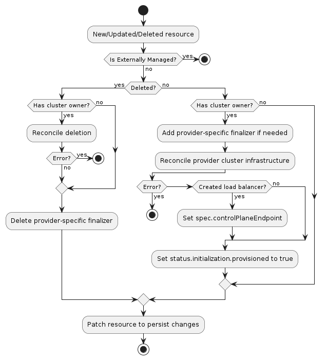

# Contract rules for InfraCluster

Infrastructure providers SHOULD implement an InfraCluster resource.

The goal of an InfraCluster resource is to supply whatever prerequisites (in term of infrastructure) are necessary for running machines.
Examples might include networking, load balancers, firewall rules, and so on.

The InfraCluster resource will be referenced by one of the Cluster API core resources, Cluster.

The [Cluster's controller](../../core/controllers/cluster.md) will be responsible to coordinate operations of the InfraCluster,
and the interaction between the Cluster's controller and the InfraCluster resource is based on the contract
rules defined in this page.

Once contract rules are satisfied by an InfraCluster implementation, other implementation details 
could be addressed according to the specific needs (Cluster API is not prescriptive).

Nevertheless, it is always recommended to take a look at Cluster API controllers,
in-tree providers, other providers and use them as a reference implementation (unless custom solutions are required 
in order to address very specific needs).

In order to facilitate the initial design for each InfraCluster resource, a few [implementation best practices] and [infrastructure Provider Security Guidance]
are explicitly called out in dedicated pages.

<aside class="note warning">

<h1>Never rely on Cluster API behaviours not defined as a contract rule!</h1>

When developing a provider, you MUST consider any Cluster API behaviour that is not defined by a contract rule
as a Cluster API internal implementation detail, and internal implementation details can change at any time.

Accordingly, in order to not expose users to the risk that your provider breaks when the Cluster API internal behavior
changes, you MUST NOT rely on any Cluster API internal behaviour when implementing an InfraCluster resource.

Instead, whenever you need something more from the Cluster API contract, you MUST engage the community.

The Cluster API maintainers welcome feedback and contributions to the contract in order to improve how it's defined,
its clarity and visibility to provider implementers and its suitability across the different kinds of Cluster API providers.

To provide feedback or open a discussion about the provider contract please [open an issue on the Cluster API](https://github.com/kubernetes-sigs/cluster-api/issues/new?assignees=&labels=&template=feature_request.md)
repo or add an item to the agenda in the [Cluster API community meeting](https://git.k8s.io/community/sig-cluster-lifecycle/README.md#cluster-api).

</aside>

## Rules (contract version v1beta1)

| Rule                                                                 | Mandatory | Note                                                                |
|----------------------------------------------------------------------|-----------|---------------------------------------------------------------------|
| [All resources: scope]                                               | Yes       |                                                                     |
| [All resources: `TypeMeta` and `ObjectMeta`field]                    | Yes       |                                                                     |
| [All resources: `APIVersion` field value]                            | Yes       |                                                                     |
| [InfraCluster, InfraClusterList resource definition]                 | Yes       |                                                                     |
| [InfraCluster: control plane endpoint]                               | No        | Mandatory if control plane endpoint is not provided by other means. |
| [InfraCluster: failure domains]                                      | No        |                                                                     |
| [InfraCluster: initialization completed]                             | Yes       |                                                                     |
| [InfraCluster: conditions]                                           | No        |                                                                     |
| [InfraCluster: terminal failures]                                    | No        |                                                                     |
| [InfraClusterTemplate, InfraClusterTemplateList resource definition] | No        | Mandatory for ClusterClasses support                                |
| [Externally managed infrastructure]                                  | No        |                                                                     |
| [Multi tenancy]                                                      | No        | Mandatory for clusterctl CLI support                                |
| [Clusterctl support]                                                 | No        | Mandatory for clusterctl CLI support                                |
| [InfraCluster: pausing]                                              | No        |                                                                     |

Note:
- `All resources` refers to all the provider's resources "core" Cluster API interacts with;
  In the context of this page: `InfraCluster`, `InfraClusterTemplate` and corresponding list types

### All resources: scope

All resources MUST be namespace-scoped.

### All resources: `TypeMeta` and `ObjectMeta` field

All resources MUST have the standard Kubernetes `TypeMeta` and `ObjectMeta` fields.

### All resources: `APIVersion` field value

In Kubernetes `APIVersion` is a combination of API group and version.
Special consideration MUST applies to both API group and version for all the resources Cluster API interacts with.

#### All resources: API group

The domain for Cluster API resources is `cluster.x-k8s.io`, and infrastructure providers under the Kubernetes SIGS org
generally use `infrastructure.cluster.x-k8s.io` as API group.

If your provider uses a different API group, you MUST grant full read/write RBAC permissions for resources in your API group
to the Cluster API core controllers. The canonical way to do so is via a `ClusterRole` resource with the [aggregation label]
`cluster.x-k8s.io/aggregate-to-manager: "true"`.

The following is an example ClusterRole for a `FooCluster` resource in the `infrastructure.foo.com` API group:

```yaml
apiVersion: rbac.authorization.k8s.io/v1
kind: ClusterRole
metadata:
    name: capi-foo-clusters
    labels:
      cluster.x-k8s.io/aggregate-to-manager: "true"
rules:
- apiGroups:
    - infrastructure.foo.com
  resources:
    - fooclusters
  verbs:
    - create
    - delete
    - get
    - list
    - patch
    - update
    - watch
- apiGroups:
    - infrastructure.foo.com
  resources:
    - fooclustertemplates
  verbs:
    - get
    - list
    - patch
    - update
    - watch
```

Note: The write permissions allow the Cluster controller to set owner references and labels on the InfraCluster resources;
write permissions are not used for general mutations of InfraCluster resources, unless specifically required (e.g. when
using ClusterClass and managed topologies).

#### All resources: version

The resource Version defines the stability of the API and its backward compatibility guarantees.
Examples include `v1alpha1`, `v1beta1`, `v1`, etc. and are governed by the [Kubernetes API Deprecation Policy].

Your provider SHOULD abide by the same policies.

Note: The version of your provider does not need to be in sync with the version of core Cluster API resources.
Instead, prefer choosing a version that matches the stability of the provider API and its backward compatibility guarantees.

Additionally:

Providers MUST set `cluster.x-k8s.io/<version>` label on the InfraCluster Custom Resource Definitions.

The label is a map from a Cluster API contract version to your Custom Resource Definition versions.
The value is an underscore-delimited (_) list of versions. Each value MUST point to an available version in your CRD Spec.

The label allows Cluster API controllers to perform automatic conversions for object references, the controllers will pick
the last available version in the list if multiple versions are found.

To apply the label to CRDs it’s possible to use commonLabels in your `kustomize.yaml` file, usually in `config/crd`:

```yaml
commonLabels:
  cluster.x-k8s.io/v1alpha2: v1alpha1
  cluster.x-k8s.io/v1alpha3: v1alpha2
  cluster.x-k8s.io/v1beta1: v1beta1
```

An example of this is in the [Kubeadm Bootstrap provider](https://github.com/kubernetes-sigs/cluster-api/blob/release-1.1/controlplane/kubeadm/config/crd/kustomization.yaml).

### InfraCluster, InfraClusterList resource definition

You MUST define a InfraCluster resource.
The InfraCluster resource name must have the format produced by `sigs.k8s.io/cluster-api/util/contract.CalculateCRDName(Group, Kind)`.

Note: Cluster API is using such a naming convention to avoid an expensive CRD lookup operation when looking for labels from 
the CRD definition of the InfraCluster resource.

It is a generally applied convention to use names in the format `${env}Cluster`, where ${env} is a, possibly short, name
for the environment in question. For example `GCPCluster` is an implementation for the Google Cloud Platform, and `AWSCluster`
is one for Amazon Web Services.

```go
// +kubebuilder:object:root=true
// +kubebuilder:resource:path=fooclusters,shortName=foocl,scope=Namespaced,categories=cluster-api
// +kubebuilder:storageversion
// +kubebuilder:subresource:status

// FooCluster is the Schema for fooclusters.
type FooCluster struct {
    metav1.TypeMeta `json:",inline"`
	metav1.ObjectMeta `json:"metadata,omitempty"`
    Spec FooClusterSpec `json:"spec,omitempty"`
    Status FooClusterStatus `json:"status,omitempty"`
}

type FooClusterSpec struct {
    // See other rules for more details about mandatory/optional fields in InfraCluster spec.
    // Other fields SHOULD be added based on the needs of your provider.
}

type FooClusterStatus struct {
    // See other rules for more details about mandatory/optional fields in InfraCluster status.
    // Other fields SHOULD be added based on the needs of your provider.
}
```

For each InfraCluster resource, you MUST also add the corresponding list resource.
The list resource MUST be named as `<InfraCluster>List`.

```go
// +kubebuilder:object:root=true

// FooClusterList contains a list of fooclusters.
type FooClusterList struct {
    metav1.TypeMeta `json:",inline"`
    metav1.ListMeta `json:"metadata,omitempty"`
    Items           []FooCluster `json:"items"`
}
```

### InfraCluster: control plane endpoint

Each Cluster needs a control plane endpoint to sit in front of control plane machines.
Control plane endpoint can be provided in three ways in Cluster API: by the users, by the control plane provider or
by the infrastructure provider.

In case you are developing an infrastructure provider which is responsible to provide a control plane endpoint for
each Cluster, the host and port of the generated control plane endpoint MUST surface on `spec.controlPlaneEndpoint`
in the InfraCluster resource.

```go
type FooClusterSpec struct {
    // controlPlaneEndpoint represents the endpoint used to communicate with the control plane.
    // +optional
    ControlPlaneEndpoint APIEndpoint `json:"controlPlaneEndpoint"`
    
    // See other rules for more details about mandatory/optional fields in InfraCluster spec.
    // Other fields SHOULD be added based on the needs of your provider.
}

// APIEndpoint represents a reachable Kubernetes API endpoint.
type APIEndpoint struct {
    // host is the hostname on which the API server is serving.
    Host string `json:"host"`
    
    // port is the port on which the API server is serving.
    Port int32 `json:"port"`
}
```

Once `spec.controlPlaneEndpoint` is set on the InfraCluster resource and the [InfraCluster initialization completed],
the Cluster controller will surface this info in Cluster's `spec.controlPlaneEndpoint`.

If instead you are developing an infrastructure provider which is NOT responsible to provide a control plane endpoint,
the implementer should exit reconciliation until it sees Cluster's `spec.controlPlaneEndpoint` populated.

### InfraCluster: failure domains

In case you are developing an infrastructure provider which has a notion of failure domains where machines should be
placed in, the list of available failure domains MUST surface on `status.failureDomains` in the InfraCluster resource.

```go
type FooClusterStatus struct {
    // failureDomains is a list of failure domain objects synced from the infrastructure provider.
    FailureDomains clusterv1.FailureDomains `json:"failureDomains,omitempty"`
    
    // See other rules for more details about mandatory/optional fields in InfraCluster status.
    // Other fields SHOULD be added based on the needs of your provider.
}
```

`clusterv1.FailureDomains` is a map, defined as `map[string]FailureDomainSpec`. A unique key must be used for each `FailureDomainSpec`.
`FailureDomainSpec` is defined as:
- `controlPlane bool`: indicates if failure domain is appropriate for running control plane instances.
- `attributes map[string]string`: arbitrary attributes for users to apply to a failure domain.

Once `status.failureDomains` is set on the InfraCluster resource and the [InfraCluster initialization completed],
the Cluster controller will surface this info in Cluster's `status.failureDomains`.

### InfraCluster: initialization completed

Each InfraCluster MUST report when Cluster's infrastructure is fully provisioned (initialization) by setting
`status.ready` in the InfraCluster resource.

```go
type FooClusterStatus struct {
    // ready denotes that the foo cluster infrastructure is fully provisioned.
	// NOTE: this field is part of the Cluster API contract and it is used to orchestrate provisioning.
	// The value of this field is never updated after provisioning is completed. Please use conditions
	// to check the operational state of the infa cluster.
    // +optional
    Ready bool `json:"ready"`
    
    // See other rules for more details about mandatory/optional fields in InfraCluster status.
    // Other fields SHOULD be added based on the needs of your provider.
}
```

Once `status.ready` is set, the Cluster "core" controller will bubbles up this info in Cluster's `status.infrastructureReady`;
If defined, also InfraCluster's `spec.controlPlaneEndpoint` and `status.failureDomains` will be surfaced on Cluster's
corresponding fields at the same time.

<aside class="note warning">

<h1>Heads up! this will change with the v1beta2 contract</h1>

When the v1beta2 contract will be released (tentative Apr 2025), `status.initialization.provisioned` will be used
instead of `status.ready`. However, `status.ready` will be supported until v1beta1 removal (~one year later).

See [Improving status in CAPI resources].

</aside>

### InfraCluster: conditions

According to [Kubernetes API Conventions], Conditions provide a standard mechanism for higher-level
status reporting from a controller.

Providers implementers SHOULD implement `status.conditions` for their InfraCluster resource.
In case conditions are implemented, Cluster API condition type MUST be used.

If a condition with type `Ready` exist, such condition will be mirrored in Cluster's `InfrastructureReady` condition.

Please note that the `Ready` condition is expected to surface the status of the InfraCluster during its own entire lifecycle,
including initial provisioning, the final deletion process, and the period in between these two moments.

See [Cluster API condition proposal] for more context.

<aside class="note warning">

<h1>Heads up! this will change with the v1beta2 contract</h1>

When the v1beta2 contract will be released (tentative Apr 2025), Cluster API will start using Kubernetes metav1.Condition
types and fully comply to [Kubernetes API Conventions].

In order to support providers continuing to use legacy Cluster API condition types, providers transitioning to
metav1.Condition or even providers adopting custom condition types, Cluster API will start to accept `Ready` condition that
provides following information:
- `type`
- `status`
- `reason` ((optional, if omitted, a default one will be used)
- `message` (optional)
- `lastTransitionTime` (optional, if omitted, time.Now will be used) 

Other fields will be ignored

See [Improving status in CAPI resources] for more context.

Please note that provider that will continue to use legacy Cluster API condition types MUST carefully take into account
the implication of this choice which are described both in the document above and in the notice at the beginning of the [Cluster API condition proposal]..

</aside>

### InfraCluster: terminal failures

Each InfraCluster SHOULD report when Cluster's enter in a state that cannot be recovered (terminal failure) by
setting `status.failureReason` and `status.failureMessage` in the InfraCluster resource.

```go
type FooClusterStatus struct {
    // failureReason will be set in the event that there is a terminal problem reconciling the FooCluster 
    // and will contain a succinct value suitable for machine interpretation.
    //
    // This field should not be set for transitive errors that can be fixed automatically or with manual intervention,
    // but instead indicate that something is fundamentally wrong with the FooCluster and that it cannot be recovered.
    // +optional
    FailureReason *capierrors.ClusterStatusError `json:"failureReason,omitempty"`
    
    // failureMessage will be set in the event that there is a terminal problem reconciling the FooCluster
    // and will contain a more verbose string suitable for logging and human consumption.
    //
    // This field should not be set for transitive errors that can be fixed automatically or with manual intervention,
    // but instead indicate that something is fundamentally wrong with the FooCluster and that it cannot be recovered.
    // +optional
    FailureMessage *string `json:"failureMessage,omitempty"`
    
    // See other rules for more details about mandatory/optional fields in InfraCluster status.
    // Other fields SHOULD be added based on the needs of your provider.
}
```

Once `status.failureReason` and `status.failureMessage` are set on the InfraCluster resource, the Cluster "core" controller
will surface those info in the corresponding fields in Cluster's `status`.

Please note that once failureReason/failureMessage is set in Cluster's `status`, the only way to recover is to delete and
recreate the Cluster (it is a terminal failure).

<aside class="note warning">

<h1>Heads up! this will change with the v1beta2 contract</h1>

When the v1beta2 contract will be released (tentative Apr 2025), support for `status.failureReason` and `status.failureMessage`
will be dropped.

See [Improving status in CAPI resources].

</aside>

### InfraClusterTemplate, InfraClusterTemplateList resource definition

For a given InfraCluster resource, you should also add a corresponding InfraClusterTemplate resources in order to use it in ClusterClasses.
The template resource MUST be named as `<InfraCluster>Template`.

```go
// +kubebuilder:object:root=true
// +kubebuilder:resource:path=fooclustertemplates,scope=Namespaced,categories=cluster-api
// +kubebuilder:storageversion

// FooClusterTemplate is the Schema for the fooclustertemplates API.
type FooClusterTemplate struct {
    metav1.TypeMeta   `json:",inline"`
    metav1.ObjectMeta `json:"metadata,omitempty"`

    Spec FooClusterTemplateSpec `json:"spec,omitempty"`
}

type FooClusterTemplateSpec struct {
    Template FooClusterTemplateResource `json:"template"`
}

type FooClusterTemplateResource struct {
    // Standard object's metadata.
    // More info: https://git.k8s.io/community/contributors/devel/sig-architecture/api-conventions.md#metadata
    // +optional
    ObjectMeta clusterv1.ObjectMeta `json:"metadata,omitempty"`
    Spec FooClusterSpec `json:"spec"`
}
```

NOTE: in this example InfraClusterTemplate's `spec.template.spec` embeds `FooClusterSpec` from InfraCluster. This might not always be
the best choice depending of if/how InfraCluster's spec fields applies to many clusters vs only one.

For each InfraClusterTemplate resource, you MUST also add the corresponding list resource.
The list resource MUST be named as `<InfraClusterTemplate>List`.

```go
// +kubebuilder:object:root=true

// FooClusterTemplateList contains a list of FooClusterTemplates.
type FooClusterTemplateList struct {
    metav1.TypeMeta `json:",inline"`
    metav1.ListMeta `json:"metadata,omitempty"`
    Items           []FooClusterTemplate `json:"items"`
}
```

### Externally managed infrastructure

In some cases, users might be required (or choose to) manage infrastructure out of band and run CAPI on top of already
existing infrastructure.

In order to support this use case, the InfraCluster controller SHOULD skip reconciliation of InfraCluster resources with
the `cluster.x-k8s.io/managed-by: "<name-of-system>"` label, and not update the resource or its status in any way.

Please note that when the cluster infrastructure is externally managed, it is responsibility of external management system
to abide to the following contract rules:
- [InfraCluster control plane endpoint]
- [InfraCluster failure domains]
- [InfraCluster initialization completed]
- [InfraCluster terminal failures]

See the [externally managed infrastructure proposal] for more detail about this use case.

### Multi tenancy

Multi tenancy in Cluster API defines the capability of an infrastructure provider to manage different credentials,
each one of them corresponding to an infrastructure tenant.

See [infrastructure Provider Security Guidance] for considerations about cloud provider credential management.

Please also note that Cluster API does not support running multiples instances of the same provider, which someone can
assume an alternative solution to implement multi tenancy; same applies to the clusterctl CLI.

See [Support running multiple instances of the same provider] for more context.

However, if you want to make it possible for users to run multiples instances of your provider, your controller's SHOULD:

- support the `--namespace` flag.
- support the `--watch-filter` flag.

Please, read carefully the page linked above to fully understand implications and risks related to this option.

### Clusterctl support

The clusterctl command is designed to work with all the providers compliant with the rules defined in the [clusterctl provider contract].

### InfraCluster: pausing

Providers SHOULD implement the pause behaviour for every object with a reconciliation loop. This is done by checking if `spec.paused` is set on the Cluster object and by checking for the `cluster.x-k8s.io/paused` annotation on the InfraCluster object.

If implementing the pause behavior, providers SHOULD surface the paused status of an object using the Paused condition: `Status.Conditions[Paused]`.

## Typical InfraCluster reconciliation workflow

A cluster infrastructure provider must respond to changes to its InfraCluster resources. This process is
typically called reconciliation. The provider must watch for new, updated, and deleted resources and respond
accordingly.

As a reference you can look at the following workflow to understand how the typical reconciliation workflow
is implemented in InfraCluster controllers:



### Normal resource

1. If the resource is externally managed, exit the reconciliation
    1. The `ResourceIsNotExternallyManaged` predicate can be used to prevent reconciling externally managed resources
1. If the resource does not have a `Cluster` owner, exit the reconciliation
    1. The Cluster API `Cluster` reconciler populates this based on the value in the `Cluster`'s `spec.infrastructureRef`
       field.
1. Add the provider-specific finalizer, if needed
1. Reconcile provider-specific cluster infrastructure
    1. If any errors are encountered, exit the reconciliation
1. If the provider created a load balancer for the control plane, record its hostname or IP in `spec.controlPlaneEndpoint`
1. Set `status.ready` to `true`
1. Set `status.failureDomains` based on available provider failure domains (optional)
1. Patch the resource to persist changes

### Deleted resource

1. If the resource has a `Cluster` owner
    1. Perform deletion of provider-specific cluster infrastructure
    1. If any errors are encountered, exit the reconciliation
1. Remove the provider-specific finalizer from the resource
1. Patch the resource to persist changes

[All resources: Scope]: #all-resources-scope
[All resources: `TypeMeta` and `ObjectMeta`field]: #all-resources-typemeta-and-objectmeta-field
[All resources: `APIVersion` field value]: #all-resources-apiversion-field-value
[aggregation label]: https://kubernetes.io/docs/reference/access-authn-authz/rbac/#aggregated-clusterroles
[Kubernetes API Deprecation Policy]: https://kubernetes.io/docs/reference/using-api/deprecation-policy/
[InfraCluster, InfraClusterList resource definition]: #infracluster-infraclusterlist-resource-definition
[InfraCluster: control plane endpoint]: #infracluster-control-plane-endpoint
[InfraCluster: failure domains]: #infracluster-failure-domains
[InfraCluster: initialization completed]: #infracluster-initialization-completed
[Improving status in CAPI resources]: https://github.com/kubernetes-sigs/cluster-api/blob/main/docs/proposals/20240916-improve-status-in-CAPI-resources.md
[InfraCluster: conditions]: #infracluster-conditions
[Kubernetes API Conventions]: https://github.com/kubernetes/community/blob/master/contributors/devel/sig-architecture/api-conventions.md#typical-status-properties
[Cluster API condition proposal]: https://github.com/kubernetes-sigs/cluster-api/blob/main/docs/proposals/20200506-conditions.md
[InfraCluster: terminal failures]: #infracluster-terminal-failures
[InfraClusterTemplate, InfraClusterTemplateList resource definition]: #infraclustertemplate-infraclustertemplatelist-resource-definition
[Externally managed infrastructure]: #externally-managed-infrastructure
[externally managed infrastructure proposal]: https://github.com/kubernetes-sigs/cluster-api/blob/main/docs/proposals/20210203-externally-managed-cluster-infrastructure.md
[Multi tenancy]: #multi-tenancy
[Support running multiple instances of the same provider]: ../../core/support-multiple-instances.md
[Clusterctl support]: #clusterctl-support
[clusterctl provider contract]: clusterctl.md
[implementation best practices]: ../best-practices.md
[infrastructure Provider Security Guidance]: ../security-guidelines.md
[InfraCluster: pausing]: #infracluster-pausing
