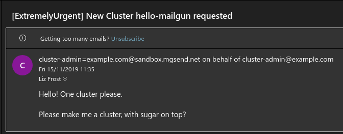

# Building, Running, Testing

## Docker Image Name

The IMG variable is used to build the Docker image and push it to a registry. The default value is `controller:latest`, which is a local image. You can change it to a remote image if you want to push it to a registry.

```bash
make docker-push IMG=ghcr.io/your-org/your-repo:dev
```

## Deployment

### Cluster API

Before you can deploy the infrastructure controller, you'll need to deploy Cluster API itself to the management cluster.

Follow the [quick start guide](https://cluster-api.sigs.k8s.io/user/quick-start) up to and including the step of [creating the management cluster](https://cluster-api.sigs.k8s.io/user/quick-start#initialize-the-management-cluster). We will proceed presuming you created a cluster with kind and initalized cluster-api with `clusterctl init`.


Check the status of the manager to make sure it's running properly:

```bash
kubectl describe -n capi-system pod | grep -A 5 Conditions
```
```bash
Conditions:
  Type                        Status
  PodReadyToStartContainers   True
  Initialized                 True
  Ready                       True
  ContainersReady             True
```

[capi]: https://github.com/kubernetes-sigs/cluster-api
[releases]: https://github.com/kubernetes-sigs/cluster-api/releases

### Your provider

In this guide, we are building an _infrastructure provider_. We must tell cluster-api and its developer tooling which type of provider it is. Edit `config/default/kustomization.yaml` and add the following common label. The prefix `infrastructure-` [is used][label_prefix] to detect the provider type.

```yaml
labels:
- includeSelectors: true
  pairs:
    cluster.x-k8s.io/provider: infrastructure-mailgun
```

Now you can apply your provider as well:

```bash
cd cluster-api-provider-mailgun

# Install CRD and controller to current kubectl context
make install deploy

kubectl describe -n cluster-api-provider-mailgun-system pod | grep -A 5 Conditions
```

```text
Conditions:
  Type              Status
  Initialized       True
  Ready             True
  ContainersReady   True
  PodScheduled      True
```

[label_prefix]: https://github.com/kubernetes-sigs/cluster-api/search?q=%22infrastructure-%22

### Tiltfile
Cluster API development requires a lot of iteration, and the "build, tag, push, update deployment" workflow can be very tedious.
[Tilt](https://tilt.dev) makes this process much simpler by watching for updates, then automatically building and deploying them.

See [Developing Cluster API with Tilt](../../core/tilt.md) on all details how to develop both Cluster API and your provider at the same time. In short, you need to perform these steps for a basic Tilt-based development environment:

- Create file `tilt-provider.yaml` in your provider directory:

```yaml
name: mailgun
config:
  image: controller:latest # change to remote image name if desired
  label: CAPM
  live_reload_deps: ["main.go", "go.mod", "go.sum", "api", "controllers", "pkg"]
```

- Create file `tilt-settings.yaml` in the cluster-api directory:

```yaml
default_registry: "" # change if you use a remote image registry
provider_repos:
  # This refers to your provider directory and loads settings
  # from `tilt-provider.yaml`
  - ../cluster-api-provider-mailgun
enable_providers:
  - mailgun
```

- Create a kind cluster. By default, Tiltfile assumes the kind cluster is named `capi-test`.

```bash
kind create cluster --name capi-test

# If you want a more sophisticated setup of kind cluster + image registry, try:
# ---
# cd cluster-api
# hack/kind-install-for-capd.sh
```

- Run `tilt up` in the cluster-api folder

You can then use Tilt to watch the container logs.

On any changed file in the listed places (`live_reload_deps` and those watched inside cluster-api repo), Tilt will build and deploy again. In the regular case of a changed file, only your controller's binary gets rebuilt, copied into the running container, and the process restarted. This is much faster than a full re-build and re-deployment of a Docker image and restart of the Kubernetes pod.

You best watch the Kubernetes pods with something like `k9s -A` or `watch kubectl get pod -A`. Particularly in case your provider implementation crashes, Tilt has no chance to deploy any code changes into the container since it might be crash-looping indefinitely. In such a case – which you will notice in the log output – terminate Tilt (hit Ctrl+C) and start it again to deploy the Docker image from scratch.

## Your first Cluster

Let's try our cluster out. We'll make some simple YAML:

```yaml
apiVersion: cluster.x-k8s.io/v1beta1
kind: Cluster
metadata:
  name: hello-mailgun
spec:
  clusterNetwork:
    pods:
      cidrBlocks: ["192.168.0.0/16"]
  infrastructureRef:
    apiVersion: infrastructure.cluster.x-k8s.io/v1alpha1
    kind: MailgunCluster
    name: hello-mailgun
---
apiVersion: infrastructure.cluster.x-k8s.io/v1alpha1
kind: MailgunCluster
metadata:
  name: hello-mailgun
spec:
  priority: "ExtremelyUrgent"
  request: "Please make me a cluster, with sugar on top?"
  requester: "cluster-admin@example.com"
```

We apply it as normal with `kubectl apply -f <filename>.yaml`.

If all goes well, you should be getting an email to the address you configured when you set up your management cluster:



## Conclusion

Obviously, this is only the first step.
We need to implement our Machine object too, and log events, handle updates, and many more things.

Hopefully you feel empowered to go out and create your own provider now.
The world is your Kubernetes-based oyster!
