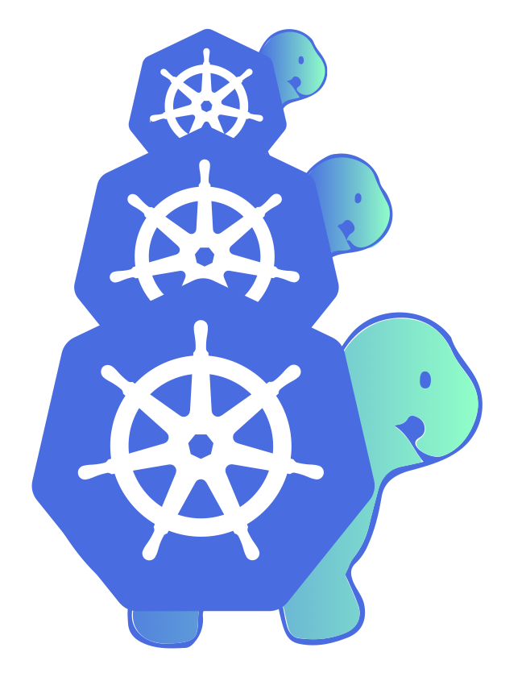

# Kubernetes Cluster API

Cluster API is a Kubernetes sub-project focused on providing declarative APIs and tooling to simplify provisioning, upgrading, and operating multiple Kubernetes clusters.

Started by the Kubernetes Special Interest Group (SIG) [Cluster Lifecycle](https://github.com/kubernetes/community/tree/master/sig-cluster-lifecycle#readme), the Cluster API project uses Kubernetes-style APIs and patterns to automate cluster lifecycle management for platform operators. The supporting infrastructure, like virtual machines, networks, load balancers, and VPCs, as well as the Kubernetes cluster configuration are all defined in the same way that application developers operate deploying and managing their workloads. This enables consistent and repeatable cluster deployments across a wide variety of infrastructure environments.

## Getting started

* [Quick start](./user/quick-start.md)
* [Concepts](./user/concepts.md)
* [Developer guide](./developer/guide.md)
* [Contributing](./CONTRIBUTING.md)

**Using Cluster API v1alpha3?** See the [legacy
documentation](https://release-0-3.cluster-api.sigs.k8s.io).

## Why build Cluster API?

Kubernetes is a complex system that relies on several components being configured correctly to have a working cluster. Recognizing this as a potential stumbling block for users, the community focused on simplifying the bootstrapping process. Today, over [100 Kubernetes distributions and installers](https://www.cncf.io/certification/software-conformance/) have been created, each with different default configurations for clusters and supported infrastructure providers. SIG Cluster Lifecycle saw a need for a single tool to address a set of common overlapping installation concerns and started kubeadm.

[Kubeadm](https://kubernetes.io/docs/reference/setup-tools/kubeadm/kubeadm/) was designed as a focused tool for bootstrapping a best-practices Kubernetes cluster. The core tenet behind the kubeadm project was to create a tool that other installers can leverage and ultimately alleviate the amount of configuration that an individual installer needed to maintain. Since it began, kubeadm has become the underlying bootstrapping tool for several other applications, including Kubespray, Minikube, kind, etc.

However, while kubeadm and other bootstrap providers reduce installation complexity, they don't address how to manage a cluster day-to-day or a Kubernetes environment long term. You are still faced with several questions when setting up a production environment, including:

* How can I consistently provision machines, load balancers, VPC, etc., across multiple infrastructure providers and locations?
* How can I automate cluster lifecycle management, including things like upgrades and cluster deletion?
* How can I scale these processes to manage any number of clusters?

SIG Cluster Lifecycle began the Cluster API project as a way to address these gaps by building declarative, Kubernetes-style APIs, that automate cluster creation, configuration, and management. Using this model, Cluster API can also be extended to support any infrastructure provider (AWS, Azure, vSphere, etc.) or bootstrap provider (kubeadm is default) you need. See the growing list of [available providers](./reference/providers.md).

{{#include ../../scope-and-objectives.md:Goals}}

{{#include ../../../README.md:Community}}
