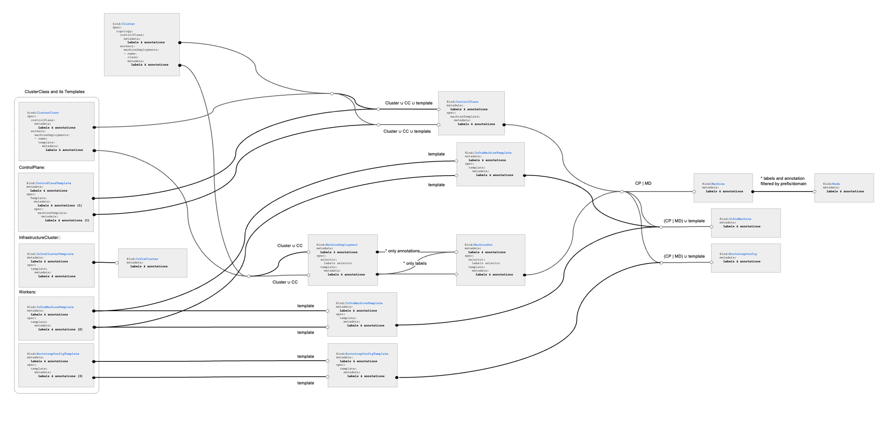

# Metadata propagation
Cluster API controllers implement consistent metadata (labels & annotations) propagation across the core API resources.
This behaviour tries to be consistent with Kubernetes apps/v1 Deployment and ReplicaSet.
New providers should behave accordingly fitting within the following pattern:

## Cluster Topology
ControlPlaneTopology labels are labels and annotations are continuously propagated to ControlPlane top-level labels and annotations
and ControlPlane MachineTemplate labels and annotations.
- `.spec.topology.controlPlane.metadata.labels` => `ControlPlane.labels`, `ControlPlane.spec.machineTemplate.metadata.labels`
- `.spec.topology.controlPlane.metadata.annotations` => `ControlPlane.annotations`, `ControlPlane.spec.machineTemplate.metadata.annotations`

MachineDeploymentTopology labels and annotations are continuously propagated to MachineDeployment top-level labels and annotations
and MachineDeployment MachineTemplate labels and annotations.
- `.spec.topology.machineDeployments[i].metadata.labels` => `MachineDeployment.labels`, `MachineDeployment.spec.template.metadata.labels`
- `.spec.topology.machineDeployments[i].metadata.annotations` => `MachineDeployment.annotations`, `MachineDeployment.spec.template.metadata.annotations`

## ClusterClass
ControlPlaneClass labels are labels and annotations are continuously propagated to ControlPlane top-level labels and annotations
and ControlPlane MachineTemplate labels and annotations.
- `.spec.controlPlane.metadata.labels` => `ControlPlane.labels`, `ControlPlane.spec.machineTemplate.metadata.labels`
- `.spec.controlPlane.metadata.annotations` => `ControlPlane.annotations`, `ControlPlane.spec.machineTemplate.metadata.annotations`
Note: ControlPlaneTopology labels and annotations take precedence over ControlPlaneClass labels and annotations.

MachineDeploymentClass labels and annotations are continuously propagated to MachineDeployment top-level labels and annotations
and MachineDeployment MachineTemplate labels and annotations.
- `.spec.workers.machineDeployments[i].template.metadata.labels` => `MachineDeployment.labels`, `MachineDeployment.spec.template.metadata.labels`
- `.spec.worker.machineDeployments[i].template.metadata.annotations` => `MachineDeployment.annotations`, `MachineDeployment.spec.template.metadata.annotations`
Note: MachineDeploymentTopology labels and annotations take precedence over MachineDeploymentClass labels and annotations.

## KubeadmControlPlane
Top-level labels and annotations do not propagate at all.
- `.labels` => Not propagated.
- `.annotations` => Not propagated.

MachineTemplate labels and annotations continuously propagate to new and existing Machines, InfraMachines and BootstrapConfigs.
- `.spec.machineTemplate.metadata.labels` => `Machine.labels`, `InfraMachine.labels`, `BootstrapConfig.labels`
- `.spec.machineTemplate.metadata.annotations` => `Machine.annotations`, `InfraMachine.annotations`, `BootstrapConfig.annotations`

## MachineDeployment
Top-level labels do not propagate at all.
Top-level annotations continuously propagate to MachineSets top-level annotations.
- `.labels` => Not propagated.
- `.annotations` => MachineSet.annotations

Template labels continuously propagate to MachineSets top-level and MachineSets template metadata.
Template annotations continuously propagate to MachineSets template metadata.
- `.spec.template.metadata.labels` => `MachineSet.labels`, `MachineSet.spec.template.metadata.labels`
- `.spec.template.metadata.annotations` => `MachineSet.spec.template.metadata.annotations`

## MachineSet
Top-level labels and annotations do not propagate at all.
- `.labels` => Not propagated.
- `.annotations` => Not propagated.

Template labels and annotations continuously propagate to new and existing Machines, InfraMachines and BootstrapConfigs.
- `.spec.template.metadata.labels` => `Machine.labels`, `InfraMachine.labels`, `BootstrapConfig.labels`
- `.spec.template.metadata.annotations` => `Machine.annotations`, `InfraMachine.annotations`, `BootstrapConfig.annotations`

## Machine
Top-level labels that meet a specific cretria are propagated to the Node labels and top-level annotatation are not propagated.
- `.labels.[label-meets-criteria]` => `Node.labels`
- `.annotations` => Not propagated.

Label should meet one of the following criteria to propagate to Node: 
- Has `node-role.kubernetes.io` as prefix.
- Belongs to `node-restriction.kubernetes.io` domain.
- Belongs to `node.cluster.x-k8s.io` domain.  
