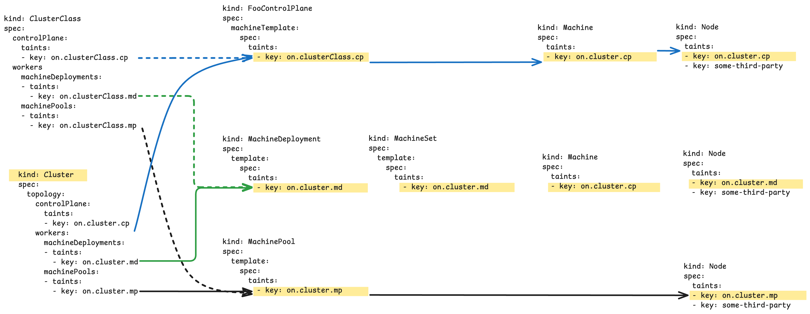

# Taint propagation
Cluster API controllers implement consistent taint propagation across Cluster API resources and from Machines to
corresponding Kubernetes Node in the workload cluster.
Note: To enable this feature it is required to set the `MachineTaintPropagation` feature gate to `true`.

See the proposal [Propagating taints from Cluster API to Nodes](https://github.com/kubernetes-sigs/cluster-api/blob/main/docs/proposals/20250513-propogate-taints.md) for more information.

When using Cluster API managed topologies, taint can be set both on ClusterClass or on the Cluster object; 
the propagation of the taints is summarized in the following table and picture:

| ClusterClass | Cluster | Result on ControlPlane, MachineDeployment, MachinePools |
|--------------|---------|---------------------------------------------------------|
| Set          | Set     | **Cluster** taints (ClusterClass taints are ignored)    |
| Set          | Not set | **ClusterClass** taints                                 |
| Not set      | Set     | **Cluster** taints                                      |
| Not set      | Not set | No taints from ClusterClass or Cluster                  |

Taint set on ControlPlane, MachineDeployment (MachineSet) resources are propagated in-place, without triggering 
a rollout, to the controlled Machines.

Taint set on the Machine resource are propagated to the corresponding Kubernetes Node in the workload cluster.
This operation is performed according to the `propagation` rule defined for each taint on the Machine object:

- `Always`:
    - These taints are supposed to be set on the `Node` object as long as it is defined on its parent core CAPI object.
    - Example: Nodes where only GPU related workload should run
    - Reconciliation behavior:
        - `Always` taint added to the machine or exists during initialization: reconciliation will add the taint to the node.
        - `Always` taint removed from machine: reconciliation will remove the taint from the node, if it did add it in the past.
        - `Always` taint not changed: reconciliation takes care that the taint still exists on the node.
      
- `OnInitialization`
    - These taints are supposed to be set **once** by Cluster API on a `Node` object.
    - Example: Ensure that no workload gets scheduled to a `Node` unless the taint got removed to e.g. install a GPU driver before allowing workload.
    - Cluster API should once set the taint on the Node and not add it again if it got removed.

Taint propagation for MachinePools resources is not implemented yet.

Please note that:
- Taints with a key of `node.cluster.x-k8s.io/uninitialized` or `node.cluster.x-k8s.io/outdated-revision` cannot be set by users
  (these taints are managed by Cluster API and providers).
- Taints with the key prefix `node.kubernetes.io/` cannot be set by users, except `node.kubernetes.io/out-of-service`
  (these taints are managed by the node controller or the kubelet).
- Taints with the key prefix `node.cloudprovider.kubernetes.io/` cannot be set by users
  (these taints are either managed by the kubelet or by a cloud-controller-manager's node-lifecycle-controller)
- The taint `node-role.kubernetes.io/control-plane` cannot be set by users on worker nodes.
- The taint `node-role.kubernetes.io/master` cannot be set by users (deprecated since 1.24)

## Notes for the Kubeadm bootstrap provider

If using the kubeadm bootstrap provider, taints can also be added by setting `init/joinConfiguration.nodeRegistration.taints`.

Adding taints with this approach is almost equivalent to adding an `OnInitialization` taint on the Machine resource.

The following table describe available options depending on where taints are set or not set [1].

| Machine | CABPK        | Result                                                                                                          |
|---------|--------------|-----------------------------------------------------------------------------------------------------------------|
| Set     | Set          | **CABPK** and **Machine** taints, on same key + effect use the value from the Machine defined taint             |
| Set     | Not set      | **CABPK default [2]** and **Machine** taints, on same key + effect use the value from the Machine defined taint |
| Set     | empty / `[]` | **Machine** taints                                                                                              |
| Not set | Set          | **CABPK** taints                                                                                                |
| Not set | Not set      | **CABPK default [2]** taint                                                                                     |
| Not set | empty / `[]` | no taints                                                                                                       |

[1]: If the taint are not set on the Machine, CAPBK preserve the same behaviour existing before the implementation of this feature.
[2]: Per default kubeadm adds the taint `node-role.kubernetes.io/control-plane:NoSchedule` to control plane nodes.