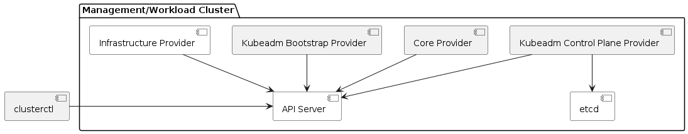
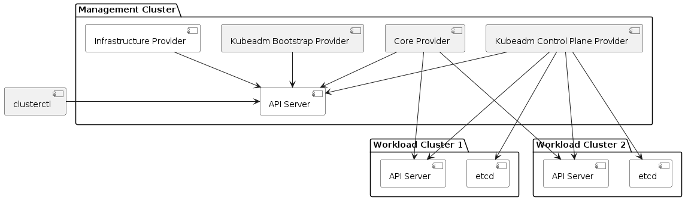

# Cluster API Version Support and Kubernetes Version Skew Policy

## Supported Versions

The Cluster API team maintains release branches for **(v1alpha3) v0.3** and **(v1alpha2) v0.2**, the two most recent releases.

Releases include these components:

- Core Provider
- Kubeadm Bootstrap Provider
- Kubeadm Control Plane Provider
- clusterctl client

All Infrastructure Providers are maintained by independent teams. Other Bootstrap and Control Plane Providers are also maintained by independent teams. For more information about their version support, see [below](#providers-maintained-by-independent-teams).

## Supported Kubernetes Versions

The project aims to keep the current minor release compatible with the actively supported Kubernetes minor releases, i.e., the current release (N), N-1, and N-2. To find out the exact range of Kubernetes versions supported by each  component, please see the [tables](#release-components) below.

See the [following section](#kubernetes-version-support-as-a-function-of-cluster-topology) to understand how cluster topology affects version support.

### Kubernetes Version Support As A Function Of Cluster Topology

The Core Provider, Kubeadm Bootstrap Provider, and Kubeadm Control Plane Provider run on the Management Cluster, and clusterctl talks to that cluster's API server.

In some cases, the Management Cluster is separate from the Workload Clusters. The Kubernetes version of the Management and Workload Clusters are allowed to be different. For example, the current Cluster API release is compatible with Kubernetes versions 1.16 through 1.18. For example, the Management Cluster can run v1.18.2, and two Workload Clusters can run v1.16.9 and v1.17.5.

Management Clusters and Workload Clusters can be upgraded independently and in any order, however, if you are additionally moving from
v1alpha2 (v0.2.x) to v1alpha3 (v0.3.x) as part of the upgrade roll out, the management cluster will need to be upgraded to at least v1.16.x,
prior to upgrading any workload cluster using Cluster API v1alpha3 (v0.3.x)

These diagrams show the relationships between components in a Cluster API release (yellow), and other components (white).

#### Management And Workload Cluster Are the Same (Self-hosted)

#### Management And Workload Clusters Are Separate

### Release Components

#### Core Provider (`cluster-api-controller`)

|                  | Cluster API v1alpha2 (v0.2) | Cluster API v1alpha3 (v0.3) |
| ---------------- | --------------------------- | --------------------------- |
| Kubernetes v1.13 | ✓                           |                             |
| Kubernetes v1.14 | ✓                           |                             |
| Kubernetes v1.15 | ✓                           |                             |
| Kubernetes v1.16 | ✓                           | ✓                           |
| Kubernetes v1.17 |                             | ✓                           |
| Kubernetes v1.18 |                             | ✓                           |
| Kubernetes v1.19 |                             | ✓                           |
| Kubernetes v1.20 |                             | ✓                           |

The Core Provider also talks to API server of every Workload Cluster. Therefore, the Workload Cluster's Kubernetes version must also be compatible.

#### Kubeadm Bootstrap Provider (`kubeadm-bootstrap-controller`)

|                                    | Cluster API v1alpha2 (v0.2) | Cluster API v1alpha3 (v0.3) |
| ---------------------------------- | --------------------------- | --------------------------- |
| Kubernetes v1.13                   |                             |                             |
| Kubernetes v1.14 + kubeadm/v1beta1 | ✓                           |                             |
| Kubernetes v1.15 + kubeadm/v1beta2 | ✓                           |                             |
| Kubernetes v1.16 + kubeadm/v1beta2 | ✓                           | ✓                           |
| Kubernetes v1.17 + kubeadm/v1beta2 |                             | ✓                           |
| Kubernetes v1.18 + kubeadm/v1beta2 |                             | ✓                           |
| Kubernetes v1.19 + kubeadm/v1beta2 |                             | ✓                           |
| Kubernetes v1.20 + kubeadm/v1beta2 |                             | ✓                           |

The Kubeadm Bootstrap Provider generates configuration using the v1beta1 or v1beta2 kubeadm API
according to the target Kubernetes version.

#### Kubeadm Control Plane Provider (`kubeadm-control-plane-controller`)

|                            | Cluster API v1alpha2 (v0.2) | Cluster API v1alpha3 (v0.3) |
| -------------------------- | --------------------------- | --------------------------- |
| Kubernetes v1.13           |                             |                             |
| Kubernetes v1.14           |                             |                             |
| Kubernetes v1.15           |                             |                             |
| Kubernetes v1.16 + etcd/v3 |                             | ✓                           |
| Kubernetes v1.17 + etcd/v3 |                             | ✓                           |
| Kubernetes v1.18 + etcd/v3 |                             | ✓                           |
| Kubernetes v1.19 + etcd/v3 |                             | ✓                           |
| Kubernetes v1.20 + etcd/v3 |                             | ✓                           |

The Kubeadm Control Plane Provider talks to the API server and etcd members of every Workload Cluster whose control plane it owns. It uses the etcd v3 API.

The Kubeadm Control Plane requires the Kubeadm Bootstrap Provider.

#### clusterctl

It is strongly recommended to always use the latest version of [clusterctl](../clusterctl/overview.md), in order to
get all the fixes/latest changes.

In case of upgrades, clusterctl should be upgraded first and then used to upgrade all the other components.

## Providers Maintained By Independent Teams

In general, if a Provider version M says it is compatible with Cluster API version N, then version M must be compatible with a subset of the Kubernetes versions supported by Cluster API version N.

To understand the version compatibility of a specific provider, please see its documentation. This book includes [a list of independent providers](providers.md)
