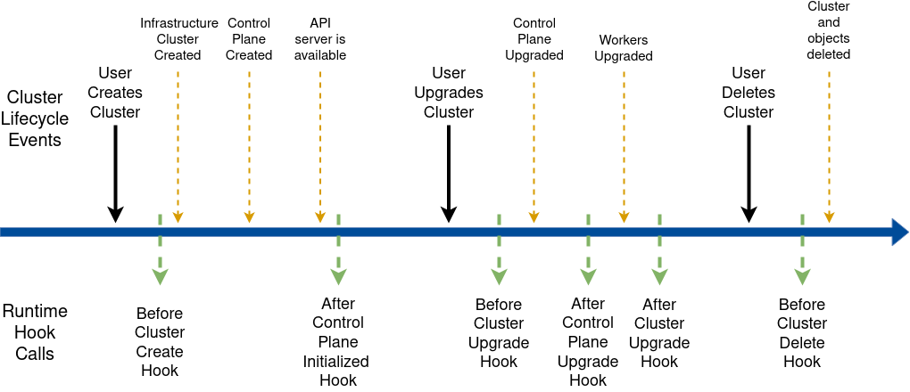

# Implementing Lifecycle Hook Runtime Extensions

<aside class="note warning">

<h1>Caution</h1>

Please note Runtime SDK is an advanced feature. If implemented incorrectly, a failing Runtime Extension can severely impact the Cluster API runtime.

</aside>

## Introduction

The lifecycle hooks allow hooking into the Cluster lifecycle. The following diagram provides an overview:



Please see the corresponding [CAEP](https://github.com/kubernetes-sigs/cluster-api/blob/main/docs/proposals/20220414-runtime-hooks.md) 
for additional background information. 

## Guidelines

All guidelines defined in [Implementing Runtime Extensions](implement-extensions.md#guidelines) apply to the 
implementation of Runtime Extensions for lifecycle hooks as well.

In summary, Runtime Extensions are components that should be designed, written and deployed with great caution given 
that they can affect the proper functioning of the Cluster API runtime. A poorly implemented Runtime Extension could 
potentially block lifecycle transitions from happening.

Following recommendations are especially relevant:

* [Blocking and non Blocking](implement-extensions.md#blocking-hooks)
* [Error messages](implement-extensions.md#error-messages)
* [Error management](implement-extensions.md#error-management)
* [Avoid dependencies](implement-extensions.md#avoid-dependencies)

## Definitions

### BeforeClusterCreate

This hook is called after the Cluster object has been created by the user, immediately before all the objects which 
are part of a Cluster topology(*) are going to be created. Runtime Extension implementers can use this hook to 
determine/prepare add-ons for the Cluster and block the creation of those objects until everything is ready.

#### Example Request:

```yaml
apiVersion: hooks.runtime.cluster.x-k8s.io/v1alpha1
kind: BeforeClusterCreateRequest
settings: <Runtime Extension settings>
cluster:
  apiVersion: cluster.x-k8s.io/v1beta1
  kind: Cluster
  metadata:
   name: test-cluster
   namespace: test-ns
  spec:
   ...
  status:
   ...
```

#### Example Response:

```yaml
apiVersion: hooks.runtime.cluster.x-k8s.io/v1alpha1
kind: BeforeClusterCreateResponse
status: Success # or Failure
message: "error message if status == Failure"
retryAfterSeconds: 10
```

For additional details, you can see the full schema in <button onclick="openSwaggerUI()">Swagger UI</button>.

(*) The objects which are part of a Cluster topology are the infrastructure Cluster, the Control Plane, the 
MachineDeployments and the templates derived from the ClusterClass.

###  AfterControlPlaneInitialized

This hook is called after the Control Plane for the Cluster is marked as available for the first time. Runtime Extension 
implementers can use this hook to execute tasks, for example component installation on workload clusters, that are only 
possible once the Control Plane is available. This hook does not block any further changes to the Cluster.

#### Example Request:

```yaml
apiVersion: hooks.runtime.cluster.x-k8s.io/v1alpha1
kind: AfterControlPlaneInitializedRequest
settings: <Runtime Extension settings>
cluster:
  apiVersion: cluster.x-k8s.io/v1beta1
  kind: Cluster
  metadata:
   name: test-cluster
   namespace: test-ns
  spec:
   ...
  status:
   ...
```

#### Example Response:

```yaml
apiVersion: hooks.runtime.cluster.x-k8s.io/v1alpha1
kind: AfterControlPlaneInitializedResponse
status: Success # or Failure
message: "error message if status == Failure"
```

For additional details, you can see the full schema in <button onclick="openSwaggerUI()">Swagger UI</button>.

###  BeforeClusterUpgrade

This hook is called after the Cluster object has been updated with a new `spec.topology.version` by the user, and
immediately before the new version is going to be propagated to the control plane (*). Runtime Extension implementers 
can use this hook to execute pre-upgrade add-on tasks and block upgrades of the ControlPlane and Workers.

Note: While the upgrade is blocked changes made to the Cluster Topology will be delayed propagating to the underlying
objects while the object is waiting for upgrade. Example: modifying ControlPlane/MachineDeployments (think scale up),
or creating new MachineDeployments will be delayed until the target ControlPlane/MachineDeployment is ready to pick up the upgrade. 
This ensures that the ControlPlane and MachineDeployments do not perform a rollout prematurely while waiting to be rolled out again for the version upgrade (no double rollouts).
This also ensures that any version specific changes are only pushed to the underlying objects also at the correct version.

#### Example Request:

```yaml
apiVersion: hooks.runtime.cluster.x-k8s.io/v1alpha1
kind: BeforeClusterUpgradeRequest
settings: <Runtime Extension settings>
cluster:
  apiVersion: cluster.x-k8s.io/v1beta1
  kind: Cluster
  metadata:
   name: test-cluster
   namespace: test-ns
  spec:
   ...
  status:
   ...
fromKubernetesVersion: "v1.21.2"
toKubernetesVersion: "v1.22.0"
```

#### Example Response:

```yaml
apiVersion: hooks.runtime.cluster.x-k8s.io/v1alpha1
kind: BeforeClusterUpgradeResponse
status: Success # or Failure
message: "error message if status == Failure"
retryAfterSeconds: 10
```

For additional details, you can see the full schema in <button onclick="openSwaggerUI()">Swagger UI</button>.

(*) Under normal circumstances `spec.topology.version` gets propagated to the control plane immediately; however 
  if previous upgrades or worker machine rollouts are still in progress, the system waits for those operations 
  to complete before starting the new upgrade.

###  AfterControlPlaneUpgrade

This hook is called after the control plane has been upgraded to the version specified in `spec.topology.version`,
and immediately before the new version is going to be propagated to the MachineDeployments of the Cluster. 
Runtime Extension implementers can use this hook to execute post-upgrade add-on tasks and block upgrades to workers
until everything is ready.

Note: While the MachineDeployments upgrade is blocked changes made to existing MachineDeployments and creating new MachineDeployments
will be delayed while the object is waiting for upgrade. Example: modifying MachineDeployments (think scale up),
or creating new MachineDeployments will be delayed until the target MachineDeployment is ready to pick up the upgrade.
This ensures that the MachineDeployments do not perform a rollout prematurely while waiting to be rolled out again for the version upgrade (no double rollouts).
This also ensures that any version specific changes are only pushed to the underlying objects also at the correct version.

#### Example Request:

```yaml
apiVersion: hooks.runtime.cluster.x-k8s.io/v1alpha1
kind: AfterControlPlaneUpgradeRequest
settings: <Runtime Extension settings>
cluster:
  apiVersion: cluster.x-k8s.io/v1beta1
  kind: Cluster
  metadata:
   name: test-cluster
   namespace: test-ns
  spec:
   ...
  status:
   ...
kubernetesVersion: "v1.22.0"
```

#### Example Response:

```yaml
apiVersion: hooks.runtime.cluster.x-k8s.io/v1alpha1
kind: AfterControlPlaneUpgradeResponse
status: Success # or Failure
message: "error message if status == Failure"
retryAfterSeconds: 10
```

For additional details, you can see the full schema in <button onclick="openSwaggerUI()">Swagger UI</button>.

###  AfterClusterUpgrade

This hook is called after the Cluster, control plane and workers have been upgraded to the version specified in 
`spec.topology.version`. Runtime Extensions implementers can use this hook to execute post-upgrade add-on tasks.
This hook does not block any further changes or upgrades to the Cluster.

#### Example Request:

```yaml
apiVersion: hooks.runtime.cluster.x-k8s.io/v1alpha1
kind: AfterClusterUpgradeRequest
settings: <Runtime Extension settings>
cluster:
  apiVersion: cluster.x-k8s.io/v1beta1
  kind: Cluster
  metadata:
   name: test-cluster
   namespace: test-ns
  spec:
   ...
  status:
   ...
kubernetesVersion: "v1.22.0"
```

#### Example Response:

```yaml
apiVersion: hooks.runtime.cluster.x-k8s.io/v1alpha1
kind: AfterClusterUpgradeResponse
status: Success # or Failure
message: "error message if status == Failure"
```

For additional details, refer to the [Draft OpenAPI spec](https://editor.swagger.io/?url=https://raw.githubusercontent.com/kubernetes-sigs/cluster-api/main/docs/proposals/images/runtime-hooks/runtime-hooks-openapi.yaml).

###  BeforeClusterDelete

This hook is called after the Cluster deletion has been triggered by the user and immediately before the topology
of the Cluster is going to be deleted. Runtime Extension implementers can use this hook to execute
cleanup tasks for the add-ons and block deletion of the Cluster and descendant objects until everything is ready.

#### Example Request:

```yaml
apiVersion: hooks.runtime.cluster.x-k8s.io/v1alpha1
kind: BeforeClusterDeleteRequest
settings: <Runtime Extension settings>
cluster:
  apiVersion: cluster.x-k8s.io/v1beta1
  kind: Cluster
  metadata:
   name: test-cluster
   namespace: test-ns
  spec:
   ...
  status:
   ...
```

#### Example Response:

```yaml
apiVersion: hooks.runtime.cluster.x-k8s.io/v1alpha1
kind: BeforeClusterDeleteResponse
status: Success # or Failure
message: "error message if status == Failure"
retryAfterSeconds: 10
```

For additional details, you can see the full schema in <button onclick="openSwaggerUI()">Swagger UI</button>.

<script>
// openSwaggerUI calculates the absolute URL of the RuntimeSDK YAML file and opens Swagger UI.
function openSwaggerUI() {
  var schemaURL = new URL("runtime-sdk-openapi.yaml", document.baseURI).href
  window.open("https://editor.swagger.io/?url=" + schemaURL)
}
</script>
