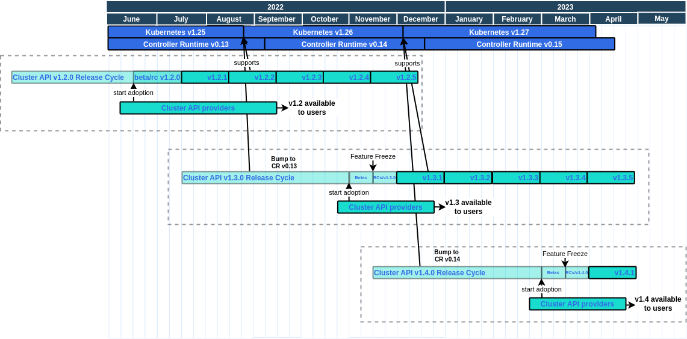

# Release Cycle

The release cycle is the time between when we start working on a release on the `main` branch until the `.0` release (e.g. `v1.3.0`) is released.

**Note**: For the `v1.3` and `v1.4` releases we assume each release cycle will last approximately 4 months (~ 17 weeks).
The release cycle duration will be revisited after the `v1.4.0` release.

A release cycle can be split up into the following phases:

* Week 1-12: Active development
    * All changes impacting providers' adoption of Cluster API should be implemented and merged in this period. Exceptions
      require special approval as described in the section below.
    * Alpha releases will be released based on the main branch only if necessary (to be determined by the release lead)
    * Please note that we also publish daily releases based on the main branch.
* Week 13-14: Beta
    * Weekly beta releases will be released based on the main branch
        * The beta releases are meant as a preview of the upcoming release
        * Providers can start adopting the new release based on the beta releases
    * All changes that impact providers' adoption of the new release should be announced in the provider updates section
      of the office hours meeting notes and approved in the PR or issue by both approvers and key affected providers.
* Week 15-16: RC
    * The release branch is created
    * Weekly RC releases will be released based on the release branch
        * RC releases are as close as possible to the final release but they are still undergoing further testing
    * Development of the next release can technically start on the main branch, but some changes might be delayed
      to ensure easier cherry-picking of other changes to the release branch.
    * There is a feature freeze on the release branch
        * Only cherry-picks for documentation, bug fixes, test fixes and test additions are allowed
* Week 17: GA
    * `x.y.0` GA release is created based on the release branch
* After that:
    * **Note** The following is the responsibility of the release team of the following release cycle.
    * `x.y.1+`: Monthly patch releases will be released based on the release branch
    * Cherry-picks to the release branch are allowed according to the [backport policy](https://github.com/kubernetes-sigs/cluster-api/blob/main/CONTRIBUTING.md#backporting-a-patch)
    * Providers create releases using the new CAPI minor release when they are ready
    * Development of the next release can now officially start on the main branch

Some additional notes:

* Support for new Kubernetes minor versions (for management and workload clusters) is first implemented
  on the main branch, then cherry-picked into supported release branches when feasible and eventually
  released in the next monthly patch release(s).
    * **Note**: We usually don't have to bump Go dependencies to support new Kubernetes minor versions as it's not necessary
      to run on a management cluster with the new version or create a workload cluster with the new version.
      If it becomes necessary to bump dependencies to a new CR/Kubernetes minor version, the change cannot be cherry-picked
      as bumping dependencies to a new minor version is a breaking change.
* New Kubernetes and Controller-Runtime (CR) minor releases are only picked up on the main branch.

The following diagram visualizes the release cycles with the v1.2, v1.3 and v1.4 releases:

<!-- The release cycle png can be opened and edited in draw.io -->

# v1.3 Release Cycle timeline

**Note**: This release will be used to set up documentation, automation, etc. for the first release team which will start with
the `v1.4` release cycle.

The following table shows the preliminary dates for the `v1.3` release cycle.

| **What**                                             | **When**                      | **Week** |
|------------------------------------------------------|-------------------------------|----------|
| Start of Release Cycle                               | Monday 18th July 2022         | week 1   |
| *1.2.1 released*                                     | Monday 15th August 2022       | week 5   | 
| *1.2.2 released*                                     | Wednesday 14th September 2022 | week 9   | 
| *1.2.3 released*                                     | Monday 10th October 2022      | week 13  | 
| *1.2.4 released*                                     | Monday 17th October 2022      | week 14  | 
| 1.3.0-beta.0 released                                | Tuesday 1st November 2022     | week 16  |
| 1.3.0-beta.1 released                                | Tuesday 8th November 2022     | week 17  |
| *1.2.5 released*                                     | Tuesday 8th November 2022     | week 17  |
| release-1.3 branch created (**Begin [Code Freeze]**) | Tuesday 15th November 2022    | week 18  |
| release-1.3 jobs created                             | Tuesday 15th November 2022    | week 18  |
| 1.3.0-rc.0 released                                  | Tuesday 15th November 2022    | week 18  |
| 1.3.0-rc.1 released                                  | Tuesday 22nd November 2022    | week 19  |
| **1.3.0 released**                                   | Thursday 1st December 2022    | week 20  |
| *1.2.6 released*                                     | Thursday 1st December 2022    | week 20  |

After the `.0` release monthly patch release will be created.

# v1.4 Release Cycle timeline

**Note**: The `v1.4` release will be the first release created by a dedicated release team.

The following table shows the preliminary dates for the `v1.4` release cycle.

| **What**                                             | **Who**      | **When**                   | **Week** |
|------------------------------------------------------|--------------|----------------------------|----------|
| Start of Release Cycle                               | Release Lead | Monday 5th December 2022   | week 1   |
| Schedule finalized                                   | Release Lead | Friday 9th December 2022   | week 1   |
| Team finalized                                       | Release Lead | Friday 9th December 2022   | week 1   |
| *1.3.1 released*                                     | Release Lead | Tuesday 10th January 2023  | week 6   |
| *1.3.2 released*                                     | Release Lead | Tuesday 31st January 2023  | week 9   |
| 1.4.0-beta.0 released                                | Release Lead | Tuesday 28th February 2023 | week 13  |
| *1.3.3 released*                                     | Release Lead | Tuesday 28th February 2023 | week 13  |
| 1.4.0-beta.1 released                                | Release Lead | Tuesday 7th March 2023     | week 14  |
| release-1.4 branch created (**Begin [Code Freeze]**) | Release Lead | Tuesday 14th March 2023    | week 15  |
| release-1.4 jobs created                             | CI Manager   | Tuesday 14th March 2023    | week 15  |
| 1.4.0-rc.0 released                                  | Release Lead | Tuesday 14th March 2023    | week 15  |
| 1.4.0-rc.1 released                                  | Release Lead | Tuesday 21st March 2023    | week 16  |
| **1.4.0 released**                                   | Release Lead | Tuesday 28th March 2023    | week 17  |
| *1.3.4 released*                                     | Release Lead | Tuesday 28th March 2023    | week 17  |
| Organize release retrospective                       | Release Lead | TBC                        | week 17  |

## Release team

TODO: This table should be filled once the release team has been finalized in ~ this
style: [Kubernetes 1.26 Release Team](https://github.com/kubernetes/sig-release/blob/master/releases/release-1.26/release-team.md) (I'm referring to the Name, Github, Slack ID pattern)

| **Role**                                  | **Lead Name** (**GitHub / Slack ID**) | **Shadow Name(s) (GitHub / Slack ID)** |
|-------------------------------------------|---------------------------------------|----------------------------------------|
| Release Lead                              |  Yuvaraj Kakaraparthi ([@ykakarap](https://github.com/ykakarap)/Slack:`@Yuvaraj Kakaraparthi`)  | Jim Ntosas ([@dntosas](https://github.com/dntosas)/ Slack:`@dntosas`), Carlos Panato ([@cpanato](https://github.com/cpanato)/ Slack:`@cpanato`), Amit Kumar ([@hackeramitkumar](https://github.com/hackeramitkumar)/ Slack:`@Amit Kumar`) |
| Communications/Docs/Release Notes Manager |  Oscar Utbult ([@oscr](https://github.com/oscr)/ Slack:`@oscar`) | Sayantani Saha ([@sayantani11](https://github.com/sayantani11)/ Slack:`@sayantani`), Vibhor Chinda ([@VibhorChinda](https://github.com/VibhorChinda)/ Slack:`@Vibhor Chinda`) |
| CI Signal/Bug Triage/Automation Manager   |  Furkat Gofurov ([@furkatgofurov7](https://github.com/furkatgofurov7)/ Slack: `@Furkat Gofurov`) | Nawaz Khazielakha ([@nawazkh](https://github.com/nawazkh)/ Slack: `@nawaz`), Aniruddha Basak ([@aniruddha2000](https://github.com/aniruddha2000/)/ Slack: `@aniruddha`), Alexander Demicev ([@alexander-demicev](https://github.com/alexander-demicev)/ Slack:`@Alexander Demicev`) |
