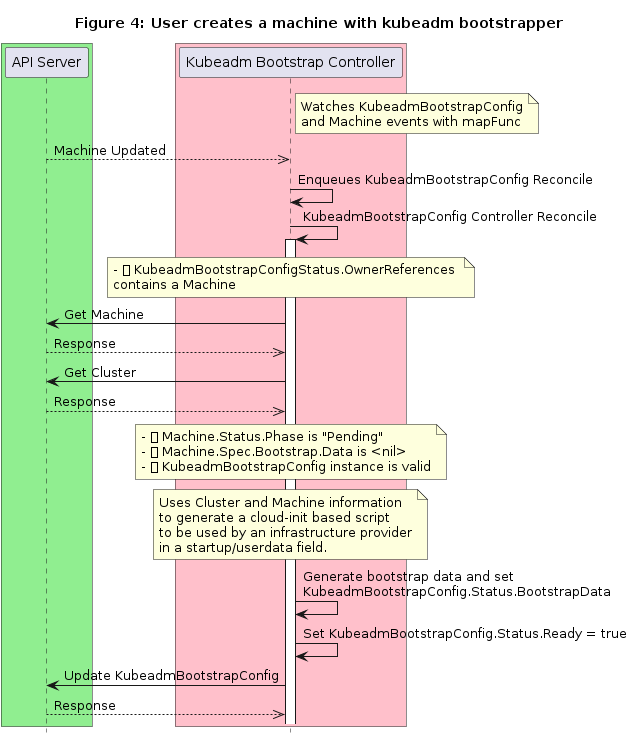
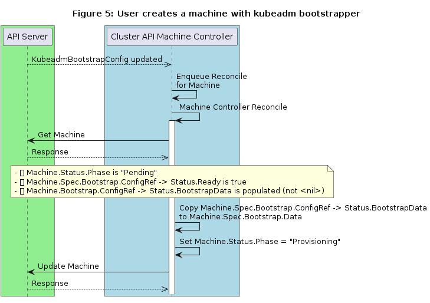

# Machine States & Preboot Bootstrapping

## Table of Contents

* [Machine States &amp; Preboot Bootstrapping](#machine-states--preboot-bootstrapping)
  * [Table of Contents](#table-of-contents)
  * [Glossary](#glossary)
  * [Summary](#summary)
  * [Motivation](#motivation)
    * [Goals](#goals)
    * [Non-Goals/Future Work](#non-goalsfuture-work)
  * [Proposal](#proposal)
    * [Data model changes](#data-model-changes)
  * [States and transitions](#states-and-transitions)
    * [Pending](#pending)
      * [Transition Conditions](#transition-conditions)
      * [Expectations](#expectations)
    * [Provisioning](#provisioning)
      * [Transition Conditions](#transition-conditions-1)
      * [Expectations](#expectations-1)
    * [Provisioned](#provisioned)
      * [Transition Conditions](#transition-conditions-2)
      * [Expectations](#expectations-2)
    * [Running](#running)
      * [Transition Conditions](#transition-conditions-3)
      * [Expectations](#expectations-3)
    * [Deleting](#deleting)
      * [Transition Conditions](#transition-conditions-4)
      * [Expectations](#expectations-4)
    * [Deleted](#deleted)
      * [Transition Conditions](#transition-conditions-5)
      * [Expectations](#expectations-5)
    * [Failed](#failed)
      * [Transition Conditions](#transition-conditions-6)
      * [Expectations](#expectations-6)
    * [Sequence diagram: User creates a machine with Kubeadm bootstrapper\.](#sequence-diagram-user-creates-a-machine-with-kubeadm-bootstrapper)
    * [User Stories](#user-stories)
    * [Implementation Details/Notes/Constraints](#implementation-detailsnotesconstraints)
      * [Machine Controller Role](#machine-controller-role)
      * [Machine Controller dynamic watchers](#machine-controller-dynamic-watchers)
      * [Object References, Templates, MachineSets and MachineDeployments](#object-references-templates-machinesets-and-machinedeployments)
      * [Controllers and the single responsibility approach](#controllers-and-the-single-responsibility-approach)
      * [Remote references and accessing a workload cluster](#remote-references-and-accessing-a-workload-cluster)
      * [The “Phase” field and its role](#the-phase-field-and-its-role)
      * [Showing a status summary to users](#showing-a-status-summary-to-users)
    * [Risks and Mitigations](#risks-and-mitigations)
      * [State transitions are inflexible](#state-transitions-are-inflexible)
      * [Machine Controller can access any machine or cluster in any namespace](#machine-controller-can-access-any-machine-or-cluster-in-any-namespace)
      * [Certificates and tokens are exposed in plaintext](#certificates-and-tokens-are-exposed-in-plaintext)
      * [Bootstrap data cannot be merged](#bootstrap-data-cannot-be-merged)
      * [MachineClass is deprecated and will be revisited later](#machineclass-is-deprecated-and-will-be-revisited-later)
  * [Design Details](#design-details)
    * [Test Plan](#test-plan)
    * [Graduation Criteria](#graduation-criteria)
    * [Upgrade / Downgrade Strategy](#upgrade--downgrade-strategy)
    * [Version Skew Strategy](#version-skew-strategy)
  * [Implementation History](#implementation-history)
  * [Drawbacks](#drawbacks)
  * [Alternatives](#alternatives)
      * [Object References, Templates, MachineSets and MachineDeployments](#object-references-templates-machinesets-and-machinedeployments-1)

## Glossary

- **[Cluster API](../book/src/reference/glossary.md#cluster-api)**: Unless otherwise specified, this refers to the project as a whole.
- **Cluster API Manager**: The controller-runtime's Manager that runs controllers.
- **[Machine](../book/src/reference/glossary.md#machine)**: The Kubernetes Custom Resource Definition offered by Cluster API.
- **[Server/Instance/Host](../book/src/reference/glossary.md#server)**: The infrastructure that backs a Machine.
- **Bootstrapping**: The process of turning a server into a Kubernetes node.

## Summary

This proposal outlines splitting up the Machine data model into two new providers/controllers along with the generic Machine controller. The two new providers are the Infrastructure provider and the Bootstrap provider. The infrastructure provider handles provisioning infrastructure (cloud, bare metal, virtual) and the bootstrap provider handles turning a server into a Kubernetes node. This change will improve separation of concerns for the Machine controller and gives more degrees of freedom to the user.

In Cluster API v1alpha1, users can create Machine custom resources. When a Machine resource is created, Cluster API components react by provisioning infrastructure (typically a physical or virtual machine) and then bootstrapping Kubernetes on the provisioned server, making it a Kubernetes Node. Cluster API’s current architecture mandates that a single “provider” handle both the infrastructure provisioning and the Kubernetes bootstrapping.

## Motivation
- A singular provider that combines infrastructure provisioning and Kubernetes bootstrapping is too restrictive. Many current v1alpha1 providers target single cloud providers. If a user wants to install a specific Kubernetes distribution (Kubernetes, OpenShift, Rancher, etc.), it is left to the provider to add support for it. In practical terms, we are not able to guarantee that a user can install the same distribution regardless of infrastructure environment.
- The Machine custom resource contains fields for provider-specific configuration and status. These are represented as opaque [RawExtensions](https://godoc.org/k8s.io/apimachinery/pkg/runtime#RawExtension), meaning their contents are not directly processed as part of the Machine’s validation.
- The strict relationship between the Machine controller with provider-specific Actuator doesn't allow reconciling machines with providerSpec of different cloud providers in the same cluster (i.e. hybrid cluster). Separation of provider-specific bits from the Machine controller increases flexibility of the cluster api plane and moves the responsibility for their interpretation and reconciliation into dedicated controllers.
- Both users and developers are confused by the code organization split. The Cluster API repository currently offers controllers for Cluster, Machine, MachineSet, MachineDeployment, Node. Some of these controllers are meant to be vendored and run as part of a provider's Manager; while some others are generic (MachineDeployment, MachineSet, Node) and meant to be run as part of the Cluster API Manager. As outlined in this proposal, we'd like to streamline the relationship between where the code lives and where it runs. In particular, we'd like to make the Machine type and its controller generic, which will allow for it to be part of the Cluster API Manager.

### Goals
1. To use Kubernetes Controllers to manage the lifecycle of Machines.
1. To make bootstrap implementations reusable across any infrastructure provider.
1. To support pre-boot (e.g. cloud-init, bash scripts, or similar) bootstrapping.
1. To support bootstrapping different Kubernetes distributions on the same infrastructure provider.
1. To validate provider-specific content as early as possible (create, update).

### Non-Goals/Future Work
1. To modify the Cluster object.
1. To fully implement machine state lifecycle hooks. This must be part of a future proposal that builds on these proposed changes.
1. To setup OS configuration, install software or any other features related to image building.
1. To support post-boot configuration of Machine.
1. To revisit MachineClass role and functionality.
1. To customize the image beyond the settings required to run kubelet, that is an implementation constraint of the bootstrap provider.

## Proposal
In this section we outline the proposed API changes; describe states, transitions, and sequence diagrams for the most important scenarios; and provide a kubeadm-based example.

### Data model changes
The Machine Spec and Status fields undergo some breaking changes which remove or add new fields. We introduce a Bootstrap Controller which encapsulates the integration point between a Machine and its path to become a Kubernetes Node.

```go
type MachineSpec struct
```
- **To remove**
    - **ProviderSpec [optional]** _Superseded by InfrastructureRef_
        - Type: `*runtime.RawExtension`
        - Description: ProviderSpec details Provider-specific configuration to use during node creation.
    - **Versions [optional]**  _Superseded by Version_
        - Type: `MachineVersionInfo`
        - Description: Versions of key software to use. This field is optional at cluster creation time, and omitting the field indicates that the cluster installation tool should select defaults for the user. These defaults may differ based on the cluster installer, but the tool should populate the values it uses when persisting Machine objects. A Machine spec missing this field at runtime is invalid.
- **To add**
    - **Bootstrap**
        - Type: `Bootstrap`
        - Description: Bootstrap is a reference to a local struct which encapsulates fields to configure the Machine’s bootstrapping mechanism.
    - **InfrastructureRef [required]**
        - Type: `corev1.ObjectReference`
        - Description: InfrastructureRef is a required reference to a Custom Resource Definition offered by an infrastructure provider.
    - **Version [optional]**
        - Type: `string`
        - Description: Version defines the desired Kubernetes version. This field is meant to be optionally used by bootstrap providers.

```go
type MachineStatus struct
```

- **To remove**
    - **ProviderStatus [optional]**
        - Type: `*runtime.RawExtension`
        - Description: ProviderStatus details a Provider-specific status. It is recommended that providers maintain their own versioned API types that should be serialized/deserialized from this field.
    - **Versions [optional]**  _Superseded by Version_
        - Type: `*MachineVersionInfo`
        - Description: Versions specifies the current versions of software on the corresponding Node (if it exists). This is provided for a few reasons [...].
- **To add**
    - **Version [optional]**
        - Type: `*string`
        - Description: Version specifies the current version of Kubernetes running on the corresponding Node. This is meant to be a means of bubbling up status from the Node to the Machine. It is entirely optional, but useful for end-user UX if it’s present.
    - **BootstrapReady [optional]**
        - Type: `bool`
        - Description: True when the bootstrap provider status is ready.
    - **InfrastructureReady [optional]**
        - Type: `bool`
        - Description: True when the infrastructure provider status is ready.

```go
type Bootstrap struct
```
- **To add**
    - **ConfigRef [optional]**
        - Type: `*corev1.ObjectReference`
        - Description: ConfigRef is a reference to a bootstrap provider-specific resource that holds configuration details. The reference is optional to allow users/operators to specify Bootstrap.Data without the need of a controller.
    - **Data [optional]**
        - Type: `*string`
        - Description: Data contains the bootstrap data, such as cloud-init details scripts. If nil, the Machine should remain in the Pending state.

## States and transitions
The Cluster API Machine Controller is responsible for managing the lifecycle of a Machine, including its state transitions. This is the only controller that should be writing updates to Machines.

---
### Pending
```go
// MachinePhasePending is the first state a Machine is assigned by
// Cluster API Machine controller after being created.
MachinePhasePending = MachinePhaseType("pending")
```

#### Transition Conditions
- `Machine.Status.Phase` is empty string

#### Expectations
- When `Machine.Spec.Bootstrap.Data` is:
    - `<nil>`, expect the field to be set by an external controller.
    - `""` (empty string), expect the bootstrap step to be ignored.
    - `"..."` (populated by user or from the bootstrap provider), expect the contents to be used by a bootstrap (pre-Running transition) or infrastructure (Provisioning state) provider.

---
### Provisioning
```go
// MachinePhaseProvisioning is the state when the
// Machine infrastructure is being created.
MachinePhaseProvisioning = MachinePhaseType("provisioning")
```

#### Transition Conditions
- `Machine.Spec.Bootstrap.ConfigRef`->`Status.Ready` is true
- `Machine.Spec.Bootstrap.Data` is not `<nil>`

#### Expectations
- Machine’s infrastructure to be in the process of being provisioned.

---
### Provisioned
```go
// MachinePhaseProvisioned is the state when its
// infrastructure has been created and configured.
MachinePhaseProvisioned = MachinePhaseType("provisioned")
```

#### Transition Conditions
- `Machine.Spec.InfrastructureRef`->`Status.Ready` is true
- `Machine.Spec.ProviderID` is synced from `Machine.Spec.InfrastructureRef` -> `Spec.ProviderID`
- (optional) `Machine.Status.Addresses` is synced from `Machine.Spec.InfrastructureRef` -> `Status.Addresses`

#### Expectations
- Machine’s infrastructure has been created and the compute resource is available to be configured.

---
### Running
```go
// MachinePhaseRunning is the Machine state when it has
// become a Kubernetes Node in a Ready state.
MachinePhaseRunning = MachinePhaseType("running")
```

#### Transition Conditions
- A Kubernetes Node is found with the same `Machine.Spec.ProviderID` and its state is “Ready”

#### Expectations
- Machine controller should set `Machine.Status.NodeRef`.

---
### Deleting
```go
// MachinePhaseDeleting is the Machine state when a delete
// request has been sent to the API Server,
// but its infrastructure has not yet been fully deleted.
MachinePhaseDeleting = MachinePhaseType("deleting")
```

#### Transition Conditions
- `Machine.ObjectMeta.DeletionTimestamp` is not zero.

#### Expectations
- Node associated should be drained and cordoned.
- Machine’s related resources should be deleted first using cascading deletion.

---
### Deleted
```go
// MachinePhaseDeleted is the Machine state when the object
// and the related infrastructure is deleted and
// ready to be garbage collected by the API Server.
MachinePhaseDeleted = MachinePhaseType("deleted")
```

#### Transition Conditions
- `Machine.ObjectMeta.DeletionTimestamp` is not zero.
- (optional) `Machine.Bootstrap.ConfigRef` -> `ObjectMeta.DeletionTimestamp` is not zero.
- `Machine.Spec.InfrastructureRef`-> `ObjectMeta.DeletionTimestamp` is not zero.

#### Expectations
- Machine controller should remove finalizer.

---
### Failed
```go
// MachinePhaseFailed is the Machine state when the system
// might require user intervention.
MachinePhaseFailed = MachinePhaseType("failed")
```

#### Transition Conditions
- `Machine.ErrorReason` and/or `Machine.ErrorMessage` is populated.

#### Expectations
- User intervention.

---


### Sequence diagram: User creates a machine with Kubeadm bootstrapper.
In this scenario, we go through each step from “kubectl apply” to seeing the Node in “Running” state. The user has chosen to create a Machine with the following: no custom user data, Machine.Bootstrap is a Kubeadm bootstrap provider, and Machine.InfrastructureRef is an AWS infrastructure provider.


Figure 2 is a simplified diagram of the configuration of a Machine using a Kubeadm bootstrap provider. Machine.Spec.Bootstrap.ConfigRef points to a bootstrap provider-specific custom resource; in this example, a KubeadmBootstrapConfig called controlplane-0.


In this diagram, we have two main entities: API Server and Cluster API Machine Controller. When a Machine is created, the Kubernetes API Server validates it, persists it, and emits a watch event. The Cluster API Machine Controller receives the watch event and reconciles the Machine.

The reconciliation loop starts by checking the Machine’s Bootstrap fields. For the purpose of this example, we expect the Machine.Spec.Bootstrap.Data field to be nil and for the ConfigRef’s associated resource to have a non-Ready status. The Machine Controller sets Machine.Status.Phase to “Pending” and sends the update to the API Server.

The Machine Controller also establishes a watch for the bootstrap and infrastructure specific resources (KubeadmBootstrapConfig, AWSInfrastructureConfig). In addition, the controller sets an OwnerReference on KubeadmBootstrapConfig and AWSInfrastructureConfig.



After the Machine Controller updates the Machine, it must wait for the machine to be “provisionable” - in this case, the Machine must have its Spec.Bootstrap.Data specified. Any value besides nil is acceptable. Some environments may not require any bootstrap data, in which case this would be designated by the empty string. Other environments that do require bootstrap data would use a non-empty string.

In this example, we have a Kubeadm Bootstrap Provider that runs a controller watching for KubeadmBootstrapConfig and Machine WatchEvents. Upon receiving a Machine event, a reconcile request is enqueued for the associated KubeadmBootstrapConfig. Next, it retrieves the Machine, Cluster, and generates a cloud-init based bootstrap configuration which is then stored in KubeadmBootstrapConfig.Status.BootstrapData. It also sets KubeadmBootstrapConfig.Status.Ready to `true`. A non-nil value in KubeadmBootstrapConfig.Status.BootstrapData is indicative to the Cluster API Machine Controller that the bootstrap provider has completed its work.



The Cluster API Machine Controller receives an event for the updated KubeadmBootstrapConfig resource and enqueues a reconciliation request for the associated Machine. The Machine Controller sees the populated KubeadmBootstrapConfig.Status.BootstrapData field and copies it to Machine.Spec.Bootstrap.Data. The Machine Controller also updates Machine.Status.Phase to Provisioning and sends the updated Machine to the API Server.


With this latest Machine update, the API Server emits another watch event. A machine infrastructure provider controller watches for updates to Machine objects to determine when it can reconcile its own objects and start provisioning. For this example, we’ll use an AWS infrastructure provider that bootstraps using cloud-init. As shown in Figure 6, it watches for AWSInfrastructureConfig and Machine WatchEvents. Once it receives the event on the Machine, it enqueues a reconciliation request for the associated AWSInfrastructureConfig (via Machine.InfrastructureRef). When the controller sees the Machine’s non-nil bootstrap data, it asks AWS to create an EC2 instance, using the Machine’s bootstrap data as the cloud-init data for the virtual machine. After the EC2 instance is up and running, the AWS controller sets AWSInfrastructureConfig.Status.Ready to `true`, populates the AWSInfrastructureConfig.Status.Addresses field, and sends the updated AWSInfrastructureConfig to the API Server.


The Cluster API Controller manager receives an event for the updated AWSInfrastructureConfig resource and enqueues a reconciliation request for the associated Machine. The Machine Controller understands that the infrastructure is ready by checking that the AWSInfrastructureConfig.Status.Addresses field has been populated and proceeds to wait for a Kubernetes Node matching the Machine.ProviderID in “Ready” state. After a Node is found, the Machine Controller sets Machine.Status.NodeRef, Machine.Status.Phase to “Ready” and updates the Machine object.


The Machine has now become a Kubernetes Node and ready to be used.

### User Stories

- As a Kubernetes operator, I’d like to provide custom bootstrap data without the use of a Kubernetes controller.

- As a Kubernetes operator, I’d like to monitor the progress of fulfilling a Machine and understand what errors, if any, have been reported by the controllers involved.

- As an infrastructure provider author, I would like to build the fewest number of components possible to support the full cluster-api.

- As an infrastructure provider author, I would like to take advantage of the kubernetes API to provide validation for provider-specific data needed to provision a machine.

- As an infrastructure provider author, I would like to build a controller to manage provisioning machines using tools of my own choosing.

- As an infrastructure provider author, I would like to build a controller to manage provisioning machines without being restricted to a CRUD API.

- As an infrastructure provider consumer, I would like to have validation for the provider-specific data I need to give the system to have it provision a machine.

### Implementation Details/Notes/Constraints

#### Machine Controller Role
The Machine Controller lives within Cluster API manager alongside MachineSet and MachineDeployment controllers. This controller should be the only controller having write permissions to Machine objects. The controller responsibility focuses on state transitions and operations including but not limited to:
- Manage Machines finalizers.
- Set Machine OwnerReferences (e.g. to Cluster, MachineSet).
- Setting Machine.Status.Phase based on the transition conditions described above.
- Pull data from provider custom resources into the right places (e.g. Machine.Spec.Bootstrap.Data from Machine.Spec.Bootstrap.ConfigRef -> Status.BootstrapData).
- Update Status fields from provider custom resources.

#### Machine Controller dynamic watchers
The Machine Controller needs to watch for updates to bootstrap and infrastructure provider specific resources so it can copy bootstrap data/status and infrastructure provider status information to the Machine status. To achieve this, we can use controller-runtime’s `source.Informer` type and client-go’s `dynamicinformer.DynamicSharedInformerFactory`.

When the Machine Controller reconciles a Machine and sees a reference to a provider-specific resource, such as a KubeadmBootstrapConfig or an AWSMachineConfig, it can:
- Get a dynamic informer for the provider-specific resource.
- Invoke c.Watch() (where c is a `controller.Controller` instance) with a `source.Informer` for the dynamic informer and a `handler.EnqueueRequestForOwner` configured with Machine as the OwnerType.

#### Object References, Templates, MachineSets and MachineDeployments
With providerSpec and providerStatus no longer inlined in the Machine resource, we need a way to ensure we can continue to provide at least unique status information for a Machine per bootstrap configuration and per infrastructure configuration.

Each Machine needs a reference to a unique Bootstrap provider-specific resource, and a reference to a unique Infrastructure provider-specific resource. This is easy to do when creating a single Machine, but not so obvious when a MachineSet is creating multiple Machine replicas.

For the MachineSet, the references to the Bootstrap and Infrastructure resources are references to templates. When the MachineSet Controller creates a new Machine replica, it retrieves the Bootstrap and Infrastructure resources referenced by the MachineSet’s Machine spec template and creates copies for that Machine to use exclusively.

#### Controllers and the single responsibility approach
Each controller internal or external to Cluster API in v1alpha2 should follow a single responsibility approach. In the scenario above we go through some of these details: a controller should only modify its own custom resources, but it can watch or read other objects. By following this principle, we aim to reduce or completely eliminate the problem of having controllers modifying and fighting for updates to the same resource.

#### Remote references and accessing a workload cluster
Part of the workflow shown above is the ability for the Machine Controller to access the Workload Cluster’s API Server. As part of this proposal, we want to standardize how the Machine Controller gains access to a cluster using a Kubernetes Secret. The Secret should be living within the associated Cluster namespace and following a preset naming convention (e.g. `<cluster-name>-kubeconfig`) and RBAC should be configured appropriately.

For the purpose of this proposal, the secret-based access to the Workload Cluster is going to require that the Workload Cluster’s API server be accessible from the management cluster with direct https. Features such as tunneling or other forms of access are left to a later proposal.

#### The “Phase” field and its role
The Phase field is a high-level indicator of the status of the Machine as it is provisioned, from the API user’s perspective. The value should not be interpreted by any software components as a reliable indication of the actual state of the Machine, and controllers should not use the Phase value when making decisions about what action to take. Controllers should always look at the actual state of the Machine’s fields to make those decisions.

#### Showing a status summary to users
One of the project’s goals is to improve the user experience by providing more information on a Machine status. In this proposal we add new fields (Machine.Status.InfrastructurePhase and Machine.Status.BootstrapPhase) to the Machine Status which the Machine Controller synchronizes from the referenced custom objects.

### Risks and Mitigations

#### State transitions are inflexible
To determine state transitions, we adopt a simple approach that relies on the values from a specific set of fields. As outlined in the state description tables above, a transition can happen if and only if the whole set of conditions is true. Some might argue that it’d be more ideal to adopt a more complex yet powerful system that would allow controllers to dynamically specify conditions that need to be met for a state transition to happen. Although desirable, this particular feature adds a lot of complexity to the system, therefore we propose to tackle related use cases and implementation work in a future community proposal.

#### Machine Controller can access any machine or cluster in any namespace
The Cluster API Machine controller, given the design outlined above, can access any Machine in any namespace and gain access (via secret-based kubeconfig) to any Workload Cluster API Server. To overcome the security concerns, we allow users or cluster operators to optionally restrict the Cluster API manager, to watch and operate on objects within a single namespace, based on prefix, or a list using command line flags and providing RBAC examples.

#### Certificates and tokens are exposed in plaintext
Sensitive data is exposed in multiple places and could pose a security risk. The behavior won’t change from v1alpha1 and will be tackled in a future proposal.

#### Bootstrap data cannot be merged
Cluster API doesn’t provide an out of the box experience for merging user-supplied user-data with one or more bootstrap providers. While there are some use cases (e.g. installing software tools, configuring kernel params) that would require support for this feature, we’d like to keep v1alpha2 scoped to a single source of truth and put aside the complications that might arise supporting such request. Bootstrap providers may allow for such feature by providing additional fields in their own custom resources.

#### MachineClass is deprecated and will be revisited later
MachineClass has served as a templating mechanisms for Machines. In v1alpha2 templating is left to MachineSet and MachineDeployment references and the functionality from MachineClass is being removed in favor of the new approach. In future revisions MachineClass might be revisited to support other use cases and tools like cluster autoscaler.

## Design Details

### Test Plan
TODO @release

### Graduation Criteria
TODO @release

### Upgrade / Downgrade Strategy
TODO @release

### Version Skew Strategy
TODO @release

## Implementation History

- [x] 05/29/2019: Discuss v1alpha2 scope reduction at the [community meeting](https://docs.google.com/document/d/1Ys-DOR5UsgbMEeciuG0HOgDQc8kZsaWIWJeKJ1-UfbY/edit#heading=h.s8py1oplak7i)
- [x] 06/04/2019: Compile a Google Doc following the CAEP template [link](https://docs.google.com/document/d/18JOgoK9EF3miEd2FWvIggruA-41jL8fLcEhiVzzwzjQ/edit?ts=5cfa7379#)
- [x] 06/05/2019: Present the proposal at the [community meeting](https://docs.google.com/document/d/1Ys-DOR5UsgbMEeciuG0HOgDQc8kZsaWIWJeKJ1-UfbY/edit#heading=h.pj3kmzqnc2qa)
- [x] 06/06/2019: Ask community for feedback
- [x] 06/10/2019: Open proposal PR

## Drawbacks

## Alternatives

#### Object References, Templates, MachineSets and MachineDeployments
For each reference have a template reference as well.
Alongside Machine.Bootstrap.ConfigRef and Machine.InfrastructureRef we can add two more fields: Machine.Bootstrap.ConfigTemplateRef and Machine.InfrastructureTemplateRef. The Machine Controller is responsible, in pre-pending phase, for turning templates in new instances and fill in Machine.Bootstrap.ConfigRef and Machine.InfrastructureRef. MachineDeployments and MachineSets should only permit the use of template references.
