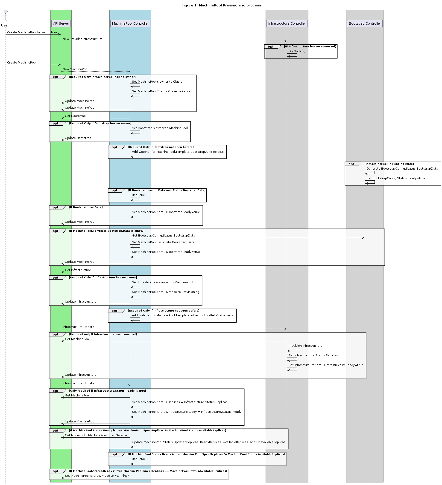

# MachinePool API

## Glossary
The lexicon used in this document is described in more detail
[here](https://github.com/kubernetes-sigs/cluster-api/blob/main/docs/book/src/reference/glossary.md).
Any discrepancies should be rectified in the main Cluster API glossary.

- **ASG** - AWS Auto Scale Group
- **MIG**  - GCP Managed Instance Group
- **VMSS** - Azure Virtual Machine Scale Set

## Summary

In Cluster API (CAPI) v1alpha2, users can create MachineDeployment, MachineSet or Machine custom
resources. When you create a MachineDeployment or MachineSet, Cluster API components react and
eventually Machine resources are created. Cluster API's current architecture mandates that a Machine
maps to a single machine (virtual or bare metal) with the provider being responsible for the
management of the underlying machine's infrastructure.

Nearly all infrastructure providers have a way for their users to manage a group of machines
(virtual or bare metal) as a single entity. Each infrastructure provider offers their own unique
features, but nearly all are concerned with managing availability, health, and configuration
updates.

This proposal outlines adding a MachinePool API (type/controller) for managing many machines as a
single entity. A MachinePool is similar to a MachineDeployment in that they both define
configuration and policy for how a set of machines are managed. They Both define a common
configuration, number of desired machine replicas, and policy for update. Both types also combine
information from Kubernetes as well as the underlying provider infrastructure to give a view of the
overall health of the machines in the set.

MachinePool diverges from MachineDeployment in that the MachineDeployment controller uses
MachineSets to achieve the aforementioned desired number of machines and to orchestrate updates to
the Machines in the managed set, while MachinePool delegates the responsibility of these concerns to
an infrastructure provider specific resource such as AWS Auto Scale Groups, GCP Managed Instance
Groups, and Azure Virtual Machine Scale Sets.

MachinePool is optional and doesn't replace the need for MachineSet/Machine since not every
infrastructure provider will have an abstraction for managing multiple machines (i.e. bare metal).
Users may always opt to choose MachineSet/Machine when they don't see additional value in
MachinePool for their use case.

## Motivation

Infrastructure providers have invested a significant amount of time optimizing the way users manage
sets of machines as a single entity. The interface exposed by each infrastructure provider has a lot
of commonalities with the MachineDeployment type. Allowing users of CAPI to leverage the
optimizations exposed by each infrastructure provider could prove beneficial.
  
**Potential benefits include:**
- Faster machine provisioning
- Improved provisioning success rates
- Automatic distribution of machines across availability zones if supported by the infrastructure
  provider
- CAPI initiated rolling update of machines
- Higher maximum machines in a cluster (Azure limitations)
- Auto-scaling

### Goals

- To expose the MachinePool API for infrastructure providers to leverage their optimizations around managing large sets of machines.
- Support for user initiated scale up/down.
- Support for declarative rolling update.

### Non-goals/Future Work

- To support enabling infrastructure provider specific autoscalers. (at least in v1alpha3)
- To support cordon/drain during infrastructure provider specific rolling update.
- To manage control plane nodes with the MachinePool API.
- To integrate MachinePool with the kubernetes cluster autoscaler.

## Proposal

This proposal introduces the MachinePool API for the purpose of delegating the management of pools
of machines to infrastructure provider supplied controllers.

### User Stories

- As an infrastructure provider author, I would like to build a controller to manage multiple
  machines with a common configuration using my provider specific resource for doing so.
- As a cluster operator, I would like to use MachinePool, similar to how I'm using MachineDeployment
  today, to manage a set of machines with a common configuration.

### Implementation Details/Notes/Constraints

#### Data Model Changes

MachinePool Spec and Status introduces the integration point for delegating the management of a set
of machines to the infrastructure provider. Many of the fields are shared with MachineDeployment due
to infrastructure provider's desire to enable the management of a set of machines with a single
configuration.

``` go
type MachinePoolSpec struct
```

- **To add**
  - **ClusterName [required]**
    - Type: `string`
    - Description: Name of the Cluster this machine pool belongs to.
  - **FailureDomains [optional]**
    - Type: `[]string`
    - Description: FailureDomains is the list of failure domains this MachinePool should be attached to.
  - **Replicas [optional]**
    - Type: `*int32`
    - Description: Number of desired machine instances. Defaults to 1.
  - **Template [required]**
    - Type: `MachineTemplateSpec`
    - Description: Machine Template that describes the configuration of each machine instance in a
      machine pool.
  - **Strategy [optional]**
    - Type: `*MachineDeploymentStrategy`
    - Description: Strategy to employ in replacing existing machine instances in a machine pool.
  - **MinReadySeconds [optional]**
    - Type: `*int32`
    - Description: Minimum number of seconds for which a newly created machine should be ready.
  - **ProviderIDList [optional]**
    - Type: `[]string`
    - Description: ProviderIDList contain a ProviderID for each machine instance that's currently
      managed by the infrastructure provider belonging to the machine pool.

``` go
type MachinePoolStatus struct
```

- **To add**
  - **NodeRefs [optional]**
    - Type: `[]corev1.ObjectReference`
    - Description: NodeRefs contain a NodeRef for each ProviderID in MachinePoolSpec.ProviderIDList.
  - **Replicas [optional]**
    - Type: `*int32`
    - Description: Replicas is the most recent observed number of replicas.
  - **ReadyReplicas [optional]**
    - Type: `*int32`
    - Description: The number of ready replicas for this MachinePool.
  - **AvailableReplicas [optional]**
    - Type: `*int32`
    - Description: The number of available replicas (ready for at least minReadySeconds) for this
      MachinePool.
  - **UnavailableReplicas [optional]**
    - Type: `*int32`
    - Description: Total number of unavailable machines targeted by this machine pool. This is the
      total number of machines that are still required for this machine pool to have 100% available
      capacity. They may either be machines that are running but not yet available or machines that
      still have not been created.
  - **FailureReason [optional]**
    - Type: `*capierrors.MachinePoolStatusError`
    - Description: FailureReason will be set in the event that there is a terminal problem
      reconciling the MachinePool and will contain a succinct value suitable for machine interpretation.
  - **FailureMessage [optional]**
    - Type: `*string`
    - Description: FailureMessage indicates that there is a problem reconciling the state, and will be
      set to a descriptive error message.
  - **Phase [optional]**
    - Type: `string`
	- Description: Phase represents the current phase of cluster actuation.
	  e.g. Pending, Running, Terminating, Failed etc.
  - **BootstrapReady [optional]**
    - Type: `bool`
    - Description: True when the bootstrap provider status is ready.
  - **InfrastructureReady [optional]**
    - Type: `bool`
    - Description: True when the infrastructure provider status is ready.

#### States and Transitions

##### Pending

``` go
// MachinePoolPhasePending is the first state a MachinePool is assigned by
// Cluster API MachinePool controller after being created.
MachinePoolPhasePending = MachinePoolPhase("pending")
```

###### Transition Conditions

- MachinePool.Phase is empty

###### Expectations

- When MachinePool.Spec.Template.Spec.Bootstrap.Data is:
  - <nil>, expect the field to be set by an external controller.
  - “” (empty string), expect the bootstrap step to be ignored.
  - “...” (populated by user or from the bootstrap provider), expect the contents to be used by a
    bootstrap or infra provider.
- When MachinePool.Spec.Template.Spec.InfrastructureRef is:
  - <nil> or not found, expect InfrastructureRef will be set/found during subsequent requeue.
  - “...” (populated by user) and found, expect the infrastructure provider is waiting for bootstrap
    data to be ready.
  - Found, expect InfrastructureRef to reference an object such as GoogleManagedInstanceGroup,
    AWSAutoScaleGroup, or AzureVMSS.

##### Provisioning

``` go
// MachinePoolPhaseProvisioning is the state when the
// MachinePool infrastructure is being created.
MachinePoolPhaseProvisioning = MachinePoolPhase("provisioning")
```

###### Transition Conditions

- MachinePool.Spec.Template.Spec.Bootstrap.ConfigRef -> Status.Ready is true
- MachinePool.Spec.Template.Spec.Bootstrap.Data is not <nil>

###### Expectations

- MachinePool’s infrastructure to be in the process of being provisioned.

##### Provisioned

``` go
// MachinePoolPhaseProvisioned is the state when its
// infrastructure has been created and configured.
MachinePoolPhaseProvisioned = MachinePoolPhase("provisioned")
```

###### Transition Conditions

- MachinePool.Spec.Template.Spec.InfrastructureRef -> Status.Ready is true
- MachinePool.Status.Replicas is synced from MachinePool.Spec.Template.Spec.InfrastructureRef -> Status.Replicas

###### Expectations

- MachinePool’s infrastructure has been created and the compute resources are configured.

##### Running

``` go
// MachinePoolPhaseRunning is the MachinePool state when it has
// become a set of Kubernetes Nodes in a Ready state.
MachinePoolPhaseRunning = MachinePoolPhase("running")
```

###### Transition Conditions

- Number of Kubernetes Nodes in a Ready state matching MachinePool.Spec.Selector equal MachinePool.Status.Replicas.

###### Expectations

- MachinePool controller should set MachinePool.Status.NodeRefs.

##### Deleting

``` go
// MachinePoolPhaseDeleting is the MachinePool state when a delete
// request has been sent to the API Server,
// but its infrastructure has not yet been fully deleted.
MachinePoolPhaseDeleting = MachinePoolPhase("deleting")
```

###### Transition Conditions

- MachinePool.ObjectMeta.DeletionTimestamp is not <nil>

###### Expectations

- MachinePool’s resources (Bootstrap and InfrastructureRef) should be deleted first using cascading deletion.

##### Failed

``` go
// MachinePoolPhaseFailed is the MachinePool state when the system
// might require user intervention.
MachinePoolPhaseFailed = MachinePoolPhase("failed")
```
###### Transition Conditions

- MachinePool.Status.FailureReason and/or MachinePool.Status.FailureMessage is populated.

###### Expectations

- User intervention required.

#### Controller Collaboration Diagram



#### CABPK Changes

**The interaction between MachinePool <-> CABPK will be identical to Machine <-> CABPK except in the
following cases:**

- A KubeadmConfig will be shared by all instances in a MachinePool versus a KubeadmConfig per
  Machine
- MachinePool is only supported for worker nodes, control plane support is not in scope

Additional details for **Support for MachinePool in CABPK** is captured in this 
[issue](https://github.com/kubernetes-sigs/cluster-api/issues/1799).

##### Bootstrap Token lifetimes

The bootstrap token TTL and renewal behavior will be carried over from CABPK's handling of
Machine. For those not familiar, there's a short 15m bootstrap token TTL to support infrastructure
provisioning that's periodically extended if the infrastructure provisioning doesn't complete within
the TTL. It's worthwhile to call out that extending the bootstrap token TTL will be leveraged by
MachinePool for scale up operations that occur after the initial TTL is exceeded.

In the future, bootstrap token handling might change once we [have a good story for injecting
secrets](https://github.com/kubernetes-sigs/cluster-api/issues/1739).

### Risks and Mitigations

#### MachinePool type might not cover all potential infrastructure providers

MachinePool is initially designed to encompass commonality across AWS, GCP, and Azure. CAPI adopting
a provider-agnostic scaling type early will allow other providers to give feedback towards evolving
the type before beta and GA milestones where API changes become more difficult.

##### Infrastructure Provider Features Required for MachinePool v1alpha3

- Target Capacity for the set/group
- Rolling update parameters

##### Infrastructure Provider Features Potentially Required for MachinePool post-v1alpha3

- Min/Max machine replicas in a set/group (autoscaling)

## Alternatives

Infrastructure Machine Controllers allocate from infrastructure provider specific scale group/set
resources. Some benefits of using provider specific scale group/set could be derived by this
approach, but it would be complex to manage.

## Upgrade Strategy

NA as this proposal only adds new types.

## Additional Details

### Test Plan

TBD

### Graduation Criteria

TBD

## Drawbacks

### Infrastructure Provider Behavior Differences

Subtle differences in how infrastructure provider scale resources are implemented might lead to an
inconsistent experience across providers.

## Implementation History

09/18/2019: Proposed idea during cluster-api f2f
10/10/2019: Compile a Google Doc following the CAEP template
10/23/2019: First round of feedback from community
10/23/2019: Present proposal at a community meeting
10/31/2019: Open proposal PR
