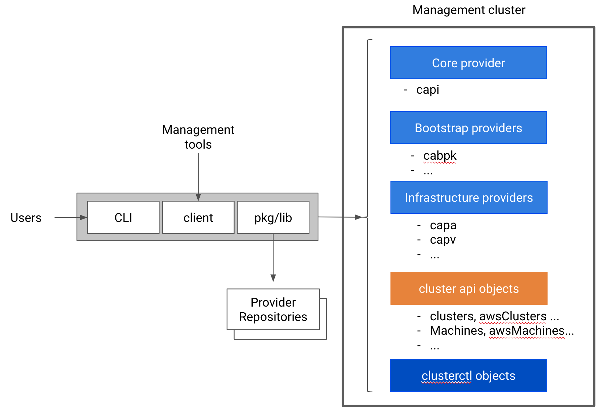
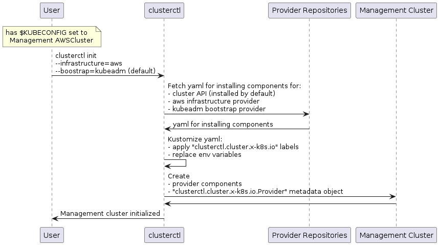
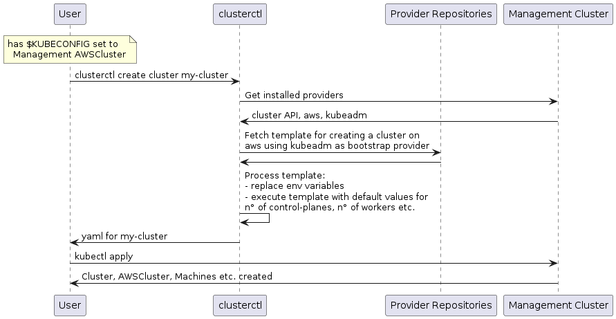

# Clusterctl redesign - Improve user experience and management across Cluster API providers

## Table of Contents

- [Table of Contents](#table-of-contents)
- [Glossary](#glossary)
- [Summary](#summary)
- [Motivation](#motivation)
    - [Goals](#goals)
    - [Non-Goals/Future Work](#non-goalsfuture-work)
- [Proposal](#proposal)
    - [Preconditions](#preconditions)
    - [User Stories](#user-stories)
        - [Initial Deployment](#initial-deployment)
        - [Day Two Operations “Lifecycle Management”](#day-two-operations-lifecycle-management)
        - [Target Cluster Pivot Management](#target-cluster-pivot-management)
        - [Provider Enablement](#provider-enablement)
    - [Implementation Details/Notes/Constraints](#implementation-detailsnotesconstraints)
        - [Init sequence](#init-sequence)
        - [Day 2 operations](#day-2-operations)
    - [Risks and Mitigations](#risks-and-mitigations)
- [Upgrade Strategy](#upgrade-strategy)
- [Additional Details](#additional-details)
    - [Test Plan [optional]](#test-plan-optional)
    - [Graduation Criteria [optional]](#graduation-criteria-optional)
    - [Version Skew Strategy](#version-skew-strategy)
- [Implementation History](#implementation-history)

## Glossary

Refer to the [Cluster API Book Glossary](https://cluster-api.sigs.k8s.io/reference/glossary.html).

## Summary

Cluster API is a Kubernetes project that brings declarative, [Kubernetes-style APIs](https://kubernetes.io/docs/concepts/overview/kubernetes-api/) to cluster creation, configuration, and management.  The project is highly successful, and has been adopted by a number of different providers.  Despite its popularity, the end user experience is fragmented across providers, and users are often confused by different version and release semantics and tools.  

In this proposal we outline the rationale for a redesign of clusterctl, with the primary purpose of unifying the user experience and lifecycle management across Cluster API based providers. 

## Motivation

One of the most relevant areas for improvement of Cluster API is the end user experience,  which is fragmented across providers.   The user experience is currently not optimized for the “day one” user story despite the improvements in the documentation.

Originally, one of the root causes of this problem was the existence of a unique copy of clusterctl for each cluster API provider, each having a slightly different set of features (different flags, different subcommands).

Another source of confusion is the current scope of clusterctl, which in some cases expanded outside of lifecycle management of Cluster API providers. For example, the support for different mechanisms for creating a bootstrap cluster (minikube, kind) takes on an unnecessary complexity and support burden.

As a result, we are proposing a redesign of clusterctl with an emphasis on lifecycle management of Cluster API providers, and a unified user experience across all the Cluster API based providers

### Goals

- Create a CLI that is optimized for the “day one” experience of using Cluster API.
- Simplify lifecycle management (installation, upgrade, removal) of provider specific components.  This includes CRDs, controllers, etc.
- Enable new providers, or new versions of existing providers, to be added without recompiling.
- Provide a consistent user experience across Cluster API providers.
- Enable provider specific deployment templates, or flavors, to end users.  E.g. dev, test, prod, etc.
- Provide support for air gapped environments
- To create a well factored client library, that can be leveraged by management tools.

### Non-Goals/Future Work

- To control the lifecycle of the management cluster. Users are expected to bring their own management cluster, either local (minikube/kind) or remote (aws,vsphere etc.).
- To own provider specific preconditions (this can be handled a number of different ways).
- To manage the lifecycle of target, or workload, clusters.  This is the domain of Cluster API providers, and not clusterctl. (at this time).
- To install network addons or any other components in the workload clusters.
- To become a general purpose cluster management tool.  E.g. collect logs, monitor resources, etc.
- To abstract away provider specific details.

## Proposal

In this section we will outline a high level overview of the proposed tool and its associated user stories.

### Preconditions

Prior to running clusterctl it is required that the operator has a valid KUBECONFIG + context to a running management cluster, following the same rules as kubectl.

### User Stories

#### Initial Deployment

- As a Kubernetes operator, I’d like to have a simple way for clusterctl to install Cluster API providers into a management cluster, using a very limited set of resources and prerequisites, ideally from a laptop with something I can install with just a couple of terminal commands.
- As a Kubernetes operator, I’d like to have the ability to provision clusters on different providers, using the same management cluster.
- As a Kubernetes operator I would like to have a consistent user experience to configure and deploy clusters across cloud providers.

#### Day Two Operations “Lifecycle Management”

- As a Kubernetes operator I would like to be able to install new Cluster API providers into a management cluster.
- As a Kubernetes operator I would like to be able to upgrade Cluster API components (including CRDs, controllers, etc).  
- As a Kubernetes operator I would like to have a simple user experience to cleanly remove the Cluster API objects from a management cluster.

#### Target Cluster Pivot Management

- As a Kubernetes operator I would like to pivot Cluster API components from a management cluster to a target cluster.

#### Provider Enablement

- As a Cluster API provider developer, I would like to use my current implementation, or a new version, with clusterctl without recompiling.  

### Implementation Details/Notes/Constraints

> Portions of clusterctl may require changes to the Cluster API data model and/or the definition of new conventions for the providers in order to enable sets of user stories listed above, therefore a roadmap and feature deliverables will need to be coordinated over time.

As of this writing, we envision clusterctl’s component model to look similar to the diagram below:



Clusterctl consists of a single binary artifact implementing a CLI; the same features exposed by the CLI will be made available to other management tools via a client library.

During provider installation, clusterctl internal pkg/lib is expected to access provider repositories and read the yaml file specifying all the provider components to be installed in the management cluster.

If the provider repository contains deployment templates, or flavors, clusterctl could be used to generate yaml for creating new workload clusters.  

Behind the scenes clusterctl will apply labels to any and all providers’ components and use a set of custom objects for keeping track of some metadata about installed providers, like e.g. the current version or the namespace where the components are installed. 

#### Init sequence

The clusterctl CLI is optimized for the “day one” experience of using Cluster API, and it will be possible to create a first cluster with two commands after the pre-requisites are met:

```shell
$ clusterctl init --infrastructure aws
$ clusterctl config cluster my-first-cluster | kubectl apply -f -
```

Then, as of today, the CNI of choice should be applied to the new cluster:

```shell
$ kubectl get secret my-first-cluster-kubeconfig -o=jsonpath='{.data.value}' | base64 -D > my-first-cluster.kubeconfig
$ kubectl apply --kubeconfig=my-first-cluster.kubeconfig -f MY_CNI
```

The internal flow for the above commands is the following:

**clusterctl init (AWS):**



Please note that “day one” experience:

1. Is based on a list of pre-configured provider repositories; it is possible to add new provider configurations to the list of known providers by using the clusterctl config file (see day 2 operations for more details about this).
2. Assumes init will replace env variables defined in the components yaml read from provider repositories, or error out if such variables are missing.
3. Assumes providers will be installed in the namespace defined in the components yaml; at the time of this writing, all the major providers ship with components yaml creating dedicated namespaces. This could be customized by specifying the --target-namespace flag.
4. Assumes to not change the namespace each provider is watching on objects; at the time of this writing, all the major providers ship with components yaml watching for objects in all namespaces. Pending [1490](https://github.com/kubernetes-sigs/cluster-api/issues/1490) issue addressed, this could be customized by specifying the --watching-namespace flag.

**clusterctl config:**



Please note that “day one” experience:

1. Assumes only one infrastructure provider and only one bootstrap provider installed in the cluster; in case of more than one provider installed, it will be possible to specify the target provider using the --infrastructure and --bootstrap flag.
2. In order to fetch template from a provider repository, Assumes a naming convention should be established (details TBD).
3. Similarly, also template variables should be defined (details TBD).

#### Day 2 operations

The clusterctl command will provide support for following operations

- Add more provider configurations using the clusterctl config file [1]
- Override default provider configurations using the clusterctl config file [1]
- Add more providers after init, eventually specifying the target namespace and the watching namespace [2]
- Add more instances of an existing provider in another namespace/with a non-overlapping watching namespace [2]
- Get the yaml for installing a provider, thus allowing full customization for advanced users
- Create additional clusters, eventually specifying template parameters
- Get the yaml for creating a new cluster, thus allowing full customization for advanced users
- Pivot the management cluster to another management cluster (see next paragraph)
- Upgrade a provider (see next paragraph)
- Delete a provider (see next paragraph)
- Reset the management cluster (see next paragraph)

*[1] clusterctl will provide support pluggable provider repository implementations. Current plan is to support:*

- *GitHub release assets*
- *GitHub tree e.g. for deploying a provider from a specific commit*
*http/https web servers e.g. as a cheap alternative for mirroring - GitHub in air-gapped environments*
- *file system e.g. for deploying a provider from the local dev environment*

*Please note that GitHub release assets is the reference implementation of a provider repository; other providers type might have specific limitations with respect to the reference implementation (details TBD).*

*[2] clusterctl command will try to prevent the user to create invalid configurations, e.g. (details TBD):*

- *Install different versions of the same provider because providers have a mix of namespaced objects and global objects, and thus it is not possible to fully isolate a provider versions.*
- *Install more instances of the same provider fighting for objects (watching objects in overlapping namespaces).*

*In any case, will be allowed to ignore above warnings with a --force flag.*

**clusterctl pivot --target-cluster**

With the new version of clusterctl the pivoting sequence is not critical to the init workflow. Nevertheless, clusterctl will preserve the possibility to pivot an existing management cluster to a target cluster.

The implementation of pivoting will take benefit of the labels applied by clusterctl for identifying provider components, and of the auto labeling cluster resources (see [1489](https://github.com/kubernetes-sigs/cluster-api/issues/1489)) for identifying cluster objects.

**clusterctl upgrade [provider]**

The clusterctl upgrade sequence is responsible for upgrading a provider version [1] [2].

At high level, the upgrade sequence consist of two operations:

1. Delete all the provider components of the current version [3]
1. Create provider components for the new version

The new provider version will be then responsible for conversion of the related cluster API objects when necessary.

*[1] Upgrading the management cluster and upgrading workload clusters are considered out of scope of clusterctl upgrades.*

*[2] in case of more than one instance of the same provider is installed on the management cluster, all the instance of the same provider will be upgraded in a single operation because providers have a mix of namespaced objects and global objects, and thus it is not possible to fully isolate a provider versions.*

*[3] TBD exact details with regards to provider CRDs in order to make object conversion possible*

**clusterctl delete [provider]**

Deleting a provider sequence consist of the following actions:
Identify all the provider components for a provider using the labels applied by clusterctl during install
Delete all the provider components [1] with the exception of CRD definitions [2]

*[1] in case of more than one instance of the same provider is installed on the management cluster, only the provider components in the provider namespace are going to be deleted thus preserving global components required for the proper functioning of other instances.*
*TBD: if delete force deleting workload cluster or preserve them / how to make this behavior configurable*

*[2] The clusterctl tools always try to preserve what is actually running and deployed, in that case the Cluster API objects for workload clusters. The --hard flag can be used to force deletion of the Cluster API objects and CRD definitions.

**clusterctl reset**

Reset sequence goal is to restore the management cluster to its initial state [1], and this basically will be implemented as hard deletion of all the installed providers

*[1] TBD: we should make delete force deleting workload cluster or preserve them (or give an option to the user for this)*

### Risks and Mitigations

- R: Change in clusterctl behavior can disrupt some current users
- M: Work with the community to refine this spec and take their feedback into account.
- R: Precondition of having a working Kubernetes cluster might increase the adoption bar, especially for new users.
- M: Document requirements and quick ways to get a working Kubernetes cluster either locally (e.g. kind) or in the cloud (e.g. GKE, EKS, etc.).

## Upgrade Strategy

Upgrading clusterctl should be a simple binary replace.

TBD. How to make the new clusterctl version read metadata from existing clusters with potentially an older CRD version.

## Additional Details

### Test Plan [optional]

Standard unit/integration & e2e behavioral test plans will apply.

### Graduation Criteria [optional]

TBD - At the time of this writing it is too early to determine graduation criteria.

### Version Skew Strategy

TBD - At the time of this writing it is too early to determine version skew limitations/constraints.

## Implementation History

- [timothysc/frapposelli] 2019-01-07: Initial creation of clusteradm precursor proposal
- [fabriziopandini/timothysc/frapposelli] 2019-10-16: Rescoped to clusterctl redesign
