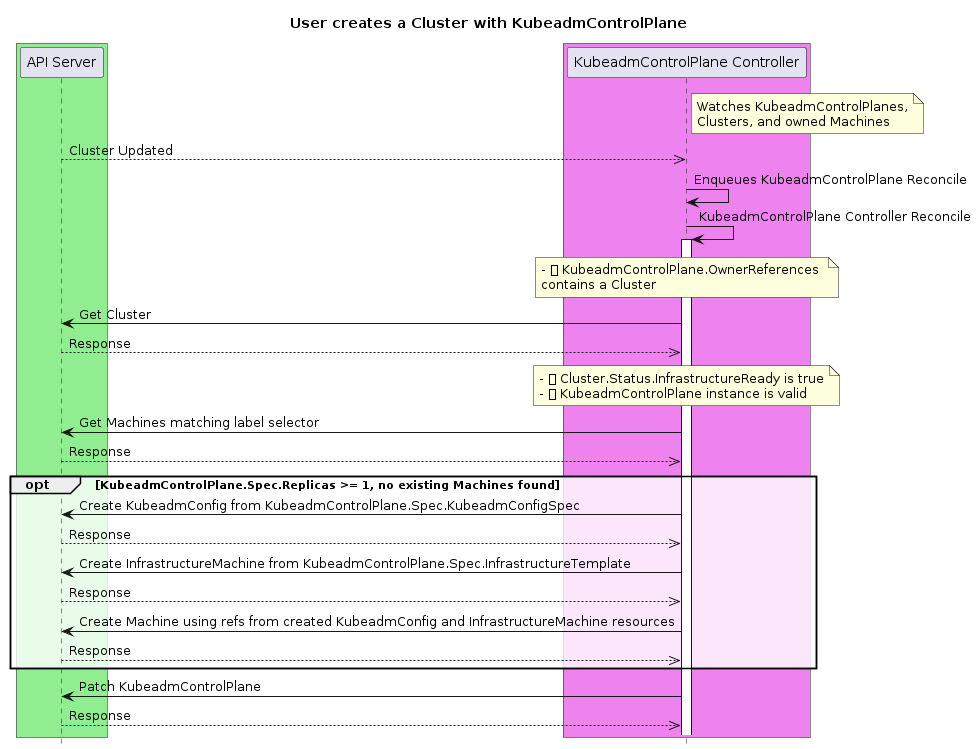

# Kubeadm Based Control Plane Management

## Table of Contents

   * [Kubeadm Based Control Plane Management](#kubeadm-based-control-plane-management)
      * [Table of Contents](#table-of-contents)
      * [Glossary](#glossary)
         * [References](#references)
      * [Summary](#summary)
      * [Motivation](#motivation)
         * [Goals](#goals)
         * [Non-Goals / Future Work](#non-goals--future-work)
      * [Proposal](#proposal)
         * [User Stories](#user-stories)
            * [Identified features from user stories](#identified-features-from-user-stories)
         * [Implementation Details/Notes/Constraints](#implementation-detailsnotesconstraints)
            * [New API Types](#new-api-types)
            * [Rollout strategy](#rollout-strategy)
            * [Modifications required to existing API Types](#modifications-required-to-existing-api-types)
            * [Behavioral Changes from v1alpha2](#behavioral-changes-from-v1alpha2)
            * [Behaviors](#behaviors)
               * [Create](#create)
               * [Scale Up](#scale-up)
               * [Scale Down](#scale-down)
               * [Delete of the entire KubeadmControlPlane (kubectl delete controlplane my-controlplane)](#delete-of-the-entire-kubeadmcontrolplane-kubectl-delete-controlplane-my-controlplane)
               * [KubeadmControlPlane rollout](#kubeadmcontrolplane-rollout)
               * [Rolling update strategy](#rolling-update-strategy)
               * [Constraints and Assumptions](#constraints-and-assumptions)
               * [Remediation (using delete-and-recreate)](#remediation-using-delete-and-recreate)
                  * [Why delete and recreate](#why-delete-and-recreate)
                  * [Scenario 1: Three replicas, one machine marked for remediation](#scenario-1-three-replicas-one-machine-marked-for-remediation)
                  * [Scenario 2: Three replicas, two machines marked for remediation](#scenario-2-three-replicas-two-machines-marked-for-remediation)
                  * [Scenario 3: Three replicas, one unresponsive etcd member, one (different) unhealthy machine](#scenario-3-three-replicas-one-unresponsive-etcd-member-one-different-unhealthy-machine)
                  * [Scenario 4: Unhealthy machines combined with rollout](#scenario-4-unhealthy-machines-combined-with-rollout)
               * [Preflight checks](#preflight-checks)
                  * [Etcd (external)](#etcd-external)
                  * [Etcd (stacked)](#etcd-stacked)
                  * [Kubernetes Control Plane](#kubernetes-control-plane)
               * [Adoption of pre-v1alpha3 Control Plane Machines](#adoption-of-pre-v1alpha3-control-plane-machines)
            * [Code organization](#code-organization)
         * [Risks and Mitigations](#risks-and-mitigations)
            * [etcd membership](#etcd-membership)
            * [Upgrade where changes needed to KubeadmConfig are not currently possible](#upgrade-where-changes-needed-to-kubeadmconfig-are-not-currently-possible)
      * [Design Details](#design-details)
         * [Test Plan](#test-plan)
         * [Graduation Criteria](#graduation-criteria)
            * [Alpha -&gt; Beta Graduation](#alpha---beta-graduation)
         * [Upgrade Strategy](#upgrade-strategy)
      * [Alternatives](#alternatives)
      * [Implementation History](#implementation-history)

## Glossary

The lexicon used in this document is described in more detail [here](https://github.com/kubernetes-sigs/cluster-api/blob/main/docs/book/src/reference/glossary.md).  Any discrepancies should be rectified in the main Cluster API glossary.

### References

[Kubernetes Control Plane Management Overview](https://docs.google.com/document/d/1nlWKEr9OP3IeZO5W2cMd3A55ZXLOXcnc6dFu0K9_bms/edit#)

## Summary

This proposal outlines a new process for Cluster API to manage control plane machines as a single concept. This includes
upgrading, scaling up, and modifying the underlying image (e.g. AMI) of the control plane machines.

The control plane covered by this document is defined as the Kubernetes API server, scheduler, controller manager, DNS
and proxy services, and the underlying etcd data store.

## Motivation

During 2019 we saw control plane management implementations in each infrastructure provider. Much like
bootstrapping was identified as being reimplemented in every infrastructure provider and then extracted into Cluster API
Bootstrap Provider Kubeadm (CABPK), we believe we can reduce the redundancy of control plane management across providers
and centralize the logic in Cluster API. We also wanted to ensure that default control plane management and use of any alternative control plane management solutions are separated.

### Goals

- To establish new resource types for control plane management
- To support single node and multiple node control plane instances, with the requirement that the infrastructure provider supports some type of a stable endpoint for the API Server (Load Balancer, VIP, etc).
- To enable scaling of the number of control plane nodes
- To enable declarative orchestrated control plane upgrades
- To provide a default machine-based implementation using kubeadm
- To provide a kubeadm-based implementation that is infrastructure provider agnostic
- To enable declarative orchestrated replacement of control plane machines, such as to roll out an OS-level CVE fix.
- To support Rolling Update type of rollout strategy (similar to MachineDeployment) in KubeadmControlPlane.
- To manage a kubeadm-based, "stacked etcd" control plane
- To manage a kubeadm-based, "external etcd" control plane (using a pre-existing, user-managed, etcd clusters).
- To manage control plane deployments across failure domains.
- To support user-initiated remediation:
  E.g. user deletes a Machine. Control Plane Provider reconciles by removing the corresponding etcd member and updating related metadata
- To support auto remediation triggered by MachineHealthCheck objects:
  E.g. a MachineHealthCheck marks a machine for remediation. Control Plane Provider reconciles by removing the machine and replaces it with a new one
  **if and only if** the operation is not potentially destructive for the cluster (e.g. the operation could cause a permanent quorum loss).

### Non-Goals / Future Work

Non-Goals listed in this document are intended to scope bound the current v1alpha3 implementation and are subject to change based on user feedback over time.

- To manage non-machine based topologies, e.g.
  - Pod based control planes.
  - Non-node control planes (i.e. EKS, GKE, AKS).
- To define a mechanism for providing a stable API endpoint for providers that do not currently have one, follow up work for this will be tracked on [this issue](https://github.com/kubernetes-sigs/cluster-api/issues/1687)
- To predefine the exact contract/interoperability mechanism for alternative control plane providers, follow up work for this will be tracked on [this issue](https://github.com/kubernetes-sigs/cluster-api/issues/1727)
- To manage CA certificates outside of what is provided by Kubeadm bootstrapping
- To manage etcd clusters in any topology other than stacked etcd (externally managed etcd clusters can still be leveraged).
- To address disaster recovery constraints, e.g. restoring a control plane from 0 replicas using a filesystem or volume snapshot copy of data persisted in etcd.
- To support rollbacks, as there is no data store rollback guarantee for Kubernetes. Consumers should perform backups of the cluster prior to performing potentially destructive operations.
- To mutate the configuration of live, running clusters (e.g. changing api-server flags), as this is the responsibility of the [component configuration working group](https://github.com/orgs/kubernetes/projects/26).
- To provide configuration of external cloud providers (i.e. the [cloud-controller-manager](https://kubernetes.io/docs/tasks/administer-cluster/running-cloud-controller/)). This is deferred to kubeadm.
- To provide CNI configuration. This is deferred to external, higher level tooling.
- To provide the upgrade logic to handle changes to infrastructure (networks, firewalls etc…) that may need to be done to support a control plane on a newer version of Kubernetes (e.g. a cloud controller manager requires updated permissions against infrastructure APIs). We expect the work on [add-on components](https://git.k8s.io/community/sig-cluster-lifecycle#cluster-addons) to help to resolve some of these issues.
- To provide automation around the horizontal or vertical scaling of control plane components, especially as etcd places hard performance limits beyond 3 nodes (due to latency).
- To support upgrades where the infrastructure does not rely on a Load Balancer for access to the API Server.
- To implement a fully modeled state machine and/or Conditions, a larger effort for Cluster API more broadly is being organized on [this issue](https://github.com/kubernetes-sigs/cluster-api/issues/1658)

## Proposal

### User Stories

1. As a cluster operator, I want my Kubernetes clusters to have multiple control plane machines to meet my SLOs with application developers.
2. As a developer, I want to be able to deploy the smallest possible cluster, e.g. to meet my organization’s cost requirements.
3. As a cluster operator, I want to be able to scale up my control plane to meet the increased demand that workloads are placing on my cluster.
4. As a cluster operator, I want to be able to remove a control plane replica that I have determined is faulty and should be replaced.
5. As a cluster operator, I want my cluster architecture to be always consistent with best practices, in order to have reliable cluster provisioning without having to understand the details of underlying data stores, replication etc…
6. As a cluster operator, I want to know if my cluster’s control plane is healthy in order to understand if I am meeting my SLOs with my end users.
7. As a cluster operator, I want to be able to quickly respond to a Kubernetes CVE by upgrading my clusters in an automated fashion.
8. As a cluster operator, I want to be able to quickly respond to a non-Kubernetes CVE that affects my base image or Kubernetes dependencies by upgrading my clusters in an automated fashion.
9. As a cluster operator, I would like to upgrade to a new minor version of Kubernetes so that my cluster remains supported.
10. As a cluster operator, I want to know that my cluster isn’t working properly after creation. I have ended up with an API server I can access, but kube-proxy isn’t functional or new machines are not registering themselves with the control plane.
11. As a cluster operator I would like to use MachineDeployment like rollout strategy to upgrade my control planes. For example in resource constrained environments I would like to my machines to be removed one-by-one before creating a new ones. I would also like to be able to rely on the default control plane upgrade mechanism without any extra effort when specific rollout strategy is not needed.

#### Identified features from user stories

1. Based on the function of kubeadm, the control plane provider must be able to scale the number of replicas of a control plane from 1 to X, meeting user stories 1 through 4.
2. To address user story 5, the control plane provider must provide validation of the number of replicas in a control plane. Where the stacked etcd topology is used (i.e., in the default implementation), the number of replicas must be an odd number, as per [etcd best practice](https://etcd.io/docs/v3.3.12/faq/#why-an-odd-number-of-cluster-members). When external etcd is used, any number is valid.
3. In service of user story 5, the kubeadm control plane provider must also manage etcd membership via kubeadm as part of scaling down (`kubeadm` takes care of adding the new etcd member when joining).
4. The control plane provider should provide indicators of health to meet user story 6 and 10. This should include at least the state of etcd and information about which replicas are currently healthy or not. For the default implementation, health attributes based on artifacts kubeadm installs on the cluster may also be of interest to cluster operators.
5. The control plane provider must be able to upgrade a control plane’s version of Kubernetes as well as updating the underlying machine image on where applicable (e.g. virtual machine based infrastructure).
6. To address user story 11, the control plane provider must provide Rolling Update strategy similar to MachineDeployment. With `MaxSurge` field user is able to delete old machine first during upgrade. Control plane provider should default the `RolloutStrategy` and `MaxSurge` fields such a way that scaling up is the default behavior during upgrade.

### Implementation Details/Notes/Constraints

#### New API Types

See [kubeadm_control_plane_types.go](https://github.com/kubernetes-sigs/cluster-api/blob/main/controlplane/kubeadm/api/v1alpha3/kubeadm_control_plane_types.go)

With the following validations:

- If `KubeadmControlPlane.Spec.KubeadmConfigSpec` does not define external etcd (webhook):
  - `KubeadmControlPlane.Spec.Replicas` is an odd number.
  - Configuration of external etcd is determined by introspecting the provided `KubeadmConfigSpec`.
- `KubeadmControlPlane.Spec.Replicas` is >= 0 or is nil
- `KubeadmControlPlane.Spec.Version` should be a valid semantic version
- `KubeadmControlPlane.Spec.KubeadmConfigSpec` allows mutations required for supporting following use cases:
    - Change of imagesRepository/imageTags (with validation of CoreDNS supported upgrade)
    - Change of node registration options
    - Change of pre/post kubeadm commands
    - Change of cloud init files

And the following defaulting:

- `KubeadmControlPlane.Spec.Replicas: 1`

##### Rollout strategy

```go
    type RolloutStrategyType string

    const (
      // Replace the old control planes by new one using rolling update
      // i.e. gradually scale up or down the old control planes and scale up or down the new one.
      RollingUpdateStrategyType RolloutStrategyType = "RollingUpdate"
    )
```

- Add `KubeadmControlPlane.Spec.RolloutStrategy` defined as:

```go
    // The RolloutStrategy to use to replace control plane machines with
    // new ones.
    // +optional
    RolloutStrategy *RolloutStrategy `json:"strategy,omitempty"`
```

- Add `KubeadmControlPlane.RolloutStrategy` struct defined as:

```go
    // RolloutStrategy describes how to replace existing machines
    // with new ones.
    type RolloutStrategy struct {
      // Type of rollout. Currently the only supported strategy is
      // "RollingUpdate".
      // Default is RollingUpdate.
      // +optional
      Type RolloutStrategyType `json:"type,omitempty"`

      // Rolling update config params. Present only if
      // RolloutStrategyType = RollingUpdate.
      // +optional
      RollingUpdate *RollingUpdate `json:"rollingUpdate,omitempty"`
    }
```

- Add `KubeadmControlPlane.RollingUpdate` struct defined as:

```go
    // RollingUpdate is used to control the desired behavior of rolling update.
    type RollingUpdate struct {
	  // The maximum number of control planes that can be scheduled above or under the
	  // desired number of control planes.
	  // Value can be an absolute number 1 or 0.
	  // Defaults to 1.
	  // Example: when this is set to 1, the control plane can be scaled
	  // up immediately when the rolling update starts.
	  // +optional
      MaxSurge *intstr.IntOrString `json:"maxSurge,omitempty"`
    }
```

#### Modifications required to existing API Types

- Add `Cluster.Spec.ControlPlaneRef` defined as:

```go
    // ControlPlaneRef is an optional reference to a provider-specific resource that holds
    // the details for provisioning the Control Plane for a Cluster.
    // +optional
    ControlPlaneRef *corev1.ObjectReference `json:"controlPlaneRef,omitempty"`
```

- Add `Cluster.Status.ControlPlaneReady` defined as:

```go
    // ControlPlaneReady defines if the control plane is ready.
    // +optional
    ControlPlaneReady bool `json:"controlPlaneReady,omitempty"`
```

#### Behavioral Changes from v1alpha2

- If Cluster.Spec.ControlPlaneRef is set:
  - [Status.ControlPlaneInitialized](https://github.com/kubernetes-sigs/cluster-api/issues/1243) is set based on the value of Status.Initialized for the referenced resource.
  - Status.ControlPlaneReady is set based on the value of Status.Ready for the referenced resource, this field is intended to eventually replace Status.ControlPlaneInitialized as a field that will be kept up to date instead of set only once.
- Current behavior will be preserved if `Cluster.Spec.ControlPlaneRef` is not set.
- CA certificate secrets that were previously generated by the Kubeadm bootstrapper will now be generated by the KubeadmControlPlane Controller, maintaining backwards compatibility with the previous behavior if the KubeadmControlPlane is not used.
- The kubeconfig secret that was previously created by the Cluster Controller will now be generated by the KubeadmControlPlane Controller, maintaining backwards compatibility with the previous behavior if the KubeadmControlPlane is not used.

#### Behaviors

##### Create

- After a KubeadmControlPlane object is created, it must bootstrap a control plane with a given number of replicas.
- `KubeadmControlPlane.Spec.Replicas` must be an odd number.
- Can create an arbitrary number of control planes if etcd is external to the control plane, which will be determined by introspecting `KubeadmControlPlane.Spec.KubeadmConfigSpec`.
- Creating a KubeadmControlPlane with > 1 replicas is equivalent to creating a KubeadmControlPlane with 1 replica followed by scaling the KubeadmControlPlane to the desired number of replicas
- The kubeadm bootstrapping configuration provided via `KubeadmControlPlane.Spec.KubeadmConfigSpec` should specify the `InitConfiguration`, `ClusterConfiguration`, and `JoinConfiguration` stanzas, and the KubeadmControlPlane controller will be responsible for splitting the config and passing it to the underlying Machines created as appropriate.
  - This is different than current usage of `KubeadmConfig` and `KubeadmConfigTemplate` where it is recommended to specify `InitConfiguration`/`ClusterConfiguration` OR `JoinConfiguration` but not both.
- The underlying query used to find existing Control Plane Machines is based on the following hardcoded label selector:

```yaml
  selector:
    matchLabels:
      cluster.x-k8s.io/cluster-name: my-cluster
      cluster.x-k8s.io/control-plane: ""
```

- Generate CA certificates if they do not exist
- Generate the kubeconfig secret if it does not exist

Given the following `cluster.yaml` file:

```yaml
kind: Cluster
apiVersion: cluster.x-k8s.io/v1alpha3
metadata:
  name: my-cluster
  namespace: default
spec:
  clusterNetwork:
    pods:
      cidrBlocks: ["192.168.0.0/16"]
  controlPlaneRef:
    kind: KubeadmControlPlane
    apiVersion: cluster.x-k8s.io/v1alpha3
    name: my-controlplane
    namespace: default
  infrastructureRef:
    kind: AcmeCluster
    apiVersion: infrastructure.cluster.x-k8s.io/v1alpha2
    name: my-acmecluster
    namespace: default
---
kind: KubeadmControlPlane
apiVersion: cluster.x-k8s.io/v1alpha3
metadata:
  name: my-control-plane
  namespace: default
spec:
  replicas: 1
  version: v1.16.0
  infrastructureTemplate:
    kind: AcmeProviderMachineTemplate
    apiVersion: infrastructure.cluster.x-k8s.io/v1alpha2
    namespace: default
    name: my-acmemachinetemplate
  kubeadmConfigSpec:
    initConfiguration:
      nodeRegistration:
        name: '{{ ds.meta_data.local_hostname }}'
        kubeletExtraArgs:
          cloud-provider: acme
    clusterConfiguration:
      apiServer:
        extraArgs:
          cloud-provider: acme
      controllerManager:
        extraArgs:
          cloud-provider: acme
    joinConfiguration:
      controlPlane: {}
      nodeRegistration:
        name: '{{ ds.meta_data.local_hostname }}'
        kubeletExtraArgs:
          cloud-provider: acme
---
apiVersion: infrastructure.cluster.x-k8s.io/v1alpha2
kind: AcmeProviderMachineTemplate
metadata:
  name: my-acmemachinetemplate
  namespace: default
spec:
  osImage:
    id: objectstore-123456abcdef
  instanceType: θ9.medium
  iamInstanceProfile: "control-plane.cluster-api-provider-acme.x-k8s.io"
  sshKeyName: my-ssh-key
---
apiVersion: infrastructure.cluster.x-k8s.io/v1alpha2
kind: AcmeCluster
metadata:
  name: my-acmecluster
  namespace: default
spec:
  region: antarctica-1
```





##### Scale Up

- Allow scale up a control plane with stacked etcd to only odd numbers, as per
  [etcd best practice](https://etcd.io/docs/v3.3.12/faq/#why-an-odd-number-of-cluster-members).
- However, allow a control plane using an external etcd cluster to scale up to other numbers such as 2 or 4.
- Scale up operations must not be done in conjunction with:
  - Adopting machines
  - Upgrading machines
- Scale up operations are blocked based on Etcd and control plane preflight checks.
  - See [Preflight checks](#preflight-checks) below.
- Scale up operations creates the next machine in the failure domain with the fewest number of machines.


##### Scale Down

- Allow scale down a control plane with stacked etcd to only odd numbers, as per
  [etcd best practice](https://etcd.io/docs/v3.3.12/faq/#why-an-odd-number-of-cluster-members).
- However, allow a control plane using an external etcd cluster to scale down to other numbers such as 2 or 4.
- Scale down operations must not be done in conjunction with:
  - Adopting machines
  - Upgrading machines
- Scale down operations are blocked based on Etcd and control plane preflight checks.
  - See [Preflight checks](#preflight-checks) below.
- Scale down operations removes the oldest machine in the failure domain that has the most control-plane machines on it.
- Allow scaling down of KCP with the possibility of marking specific control plane machine(s) to be deleted with delete annotation key. The presence of the annotation will affect the rollout strategy in a way that, it implements the following prioritization logic in descending order, while selecting machines for scale down:
  - outdatedMachines with the delete annotation
  - machines with the delete annotation
  - outdated machines
  - all machines


##### Delete of the entire KubeadmControlPlane (kubectl delete controlplane my-controlplane)

- KubeadmControlPlane deletion should be blocked until all the worker nodes are deleted.
- Completely removing the control plane and issuing a delete on the underlying machines.
- User documentation should focus on deletion of the Cluster resource rather than the KubeadmControlPlane resource.

##### KubeadmControlPlane rollout

KubeadmControlPlane rollout operations rely on [scale up](#scale up) and [scale down](#scale_down) which are be blocked based on Etcd and control plane preflight checks.
  - See [Preflight checks](#preflight-checks) below.

KubeadmControlPlane rollout is triggered by:

  - Changes to Version
  - Changes to the kubeadmConfigSpec
  - Changes to the infrastructureRef
  - The `rolloutAfter` field, which can be set to a specific time in the future
    - Set to `nil` or the zero value of `time.Time` if no upgrades are desired
    - An upgrade will run after that timestamp is passed
    - Good for scheduling upgrades/SLOs
    - Set `rolloutAfter` to now (in RFC3339 form) if an upgrade is required immediately

- The controller should tolerate the manual or automatic removal of a replica during the upgrade process. A replica that fails during the upgrade may block the completion of the upgrade. Removal or other remedial action may be necessary to allow the upgrade to complete.

- In order to determine if a Machine to be rolled out, KCP implements the following:
    - The infrastructureRef link used by each machine at creation time is stored in annotations at machine level.
    - The kubeadmConfigSpec used by each machine at creation time is stored in annotations at machine level.
        - If the annotation is not present (machine is either old or adopted), we won't roll out on any possible changes made in KCP's ClusterConfiguration given that we don't have enough information to make a decision. Users should use KCP.Spec.RolloutAfter field to force a rollout in this case.

##### Rolling update strategy

Currently KubeadmControlPlane supports only one rollout strategy type the `RollingUpdateStrategyType`. Rolling upgrade strategy's behavior can be modified by using `MaxSurge` field. The field values can be an absolute number 0 or 1.

When `MaxSurge` is set to 1 the rollout algorithm is as follows:

  - Find Machines that have an outdated spec
  - If there is a machine requiring rollout
    - Scale up control plane creating a machine with the new spec
    - Scale down control plane by removing one of the machine that needs rollout (the oldest out-of date machine in the failure domain that has the most control-plane machines on it)

When `MaxSurge` is set to 0 the rollout algorithm is as follows:

  - KubeadmControlPlane verifies that control plane replica count is >= 3
  - Find Machines that have an outdated spec and scale down the control plane by removing the oldest out-of-date machine.
  - Scale up control plane by creating a new machine with the updated spec

> NOTE: Setting `MaxSurge` to 0 could be use in resource constrained environment like bare-metal, OpenStack or vSphere resource pools, etc when there is no capacity to Scale up the control plane.

###### Constraints and Assumptions

  * A stable endpoint (provided by DNS or IP) for the API server will be required in order
  to allow for machines to maintain a connection to control plane machines as they are swapped out
  during upgrades. This proposal is agnostic to how this is achieved, and is being tracked
  in https://github.com/kubernetes-sigs/cluster-api/issues/1687. The control plane controller will use
  the presence of the apiEndpoints status field of the cluster object to  determine whether or not to proceed.
  This behaviour is currently implicit in the implementations for cloud providers that provider a load balancer construct.

  * Infrastructure templates are expected to be immutable, so infrastructure template contents do not have to be hashed in order to detect
    changes.

##### Remediation (using delete-and-recreate)

- KCP remediation is triggered by the MachineHealthCheck controller marking a machine for remediation. See
  [machine-health-checking proposal](https://github.com/kubernetes-sigs/cluster-api/blob/11485f4f817766c444840d8ea7e4e7d1a6b94cc9/docs/proposals/20191030-machine-health-checking.md)
  for additional details. When there are multiple machines that are marked for remediation, the oldest one will be remediated first.

- Following rules should be satisfied in order to start remediation
  - The cluster MUST have at least two control plane machines, because this is the smallest cluster size that can be remediated.
  - The number of replicas MUST be equal to or greater than the desired replicas. This rule ensures that when the cluster
    is missing replicas, we skip remediation and instead perform regular scale up/rollout operations first.
  - The cluster MUST have no machines with a deletion timestamp. This rule prevents KCP taking actions while the cluster is in a transitional state.
  - Remediation MUST preserve etcd quorum. This rule ensures that we will not remove a member that would result in etcd
    losing a majority of members and thus become unable to field new requests.

- When all the conditions for starting remediation are satisfied, KCP temporarily suspend any operation in progress
  in order to perform remediation.
- Remediation will be performed by issuing a delete on the unhealthy machine; after deleting the machine, KCP
  will restore the target number of machines by triggering a scale up (current replicas<desired replicas) and then
  eventually resume the rollout action.
  See [why delete and recreate](#why-delete-and-recreate) for an explanation about why KCP should remove the member first and then add its replacement.

###### Why delete and recreate

When replacing a KCP machine the most critical component to be taken into account is etcd, and
according to the [etcd documentation](https://etcd.io/docs/v3.5/faq/#should-i-add-a-member-before-removing-an-unhealthy-member),
it's important to remove an unhealthy etcd member first and then add its replacement:

- etcd employs distributed consensus based on a quorum model; (n/2)+1 members, a majority, must agree on a proposal before
  it can be committed to the cluster. These proposals include key-value updates and membership changes. This model totally
  avoids potential split brain inconsistencies. The downside is permanent quorum loss is catastrophic.

- How this applies to membership: If a 3-member cluster has 1 downed member, it can still make forward progress because
  the quorum is 2 and 2 members are still live. However, adding a new member to a 3-member cluster will increase the quorum
  to 3 because 3 votes are required for a majority of 4 members. Since the quorum increased, this extra member buys nothing
  in terms of fault tolerance; the cluster is still one node failure away from being unrecoverable.

- Additionally, adding new members to an unhealthy control plane might be risky because it may turn out to be misconfigured
  or incapable of joining the cluster. In that case, there's no way to recover quorum because the cluster has two members
  down and two members up, but needs three votes to change membership to undo the botched membership addition. etcd will
  by default reject member add attempts that could take down the cluster in this manner.

- On the other hand, if the downed member is removed from cluster membership first, the number of members becomes 2 and
  the quorum remains at 2. Following that removal by adding a new member will also keep the quorum steady at 2. So, even
  if the new node can't be brought up, it's still possible to remove the new member through quorum on the remaining live members.

As a consequence KCP remediation should remove unhealthy machine first and then add its replacement.

Additionally, in order to make this approach more robust, KCP will test each etcd member for responsiveness before
using the Status endpoint and determine as best as possible that we would not exceed failure tolerance by removing a machine.
This should ensure we are not taking actions in case there are other etcd members not properly working on machines
not (yet) marked for remediation by the MachineHealthCheck.

###### Scenario 1: Three replicas, one machine marked for remediation

If MachineHealthCheck marks one machine for remediation in a control-plane with three replicas, we will look at the etcd
status of each machine to determine if we have at most one failed member. Assuming the etcd cluster is still all healthy,
or the only unresponsive member is the one to be remediated, we will scale down the machine that failed the MHC and
then scale up a new machine to replace it.

###### Scenario 2: Three replicas, two machines marked for remediation

If MachineHealthCheck marks two machines for remediation in a control-plane with three replicas, remediation might happen
depending on the status of the etcd members on the three replicas.

As long as we continue to only have at most one unhealthy etcd member, we will scale down an unhealthy machine,
wait for it to provision and join the cluster, and then scale down the other machine.

However, if more than one etcd member is unhealthy, remediation would not happen and manual intervention would be required
to fix the unhealthy machine.

###### Scenario 3: Three replicas, one unresponsive etcd member, one (different) unhealthy machine

It is possible to have a scenario where a different machine than the one that failed the MHC has an unresponsive etcd.
In this scenario, remediation would not happen and manual intervention would be required to fix the unhealthy machine.

###### Scenario 4: Unhealthy machines combined with rollout

When there exist unhealthy machines and there also have been configuration changes that trigger a rollout of new machines to occur,
remediation and rollout will occur in tandem.

This is to say that unhealthy machines will first be scaled down, and replaced with new machines that match the desired new spec.
Once the unhealthy machines have been replaced, the remaining healthy machines will also be replaced one-by-one as well to complete the rollout operation.

##### Preflight checks

This paragraph describes KCP preflight checks specifically designed to ensure a kubeadm
generated control-plane is stable before proceeding with KCP actions like scale up, scale down and rollout.

Preflight checks status is accessible via conditions on the KCP object and/or on the controlled machines.

###### Etcd (external)

Etcd connectivity is the only metric used to assert etcd cluster health.

###### Etcd (stacked)

Etcd is considered healthy if:

- There are an equal number of control plane Machines and members in the etcd cluster.
  - This ensures there are no members that are unaccounted for.
- Each member reports the same list of members.
  - This ensures that there is only one etcd cluster.
- Each member does not have any active alarms.
  - This ensures there is nothing wrong with the individual member.

The KubeadmControlPlane controller uses port-forwarding to get to a specific etcd member.

###### Kubernetes Control Plane

- There are an equal number of control plane Machines and api server pods checked.
  - This ensures that Cluster API is tracking all control plane machines.
- Each control plane node has an api server pod that has the Ready condition.
  - This ensures that the API server can contact etcd and is ready to accept requests.
- Each control plane node has a controller manager and a scheduler pod that has the Ready condition.
  - This ensures the control plane can manage default Kubernetes resources.

##### Adoption of pre-v1alpha3 Control Plane Machines

- Existing control plane Machines will need to be updated with labels matching the expected label selector.
- The KubeadmConfigSpec can be re-created from the referenced KubeadmConfigs for the Machines matching the label selector.
  - If there is not an existing initConfiguration/clusterConfiguration only the joinConfiguration will be populated.
- In v1alpha2, the Cluster API Bootstrap Provider is responsible for generating certificates based upon the first machine to join a cluster. The OwnerRef for these certificates are set to that of the initial machine, which causes an issue if that machine is later deleted. For v1alpha3, control plane certificate generation will be replicated in the KubeadmControlPlane provider. Given that for v1alpha2 these certificates are generated with deterministic names, i.e. prefixed with the cluster name, the migration mechanism should replace the owner reference of these certificates during migration. The bootstrap provider will need to be updated to only fallback to the v1alpha2 secret generation behavior if Cluster.Spec.ControlPlaneRef is nil.
- In v1alpha2, the Cluster API Bootstrap Provider is responsible for generating the kubeconfig secret; during adoption the adoption of this secret is set to the KubeadmConfig object.
- To ease the adoption of v1alpha3, the migration mechanism should be built into Cluster API controllers.

#### Code organization

The types introduced in this proposal will live in the `cluster.x-k8s.io` API group. The controller(s) will also live inside `sigs.k8s.io/cluster-api`.

### Risks and Mitigations

#### etcd membership

- If the leader is selected for deletion during a replacement for upgrade or scale down, the etcd cluster will be unavailable during that period as leader election takes place. Small time periods of unavailability should not significantly impact the running of the managed cluster’s API server.
- Replication of the etcd log, if done for a sufficiently large data store and saturates the network, machines may fail leader election, bringing down the cluster. To mitigate this, the control plane provider will only create machines serially, ensuring cluster health before moving onto operations for the next machine.
- When performing a scaling operation, or an upgrade using create-swap-delete, there are periods when there are an even number of nodes. Any network partitions or host failures that occur at this point will cause the etcd cluster to split brain. Etcd 3.4 is under consideration for Kubernetes 1.17, which brings non-voting cluster members, which can be used to safely add new machines without affecting quorum. [Changes to kubeadm](https://github.com/kubernetes/kubeadm/issues/1793) will be required to support this and is out of scope for the time frame of v1alpha3.

#### Upgrade where changes needed to KubeadmConfig are not currently possible

- We don't anticipate that this will immediately cause issues, but could potentially cause problems when adopt new versions of the Kubeadm configuration that include features such as kustomize templates. These potentially would need to be modified as part of an upgrade.

## Design Details

### Test Plan

Standard unit/integration & e2e behavioral test plans will apply.

### Graduation Criteria

#### Alpha -> Beta Graduation

This work is too early to detail requirements for graduation to beta. At a minimum, etcd membership and quorum risks will need to be addressed prior to beta.

### Upgrade Strategy

- v1alpha2 managed clusters that match certain known criteria should be able to be adopted as part of the upgrade to v1alpha3, other clusters should continue to function as they did previously.

## Alternatives

For the purposes of designing upgrades, two existing lifecycle managers were examined in detail: kops and Cloud Foundry Container Runtime. Their approaches are detailed in the accompanying "[Cluster API Upgrade Experience Reports](https://docs.google.com/document/d/1RnUG9mHrS_qmhmm052bO6Wu0dldCamwPmTA1D0jCWW8/edit#)" document.

## Implementation History

- [x] 10/17/2019: Initial Creation
- [x] 11/19/2019: Initial KubeadmControlPlane types added [#1765](https://github.com/kubernetes-sigs/cluster-api/pull/1765)
- [x] 12/04/2019: Updated References to ErrorMessage/ErrorReason to FailureMessage/FailureReason
- [x] 12/04/2019: Initial stubbed KubeadmControlPlane controller added [#1826](https://github.com/kubernetes-sigs/cluster-api/pull/1826)
- [x] 07/09/2020: Document updated to reflect changes up to v0.3.9 release
- [x] 22/09/2020: KCP remediation added
- [x] XX/XX/2020: KCP rollout strategies added
