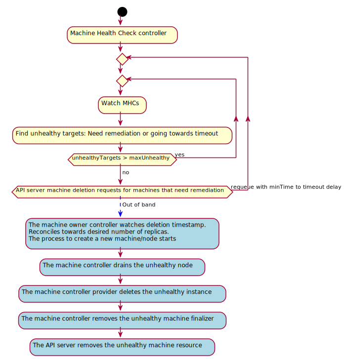

# Title
- Machine health checking a.k.a node auto repair

## Table of Contents

A table of contents is helpful for quickly jumping to sections of a proposal and for highlighting
any additional information provided beyond the standard proposal template.
[Tools for generating](https://github.com/ekalinin/github-markdown-toc) a table of contents from markdown are available.

   * [Title](#title)
      * [Table of Contents](#table-of-contents)
      * [Glossary](#glossary)
      * [Summary](#summary)
      * [Motivation](#motivation)
         * [Goals](#goals)
         * [Non-Goals/Future Work](#non-goalsfuture-work)
      * [Proposal](#proposal)
         * [Unhealthy criteria:](#unhealthy-criteria)
         * [Remediation:](#remediation)
            * [Conditions VS External Remediation](#conditions-vs-external-remediation)
         * [User Stories](#user-stories)
            * [Story 1](#story-1)
            * [Story 2](#story-2)
            * [Story 3 (external remediation)](#story-3-external-remediation)
            * [Story 4 (external remediation)](#story-4-external-remediation)
            * [Story 5 (external remediation)](#story-5-external-remediation)
         * [Implementation Details/Notes/Constraints](#implementation-detailsnotesconstraints)
            * [MachineHealthCheck CRD:](#machinehealthcheck-crd)
            * [Machine conditions:](#machine-conditions)
            * [External Remediation](#external-remediation)
               * [Example CRs](#example-crs)
            * [MachineHealthCheck controller:](#machinehealthcheck-controller)
         * [Risks and Mitigations](#risks-and-mitigations)
      * [Contradictory signal](#contradictory-signal)
      * [Alternatives](#alternatives)
      * [Upgrade Strategy](#upgrade-strategy)
      * [Additional Details](#additional-details)
         * [Test Plan [optional]](#test-plan-optional)
         * [Graduation Criteria [optional]](#graduation-criteria-optional)
         * [Version Skew Strategy [optional]](#version-skew-strategy-optional)
      * [Implementation History](#implementation-history)

## Glossary
Refer to the [Cluster API Book Glossary](https://cluster-api.sigs.k8s.io/reference/glossary.html).

## Summary
Enable opt in automated health checking and remediation of unhealthy nodes backed by machines.

## Motivation
- Reduce administrative overhead to run a cluster.
- Increase ability to respond to failures of machines and keep the cluster nodes healthy.

### Goals
- Enable automated remediation for groups of machines/nodes (e.g a machineSet)
- Allow users to define different health criteria based on node conditions for different groups of nodes.
- Provide a means for the cluster administrator to configure thresholds for disabling automated remediation when multiple nodes are unhealthy at the same time.
- Facilitate rapid experimentation by creating the ability to define customized remediation flows outside of the Machine Health Check and CAPI codebase.

### Non-Goals/Future Work
- Record long-term stable history of all health-check failures or remediations.
- Provide a mechanism to guarantee that application quorum for N members is maintained at any time.
- Create an escalation path from failed external remediation attempts to machine deletion.
- Provide a finalizer-like pre-hook mechanism for allowing customization or blocking of the remediation process prior to power-cycling a machine or deleting it. This concept may already be covered as part of a separate enhancement.


## Proposal
The machine health checker (MHC) is responsible for marking machines backing unhealthy Nodes.

MHC requests a remediation in one of the following ways:
- Applying a Condition which the owning controller consumes to remediate the machine (default) 
- Creating a CR based on a template which signals external component to remediate the machine 

It provides a short-circuit mechanism and limits remediation when the `maxUnhealthy` threshold is reached for a targeted group of machines.
This is similar to what the node life cycle controller does for reducing the eviction rate as nodes become unhealthy in a given zone. E.g a large number of nodes in a single zone are down due to a networking issue.

The machine health checker is an integration point between node problem detection tooling expressed as node conditions and remediation to achieve a node auto repairing feature.

### Unhealthy criteria:
A machine is unhealthy when:
- The referenced node meets the unhealthy node conditions criteria defined.
- The Machine has no nodeRef.
- The Machine has a nodeRef but the referenced node is not found.

If any of those criteria are met for longer than the given timeouts and the `maxUnhealthy` threshold has not been reached yet, the machine will be marked as failing the healthcheck.

Timeouts:
- For the node conditions the time outs are defined by the admin.
- For a machine with no nodeRef an opinionated value could be assumed e.g 10 min.

### Remediation:
- Remediation is not an integral part or responsibility of MachineHealthCheck. This controller only functions as a means for others to act when a Machine is unhealthy in the best way possible.

#### Conditions VS External Remediation

The conditions based remediation doesn’t offer any other remediation than deleting an unhealthy Machine and replacing it with a new one.

Environments consisting of hardware based clusters are significantly slower to (re)provision unhealthy machines, so they have a need for a remediation flow that includes at least one attempt at power-cycling unhealthy nodes.

Other environments and vendors also have specific remediation requirements, so there is a need to provide a generic mechanism for implementing custom remediation logic.

### User Stories

#### Story 1
- As a user of a Workload Cluster, I only care about my app's availability, so I want my cluster infrastructure to be self-healing and the nodes to be remediated transparently in the case of failures.

#### Story 2
As an operator of a Management Cluster, I want my machines to be self-healing and to be recreated, resulting in a new healthy node in the case of matching my unhealthy criteria.

#### Story 3 (external remediation)
As an admin of a hardware based cluster, I would like unhealthy nodes to be power-cycled, so that I can recover from transient errors faster and begin application recovery sooner.

#### Story 4 (external remediation)
As an admin of a hardware based cluster, I would like unhealthy nodes to be power-cycled, so that I can detect non-transient issues faster.

#### Story 5 (external remediation)
As an admin of a hardware based cluster, I would like the system to keep attempting to power-cycle unhealthy nodes, so that they are automatically added back to the cluster when I fix the underlying problem.

### Implementation Details/Notes/Constraints

#### MachineHealthCheck CRD:
- Enable watching a group of machines (based on a label selector).
- Enable defining an unhealthy node criteria (based on a list of node conditions).
- Enable setting a threshold of unhealthy nodes. If the current number is at or above this threshold no further remediation will take place. This can be expressed as an int or as a percentage of the total targets in the pool.


E.g:
- I want a machine to be remediated when its associated node has `ready=false` or `ready=Unknown` condition for more than 5m.
- I want to disable auto-remediation if 40% or more of the matching machines are unhealthy.

```yaml
apiVersion: cluster.x-k8s.io/v1alpha3
kind: MachineHealthCheck
metadata:
  name: example
  namespace: machine-api
spec:
  selector:
    matchLabels:
      role: worker
  unhealthyConditions:
  - type:    "Ready"
    status:  "Unknown"
    timeout: "5m"
  - type:    "Ready"
    status:  "False"
    timeout: "5m"
  maxUnhealthy: "40%"
status:
  currentHealthy: 5
  expectedMachines: 5
```

#### Machine conditions:

```go
const ConditionHealthCheckSucceeded ConditionType = "HealthCheckSucceeded"
const ConditionOwnerRemediated ConditionType = "OwnerRemediated"
```

- Both of these conditions are applied by the MHC controller. HealthCheckSucceeded should only be updated by the MHC after running the health check.
- If a health check passes after it has failed, the conditions will not be updated. When in-place remediation is needed we can address the challenges around this.
- OwnerRemediated is set to False after a health check fails, but should be changed to True by the owning controller after remediation succeeds.
- If remediation fails OwnerRemediated can be updated to a higher severity and the reason can be updated to aid in troubleshooting.

This is the default remediation strategy.

#### External Remediation

A generic mechanism for supporting externally provided custom remediation strategies.

We propose modifying the MachineHealthCheck CRD to support a externalRemediationTemplate, an ObjectReference to a provider-specific template CRD.

If no value for externalRemediationTemplate is defined for the MachineHealthCheck CR, the condition-based flow is preserved.

If a value for externalRemediationTemplate is supplied and the Machine enters an unhealthy state, the template will be instantiated using existing CAPI functionality, with the same name and namespace as the target Machine, and the remediation flow passed to an External Remediation Controller (ERC) watching for that CR.

No further action (deletion or applying conditions) will be taken by the MachineHealthCheck controller until the Node becomes healthy, when it will locate and delete the instantiated MachineRemediation CR.

```go
    type MachineHealthCheckSpec struct {
        ...
    
        // +optional
        ExternalRemediationTemplate *ObjectReference `json:"externalRemediationTemplate,omitempty"`
    }
```

When a Machine enters an unhealthy state, the MHC will:
* Look up the referenced template
* Instantiate the template (for simplicity, we will refer to this as a External Machine Remediation CR, or EMR)
* Force the name and namespace to match the unhealthy Machine
* Save the new object in etcd

We use the same name and namespace for the External Machine Remediation CR to ensure uniqueness and lessen the possibility for multiple parallel remediations of the same Machine. 

The lifespan of the EMRs is that of the remediation process and they are not intended to be a record of past events.
The EMR will also contain an ownerRef to the Machine, to ensure that it does not outlive the Machine it references.

The only signaling between the MHC and the external controller watching EMR CRs is the creation and deletion of the EMR itself.
Any actions or changes that admins should be informed about should be emitted as events for consoles and UIs to consume if necessary.
They are informational only and do not result in or expect any behaviour from the MHC, Node, or Machine as a result.

When the external remediation controller detects the new EMR it starts remediation and performs whatever actions it deems appropriate until the EMR is deleted by the MHC.
It is a detail of the ERC when and how to retry remediation in the event that a EMR is not deleted after the ERC considers remediation complete. 

The ERC may wish to register a finalizer on its CR to ensure it has an opportunity to perform any additional cleanup in the case that the unhealthy state was transient and the Node returned to a healthy state prior to the completion of the full custom ERC flow.

##### Example CRs

MachineHealthCheck:
```yaml
    kind: MachineHealthCheck
    apiVersion: cluster.x-k8s.io/v1alphaX
    metadata:
      name: REMEDIATION_GROUP
      namespace: NAMESPACE_OF_UNHEALTHY_MACHINE
    spec:
      selector:
        matchLabels: 
          ...
      externalRemediationTemplate:
        kind: Metal3RemediationTemplate
        apiVersion: remediation.metal3.io/v1alphaX
        name: M3_REMEDIATION_GROUP
```

Metal3RemediationTemplate:
```yaml
    kind: Metal3RemediationTemplate
    apiVersion: remediation.metal3.io/v1alphaX
    metadata:
      name: M3_REMEDIATION_GROUP
      namespace: NAMESPACE_OF_UNHEALTHY_MACHINE
    spec:
      template:
        spec:
          strategy: 		    escalate
          deleteAfterRetries:     10
          powerOnTimeoutSeconds:  600
          powerOffTimeoutSeconds: 120
```

Metal3Remediation:
```yaml
    apiVersion: remediation.metal3.io/v1alphaX
    kind: Metal3Remediation
    metadata:
      name: NAME_OF_UNHEALTHY_MACHINE
      namespace: NAMESPACE_OF_UNHEALTHY_MACHINE
      finalizer:
      - remediation.metal3.io
      ownerReferences:
      - apiVersion:cluster.x-k8s.io/v1alphaX
        kind: Machine
        name: NAME_OF_UNHEALTHY_MACHINE
        uid: ...
    spec:
      strategy: 		    escalate
      deleteAfterRetries:     10
      powerOnTimeoutSeconds:  600
      powerOffTimeoutSeconds: 120
    status:
      phase: power-off
      retryCount: 1
```

#### MachineHealthCheck controller:
Watch:
- Watch machineHealthCheck resources
- Watch machines and nodes with an event handler e.g controller runtime `EnqueueRequestsFromMapFunc` which returns machineHealthCheck resources.

Reconcile:
- Fetch all the machines targeted by the MachineHealthCheck and operate over machine/node targets. E.g:
```
type target struct {
  Machine capi.Machine
  Node    *corev1.Node
  MHC     capi.MachineHealthCheck
}
```

- Calculate the number of unhealthy targets.
- Compare current number against `maxUnhealthy` threshold and temporary short circuits remediation if the threshold is met.
- Either marks unhealthy target machines with conditions or create an external remediation CR as described above.

Out of band:
- The owning controller observes the OwnerRemediated=False condition and is responsible to remediate the machine.
- The owning controller performs any pre-deletion tasks required.
- The owning controller MUST delete the machine.
- The machine controller drains the unhealthy node.
- The machine controller provider deletes the instance.



### Risks and Mitigations

## Contradictory signal

If a user configures healthchecks such that more than one check applies to
machines these healthchecks can potentially become a source of contradictory
information. For instance, one healthcheck could pass for a given machine,
while another fails. This will result in undefined behavior since the order in
which the checks are run and the timing of the remediating controller will
determine which condition is used for remediation decisions.

There are safeguards that can be put in place to prevent this but it is out of
scope for this proposal. Documentation should be updated to warn users to
ensure their healthchecks do not overlap.

## Alternatives

This proposal was originally adopted and implemented having the MHC do the
deletion itself. This was revised since it did not allow for more complex
controllers, for example the Kubeadm Control Plane, to account for the
remediation strategies they require.

It was also adopted in a later iteration using annotations on the machine.
However it was realized that this would amount to a privilege escalation
vector, as the `machines.edit` permission would grant effective access to
`machines.delete`. By using conditions, this requires `machines/status.edit`,
which is a less common privilege.

Considered to bake this functionality into machineSets.
This was discarded as different controllers than a machineSet could be owning the targeted machines.
For those cases as a user you still want to benefit from automated node remediation.

Considered allowing to target machineSets instead of using a label selector.
This was discarded because of the reason above.
Also there might be upper level controllers doing things that the MHC does not need to account for, e.g machineDeployment flipping machineSets for a rolling update.
Therefore considering machines and label selectors as the fundamental operational entity results in a good and convenient level of flexibility and decoupling from other controllers.

Considered a more strict short-circuiting mechanism decoupled from the machine health checker i.e machine disruption budget analogous to pod disruption budget.
This was discarded because it added an unjustified level of complexity and additional API resources.
Instead we opt for a simpler approach and will consider RFE that requires additional complexity based on real use feedback.

Considered using conditions instead of external remediation.
The existing design doesn't solve all the problems required to have full external remediation that doesn't necessarily deletes the Machine at the end of remediation, but this can be modified and expanded.

We could give up on the idea of a shared MHC and instead focus on providing a common library for deciding if a Node is healthy. This creates a situation where we could end up with baremetal, Master, and Ceph MHC variants that somehow need to duplicate or coordinate their activities.

## Upgrade Strategy
This is an opt in feature supported by a new CRD and controller so there is no need to handle upgrades for existing clusters. 

External remediation feature adds A new optional field will be added to MachineHealthCheck CRD, so existing CRs will be still valid and will function as they previously did.
The templates are all new, and opt-in feature so upgrade has no impact in this case.

## Additional Details

### Test Plan [optional]
Extensive unit testing for all the cases supported when remediating.

e2e testing as part of the cluster-api e2e test suite.

For failing early testing we could consider a test suite leveraging kubemark as a provider to simulate healthy/unhealthy nodes in a cloud agnostic manner without the need to bring up a real instance.

[testing-guidelines]: https://git.k8s.io/community/contributors/devel/sig-testing/testing.md

### Graduation Criteria [optional]
This propose the new CRD to belong to the same API group than other cluster-api resources, e.g machine, machineSet and to follow the same release cadence.

### Version Skew Strategy [optional]

## Implementation History
- [x] 10/30/2019: Opened proposal PR
- [x] 04/15/2020: Revised to move reconciliation to owner controller
- [x] 08/04/2020: Added external remediation

<!-- Links -->
[community meeting]: https://docs.google.com/document/d/1Ys-DOR5UsgbMEeciuG0HOgDQc8kZsaWIWJeKJ1-UfbY
