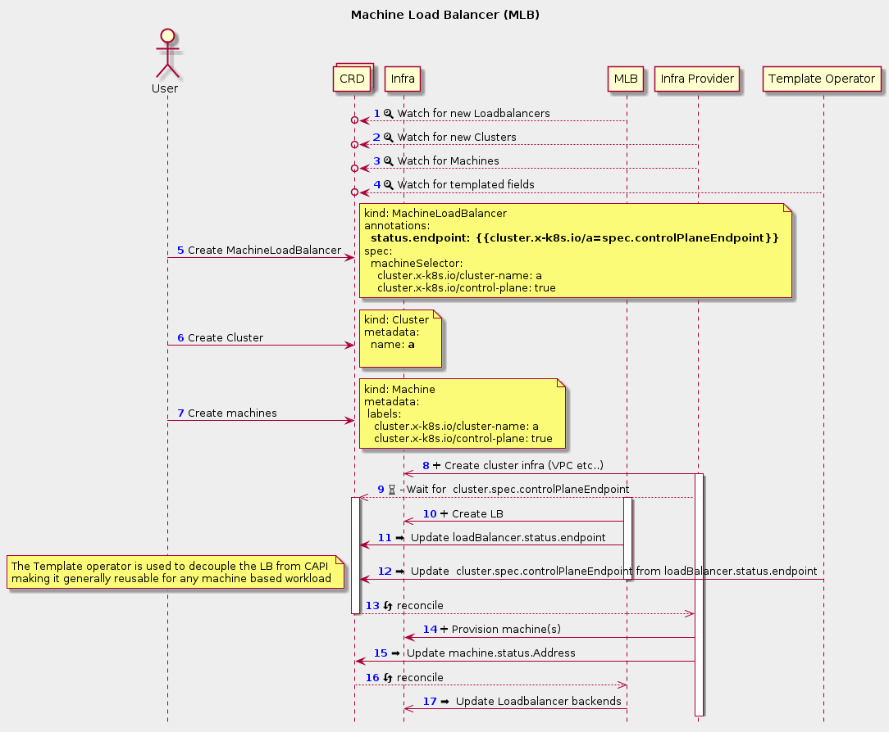

# Machine Load Balancer (MLB)

### Motivation

* On-Premises clusters (without access to a Public Cloud Load Balancer as a Service or some existing, external endpoint) need a pluggable mechanism to enable the deployment of highly-available (HA) control planes using Cluster API (CAPI).

* Multi-cluster environments need a mechanism to load balance ingress access across multiple clusters in a safe and deterministic manner to support ephemeral, immutable clusters.

* Some environments need the ability to create different load balancing topologies e.g. 1 LB for control plane traffic, and another for external traffic to the kubernetes API. Or 1 LB per AZ to reduce inter-AZ traffic.

#### Goals

* Introduce one or more extension points to enable integrating external load balancers.
* Allow the reuse of a Machine Load Balancer across CAPI providers, ex. AWS Elastic Load Balancers (ELB), F5, Netscaler, etc.
* Represent the status of load balancer in resource status e.g. 4 of 5 members healthy.

#### Non-Goals

* Providing load balancers for non-control plane workloads i.e Service Type Load Balancer
* Handling other Infrastructure Providers like networking and firewalls, This CAEP may, however, be merged into a larger CAEP when it is ready.

## Summary

The Machine Load Balancer (MLB) provides an abstraction for implementing load balancing across machines while also allowing the resulting  load balancer address to be used by any CRD.

#### Coupling and Dependencies

* The MLB depends on the [template operator](https://docs.google.com/document/d/1dJdnMozsWJ2ccPXWWkZpFVccFFSI7sYaJ6D25sZFlTU/edit#heading=h.vclg2zerysbp) to plumb the load balancer endpoint from the load balancer CRD, to the cluster CRD
  * The MLB depends on the CAPI Machine CRD'S but it could be extended to other machine like objects as well.
* CAPI has no dependency on the MLB, it only waits until something sets a `controlPlaneEndpoint`

### Workflow





**1 - 4:** Controllers watch the resources they responsible for

**5 - 7:** User or system creates all CRD's *concurrently*

**8 - 9:**  Infra provider spins up infrastructure and then waits until the `spec.controlPlaneEndpoint` is set

**10 -11:** The MLB provisions the load balancer and updates `status.endpoint`

**12:** The template operator picks up that `status.endpoint` has been updated and copies the value to `spec.controlPlaneEndpoint`

**13+** CAPI infra providers pick up that the `controlPlaneEndpoint` has been set and continue provisioning

##   Types

```go
type MachineLoadBalancer struct {
  ObjectMeta
  TypeMeta
  Spec MachineLoadBalancerSpec
  Status MachineLoadBalancerStatus
}
type MachineLoadBalancerSpec struct {
  Port MachineLoadBalancerPort
  // MachineSelector provides a mechanism to select multiple machines based on their labels        // allowing for load balancing across clusters and different network topologies.
  MachineSelector Selector
  // ProviderRef is a load balancer specific CRD used for configuring the underlying load                       // balancer and/or providing access credentials
  ProviderRef corev1.ObjectReference
}

type MachineProtocol string
const (
  TcpMachineProtocol MachineProtocol = "tcp"
  TcpMachineProtocol MachineProtocol = "udp"
)

type MachineLoadBalancerPort struct {
  Port int32
  MachinePort int32
  Protocol MachineProtocol
}

type MachineLoadBalancerStatus struct {
  // Endpoint is the DNS/IP endpoint for the load balancer (includes scheme and port)
  Endpoint string
  // Status provides the health of the load balancer
  Status string
  // Ready is true when there is at least 1 healthy member
  Ready bool
}
```
#### Contract with CAPI

The Machine Load Balancer is decoupled from CAPI such that CAPI and infra providers are not aware of the existence of the MachineLoadBalancer - However the following conditions are required:

* Infra providers MUST NOT provision a load balancer if an external control plane endpoint is already specified
* Machines MUST be labelled with:
  * **cluster.x-k8s.io/control-plane**: "" if the machine is part of the control plane
  * **cluster.x-k8s.io/cluster-name** the name of the cluster
  * **cluster.x-k8s.io/control-plane/selected-for-upgrade**=true if the machine is queued for deletion and its connections should be drained, and then removed from a LB.
* Machines SHOULD be labelled with:
  * **failure-domain.beta.kubernetes.io/zone** if applicable
  * **failure-domain.beta.kubernetes.io/region** if applicable


## User Stories

#### Support for existing infrastructure

As an on-premises cluster operator, I need to be able to leverage existing datacenter infrastructure such as  F5 / OpenStack Octavia /  MetalLB

#### Support for an on-prem, HA control plane

As an on-premises cluster operator, I need to be able to deploy a load balancer (dedicated, DNS or client-side) to enable HA functionality for the control plane.

#### Support non-cloud-based load balancers

As an operator of cloud-based clusters, I want to leverage non-cloud based load balancers or utilize cloud load balancers in a non-traditional way.

#### Support for different API server authentication methods

As an operator of clusters, I want control plane components to authenticate via PKI, but end users should authenticate via authenticating proxy
