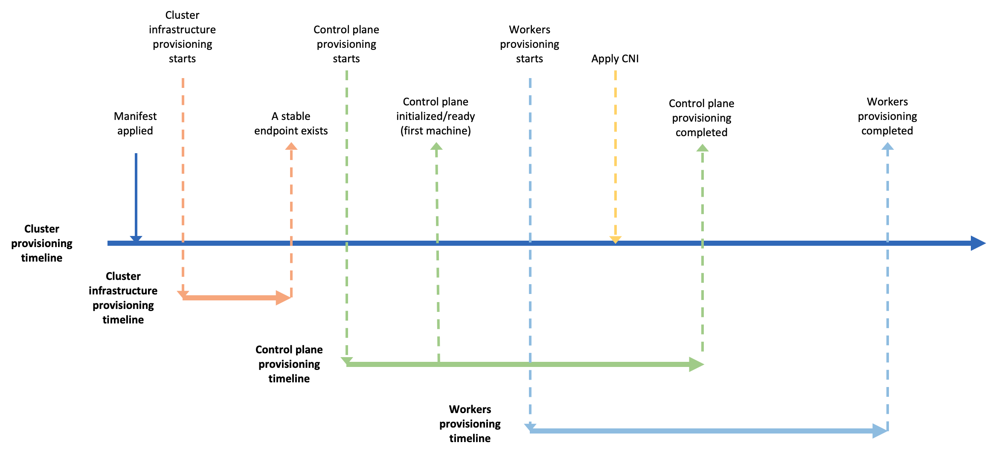
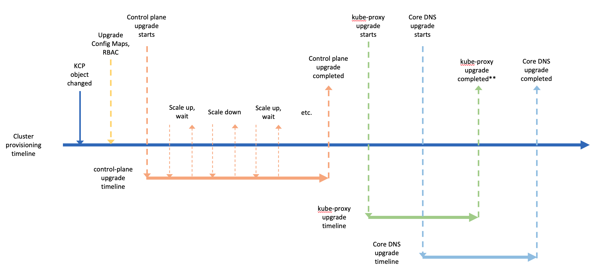

# Conditions - Cluster status at glance

## Table of Contents

- [Conditions - Cluster status at glance](#conditions---cluster-status-at-glance)
  - [Table of Contents](#table-of-contents)
  - [Glossary](#glossary)
  - [Summary](#summary)
  - [Motivation](#motivation)
     - [Goals](#goals)
     - [Non-Goals/Future Work](#non-goalsfuture-work)
  - [Proposal](#proposal)
     - [User Stories](#user-stories)
        - [Story 1](#story-1)
        - [Story 2](#story-2)
        - [Story 3](#story-3)
        - [Story 4](#story-4)
     - [Implementation Details/Notes/Constraints](#implementation-detailsnotesconstraints)
        - [Data Model Changes](#data-model-changes)
        - [Constraints](#constraints)
           - [Condition semantic](#condition-semantic)
           - [The Ready condition](#the-ready-condition)
           - [Controller changes](#controller-changes)
        - [The cluster provisioning workflow](#the-cluster-provisioning-workflow)
           - [The ClusterInfrastructureReady condition](#the-clusterinfrastructureready-condition)
           - [The cluster’s ControlPlaneReady condition](#the-clusters-controlplaneready-condition)
           - [The cluster’s WorkersReady condition](#the-clusters-workersready-condition)
     - [The control plane upgrade workflow](#the-control-plane-upgrade-workflow)
     - [Risks and Mitigations](#risks-and-mitigations)
  - [Alternatives](#alternatives)
     - [Kubernetes Conditions](#kubernetes-conditions)
     - [Status field](#status-field)
  - [Upgrade Strategy](#upgrade-strategy)
  - [Additional Details](#additional-details)
     - [Test Plan [optional]](#test-plan-optional)
     - [Graduation Criteria [optional]](#graduation-criteria-optional)
     - [Version Skew Strategy [optional]](#version-skew-strategy-optional)
  - [Implementation History](#implementation-history)

## Glossary

Refer to the [Cluster API Book Glossary](https://cluster-api.sigs.k8s.io/reference/glossary.html).

Condition: The state of an object with regard to its appearance, quality, or working order.

## Summary

In Cluster API a workload cluster is composed of a fair number of Kubernetes objects, and to
understand the status of your Cluster you have to jump from one object to another. Or, in the
worst case, you have to look at the logs from the Cluster API pods to get more details on why
things aren’t working.

This proposal introduces the concept of “conditions” as a tool designed to provide an “at a glance”
view of the status of a cluster, providing immediate answers and fine-grained guidance when
investigating issues. 

## Motivation

- Cluster API requires a large number of objects to define a workload cluster: Cluster,
  InfrastructureCluster, KubeadmControlPlane, MachineDeployments, Machines, and so on.
  Each object carries its own status. Operators need to describe each object individually to
  determine an overall cluster health summary.
- Objects can be tied to each other directly (via object references), or indirectly
  (via owner references). These dependencies can often require a deep knowledge of the
  project’s internals and its APIs to investigate issues or problems. 
- Some objects, like MachineSets or MachineDeployments, are considered a collection of
  other objects (e.g. MachineSets). Their status is effectively tied to the status of each
  item in the collection. 

### Goals

- To define a data model for the Condition type.
- To introduce the first set of conditions on Cluster API core objects (up to a minimal level of
  detail required for an initial implementation).
- To provide flexibility for providers to incrementally adopt this proposal.
- To provide flexibility for providers to add, remove, or update their own set of conditions over time.
- To provide utilities and libraries for a unified way to work with conditions.

### Non-Goals/Future Work

- To pre-define every possible condition.
- To define the exact semantic for every condition introduced in the proposal (this should be done
  during implementation).
- To remove or deprecate `Phase`, `FailureMessage`, and `FailureReason` from Status in v0.3.
- To remove or deprecate usage of `Events`.

## Proposal

### User Stories

#### Story 1
As a developer, as a user, as a tool built on top of Cluster API, I would like to have common types
for defining conditions on different Cluster API or provider objects.

#### Story 2        
As a user, I would like to quickly understand the current state of my cluster
during the initial provisioning workflow.

#### Story 3
As a user, I would like to quickly understand the current state of my cluster
during the upgrade workflow.

#### Story 4
As a user, I would like to quickly understand the operational state of my cluster.

### Implementation Details/Notes/Constraints

This proposal aims to be consistent with the target state of conditions in Kubernetes (see [KEP](https://github.com/kubernetes/enhancements/pull/1624)).

At the same time, we should think that Cluster API presents some specific challenges that are not common
to the core Kubernetes objects:

- Cluster API has a high number of long-running operations, and this makes it crucial for the success of
  this proposal to introduce a clean way to provide evidence about what is happening during those operations,
  and not only to show the final state of the operations.
- Cluster API has a complex hierarchy of objects, and the informative value of a condition, especially in
  the core types, is highly correlated to the possibility to collect and summarize meaningful information
  from the underlying hierarchy of objects.
- Cluster API defines a set of core objects and extension points (e.g. bootstrap, control plane and infrastructure).
  Extension points are defined by a set of contracts, which each provider adheres to. To provide a great user
  experience, core and provider contracts should be extended to allow for better coordination and visibility
  based on conditions.


This proposal consists of three parts:

- Data model changes.
- Constraints/design principles for implementing conditions in Cluster API-
- Use case driven examples of how conditions could improve observability on Cluster API.

#### Data Model Changes

In this section we outline the proposed API additions.

All the changes can be implemented in the v0.3.x timeframe (no breaking changes, only additions).

Following types should be defined in Cluster API / v1alpha3 api.

```golang
// ConditionType is a valid value for Condition.Type.
type ConditionType string

// ConditionSeverity expresses the severity of a Condition Type failing.
type ConditionSeverity string

const (
  // ConditionSeverityError specifies that a failure of a condition type
  // should be viewed as an error.
  ConditionSeverityError ConditionSeverity = "Error"

  // ConditionSeverityWarning specifies that a failure of a condition type
  // should be viewed as a warning, but that things could still work.
  ConditionSeverityWarning ConditionSeverity = "Warning"

  // ConditionSeverityInfo specifies that a failure of a condition type
  // should be viewed as purely informational, and that things could still work.
  ConditionSeverityInfo ConditionSeverity = "Info"

  // ConditionSeverityNone should apply only if the condition is in state "True".
  // As ConditionSeverityNone is the default for conditions we use the empty string (coupled with omitempty)
  ConditionSeverityNone ConditionSeverity = ""
)

// Condition defines an extension to status (i.e. an observation) of a Cluster API resource.
type Condition struct {
   // Type of condition.
   // +required
   Type ConditionType `json:"type" description:"type of status condition"`

   // Status of the condition, one of True, False, Unknown.
   // +required
   Status corev1.ConditionStatus `json:"status"`

   // Severity with which to treat failures of this type of condition.
   // When this is not specified, it defaults to Error.
   // +optional
   Severity ConditionSeverity `json:"severity,omitempty"`

   // LastTransitionTime is the last time the condition transitioned from one status to another.
   // +required
   LastTransitionTime metav1.Time `json:"lastTransitionTime,omitempty"`

   // The reason for the condition's last transition.
   // Reasons should be CamelCase.
   // +optional
   Reason string `json:"reason,omitempty" description:"one-word CamelCase reason for the condition's last transition"`

   // A human readable message indicating details about the transition.
   // +optional
   Message string `json:"message,omitempty" description:"human-readable message indicating details about last transition"`
}

// Conditions define an extension to status (i.e. an observation) of a Cluster API resource.
type Conditions []Condition
```

Every Cluster API resource except data-only objects which aren't reconciled (i.e. `KubeadmConfigTemplate`)
SHOULD have conditions field in the status struct. e.g.

```golang
// ClusterStatus represent the status for the Cluster object
type ClusterStatus struct {
    ...
    // Conditions define a list of readiness conditions for the Cluster object
    Conditions Conditions `json:"conditions,omitempty"
} 
```

Each Cluster API resource SHOULD define its own set of condition types, e.g. 

```golang
// ConditionTypes for the cluster object 
const (
	ClusterInfrastructureReady ConditionType = "ClusterInfrastructureReady"
	
	...
)
```

Condition types MUST have a consistent polarity (i.e. "True = good");

Condition types SHOULD have one of the following suffix:

- `Ready`, for resources which represent an ongoing status, like `ControlplaneReady` or `MachineDeploymentsReady`.
- `Succeeded`, for resources which run-to-completion, e.g. `CreateVPCSucceeded`

When the above suffix are not adequate for a specific condition type, other suffix _with positive meaning_ COULD be used 
(e.g. `Completed`, `Healthy`); however, it is recommended to balance this flexibility with the objective to provide
a consistent condition naming across all the Cluster API objects.

The `Severity` field MUST be set only when `Status=False` and it is designed to provide a standard classification
of possible conditions failure `Reason`. 

Please note that the combination of `Reason` and `Severity` gives different meaning to a condition failure
allowing to detect when a long-running task is still ongoing:

```
ControlPlaneReady=False, Reason=ScalingUp, Severity=Info
```

In other cases, the combination of `Reason` and `Severity` allows to detect when a failure is due to a catastrophic
error or to other events that are transient or can be eventually remediated by an user intervention

```
MachineReady=False, Reason=MachineNotHealthy, Severity=Error
MachineReady=False, Reason=MachineUnderProbation, Severity=Warning
AWSMachineReady=False, Reason=SSHKeyMissing, Severity=Warning
```

A more contextualized example/explanation about the Severity field can be found in the
“Cluster provisioning” example later on in this document.

#### Constraints
In order to ensure a consistent implementation of conditions across all the Cluster API components
the following constraints/design principles MUST be applied:

##### Condition semantic

- Condition types in Cluster API core objects MUST be provider agnostic. 
- Condition types in Cluster API core objects MUST represent the operational state of a component
  in the cluster, where the operational state is when the component is ready to serve application workloads. It should be avoided to represent only the infrastructure/provision part of the component's lifecycle.
- Condition types in Cluster API provider-specific objects COULD be used for surfacing more
  granular/internal details about provisioning, but always with a user driven perspective (conditions != debug).
- Operations like upgrades, scaling-up, or scaling-down, even if orchestrated in a non-disruptive fashion,
  MUST be considered as a deviation from the normal operational state of the cluster, and the operator
  should be always informed when those changes are happening. 
  e.g. There should be a condition with Severity=Warning.

##### The Ready condition

- A `Ready` condition SHOULD be provided at object level to represent _the overall_ operational state of
  the component (NB. a more contextualized example/explanation of the Ready conditions can be found
  in the “Cluster provisioning” example later on in this document).
- The `Ready` condition MUST be based on the summary of more detailed conditions existing on the same
  object, if defined. 
  e.g. `AWSCluster.Status.Conditions[Ready]` condition should be the summary of `VPCReady`, `SubnetsReady`,
  `InternetGatewaysReady` conditions.
- Detailed conditions at object level COULD be based on `Ready` conditions gathered from the dependent
  objects. e.g. 
  - `Cluster.Status.Conditions[ClusterInfrastructureReady]` is a condition based on infrastructure
  cluster state, e.g. `AWSCluster.Status.Conditions[Ready]`. 
  - `KubeadmControlPlane.Status.Conditions[MachinesReady]` is a condition based on the aggregation
  of the underlying `Machines.Status.Conditions[Ready]` conditions.
- A corollary of the above set of constraints is that an object SHOULD NEVER be in status `Ready=True`
  if one of the object's conditions are `false` or if one of the object dependents is in status `Ready=False`.

##### Controller changes

- A controller MUST only evaluate Conditions based on the object it’s reconciling and its directly-referenced
  objects (dependents).
- If the dependents objects are not exposing a `Ready` condition, the summary
  condition MUST NOT be generated and error MUST NOT be raised; please note that this approach (silently fail),
  is explicitly designed to allow an incremental implementation of conditions across providers; however,
  we are expecting this will change in the future.
- In order to support an easy and consistent implementation of all the above constraints across all
  Cluster API components, all the controller MUST use a new set of utilities implemented in Cluster API for:
  - Summarizing a list of conditions into another condition on the same object
  - Mirroring a condition from an object to another.
  - Aggregating a condition from a set of dependents objects.

#### The cluster provisioning workflow
Let’s consider the following timeline representing the workflow for the initial provisioning of a
Cluster with ClusterAPI:



Conditions are expected to provide a simple and intuitive view of where a Cluster is with respect
to this timeline. 

In order to do so, `Cluster.Status.Conditions` should have:

- A condition of type `ClusterInfrastructureReady` that should provide an observation point on the
  operational state of the cluster infrastructure.
- A condition of type `ControlPlaneReady` that should provide an observation point on the operational
  state of the cluster control plane.
- A condition of type `WorkersReady` that should provide an observation point on the operational state
  of the workers nodes.

##### The `ClusterInfrastructureReady` condition
In order to understand how `ClusterInfrastructureReady` condition can be, let’s take AWS as an example
of how the cluster infrastructure process can be:

- Provision Network
  - Provision VPC
  - Provision Subnets
  - Provision InternetGateways
  - ProvisionNatGateways
  - Provision RouteTables
  - Provision SecurityGroups
- Provision Bastion Host
- Etc.

Without getting into further details, clearly provisioning an operational cluster infrastructure can
be fairly complex, so we would expect to have in `AwsCluster.Status.Conditions` a set condition types
providing observation points for all the above steps, e.g. `VPCReady`, `SubnetsReady`, 
`InternetGatewaysReady`, etc.

For all the above conditions `Status=True` corresponds to the final state when the resource is
provisioned and fully operational (same polarity); it is also important to notice that the elapsed
time when those conditions have `Status=False` can be fairly long, so it is crucial to introduce
a clean way to provide evidence about what is happening during those phases, e.g.

- The provisioning is just proceeding (info)
- The provisioning is not completed yet, but it is taking longer than expected (warning)
- A recoverable error occurred during provisioning and someone/something should take action (warning)
- A catastrophic error occurred (error)
- The provisioning is completed, but for any reason, the resource is not operational (error)

This can be achieved by using different `Reason` and `Message` values, but this alone is not ideal, because,
in order to understand the implications of each `Reason` code (is it info, a warning, or an error?),
it might require a deep knowledge or provider internals; additionally, this forces condition consumers to
depend on the `Reason` code enumeration, and this can lead to brittle solutions.

This problem was addressed by the introduction of the `Severity` field, which provides an explicit
classification of `Reason` code, so the users or machines can immediately understand the current situation
and act accordingly.

But, while having many provider-specific conditions in `AwsCluster.Status.Conditions` is definitely a
remarkable improvement, at the same time this does not help in creating a consistent experience
across providers, and it does not solve the problem of having a simple and intuitive view of the cluster
infrastructure operational status in `Cluster.Status.Conditions`. 

In order to solve this problem, the proposed solution is to:

Introduce a `Ready` condition in `AwsCluster.Status.Conditions` that summarizes _the overall state_
of the current operational status for a cluster infrastructure for AWS.

Make the `ClusterInfrastructureReady` condition in `Cluster.Status.Conditions` to mirror the above
one, or generalizing, to mirror the Ready condition from the infrastructure cluster object.

Both actions can be generalized and implemented in utility in CAPI; as a working assumption, e.g.
the utility that generates summary of a list of conditions should apply the following rules:
- Errors MUST surface immediately. 
- If there are no errors, Warnings MUST surface immediately.
- The operation progress SHOULD be expressed in the form of step completed vs total steps to execute
  (details or possible alternatives TBD). 

##### The cluster’s `ControlPlaneReady` condition

The condition of type `Cluster.Status.ControlPlaneReady` should provide an observation point on the
operational state of the cluster control plane.

In order to get this condition in place, we are re-applying the same design patterns defined in the
previous paragraph and re-using the "Summarize" and the "Mirror" strategy across the hierarchy of
objects that defines the cluster control plane. Below the description of all the required steps:

A set of provider-specific conditions should be created in `AwsMachine.Status.Conditions`, e.g. 
`InstanceReady`, `SecurityGroupsReady`, `LBAttachemenReady`, `BootstrapDataSecretDeletionSuccceded`
(the other infrastructure providers are expected to implement different conditions at this level)
 
A summary of the operational state of the machine infrastructure should be generated in
`AwsMachine.Status.Conditions[Ready]`; this condition will be mirrored into
`Machine.Status.Conditions[InfrastructureReady]`.

A set of additional `Machine.Status.Conditions` should be created in order to provide an
observation point on the operational state of kubeadm control-plane machine components like
e.g. `EtcdReady`, `ApiServerPodReady`, etc. (the other control plane providers are expected to
implement different conditions at this level)

A summary of the operational state of the control plane machine should be generated into
`Machine.Status.Conditions[Ready]`; the aggregation of all the machine’s Ready conditions will
be mirrored into `KubeadmControlPlane.Status.Conditions[MachinesReady]`.

A set of additional `KubeadmControlPlane.Status.Conditions` will be created in order
to provide an observation point on the operational state of the overall kubeadm control-plane
specific processes, like e.g. `ScalingUpSuccedeed`, `ScalingDownSuccedeed`, `MachineRemediationSuccedeed`. 

A summary of the operational state of the entire control plane should be generated into
`KubeadmControlPlane.Status.Conditions[Ready]`; this condition will be mirrored into 
`Cluster.Status.Conditions[ControlPlaneReady]`.

##### The cluster’s `WorkersReady` condition

The Cluster condition `Cluster.Status.WorkersReady` should provide an observation point on
the operational state of all workers nodes (incl. Machines, MachineDeployments, MachineSets).

This can be achieved using the same design patterns defined in the previous paragraph
and re-using the "Summarize" and the "Mirror" strategy; however, in this case, the implementation should
consider that a cluster can have many MachineDeployments, MachinePools, etc.

Considering the complexity and to wait for more in-depth analysis and use-cases, the implementation
of this Condition is deferred until a later stage.

### The control plane upgrade workflow

To further validate the above design let’s consider another timeline representing the upgrade of a
control plane:



Also in this case, we expect a simple and intuitive view of where a Cluster is with respect to this
timeline, and we expect this should be provided by the condition of type `ControlPlaneReady`
introduced in the previous paragraphs.

However, in order to address the specific use case, the following conditions should be added
to `KubeadmControlPlane.Status.Conditions`: `MachinesUpgradeSuccedeed`, `KubeProxyUpgradeSucceded`,
`CoreDNSUpgradeSucceded`. Those conditions represent a “run-to-completion” task, and since all of
them are related to the same upgrade process, we are assuming to reset those conditions every
time an upgrade starts.

Then, those new conditions will be then captured by the summary in `KubeadmControlPlane.Status.Conditions[Ready]`
and be reflected to `Cluster.Status.Conditions[ControlPlaneReady]`.

However, please note that during upgrades, some rules that are be used to evaluate the
operational state of a control plane should be temporary changed e.g. during upgrades:

- It is acceptable to have a number of replicas higher than the desired number of replicas
- It is acceptable that one of the controlled machines is not fully operational while being provisioned.
- It is acceptable that one of the controlled machines is becoming not operational while being deleted.

During the implementation phase, we will consider if to treat such exceptions as a special case or if to
enhance the condition utilities to handle those situations in a generalized way.

### Risks and Mitigations

- Risk: This proposal aims to be consistent with the target state of conditions in Kubernetes, but this
  is still under definition (see [KEP](https://github.com/kubernetes/enhancements/pull/1624)).
  - Mitigation: Periodically re-evaluate this proposal vs the Kubernetes KEP. 

- Risk: Cluster API presents some specific challenges that are not common to the core Kubernetes objects.
  - Mitigation: To allow a minimal set of carefully evaluated differences between Cluster API and Kubernetes
  conditions types.
  - Mitigation: To define constraints and to provide utilities for dealing with the Cluster API object hierarchy.

- Risk: This proposal allows for implementing conditions in incremental fashion, and this makes it complex
  to ensure a consistent approach across all objects.
  - Mitigation: Ensure all the implementations comply with the defined set of constraints/design principles. 

- Risk: Having a consistent polarity ensures a simple and clear contract with the consumers, and it allows 
  processing conditions in a simple and consistent way without being forced to implements specific logic
  for each condition type. However, we are aware about the fact that enforcing of consistent polarity (truthy)
  combined with the usage of recommended suffix for condition types can lead to verbal contortions to express 
  conditions, especially in case of conditions designed to signal problems or in case of conditions
  that might exists or not.
  - Mitigation: We are relaxing the rule about recommended suffix and allowing usage of custom suffix.
  - Mitigation: We are recommending the condition adhere to the design principle to express the operational state
    of the component, and this should help in avoiding conditions name to surface internal implementation details.
  - Mitigation: We should recommend condition implementers to clearly document the meaning of Unknown state, because as
    discussed also in the recent [Kubernetes KEP about standardizing conditions](https://github.com/kubernetes/enhancements/pull/1624#pullrequestreview-388777427),
    _"Unknown" is a fact about the writer of the condition, and not a claim about the object_.
  - Mitigation: We should recommend developers of code relying on conditions to treat Unknown as a separated state vs
    assimilating it to True or False, because this can vary case by case and generate confusion in readers.
    
  As a final consideration about the risk related to using a consistent polarity, it is important to notice that a
  consistent polarity ensure a clear meaning for True or o False states, which is already an improvement vs having
  different interpretations for all the three possible condition states.
  
## Alternatives

### Kubernetes Conditions

While designing this proposal it was considered how Kubernetes APIs implements `.status.conditions` in different
objects, i.e.

Pods have a consistent set of conditions with positive polarity

```
 Type              Status
 Initialized       True
 Ready             True
 ContainersReady   True
 PodScheduled      True
```

Nodes instead have a mix of negative and positive polarity conditions 

```
 Type             Status
 MemoryPressure   False
 DiskPressure     False
 PIDPressure      False
 Ready            True
```

Not only the polarity, but also the schema of condition types slightly changes between different types, and in
order to fix this, there is a [KEP](https://github.com/kubernetes/enhancements/pull/1624) that is trying to
introduce a common Conditions type, as the first step for convergence about conditions usages and conditions
types in Kubernetes.

This proposal is moving along the same lines of the Kubernetes KEP, with the following small differences
as of to day.

- In K8s the `Type` field is a string, while in this proposal is a string alias so we can enforce the
  definition of a well-defined set of `ConditionType` constants.
- In K8s there is an `ObservedGeneration` field, while in this proposal not.
- In this proposal there is an `Severity` field for providing a better classification of the different
  reasons, while in this K8s not.

### Status field

In Kubernetes during the discussions about conditions one of the points usually discussed is the possibility
of using status fields instead of conditions.

Within the context of this proposal, we are not considering this a viable option, mostly because status
fields are object specific and this will fail the objective of creating a consistent UX for the users.

## Upgrade Strategy

NA

## Additional Details

### Test Plan [optional]

TBD

### Graduation Criteria [optional]

TBD

### Version Skew Strategy [optional]

NA

## Implementation History

- [ ] 2020-04-27: Compile a Google Doc following the CAEP template
- [ ] 2020-05-06: Create CAEP PR 
