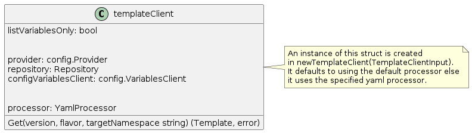
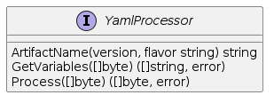

# Extensible Template Processing for clusterctl

## Table of Contents

   * [Extensible Template Processing for clusterctl](#extensible-template-processing-for-clusterctl)
      * [Table of Contents](#table-of-contents)
      * [Glossary](#glossary)
      * [Summary](#summary)
      * [Motivation](#motivation)
         * [Goals](#goals)
         * [Non-Goals](#non-goals)
         * [Future Work](#future-work)
      * [Proposal](#proposal)
         * [User Stories](#user-stories)
         * [Implementation Details/Notes/Constraints](#implementation-detailsnotesconstraints)
            * [UX for using Extensible Templating Tools](#ux-for-using-extensible-templating-tools)
            * [Interface and Library Changes](#interface-and-library-changes)
            * [Notes](#notes)
         * [Risks and Mitigations](#risks-and-mitigations)
         * [Constraints](#constraints)
      * [Alternatives](#alternatives)
      * [Upgrade Strategy](#upgrade-strategy)
      * [Additional Details](#additional-details)
      * [Implementation History](#implementation-history)

## Glossary

Refer to the [Cluster API Book Glossary](https://cluster-api.sigs.k8s.io/reference/glossary.html).

SimpleYamlProcessor - This is the processor that will handle the existing
variable substitution method of templating. This will be the default mode of
operation.

Some templating tools that can be used to manage your templates.

* Ytt - Yaml Templating Tool.
  * Source https://github.com/k14s/ytt
* Cue - Cue Data Constraint Language.
  * Source: https://github.com/cuelang/cue
* Dhall - Dhall Programming Configuration Language.
  * Source: https://github.com/dhall-lang/dhall-lang/blob/master/README.md
  * Golang Library: https://github.com/philandstuff/dhall-golang
  * Kubernetes Library: https://github.com/dhall-lang/dhall-kubernetes
* Helm Template
  * Doc: https://helm.sh/docs/helm/helm_template/
  * Code: https://github.com/helm/helm/blob/master/cmd/helm/template.go

## Summary

Clusterctl handles the lifecycle of Cluster API management and workload
clusters. It automates fetching the YAML files defining provider components
and the cluster templates used to define workload clusters. However, as more
providers contribute to CAPI and the variety of workload cluster templates
increase, it becomes harder for operators to manage all the cluster template
flavor permutations. Operators and providers are now leaning towards yaml
templating tools to properly manage the variety of cluster templates, and to
simplify the end user experience by limiting the amount of boilerplate YAML
that operators need to supply.

This proposal outlines the need to create an extensible templating mechanism
within clusterctl so that it can be used effectively with other templating
tools and continue to provide a seamless user experience.

## Motivation

To support a Cluster API that is cloud agnostic, operators need to deploy
workloads in a multi-cloud environment. Operators and providers may need to
create and _manage_ multiple cluster templates across a matrix of options and
configurations. To manage the explosion of yaml manifests, operators may want
to explore templating tools to minimize duplication and assert type
correctness.

Users looking to deploy workload clusters may be overwhelmed by the number of
variables needed to configure a workload cluster. Some of these options may be
circumvented via defaults provided by the operators as part of the templating
tool.

This proposal aims to extend clusterctl’s current templating mechanism of
simple variable substitution to support other templating formats natively,
thus benefiting the operators to deploy workload clusters with minimal
configuration.

### Goals

- Clusterctl will not be changing the way it gets values for yaml variables.
  That is, it will get values from environment variables and the config file.
- To provide an interface such that other templating solutions may be
  supported.

### Non-Goals

- To disrupt upstream templating solutions such as kustomize.
- To replace Clusterctl default mode of processing templates, aka
  `SimpleYamlProcessor`.

### Future Work

- To automatically detect template files for the appropriate template engine.
- To use the configuration file to determine which provider should use
  preferred templating mechanisms.

## Proposal

This section outlines the high level work that needs to be done in order to
accomplish the task of supporting other templating tools.

### User Stories

- As a clusterctl user, I would like to preserve the current behavior of using
  existing workload cluster templates with simple variable substitution from
  the clusterctl config and environment variables.
- As an infrastructure provider, I would like to provide templated yaml with
  defaults and have that be consumed by `clusterctl config cluster` to
  generate cluster manifests.
- As a developer, I would like to easily provide a way to extend clusterctl
  with my preferred templating solution.

### Implementation Details/Notes/Constraints

Currently the clusterctl command fetches yaml for the provider components
(yaml defining the management cluster components) and the workload cluster
templates.

#### UX for using Extensible Templating Tools

For the first iteration, we won't be making any user facing changes to the
clusterctl CLI. Therefore all the clusterctl commands will hold true with the
current expected behavior. The changes will be exposed via the clusterctl library.

#### Interface and Library Changes

Package Method Calls for `clusterctl config cluster`

The `TemplateClient` will contain a field adhering to the interface - `YamlProcessor`.

The `YamlProcessor` will provide three behaviors.

1. `ArtifactName` will return the name of the template artifacts that need to be retrieved from the source.

   - For the default `SimpleYamlProcessor`, it will be `cluster-template.yaml`. If the
     flavor option is provided, it will be `cluster-template-<flavor>.yaml`.
   - For other `YamlProcessor`s, it could be something that follows a separate
     convention such as
     `cluster-template-<template-engine-type>.<compression-format>`. This
     should include all the artifacts required by the template processor to
     produce the final YAML template.

   Once we retrieve the artifact blob of bytes we can then perform the required
   two functions.

2. `GetVariables` is responsible for parsing the template artifact blob of bytes and
   providing a list of variables that the template requires.

3. `Process` is responsible for parsing the artifact blob of bytes and will
   return the final manifest with values retrieved from the `VariablesGetter`.

The yaml specific processor can be passed in via the clusterctl library.

#### Notes

- Another method of defining a yaml processor instead of using its library
  would be to shell out to the templating engine binary/executable.
  The advantage of this is that the templating engine is not a dependency within
  the clusterctl codebase.
  The disadvantage is that the user needs to ensure the binary is installed
  separately which disrupts the UX of clusterctl. If each infrastructure
  provider provides different template styles, the user would need to install
  multiple templating tool binaries.

### Risks and Mitigations

- Support path for supporting extended templating tools within clusterctl.
  That is, if there are templating issues, who owns them and how do we address
  them. This is for each templating engine that is included in clusterctl.
  However since if we decide to put extended templating
  libraries within a **contrib** folder, it will be the responsibility of the
  contributor and not the project maintainers to support the templating
libraries so the issue of support should be solved with this contract.

- Each provider may want to implement their own templating standard. This
  could affect the UX of clusterctl when automatically pulling workload
  cluster templates from various providers.

- Define a format or convention for retrieving multiple template files.
  Currently, clusterctl supports template retrieval from a ConfigMap in a
  cluster, URL, Github release artifacts and local file system. We default to
  retrieving provider cluster templates from github release assets. In order to
  avoid running into github quota limits on retrieving asset files we can pull a
  compressed file with all the template contents.

  As mentioned above in the *Constraints* and *Implementation* section a suggestion
  for convention would be
  `cluster-template-<template-engine-type>.<compression-format>`. Compression
  format could be tar, gzip, zip, etc.

  We will be leaning towards `tar.gz` compression format unless any objections.

### Constraints

- Currently, clusterctl relies on the conformance of file name conventions
  such as `infrastructure-components.yaml` and
  `cluster-template-<flavor>.yaml`. Other templating tools might require other
  conventions to be defined and followed to allow the same "day 1" experience.
- Some templating tools will require multiple files to be defined rather than
  a single yaml file. These artifacts will need to be "grouped" together to
  support current retrieval mechanisms. Currently, `clusterctl config cluster`
  retrieves templates from multiple sources such as ConfigMaps within a
  cluster, URL, Github Repository, Local Repository and even the overrides
  directory. To ensure compatibility, we’ll need to establish a compression
  format like tar.gz

## Alternatives

- An alternative to allowing clusterctl handle templates would be to just use
  another tool upstream to generate the various templates with variables
  defined. Then use clusterctl to consume that template and use the
  `SimpleYamlProcessor` to produce the template.

## Upgrade Strategy

Any individual template engine libraries would be upgraded via go modules
preferably using semver standards.

## Additional Details

Currently, cluster-api-provider-azure is using kustomize to author their
cluster template flavors. See [issue 540] for more details. Maybe we can
collect input from them to understand their strategy if they need to
manage their template variations.

## Implementation History

- 04/22/2020: Proposed idea in an issue or [community meeting]
- 04/27/2020: Compile a [CAEP Google Doc] following the CAEP template
- 05/06/2020: First round of feedback from community
- 05/11/2020: Open proposal PR
- 05/13/2020: Present proposal at a [community meeting]

<!-- Links -->
[community meeting]: https://docs.google.com/document/d/1fQNlqsDkvEggWFi51GVxOglL2P1Bvo2JhZlMhm2d-Co/edit#heading=h.3wfmgc28aou3
[CAEP Google Doc]: https://docs.google.com/document/d/1GByR9Dm0igw7FaDDwIM7OldhB5TMuixHswq7TAO1bQg/edit?usp=sharing
[issue 540]: https://github.com/kubernetes-sigs/cluster-api-provider-azure/pull/540
