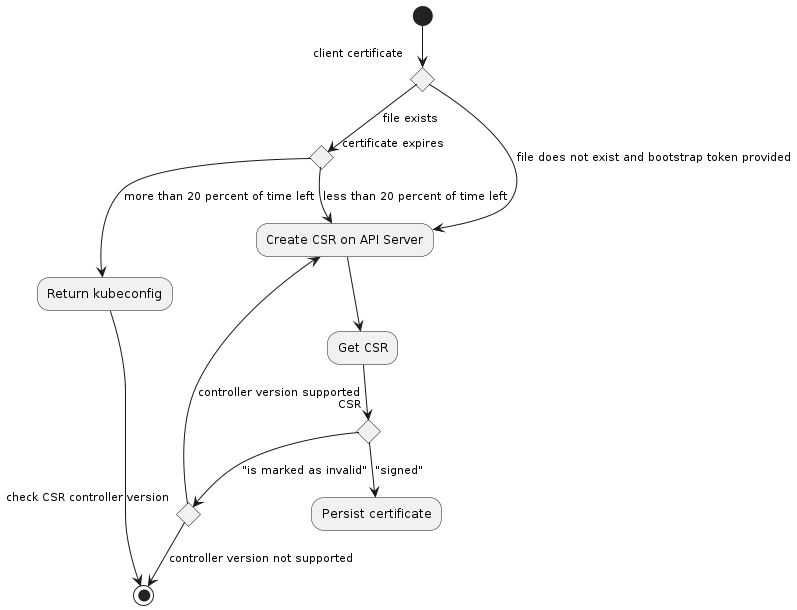

---

title: Cluster API Kubelet Authentication
authors:
  - "@randomvariable"
  - "@yastij"
reviewers:
  - "@ashish-amarnath"
  - "@alexander-demichev"
  - "@arvinderpal"
  - "@cecilerobertmichon"
  - "@elmiko"
  - "@enxebre"
  - "@fabriziopandini"
  - "@joelspeed"
  - "@jpeach"
  - "@kfox1111"
  - "@neolit123"
  - "@sbueringer"
  - "@sftim"
  - "@vincepri"
creation-date: 2021-02-22
last-updated: 2021-04-29
status: implementable
replaces:
superseded-by:

---

# Cluster API Kubelet Authentication


## Table of Contents

- [Cluster API Kubelet Authentication](#cluster-api-kubelet-authentication)
  - [Table of Contents](#table-of-contents)
  - [Glossary](#glossary)
  - [Summary](#summary)
  - [Motivation](#motivation)
    - [Goals](#goals)
    - [Non-Goals/Future Work](#non-goalsfuture-work)
  - [Proposal](#proposal)
    - [User Stories](#user-stories)
      - [Story 1: Machine Attestation](#story-1-machine-attestation)
      - [Story 2: MachinePool race conditions](#story-2-machinepool-race-conditions)
    - [Requirements](#requirements)
    - [Implementation Details/Notes/Constraints](#implementation-detailsnotesconstraints)
      - [New Components](#new-components)
      - [Kubelet authentication plugin](#kubelet-authentication-plugin)
      - [Node Attestation](#node-attestation)
      - [CSR format used by kubelet-authenticator](#csr-format-used-by-kubelet-authenticator)
        - [OIDs](#oids)
      - [CSR PEM Blocks](#csr-pem-blocks)
      - [Attestation data](#attestation-data)
      - [Core Specification](#core-specification)
      - [Provider Specification](#provider-specification)
        - [All providers](#all-providers)
        - [Insecure providers](#insecure-providers)
        - [Secure providers](#secure-providers)
        - [TPM based providers](#tpm-based-providers)
      - [Kubeadm](#kubeadm)
      - [Changes to the Cluster and core Cluster API controller](#changes-to-the-cluster-and-core-cluster-api-controller)
      - [Changes to KubeadmControlPlane resources and controller](#changes-to-kubeadmcontrolplane-resources-and-controller)
      - [Changes to Cluster API Bootstrap Provider Kubeadm](#changes-to-cluster-api-bootstrap-provider-kubeadm)
        - [Changes to token rotation](#changes-to-token-rotation)
      - [Kubelet authenticator flow](#kubelet-authenticator-flow)
        - [Client CSR flow](#client-csr-flow)
        - [Serving CSR handling](#serving-csr-handling)
    - [Risks and Mitigations](#risks-and-mitigations)
  - [Alternatives](#alternatives)
      - [Implement within the cloud providers instead of Cluster API](#implement-within-the-cloud-providers-instead-of-cluster-api)
      - [Implement as authentication webhook, as per aws-iam-authenticator (Amazon EKS)](#implement-as-authentication-webhook-as-per-aws-iam-authenticator-amazon-eks)
      - [SPIRE/SPIFFE](#spirespiffe)
  - [Upgrade Strategy](#upgrade-strategy)
  - [Additional Details](#additional-details)
    - [Test Plan [optional]](#test-plan-optional)
    - [Graduation Criteria [optional]](#graduation-criteria-optional)
      - [Graduation to beta](#graduation-to-beta)
      - [Graduation to GA](#graduation-to-ga)
    - [Version Skew Strategy](#version-skew-strategy)
  - [Implementation History](#implementation-history)

## Glossary


- **OID:** Object Identifier defined by the International Telecommunications Union and used in PKI
  to identify attributes on certificates.

- **PKI:** Public Key Infrastructure

- **TPM:** Trusted Platform Module (TPM) is a specification defined by the Trusted Computing Group
  (TCG) that allows hosts to attest to their identity via PKI and a secure crypto-processor which
  may either be a separate chip, built into the CPU or a virtual device provided by the hypervisor.

- **Trust on first use:** Often abbreviated to TOFO is an authentication convention that a provided
  credential is only trusted from one endpoint which is recorded, and if presented again from a
  different endpoint it is untrusted. See https://en.wikipedia.org/wiki/Trust_on_first_use for more
  information.


## Summary

This proposal outlines a method to secure node registration within Cluster API, to solve 2 primary
problems:

- Solve a class of attacks involving node impersonation allowing an attacker to access secrets and
  volumes they shouldn’t by using hardware attestation of node identity.
- Reduce kubeadm token reuse in MachinePools where the cloud provider does not support continuous
  update of the bootstrap userdata without creating new cloud provider specific MachinePool
  resources (e.g. AWS Launch Configurations).

This node attestation mechanism will be optional in the initial implementation, and can potentially
be used independently of Cluster API.

## Motivation

Cluster API default core components are largely reliant on kubeadm for cluster bootstrapping and
node registration. Kubeadm is a platform-agnostic command line tool designed to assist users to
bootstrap Kubernetes clusters, and is used as a building block in Cluster API. Because kubeadm is
platform-independent and is intended to provide an “easy path” to cluster bootstrapping,  there are
a number of inherent design decisions that limit the overall security of the provisioned cluster:

- Kubeadm uses TLS bootstrapping for node registration, however the default workflow used by Cluster
  API uses bootstrap token which allow registration as arbitrary node names.
  - When used in this mode, Kubeadm essentially does “client-side validation” to prevent node
    hijacking, but this does not mean the token cannot be reused by an attacker within the lifetime
    of the token to perform a hijack. By hijack, the token could be used to auto-approve a CSR
    for an existing node, and in particular a control plane node such that it then has access to
    workloads and secrets intended only for control plane instances.
  - Cluster API cannot scope a token down to a specific node, because neither bootstrap providers,
    nor most infrastructure providers know the identity of the node ahead of time.

### Goals

- Provide a bootstrap mechanism that assures secure node registration
- To provide a node registration mechanism that is independent of kubeadm
- Ensure that this can work with any infrastructure provider


### Non-Goals/Future Work

- To change assumptions around management cluster to workload cluster connectivity
- Solve the protection of initial cluster bootstrap secrets for the control plane nodes
- To be a mandatory requirement of using Cluster API
- To implement or enable hardware-backed encryption of traffic between worker nodes and the control
  plane components.

## Proposal

### User Stories

#### Story 1: Machine Attestation

A cluster operator has been asked to ensure compliance with [NIST SP 800-190 Application Container
Security][nist-sp-800-190] Guide. Hardware countermeasure 4.6 suggests that container platforms
should make use of trusted computing. In a Kubernetes context, this would mean providing hardware
node attestation wherever possible.

#### Story 2: MachinePool race conditions

A cluster operator has set up a MachinePool in either AWS or Azure, and wants the MachinePool to be
reliable. The current behaviour of Cluster API Bootstrap Provider Kubeadm (CABPK) is such that
bootstrap tokens are rotated at set intervals, and infrastructure providers must update their
MachinePool implementations with the new secret data.

This has led to either: implementation specific hacks to ensure the token gets updated, and minor
race conditions where the infrastructure machine pool implementation does not have the new token
inserted and attempts to bootstrap the machine with stale bearer tokens.

### Requirements

The node bootstrapper MUST be able to attest the identity of the machine against a chain of trust
provided by the hardware or cloud provider.


### Implementation Details/Notes/Constraints

#### New Components

* **node-attestation-controller**
  * **Code Location**: Part of Cluster API repository, under bootstrap/node/attestation/controller, and
    imported by Cluster API infra providers for implementation.
  * **Release Artifact**: Embedded controller within infrastructure providers.
  * **Description**: A controller to verify and sign the CSR. This would be typically an importable
  controller where the infrastructure provider implements the interface with specific code for CSR
  approval and start the controller as part of its main.go or through an independent binary.

* **kubelet-authenticator**
  * **Code Location**: Part of Cluster API repository, under bootstrap/node/attestation/authenticator
    and imported by Cluster API infra providers for implementation.
generic challenge-response implementation will be included for providers / bare metal without an
attestation mechanism. This controller runs as part of the Cluster API components in the management
cluster
  * **Release Artifact**: Binary for each implementing infrastructure provider called `kubelet-authenticator-<provider>`
  * **Description**: A controller to verify and sign the CSR. This would be typically an importable
  controller where the infrastructure provider implements the interface with specific code for CSR
  approval and start the controller as part of its main.go or through an independent binary.

* **kubelet-authenticator-null**
  * **Code Location**: Part of CLuster API Provider, under bootstrap/node/attestation/null
  * **Release Artifact**: None. Used only for testing.
  * **Description**: A "rubber-stamp" attestor that will validate all CSRs. We will not want to release
    this as an artifact to prevent it being accidentally used.

#### Kubelet authentication plugin

We propose a kubelet authentication plugin to be present on the instances, (the
kubelet-authenticator CLI will be baked into the machine images through image-builder), which will
be responsible for node registration, as well as certificate rotation. The agent will be made up of
two parts:
- A common library vendored from Cluster API which includes the following functionality:
  - Certificate filesystem locking
  - Checking existing certificate validity
  - Certificate signing request generation for kubelet client certificates
  - Submission of CSRs to the API server and waiting for approval
- A provider specific implementation for node attestation
  - A provider will need to implement the generation of the attestation to be included in the CSR
    and the retrieval of the provider ID to be stored in an X.509 extension attribute.
  - A provider will need to implement checks to verify the SAN attributes of serving certificates.

The behaviour of the authentication plugin will be as follows:


#### Node Attestation

As for the node-attestation-controller, the following interface needs to be implemented by the
infrastructure providers:
```go
type ClusterAPISigner interface {
     VerifyClientAttestationData (csr *certificatesv1beta1.CertificateSigningRequest) err
     VerifyServingAttestationData (csr *certificatesv1beta1.CertificateSigningRequest) err
     MachineName (csr *certificatesv1beta1.CertificateSigningRequest) (string, error)
}
```

This enables infrastructure providers to perform infrastructure-specific validation of node
attestations (TPM, appended tags by the provider, etc.)

Cluster API is responsible for partially verifying node identity with the following conditions:

- A corresponding machine object exist for the CSR's `.spec.Username` (`system:nodes:<nodename>`)
  (providing the value is deferred to infrastructure provider)
- The Machine must have conditions BootstrapReady.
- The Kubernetes CSR spec has the needed groups
- The Kubernetes CSR spec is limited to needed usages (e.g. client auth)
- The Kubernetes CSR spec is limited to needed extensions (e.g. no CA extension)
- Parse the CSR and verify that the CN is the same as .spec.username
- Parse the CSR and verify that the Organization is the same as .spec.Groups
- Parse the CSR and ensure that no SANs are appended for kubelet client certificates

#### CSR format used by kubelet-authenticator
We propose the introduction of X.509 extension attributes based
on those reserved for the Kubernetes GCP cloud provider within Google’s organization ID allocation.

We will request via SIG Architecture or CNCF to apply for an [IANA OID registration
block][iana-issue] for the Kubernetes project.

##### OIDs

* **OID Suffix**: 2.1.21
* **Name**: KubernetesNodeProviderIdentifierOID
* **Description**: An identifier for the machine, should be the same or a derivative of the node
  provider ID. This is the equivalent of Google’s CloudComputeInstanceIdentifierOID, which we can
  reuse for a proof of concept (1.3.6.1.4.1.11129.2.1.21).

#### CSR PEM Blocks

The following blocks will be added to CSRs following Section 2 of [RFC7468].

| Block Name                                 | Description                                          |
| ------------------------------------------ | ---------------------------------------------------- |
| KUBELET AUTHENTICATOR ATTESTATION PROVIDER | string describing the attestation provider           |
| KUBELET AUTHENTICATOR ATTESTATION DATA     | the actual attestation data to perform validation on |

#### Attestation data

Attestation data will be appended with the following headers and footers and MUST
be base64 encoded.

Example CSR:
```
-----BEGIN ATTESTATION DATA-----
S25vd2luZyBtZSBBbGFuIFBhcnRyaWRnZSwga25vd2luZyB5b3UgS3ViZXJuZXRlcyBjbHVzdGVyLCBhaGEh
-----END ATTESTATION DATA-----
```
The format of the attestation block is left to the provider.

#### Core Specification
- Core Cluster API MUST provide the following implementations of CSRs and signers:
  - `cluster.x-k8s.io/kube-apiserver-client-kubelet-insecure` which implement an “Always Allow” type
    signer that provides equivalent security to Cluster API v1alpha3. This is only to be used for
    providers where no secure mechanism exists.

- Core Cluster API MIGHT provide the following implementations of CSRs and signers:
  - `cluster.x-k8s.io/kube-apiserver-client-kubelet-tpm` and `cluster-x-k8s-io/kubelet-serving-tpm`
    - Will implement TPM-based certificate signers and requesters based on the
      [cloud-provider-gcp implementation].
    - We will additionally implement a challenge-response mechanism, similar to that done in
      [SPIRE's TPM plugin]. This proposal will be updated with the implementation.
    - However, since the mechanism for retrieving endorsement keys varies across
    platforms, the TPM signer will additionally require a provider specific mechanism to provide the
    TPM Endorsement Key's CA.

#### Provider Specification

##### All providers
- All providers MUST insert a ProviderID within the KubernetesNodeProviderIdentifierOID extension
  attribute of the CSR.
- All signer names MUST be filled in by the provider’s controller in
  InfraCluster.Status.KubeletClientCertificateSigner and
  InfraCluster.Status.KubeletServingCertificateSigner if the attestation controller is running.
- All providers SHOULD implement trust-on-first-use type mechanisms to prevent replay attacks. We
  defer to providers how endpoint or authentication data is recorded to validate endpoints.

##### Insecure providers
- An insecure provider CANNOT implement certificate rotation or kubelet serving certificate signing.
- InfraCluster.Status.KubeletClientCertificateSigner MUST be set to
  cluster.x-k8s.io/kube-apiserver-client-kubelet-insecure.
- An insecure provider MUST use the cluster.x-k8s.io/kube-apiserver-client-kubelet-insecure signer.

##### Secure providers
- A secure provider MUST implement certificate rotation and kubelet server certificate signing.
- A provider must register signers of:
    - `cluster-x-k8s-io/kube-apiserver-client-kubelet-<provider>`
    - `cluster-x-k8s-io/kubelet-serving-<provider>`
- A secure provider MUST implement a secure attestation mechanism, based upon PEM-encoded blocks
  within the Certificate Signing Request.
- Where a secure provider’s attestation mechanism does not include a challenge-response, nonce or
  timestamp to protect against replay attacks, the mechanism MUST implement a secondary time-limited
  attestation (e.g. AWS Instance Identity document + AWS HMACv4 signature).
- A provider’s signer MUST run on the management cluster.

##### TPM based providers
- A TPM provider MUST use the following certificate signers
    - `cluster-x-k8s-io/kube-apiserver-client-kubelet-tpm`
    - `cluster-x-k8s-io/kubelet-serving-tpm`
- A TPM provider MUST annotate new CSRs as follows:
    - Key: cluster-x-k8s-io/tpm-endorsement-key
  - Value: Platform-specific endorsement key (e.g., retrieved from GCP Shielded VM API or VMware
    vCenter).

#### Kubeadm
Since this proposal essentially takes over part of the node registration process from kubeadm, we
will require the following changes:
- kubeadm COULD allow opt-out of kubeadm setting up ClusterRoleBindings between the system:nodes
  group and the `system:certificates.k8s.io:certificatesigningrequests:selfnodeclient` permission,
  so that certificate renewals must go through re-attestation.
- Kubeadm COULD allow opt-out of kubeadm setting up `kubeadm:node-autoapprove-bootstrap` cluster
  role binding. This is deferred to a future Kubeadm design and release, and for this proposal, we
  will add fields to KubeadmControlPlane to remove these node groups and bindings post control plane
  initialisation.

The idea is to rely on the [client-go auth exec mechanism] of kubeconfigs with local cache
directory, when kubelet wants to talk to the apiserver it will call on the kubelet authenticator to
get a client certificate.

#### Changes to the Cluster and core Cluster API controller

``` yaml
spec:
  security:
    kubeletAuthentication: true
    authorizedAttestors:
    - contosoCloud
```

#### Changes to KubeadmControlPlane resources and controller

The cluster field if set will be read by KCP and remove the `kubeadm:node-autoapprove-bootstrap`
cluster role binding.

#### Changes to Cluster API Bootstrap Provider Kubeadm

If the kubeletAuthentication field is set for the cluster, CABPK will
default `--rotate-server-certificates` on NodeRegistrationOptions.ExtraArgs for the kubeadm
configuration. If KubeletConfiguration is supported within Cluster API v1alpha4, we
will opt to set ServerTLSBootstrap on KubeletConfiguration instead.

CABPK will also update the runcmds for cloud-init / Ignition such that the authenticator is set up
with the initial bootstrap token.

##### Changes to token rotation

Token rotation in CABPK is currently as follows:

* If the token is for a Machine, renews the token TTL until the Machine has reached the
  InfrastructureReady == True condition, at which point the TTL clock is run out.
  * CABPK does not wait for Node Ready at present because we cannot ensure the machine bootstrap has
    been deliberately interrupted such that it may be used to register an arbitrary node.
* If the token is for a MachinePool, rotate the token when the TTL is hit.
  * Since tokens are used for multiple machines to self-approve CSRs, we minimise token reuse
    opportunities by rotating it.
  * This causes issues for infrastructure provider mechanisms for MachinePools (User Story 2).

When cluster.Spec.Security.KubeletAuthentication is set to true, CABPK will switch to this alternate
behaviour, as there is no auto-approval of node CSRs:
* If the token is for a Machine, renew the token TTL until the Machine is Ready (i.e. kubelet has
  successfully registered and a ProviderID exists)
* If the token is for a MachinePool, renew the token TTL for the lifetime of the MachinePool.
  * This should be safe, as in the event of a compromise, administrators should replace the entire
    MachinePool.


#### Kubelet authenticator flow

The authenticator will be responsible for updating the kubelet client certificates only.

##### Client CSR flow



##### Serving CSR handling

For the Kubelet serving certificate, we intend to enable serving certificate TLS bootstrapping on
Kubelet via the ServerTLSBootstrap settings of Kubelet's configuration.

This will cause Kubelet to not generate a self-signed certificate for serving and instead
submit CSRs for the initial certificate and rotation to the API server.

The attestation controller will validate the following:

* CSR spec.username field is of the form system:node:<nodeName> and spec.groups contains
  system:nodes
* Only contains digital signature, server auth and key encipherment usages.
* Only has IP and DNS subjectAltNames that belong to the requesting node. We defer to
  the infrastructure provider if it makes calls to the cloud provider for verification.

### Risks and Mitigations

There may be additional security risks being introduced in this design. In order to mitigate this,
this proposal will be taken to SIG Security and SIG Auth for review **before the beta graduation**.

## Alternatives

#### Implement within the cloud providers instead of Cluster API
Given that there is an existent implementation in cloud-provider-gcp, this could be extended to all
of the cloud providers. However, there are some advantages to making Cluster API responsible for
kubelet registration in that no changes to the assumptions around connectivity between management
and workload clusters are required, neither does the signer need to be included as a static pod
during control plane instantiation.

#### Implement as authentication webhook, as per aws-iam-authenticator (Amazon EKS)
If attestation was implemented as an authentication webhook, it would be in the critical path for
all token-based authentication against the API server. It would also additionally be needed to be
set up at workload cluster instantiation via a static pod and API server start up.

#### SPIRE/SPIFFE

SPIFFE (Secure Production Identity Framework for Everyone), and it's open source implementation in
SPIRE form a set of standard frameworks for workload identity which is independent of any
particular cluster technology. We spent some time investigating if SPIRE could be used as a baseline
for kubelet authentication within Cluster API. However, [SPIRE currently requires a
RDBMS][spire-architecture] independent of the Kubernetes API Server / etcd datastore. In the default
mode, it uses SQLite.

For the Day 0 provisioning of management clusters from Kind and then effecting a move of data, or
otherwise bootstrapping SPIRE into a workload cluster on first boot presents a significant challenge
as well as introducing a number of large dependencies into Cluster API. For this reason, we have
chosen the main proposal instead.

In addition, it isn't immediately clear how SVIDs (SANs starting with SPIFFE://\<identity\>) map to
node identities accepted by the Kubernetes API Server. Node identity is most frequently the hostname
in the CN of the certificate, and although there have been [initial discussions][spiffe-discussions]
about how to make the Kubernetes API Server accept SVIDs directly, we do not want to wait on the
resolution of that before proceeding.

Where SPIFFE is desired end-to-end, it should in theory be possible to develop a CAPI kubelet
authenticator provider that uses the SVID certificate as the CSR attestation data that is then
exchanged for the kubelet certificate.

## Upgrade Strategy

upgrades should be transparent for users:

- Upgrading cluster API components shouldn't have effects on existing clusters
- Upgrading workload clusters should also work fine, as CABPK would supply a bootstrap script in
  v1alpha4 and the current one when it's running in v1alpha3

## Additional Details

### Test Plan [optional]

- E2E tests to be added to AWS, vSphere and Azure providers as each provider implements the signer
- E2E tests to be added for the insecure signers for use with CAPD.
Upgrade tests from latest minor release to latest main branch of Kubernetes


### Graduation Criteria [optional]

#### Graduation to beta
- E2E tests testing upgrades to latest main branch of Kubernetes are required such that Cluster API
  can make appropriate changes to node registration if kubelet or kubeadm behaviour changes.

- Security review by SIG Auth and SIG Security
#### Graduation to GA
- External security review of the combined Cluster API and kubeadm model.


### Version Skew Strategy

Any changes to the attestation data should be handled in a backward compatible manner by the
infrastructure provider when implementing the interface used by the node-attestation-controller, by
making sure it's able to convert an older attestation format to a newer one.

This will be done by the controller verifying the version of the CSR sent by the CLI. If the
version is mismatched, the controller will add an annotation listing supported versions. If the
CLI supports the older version, it files a new CSR with the older format.


## Implementation History

- [ ] 2020/10/07: [Initial Google doc][google-doc]
- [ ] 2021/02/22: Open proposal PR
- [ ] 2021/04/16: Upload PlantUML diagrams
- [ ] 2021/04/27: Commentary on SPIFFE/SPIRE
- [ ] 2021/04/28: Updates on token renewal, version skew and components
- [ ] 2021/04/29: Update TPM text, add links to K8s GCP Cloud Provider and SPIRE TPM plugins.

<!-- Links -->
[community meeting]: https://docs.google.com/document/d/1Ys-DOR5UsgbMEeciuG0HOgDQc8kZsaWIWJeKJ1-UfbY
[nist-sp-800-190]: https://csrc.nist.gov/publications/detail/sp/800-190/final
[google-doc]: https://docs.google.com/document/d/12xBDKPbmzWGcPK0qp23rfqzDlqGqnXV_t5fuXUol0QA/edit
[RFC7468]: https://tools.ietf.org/html/rfc7468#page-3
[iana-issue]: https://github.com/kubernetes/k8s.io/issues/1959
[spire-architecture]: https://spiffe.io/docs/latest/spire-about/spire-concepts/
[spiffe-discussions]: https://github.com/kubernetes/community/blob/master/sig-auth/archive/meeting-notes-2020.md#december-9-11a---noon-pacific-time
[client-go auth exec mechanism]: https://kubernetes.io/docs/reference/access-authn-authz/authentication/#configuration
[cloud-provider-gcp implementation]: https://github.com/kubernetes/cloud-provider-gcp/blob/master/cmd/gke-exec-auth-plugin/tpm.go#L76
[SPIRE's TPM plugin]: https://github.com/bloomberg/spire-tpm-plugin#how-it-works
