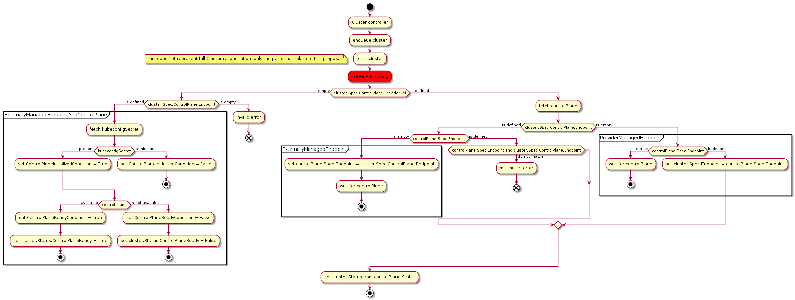
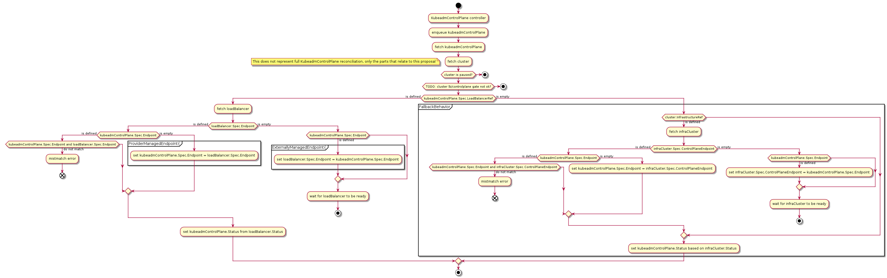
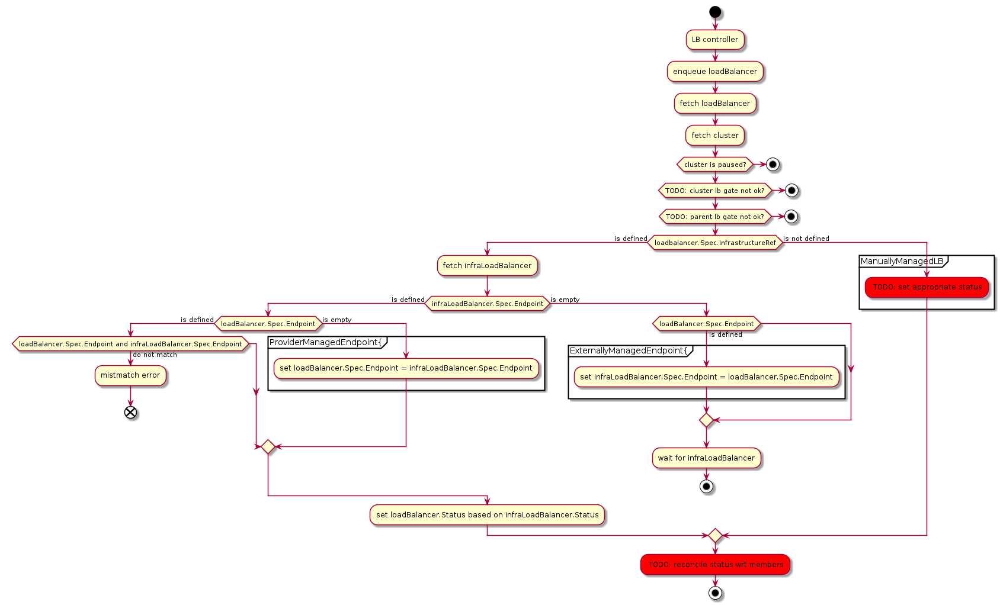
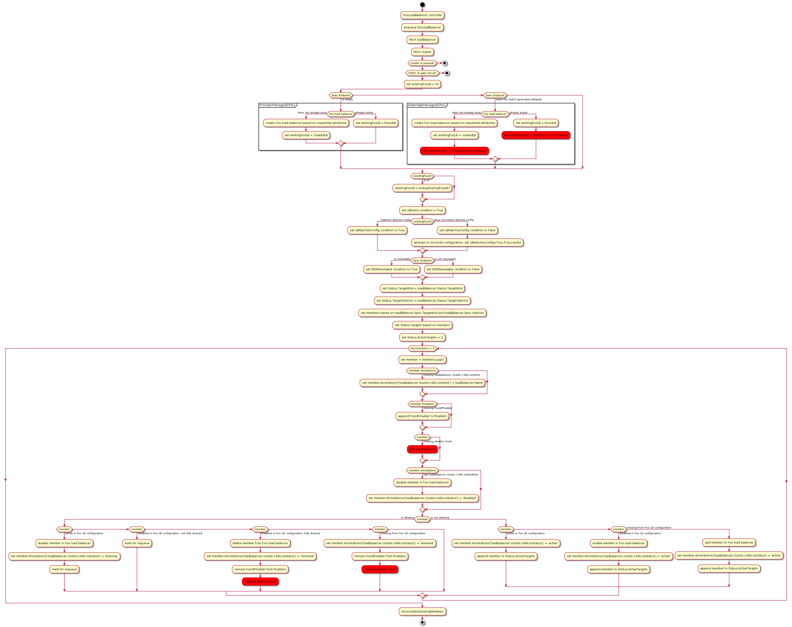
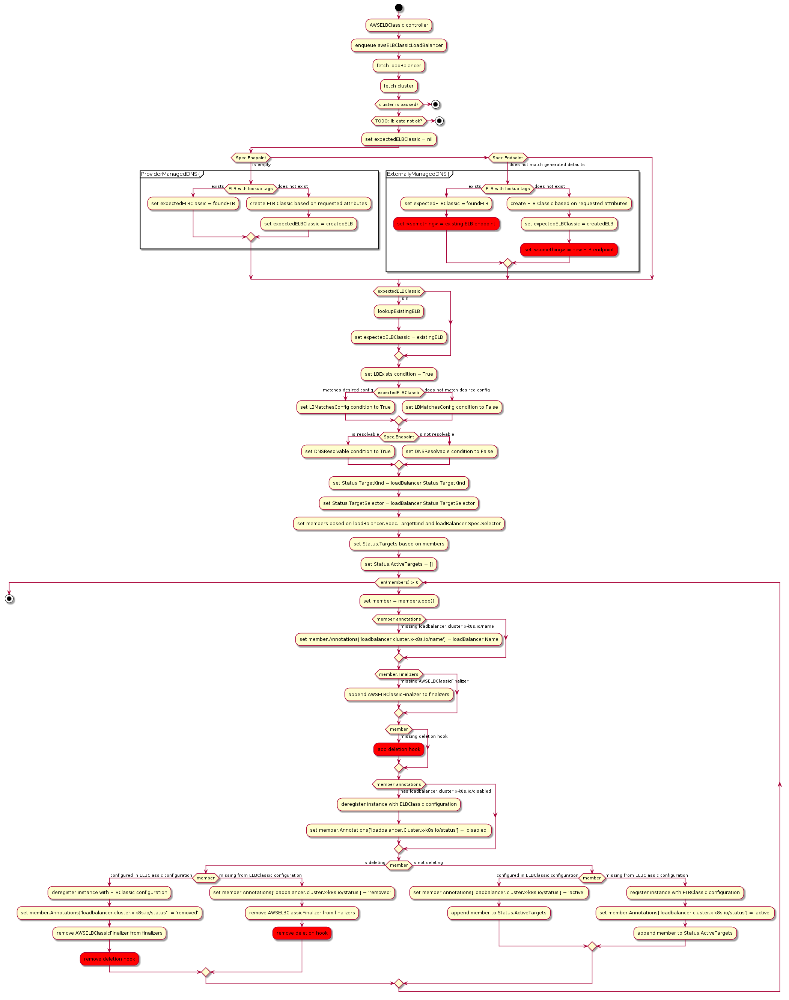

# Load Balancer Provider

## Table of Contents

A table of contents is helpful for quickly jumping to sections of a proposal and for highlighting
any additional information provided beyond the standard proposal template.
[Tools for generating](https://github.com/ekalinin/github-markdown-toc) a table of contents from markdown are available.

- [Title](#title)
  - [Table of Contents](#table-of-contents)
  - [Glossary](#glossary)
  - [Summary](#summary)
  - [Motivation](#motivation)
    - [Goals](#goals)
    - [Non-Goals/Future Work](#non-goalsfuture-work)
  - [Proposal](#proposal)
    - [User Stories](#user-stories)
      - [Story 1](#story-1)
      - [Story 2](#story-2)
    - [Requirements (Optional)](#requirements-optional)
      - [Functional Requirements](#functional-requirements)
        - [FR1](#fr1)
        - [FR2](#fr2)
      - [Non-Functional Requirements](#non-functional-requirements)
        - [NFR1](#nfr1)
        - [NFR2](#nfr2)
    - [Implementation Details/Notes/Constraints](#implementation-detailsnotesconstraints)
    - [Security Model](#security-model)
    - [Risks and Mitigations](#risks-and-mitigations)
  - [Alternatives](#alternatives)
  - [Upgrade Strategy](#upgrade-strategy)
  - [Additional Details](#additional-details)
    - [Test Plan [optional]](#test-plan-optional)
    - [Graduation Criteria [optional]](#graduation-criteria-optional)
    - [Version Skew Strategy [optional]](#version-skew-strategy-optional)
  - [Implementation History](#implementation-history)

## Glossary

Refer to the [Cluster API Book Glossary](https://cluster-api.sigs.k8s.io/reference/glossary.html).

If this proposal adds new terms, or defines some, make the changes to the book's glossary when in PR stage.

## Summary

We propose a first-class Load Balancer construct for Cluster API for the purpose of providing a pluggable model for load balancing Kubernetes cluster control planes such that the load balancer implementation isn't tied directly into the Infrastructure Cluster resource. This will open the possibility for multiple swappable options in cloud environments and the ability to re-use load balancer implementations when possible, especially for bare metal and data center environments with heterogeneous infrastructure.

## Motivation

In private data center environments, there is no common infrastructure provider for load balancers vs. the provider for the machines themselves. Virtualized environments may use one vendor for virtual machines, e.g. VMware vSphere, KVM, or Xen, and a variety of vendors for networks and load balancers, e.g. F5, VMware NSX-T, Cisco ACI etc… This requires the ability to plug in different infrastructure providers for networking constructs with that of the machine provisioner. The most common use is the provisioning of a load balancer to sit in front of the Kubernetes control plane instances in order to provide a stable endpoint. Many cluster operators will also want to provision a stable machine-based load balancer to front all workload services from that provisioned cluster.

Additionally, there are also cases where providers such as vSphere may be run in public cloud environments and being able to re-use existing native load balancer implementations would be preferred compared to having to re-implement or fork existing implementations for use in those environments.

There are also cases within existing infrastructure provider implementations where it would be beneficial to allow for easier swapping of different load balancer implementations that may provide different benefits under different circumstances.

We've also seen use cases where there is a need for a Load Balancer to front non-control plane services, such as Ingress. Any functionality that we add should also support these use cases in addition to just control plane load balancing.

### Goals

- Provide a common abstraction for Load Balancers between various providers
- Allow for reuse of load balancer providers between infrastructure providers where possible
- Load Balancer must be able to interoperate with alternative Control Plane Providers
- Continued reconciliation of members of the Load Balancer (quiescing of connections, allow for graceful termination/removal of membership as part of deletion mechanisms)
- Should provide an upgrade path for existing Clusters (specifically vsphere clusters and the current Load Balancer provider)
- Should not be tied to a specific Control Plane provider implementation (to support alternative Control Plane provider implementations)
- Should not be a required component of a "Cluster", since some control plane implementations do not require a load balancer (for example, Control Plane providers based on managed Kubernetes services)
- Must be optional to start, to limit the changes required of infrastructure providers

### Non-Goals/Future Work

- Require all load balancer providers to work with all infrastructure providers

## Proposal

This is where we get down to the nitty gritty of what the proposal actually is.

- What is the plan for implementing this feature?
- What data model changes, additions, or removals are required?
- Provide a scenario, or example.
- Use diagrams to communicate concepts, flows of execution, and states.

[PlantUML](http://plantuml.com) is the preferred tool to generate diagrams,
place your `.plantuml` files under `images/` and run `make diagrams` from the docs folder.

### User Stories

#### Story 1 - Allow use of different managed load balancers on AWS
As a platform operator, I want to try using Network Load Balancers to provide connectivity to my Kubernetes clusters, as Elastic Load Balancing v1 doesn’t tag network interfaces correctly which I require for reporting to my finance department. Cluster API Provider AWS only provisions ELBs at the moment, and this is hard-coded into the reconciliation of its AWSCluster resource.

#### Story 2 - Allow use of an AWS Marketplace offering for the control plane load balancer
As a platform operator, I have a requirement in my organisation to use a particular, licensed load balancing solution purchased from the AWS Marketplace, e.g. F5, Avi.

#### Story 3 - DNS registration of load balancers

##### Story 3a - Custom endpoints for consumers
As a platform operator, in my environment we use PowerDNS for DNS registration with OpenStack, an internal ACME server and a 3rd party load balancer provider. I would like to provide a cluster as a service offering to my development teams, and provide a friendly DNS endpoint for the cluster. When a new cluster is provisioned, I want the load balancer to be configured, a DNS entry created via the PowerDNS API and a certificate to be issued for end users to connect to the API server with a known CA certificate. A static IP is assumed for the load balancer.

##### Story 3b - DHCP only environment
In my environment, our infrastructure team does not permit us to reserve IP addresses for load balancer provisioning, and only DHCP is available. As a platform operator however, I want highly available Kubernetes control planes. I would like a mechanism to be able to load balance across multiple API servers and provide end users with a DNS endpoint, which is dynamically updated in my organisation’s Active Directory DNS service using RFC2136 with GSS-TSIG.

##### Story 3c - DNS registration to separate AWS account
In my environment, clusters are recreated periodically without interacting with the teams that leverage the clusters.  We would like friendly DNS endpoints for our clusters, and those DNS entries need to be in an AWS Route 53 Private Hosted Zone that is in a separate AWS account.  We need to assume a cross-account role over AWS IAM and create those DNS entries for the Load Balancers prior to the first control plane node coming up, so that kubeadm can leverage the same DNS entry.

##### Story 4 - Reuse of load balancers between various infrastructure providers
I am running VMC (VMware Cloud) on AWS where I can provision virtual machines via VMware vSphere, but the networking solution is provided by AWS Network Load Balancers. I would like Cluster API to provision an AWS Network Load Balancer for my Kubernetes cluster control plane so I do not have to provision an additional product inside my VMC environment.

##### Story 5 - Enable migration between load balancer provider implementations through externally managed DNS

TODO: expand on this more, for automation of creation of DNS records for a cluster, separating dns from the load balancer for the purpose of a persistent endpoint.

### Requirements

#### Functional Requirements

##### FR1

The Load Balancer provider WILL NOT automate the creation of DNS records, as this is deferred to an external provider. 

##### FR2

The Load Balancer provider MUST not exclude the use of external controllers to manage DNS for load balancers.

#### Non-Functional Requirements

##### NFR1

The Load Balancer MUST allow alternate endpoints, such as DNS aliases to be used as the control plane endpoint in addition to the load balancer.

##### NFR2

This proposal MUST be compatible with the [Cluster API Provider AWS v1alpha4 API](https://docs.google.com/document/d/1EeD2KjFfeKoD-o0LJTMMWh9GUy-15yG80S5Uoj7oKcA/edit)

### Implementation Details/Notes/Constraints

### Changes to types

#### Changes to Cluster type:

Consolidate Control Plane related configuration under `Spec.ControlPlane`.

- Create a new field Spec.ControlPlane
    - Move Spec.ControlPlaneEndpoint to Spec.ControlPlane.Endpoint
    - Move Spec.ControlPlaneRef to Spec.ControlPlane.ProviderRef

```yaml
apiVersion: cluster.x-k8s.io/v1alpha4
kind: Cluster
metadata:
  name: my-cluster
spec:
  controlPlane:
    endpoint:
      host: test.example.com
      port: 443
    providerRef:
      apiGroup: cluster.x-k8s.io
      kind: KubeadmControlPlane
      name: my-cluster-control-plane
```

#### Changes to Cluster reconciliation:



##### Scenario: externally managed endpoint and control plane

User wants to provide an externally managed endpoint for use when creating a cluster to a pre-existing control plane that is not managed by Cluster API.

Preconditions:
- `Spec.ControlPlane.Endpoint` is non-empty
- `Spec.ControlPlane.ProviderRef` is nil
- A pre-configured kubeconfig secret that can access the pre-existing control plane exists with the expected name.

Reconciliation:
- Set `ControlPlaneInitializedCondition` to True
- Test availability of the controlplane using the configured endpoint and provided kubeconfig:
  - If available: Set `Status.ControlPlaneReady` and the `ControlPlaneReadyCondition` to True
  - Otherwise: Set `Status.ControlPlaneReady` and the `ControlPlaneReadyCondition` to False

##### Scenario: externally managed endpoint

User wants to provide an externally managed endpoint for use when creating a cluster, but wants Cluster API to manage the control plane for the cluster.

Preconditions:
- `Spec.ControlPlane.Endpoint` is non-empty
- `Spec.ControlPlane.ProviderRef` is defined

Reconciliation:
- Fetch the referenced provider CR as `cp`
  - If `cp.Spec.Endpoint` is empty, set `cp.Spec.Endpoint` to `Spec.ControlPlane.Endpoint`
  - If `cp.Spec.Endpoint` is non-empty and is not equal to `Spec.ControlPlane.Endpoint`, error
  - If `cp.Spec.Endpoint` is non-empty and is equal to `Spec.ControlPlane.Endpoint`:
    - Set `Status.ControlPlaneReady` and conditions based on state of `cp`

##### Scenario: Cluster API managed endpoint

User wants Cluster API to manage the endpoint for the cluster control plane.

Preconditions:
- `Spec.ControlPlane.Endpoint` is empty
- `Spec.ControlPlane.ProviderRef` is defined

Reconciliation:
- Fetch the referenced provider CR as `cp`
  - If `cp.Spec.Endpoint` is empty, return early and wait for triggered re-reconciliation
  - If `cp.Spec.Endpoint` is non-empty and is not equal to `Spec.ControlPlane.Endpoint`, error
  - If `cp.Spec.Endpoint` is non-empty and is equal to `Spec.ControlPlane.Endpoint`:
    - Set `Status.ControlPlaneReady` and conditions based on state of `cp`

#### Changes to ControlPlane provider types:

- Add spec.Endpoint, if not defined it will be populated by the load balancer provider (if defined)
- Add optional LoadBalancerRef (if needed, based on the provider)

#### New Watches:

- LoadBalancer

##### Example: KubeadmControlPlane

```yaml
apiVersion: controlplane.cluster.x-k8s.io/v1alpha4
kind: KubeadmControlPlane
metadata:
  name: my-cluster-control-plane
spec:
  endpoint:
    host: test.example.com
    port: 443
  loadBalancerRef:
    apiGroup: cluster.x-k8s.io
    kind: LoadBalancer
    name: my-cluster-control-plane-lb
```

#### Changes to ControlPlane provider reconciliation:

##### Example: KubeadmControlPlane



###### Scenario: Load Balancer specified, externally managed endpoint

User wants to provide an externally managed endpoint for use when creating a cluster, but wants Cluster API to manage the load balancer for the control plane.

Preconditions:
- `Spec.Endpoint` is non-empty (could be populated by the Cluster controller)
- `Spec.LoadBalancerRef` is defined

Reconciliation:
TODO

###### Scenario: Load Balancer specified, provider managed endpoint

User wants Cluster API to manage the endpoint for the control plane when creating a cluster.

Preconditions:
- `Spec.Endpoint` is empty
- `Spec.LoadBalancerRef` is defined

Reconciliation:
TODO

###### Scenario: Load Balancer not specified (fallback behavior)

User wants Cluster API to manage the endpoint for the control plane, but is using a provider that doesn't yet support pluggable load balancers.

Preconditions:
- `Spec.Endpoint` is empty
- `Spec.LoadBalancerRef` is nil

Reconciliation:
TODO

### New Types

#### Load Balancer

A common type to aggregate information between Load Balancer provider implementations and to provide some common reconciliation logic.

```yaml
apiVersion: cluster.x-k8s.io/v1alpha4
kind: LoadBalancer
  metadata:
    name: my-cluster-control-plane-lb
spec:
  clusterName: my-cluster
  endpoint:
    host: test.example.com
    port: 443
  targetKind:
    apiGroup: cluster.x-k8s.io
    kind: Machine
  selector:
    matchExpressions:
    matchLabels:
      cluster.x-k8s.io/cluster-name: my-cluster
      loadbalancer.cluster.x-k8s.io/name: my-cluster-control-plane-lb
  infrastructureRef:
    apiGroup: infrastructure.cluster.x-k8s.io
    kind: AWSNLB
    name: my-cluster-control-plane-nlb
status:
  targetKind: <string representing group/kind name for selector>
  targetSelector: <string representing the label selector for the referenced LB>
  targets: (List of members matching label selector)
  activeTargets: (List of active members)
  conditions: (List of infra providers condition for the load balancer)
```

#### Annotations

- Used by providers to signal the state of the resource in the LB
  - loadbalancer.cluster.x-k8s.io/name: `<name of lb>`
  - loadbalancer.cluster.x-k8s.io/status: `<status>`
    - Statuses:
      - 'active' (configured and active in configuration)
      - 'removed' (removed from configuration and safe to delete)
      - 'disabled' (user requested disable complete)
      - other provider-relevant statuses for in-between states
- Used by users/external systems to signal to the load balancer provider that a resource should be temporarily removed from the LB:
  - loadbalancer.cluster.x-k8s.io/disabled:

#### Conditions

TODO

#### Defaults

- If Spec.Selector is not defined:
  - Spec.Selector.MatchLabels = `{'cluster.x-k8s.io/cluster-name': Spec.ClusterName, 'loadbalancer.cluster.x-k8s.io/name': Metadata.Name }`

#### Watches:

- Cluster
- LoadBalancer
- ??? Kind referenced by LB selector
- LoadBalancer provider types

#### Reconciliation



###### Scenario: externally managed endpoint

###### Scenario: provider managed endpoint


TODO: gate provider load balancer reconciliation when user defined endpoint hasn't yet been pushed down to LB Provider

### Example Load Balancer Provider (FooLoadBalancer)
In this example, we are provisioning a Kubernetes cluster on AWS to be backed by a fully hypothetical Foo Load Balancer.

```yaml
---
apiVersion: cluster.x-k8s.io/v1alpha4
kind: Cluster
metadata:
  name: my-cluster
  namespace: default
spec:
  clusterNetwork:
    pods:
      cidrBlocks:
        - 192.168.0.0/16
  controlPlaneRef:
    apiGroup: controlplane.cluster.x-k8s.io
    kind: KubeadmControlPlane
    name: my-cluster
  infrastructureRef:
    apiGroup: infrastructure.cluster.x-k8s.io
    kind: AWSCluster
    name: my-cluster
---
apiVersion: controlplane.cluster.x-k8s.io/v1alpha4
kind: KubeadmControlPlane
metadata:
  name: my-cluster
  namespace: default
spec:
  infrastructureTemplate:
    apiGroup: infrastructure.cluster.x-k8s.io
    kind: AWSMachineTemplate
    name: my-cluster
  loadBalancerRef:
    apiGroup: cluster.x-k8s.io
    kind: LoadBalancer
    name: my-cluster-control-plane-lb
---
apiVersion: infrastructure.cluster.x-k8s.io/v1alpha4
kind: AWSCluster
metadata:
  name: my-cluster
spec:
  region: eu-west-1
  sshKeyName: default
---
apiVersion: cluster.x-k8s.io
kind: LoadBalancer
metadata:
  name: my-cluster-control-plane-lb
  namespace: default
spec:
  infrastructureRef:
    apiGroup: infrastructure.cluster.x-k8s.io
    kind: FooLoadBalancer
    name: my-cluster-control-plane-foo
  targetKind:
    apiGroup: cluster.x-k8s.io
    kind: Machine
  selector:
    matchLabels:
      cluster.x-k8s.io/cluster-name: my-cluster
      loadbalancer.cluster.x-k8s.io/name: my-cluster-control-plane-lb
---
apiVersion: infrastructure.cluster.x-k8s.io/v1alpha4
kind: FooLoadBalancer
metadata:
  name: my-cluster-control-plane-foo
  namespace: default
spec:
  endpoint:
    host:
    port:
status:
  targetKind: <string representing group/kind name for selector>
  targetSelector: <string representing the label selector for the referenced LB>
  targets: (List of members matching label selector)
  activeTargets: (List of active members)
```

#### Conditions

- DNSResolvable
- LBExists
- LBMatchesConfig
- TODO: condition to indicate ready to unblock things like ControlPlane initialization
- TODO: condition to indicate fully healthy or degraded

#### Watches:

- own resource
- Kind referenced by LB selector (to identify changes to "disabled" annotation)
- LoadBalancer resources associated with own resource

#### Reconciliation




- If Spec.Endpoint is not defined:
    - Create new LB using provider defaults for endpoint, populate Spec.Endpoint
- Lookup related LoadBalancer resource:
    - For any matching resources:
        - resource is not deleting:
            - `loadbalancer.cluster.x-k8s.io/disabled` not present:
                - resource not present in load balancer:
                    - add resource to load balancer config
                    - set `loadbalancer.cluster.x-k8s.io/status` to 'adding'
                    - requeue resource appropriately
                - resource present in load balancer, but not active:
                    - update `loadbalancer.cluster.x-k8s.io/status` appropriately for resource
                    - requeue resource appropriately
                - resource present and active in load balancer:
                    - set `loadbalancer.cluster.x-k8s.io/status` to 'active'
            - `loadbalancer.cluster.x-k8s.io/disabled` is present:
                - resource active in load balancer:
                    - start removal/disabling of resource from lb
                    - set `loadbalancer.cluster.x-k8s.io/status` to 'disabling'
                    - requeue resource appropriately
                - resource is being removed/disabled from lb:
                    - update `loadbalancer.cluster.x-k8s.io/status` appropriately for resource
                    - requeue resource appropriately
                - resource is removed/disabled from the load balancer:
                    - set `loadbalancer.cluster.x-k8s.io/status` to 'disabled'
        - resource is deleting:
            - resource active in load balancer:
                - start removal of resource from lb:
                - set `loadbalancer.cluster.x-k8s.io/status` to 'removing'
                - requeue resource appropriately
            - resource is being removed from lb:
                - update `loadbalancer.cluster.x-k8s.io/status` appropriately for resource
                - requeue resource appropriately
            - resource is removed from load balancer:
                - set `loadbalancer.cluster.x-k8s.io/status` to 'removed'

- Ensure there are no resources configured in the load balancer that do not match the selector
	

LB provider registers pre-drain or pre-term hook on machines that are LoadBalancerMembers
CP provider issues machine delete
LB provider processes hook, quiesces, removes its hook annotation
Machine is deleted


### Example Provider (AWSELBClassic)
In this example, we are provisioning a Kubernetes cluster on AWS to be backed by an Classic Elastic Load Balancer, which is represents the current behaviour of Cluster API Provider AWS.

```yaml
---
apiVersion: cluster.x-k8s.io/v1alpha4
kind: Cluster
metadata:
  name: my-cluster
  namespace: default
spec:
  clusterNetwork:
    pods:
      cidrBlocks:
        - 192.168.0.0/16
  controlPlaneRef:
    apiGroup: controlplane.cluster.x-k8s.io
    kind: KubeadmControlPlane
    name: my-cluster
  infrastructureRef:
    apiGroup: infrastructure.cluster.x-k8s.io
    kind: AWSCluster
    name: my-cluster
---
apiVersion: controlplane.cluster.x-k8s.io/v1alpha4
kind: KubeadmControlPlane
metadata:
  name: my-cluster
  namespace: default
spec:
  infrastructureTemplate:
    apiGroup: infrastructure.cluster.x-k8s.io
    kind: AWSMachineTemplate
    name: my-cluster
  loadBalancerRef:
    apiGroup: cluster.x-k8s.io
    kind: LoadBalancer
    name: my-cluster-control-plane-lb
---
apiVersion: infrastructure.cluster.x-k8s.io/v1alpha4
kind: AWSCluster
metadata:
  name: my-cluster
spec:
  region: eu-west-1
  sshKeyName: default
---
apiVersion: cluster.x-k8s.io
kind: LoadBalancer
metadata:
  name: my-cluster-control-plane-lb
  namespace: default
spec:
  infrastructureRef:
    apiGroup: infrastructure.cluster.x-k8s.io
    kind: AWSELBClassicLoadBalancer
    name: my-cluster-control-plane-nlb
  targetKind:
    apiGroup: cluster.x-k8s.io
    kind: Machine
  selector:
    matchLabels:
      cluster.x-k8s.io/cluster-name: my-cluster
      loadbalancer.cluster.x-k8s.io/name: my-cluster-control-plane-lb
---
apiVersion: infrastructure.cluster.x-k8s.io/v1alpha4
kind: AWSELBClassicLoadBalancer
metadata:
  name: my-cluster-control-plane-nlb
  namespace: default
spec:
  endpoint:
    host:
    port:
  scheme: internet-facing
  ipAddressType: dualstack
status:
  targetKind: <string representing group/kind name for selector>
  targetSelector: <string representing the label selector for the referenced LB>
  targets: (List of members matching label selector)
  activeTargets: (List of active members)
```

#### Conditions

- DNSResolvable
- LBExists
- LBMatchesConfig
- TODO: condition to indicate ready to unblock things like ControlPlane initialization
- TODO: condition to indicate fully healthy or degraded

#### Watches:

- own resource
- Kind referenced by LB selector (to identify changes to "disabled" annotation)
- LoadBalancer resources associated with own resource

#### Reconciliation




TODO: Load AWSCluster and retrieve SG and subnet information
- If Spec.Endpoint is not defined:
    - Create new LB using provider defaults for endpoint, populate Spec.Endpoint
- Lookup related LoadBalancer resource:
    - For any matching resources:
        - resource is not deleting:
            - `loadbalancer.cluster.x-k8s.io/disabled` not present:
                - resource not present in load balancer:
                    - add resource to load balancer config
                    - set `loadbalancer.cluster.x-k8s.io/status` to 'adding'
                    - requeue resource appropriately
                - resource present in load balancer, but not active:
                    - update `loadbalancer.cluster.x-k8s.io/status` appropriately for resource
                    - requeue resource appropriately
                - resource present and active in load balancer:
                    - set `loadbalancer.cluster.x-k8s.io/status` to 'active'
            - `loadbalancer.cluster.x-k8s.io/disabled` is present:
                - resource active in load balancer:
                    - start removal/disabling of resource from lb
                    - set `loadbalancer.cluster.x-k8s.io/status` to 'disabling'
                    - requeue resource appropriately
                - resource is being removed/disabled from lb:
                    - update `loadbalancer.cluster.x-k8s.io/status` appropriately for resource
                    - requeue resource appropriately
                - resource is removed/disabled from the load balancer:
                    - set `loadbalancer.cluster.x-k8s.io/status` to 'disabled'
        - resource is deleting:
            - resource active in load balancer:
                - start removal of resource from lb:
                - set `loadbalancer.cluster.x-k8s.io/status` to 'removing'
                - requeue resource appropriately
            - resource is being removed from lb:
                - update `loadbalancer.cluster.x-k8s.io/status` appropriately for resource
                - requeue resource appropriately
            - resource is removed from load balancer:
                - set `loadbalancer.cluster.x-k8s.io/status` to 'removed'

- Ensure there are no resources configured in the load balancer that do not match the selector
	

LB provider registers pre-drain or pre-term hook on machines that are LoadBalancerMembers
CP provider issues machine delete
LB provider processes hook, quiesces, removes its hook annotation
Machine is deleted

### Heterogeneous VMware Cloud cluster backed by AWS NLB
In this example, we are backing a VMC on AWS cluster using a network load balancer. We explicitly reference the subnets, security groups and credentials required for the load balancer. Note that Cluster API Provider AWS may provide other mechanisms to reconcile security groups and subnets in its v1alpha4 and this is a potential example.

```yaml
---
apiVersion: cluster.x-k8s.io/v1alpha4
kind: Cluster
metadata:
 name: my-cluster
 namespace: default
spec:
 clusterNetwork:
   pods:
     cidrBlocks:
     - 192.168.0.0/16
 controlPlaneRef:
   apiGroup: controlplane.cluster.x-k8s.io
   kind: KubeadmControlPlane
   name: my-cluster
 infrastructureRef:
   apiGroup: infrastructure.cluster.x-k8s.io
   kind: VSphereCluster
   name: my-cluster
---
apiVersion: controlplane.cluster.x-k8s.io/v1alpha4
kind: KubeadmControlPlane
metadata:
 name: my-cluster
 namespace: default
spec:
 infrastructureTemplate:
   apiGroup: infrastructure.cluster.x-k8s.io
   kind: VSphereMachineTemplate
   name: my-cluster
 loadBalancerRef:
   apiGroup: cluster.x-k8s.io
   kind: LoadBalancer
   name: my-cluster-control-plane-lb
---
apiVersion: cluster.x-k8s.io
kind: LoadBalancer
metadata:
 name: my-cluster-control-plane-lb
 namespace: default
spec:
 infrastructureRef:
   apiGroup: infrastructure.cluster.x-k8s.io
   kind: AWSNetworkLoadBalancer
   name: my-cluster-control-plane-nlb
 targetKind:
   apiGroup: cluster.x-k8s.io
   kind: Machine
 selector:
   matchExpressions:
   matchLabels:
     cluster.x-k8s.io/cluster-name: my-cluster
     loadbalancer.cluster.x-k8s.io/name: my-cluster-control-plane-lb
---
apiVersion: infrastructure.cluster.x-k8s.io/v1alpha4
kind: AWSNetworkLoadBalancer
metadata:
 name: my-cluster-control-plane-nlb
 namespace: default
spec:
 endpoint:
   host:
   port:
 credentialRef:
   kind: AWSClusterControllerPrincipal
   name: default
 subnets:
 - sn-fdsfsdfe
 - sn-fdsjkfdj
 securityGroups:
 - sg-fdjsfjsd
 - sg-fdsfjdsj
 scheme: internet-facing
 additionalTags: []
 ipAddressType: dualstack
status:
   targetKind: <string representing group/kind name for selector>
   targetSelector: <string representing the label selector for the referenced LB>
   targets: (List of members matching label selector)
   activeTargets: (List of active members)
```
#### TODO

- define conditions

#### Watches:

- own resource
- Kind referenced by LB selector (to identify changes to "disabled" annotation)
- (???) LoadBalancer resources associated with own resource

#### Reconciliation
TODO: Attempt to load InfraCluster and switch to alternate behaviour when != AWSCluster.
- If Spec.Endpoint is not defined:
    - Create new LB using provider defaults for endpoint, populate Spec.Endpoint
- Lookup related LoadBalancer resource:
    - For any matching resources:
        - resource is not deleting:
            - `loadbalancer.cluster.x-k8s.io/disabled` not present:
                - resource not present in load balancer:
                    - add resource to load balancer config
                    - set `loadbalancer.cluster.x-k8s.io/status` to 'adding'
                    - requeue resource appropriately
                - resource present in load balancer, but not active:
                    - update `loadbalancer.cluster.x-k8s.io/status` appropriately for resource
                    - requeue resource appropriately
                - resource present and active in load balancer:
                    - set `loadbalancer.cluster.x-k8s.io/status` to 'active'
            - `loadbalancer.cluster.x-k8s.io/disabled` is present:
                - resource active in load balancer:
                    - start removal/disabling of resource from lb
                    - set `loadbalancer.cluster.x-k8s.io/status` to 'disabling'
                    - requeue resource appropriately
                - resource is being removed/disabled from lb:
                    - update `loadbalancer.cluster.x-k8s.io/status` appropriately for resource
                    - requeue resource appropriately
                - resource is removed/disabled from the load balancer:
                    - set `loadbalancer.cluster.x-k8s.io/status` to 'disabled'
        - resource is deleting:
            - resource active in load balancer:
                - start removal of resource from lb:
                - set `loadbalancer.cluster.x-k8s.io/status` to 'removing'
                - requeue resource appropriately
            - resource is being removed from lb:
                - update `loadbalancer.cluster.x-k8s.io/status` appropriately for resource
                - requeue resource appropriately
            - resource is removed from load balancer:
                - set `loadbalancer.cluster.x-k8s.io/status` to 'removed'

- Ensure there are no resources configured in the load balancer that do not match the selector
	

LB provider registers pre-drain or pre-term hook on machines that are LoadBalancerMembers
CP provider issues machine delete
LB provider processes hook, quiesces, removes its hook annotation
Machine is deleted

#### Pushing and Pulling data changes

This proposal makes explicit the following requirements and order of precedence:

Generic Cluster API resources take precedence on infra resources
If fields subject to contract are set on CAPI resources, the provider is responsible of copying them back to infra resources before starting to reconcile
If fields subject to contract aren’t set on CAPI resources, CAPI controllers will take care of pulling the values from the infrastructure resources

##### Operation of predeletion hooks
###### Diagrams TODO

####### Example of homogenous infrastructure - AWS backed by ELB

####### Example of adoption via an infrastructure provider

####### Example of an heterogeneous infrastructure, i.e. VMC on AWS backed by NLB

#### TODO: Changes needed to clusterctl and existing infrastructure providers
Notes:
- in order to determine UX changes it is required to define packaging/installation sequence for the Load Balancer/InfraLoadBalancer (bundled with CAPI/infra providers, stand alone, both)
- we should define also how credential for the InfraLoadBalancer should be provided
- we should brainstorm both on the clusterctl workflow and on the github workflow (without clusterctl)
- the “quick start” workflow should be as simple as possible  

### Security Model

Roles
For the purposes of this security model, 3 common roles have been identified:
Infrastructure provider: The infrastructure provider (infra) is responsible for the overall environment that the cluster(s) are operating in or the PaaS provider in a company.
Management cluster operator: The cluster operator (ops) is responsible for administration of the Cluster API management cluster. They manage policies, network access, application permissions.
Workload cluster operator: The workload cluster operator (dev) is responsible for management of the cluster relevant to their particular applications .

#### Write Permissions

| | Cluster | Load Balancer | AWSELBLoadBalancer | AWS IAM API | Relevant AWS APIs |
|---|---|---|---|---|---|
| Load Balancer Provider | No | No | Yes | No | Yes |
| Load Balancer Controller | No | Yes | Yes | No | No |
| Cluster Controller | Yes | Yes | No | No | No |
| Management Cluster Operators | Yes | Yes | Yes | Yes | No |
| Workload Cluster Operator | Yes | Yes | Yes | No | No |

TODO: Credential management changes for infra providers

#### Credential Management

Infra load balancers need a specific credential workflow:
Look at the infra load balancer resource for spec.CredentialRef:
If it’s set: use it for load balancing provisioning
If it’s not set: the infra load balancer provider tries to read credentials from the infrastructure cluster owning it:
If the infra cluster is from the same type, use its credentialRef
If the infra cluster is not from the same type, fallback to the credentials of infrastructure load balancer controller

### Risks and Mitigations

- What are the risks of this proposal and how do we mitigate? Think broadly.
- How will UX be reviewed and by whom?
- How will security be reviewed and by whom?
- Consider including folks that also work outside the SIG or subproject.

## Alternatives

### Using Services API

Kubernetes already provides a load balancer construct of Service Type=Loadbalancer. The service API allows pointing at arbitrary IPs, which could in fact be the machines of a workload cluster’s control plane.

While we believe this approach has longer term benefits, there are a few reasons that it does not fit the short term requirements:

- Existing Service Type=LoadBalancer implementations do not support credential multi-tenancy

- Existing Service Type=LoadBalancer implementations do not support co-deployment with other implementations

- ??? (I know there were other reasons, but blanking on them at the moment, need to finish out this list)


#### MachineService

The MachineService and MachineServiceController are responsible for creating services and endpoints for Machines in a similar way the Endpoint Controller creates endpoints for pod based services.

1.  The MachineServiceController creates a new v1.Service for each MachineService copying over all metadata. Note that endpoint lifecycle here is shared with Kubernetes controller manager’s endpoint controller.
2. The MachineServiceController watches and reconciles matching Machines into v1.Endpoints
3. Any existing load balancer implementation that supports services watches the v1.Service and corresponding Endpoints and creates an implementation specific load balancer without being aware that these are machines and not pods.
NOTE: This implies that the load balancer controller must create the load balancer in a network with access to the machines. Some implementations may need to be enhanced to support this.
4. The Cluster API APIEndpoint struct is modified to include an additional serviceRef field that, so that the v1.Service can be used as a control plane load balancer.

```yaml
kind: MachineService
apiVersion: cluster.x-k8s.io/v1alpha4
metadata
  name: control-plane-lb
spec:
  [ all current service fields ]
  selector:
    cluster.x-k8s.io/cluster-name: MyApp
    cluster.x-k8s.io/control-plane: control-plane
  ports:
    - protocol: TCP
      port: 443
      targetPort: 6443
```

```yaml
kind: Service
apiVersion: v1
metadata:
  annotations:  # copied from machine service
  labels: # copied from machine service
  ownerReferences:
kind: MachineService
apiVersion: cluster.x-k8s.io/v1alpha4
name: control-plane-lb
spec:
  # selectors are not copied across as they would apply to pods only, 
  # endpoints are created for matching machines by the MachineService controller
  ports:
    - protocol: TCP
      Port: 443
      targetPort: 6443
```

```yaml
kind: Cluster
apiVersion: cluster.x-k8s.io/v1alpha4
spec:
	controlPlaneEndpoint:
        # existing host/port combination remains
	  host:
        port:
# new serviceRef points to a service (most likely created by MachineService,                   	 but it could be a normal service for pod based control planes, control plane providers must wait until either host/port is populated or the service referenced has a status.loadbalancer.ingress.host populated
        serviceRef:
name: control-plane-lb
```

## Upgrade Strategy

If applicable, how will the component be upgraded? Make sure this is in the test plan.

Consider the following in developing an upgrade strategy for this enhancement:
- What changes (in invocations, configurations, API use, etc.) is an existing cluster required to make on upgrade in order to keep previous behavior?
- What changes (in invocations, configurations, API use, etc.) is an existing cluster required to make on upgrade in order to make use of the enhancement?

### For infrastructure providers taht provide LB constructs

Describe adoption here

### For infrastructuure providers that do not provide LB constructs

Describe fallback to existing behavior here

## Additional Details

### Test Plan [optional]

**Note:** *Section not required until targeted at a release.*

Consider the following in developing a test plan for this enhancement:
- Will there be e2e and integration tests, in addition to unit tests?
- How will it be tested in isolation vs with other components?

No need to outline all of the test cases, just the general strategy.
Anything that would count as tricky in the implementation and anything particularly challenging to test should be called out.

All code is expected to have adequate tests (eventually with coverage expectations).
Please adhere to the [Kubernetes testing guidelines][testing-guidelines] when drafting this test plan.

[testing-guidelines]: https://git.k8s.io/community/contributors/devel/sig-testing/testing.md

### Graduation Criteria [optional]

**Note:** *Section not required until targeted at a release.*

Define graduation milestones.

These may be defined in terms of API maturity, or as something else. Initial proposal should keep
this high-level with a focus on what signals will be looked at to determine graduation.

Consider the following in developing the graduation criteria for this enhancement:
- [Maturity levels (`alpha`, `beta`, `stable`)][maturity-levels]
- [Deprecation policy][deprecation-policy]

Clearly define what graduation means by either linking to the [API doc definition](https://kubernetes.io/docs/concepts/overview/kubernetes-api/#api-versioning),
or by redefining what graduation means.

In general, we try to use the same stages (alpha, beta, GA), regardless how the functionality is accessed.

[maturity-levels]: https://git.k8s.io/community/contributors/devel/sig-architecture/api_changes.md#alpha-beta-and-stable-versions
[deprecation-policy]: https://kubernetes.io/docs/reference/using-api/deprecation-policy/

## Implementation History

- [ x ] 13/08/2019: Proposed idea in an issue (https://github.com/kubernetes-sigs/cluster-api/issues/1250)
- [ x ] 26/10/2020: Compile a Google Doc following the CAEP template (https://docs.google.com/document/d/1wJrtd3hgVrUnZsdHDXQLXmZE3cbXVB5KChqmNusBGpE/edit#heading=h.u3b85t6efycf)
- [ x ] 29/03/2021: Open proposal PR

