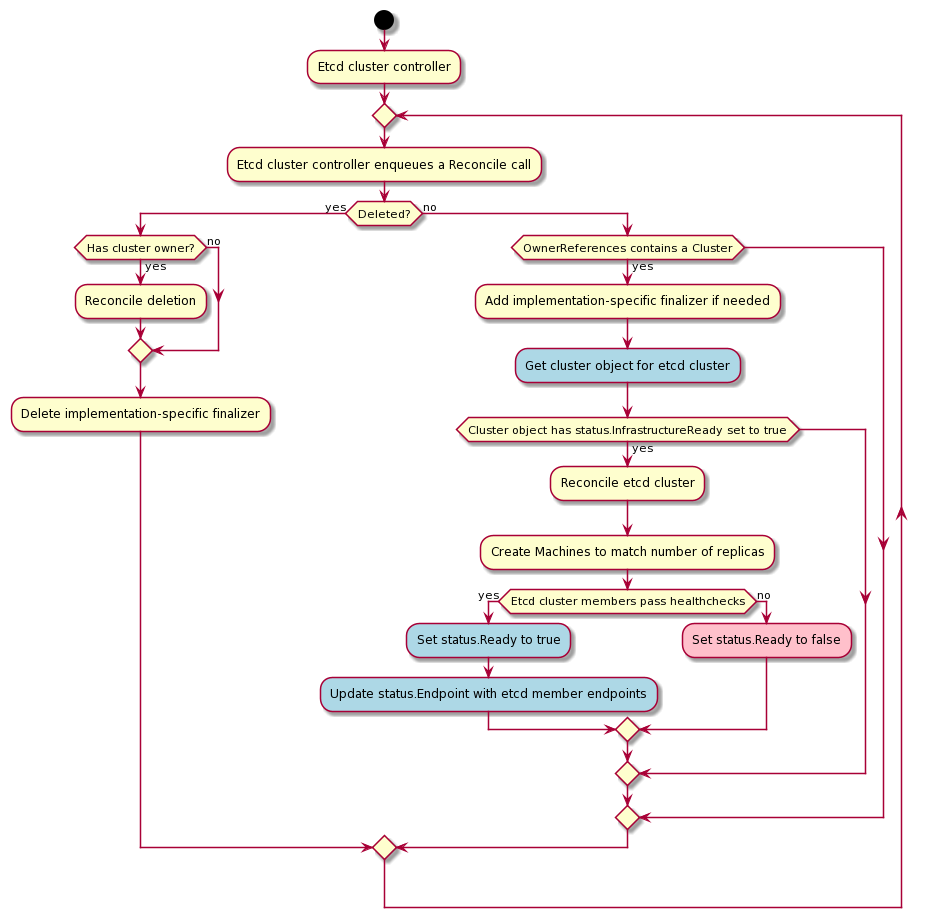
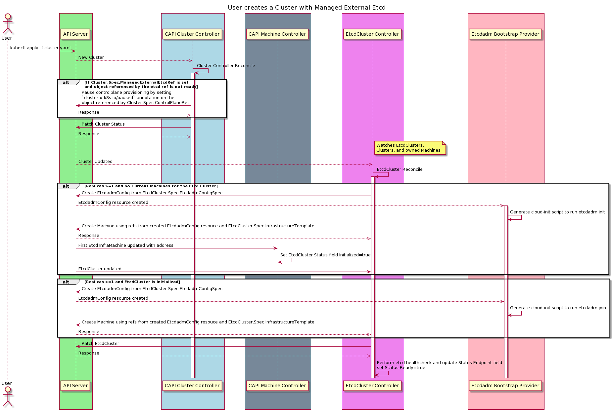

# Add support for managed external etcd clusters in CAPI

## Table of Contents

- [Title](#title)
  - [Table of Contents](#table-of-contents)
  - [Glossary](#glossary)
  - [Summary](#summary)
  - [Motivation](#motivation)
    - [Goals](#goals)
    - [Non-Goals](#non-goals)
  - [Proposal](#proposal)
    - [User Stories](#user-stories)
    - [Implementation Details/Notes/Constraints](#implementation-detailsnotesconstraints)
    - [Future work](#future-work)
    - [POC implementation](#poc-implementation)
    - [Questions](#questions)
    - [Design questions](#design-questions)
    - [Security Model](#security-model)
    - [Risks and Mitigations](#risks-and-mitigations)
  - [Alternatives](#alternatives)
  - [Upgrade Strategy](#upgrade-strategy)
  - [Additional Details](#additional-details)
    - [Test Plan [optional]](#test-plan-optional)
    - [Graduation Criteria [optional]](#graduation-criteria-optional)
    - [Version Skew Strategy [optional]](#version-skew-strategy-optional)
  - [Implementation History](#implementation-history)

## Glossary

### Etcd provider
A provider that creates and manages an etcd cluster to be used by a single workload cluster for the [external etcd topology](https://kubernetes.io/docs/setup/production-environment/tools/kubeadm/ha-topology/#external-etcd-topology).

### Etcdadm based etcd provider
This provider is an implementation of the Etcd provider that uses [etcdadm](https://github.com/kubernetes-sigs/etcdadm) to create and manage an external etcd cluster.

### Etcdadm bootstrap provider
It is responsible for running etcdadm commands on individual Machines to bring up an etcd cluster.

### Etcdadm cluster controller
It accepts the etcd cluster configuration options from the user, such as the cluster size or version, and generates the objects required by the Etcdadm bootstrap provider for etcd cluster creation. It is responsible for managing the etcd cluster lifecycle.

Refer to the [Cluster API Book Glossary](https://cluster-api.sigs.k8s.io/reference/glossary.html).

### Abbreviations:
- CAPI: Cluster API
- KCP: KubeadmControlPlane
- CRD: Custom Resource Definition

## Summary

This proposal aims to extend CAPI to support provisioning and managing of the lifecycle of external etcd clusters. With this, users can create CAPI clusters with the external etcd topology where the etcd cluster is also managed by CAPI.

## Motivation

- Cluster API supports the use of an external etcd cluster, by allowing users to provide their external etcd cluster's endpoints.
So it would be good to add support for provisioning the etcd cluster too, so the user can have a single workflow for full management of a cluster using the external etcd topology. The user can offload the responsibility of managing an external etcd cluster to CAPI.
    
- External etcd topology decouples the control plane and etcd member. So if a control plane-only node fails, or if there's a memory leak in a component like kube-apiserver, it won't directly impact an etcd member.
  
- Etcd is resource intensive, so it is safer to have dedicated nodes for etcd, it could use more disk space, higher bandwidth. Having a separate etcd cluster for these reasons could ensure a more resilient HA setup.

### Goals

- Define a contract for adding pluggable etcd providers
  - Define the responsibilities of an etcd provider, along with the required services and API types it should add.
  - Extend the contract for control plane providers and infrastructure providers in order to properly handle external etcd clusters managed by pluggable etcd providers.
  - User should be able to create and manage a Kubernetes cluster that uses external etcd topology in a declarative way. The CAPI controllers will deploy the etcd cluster first and then use that as input to the workload cluster, without requiring any user intervention.
  - There will be a 1:1 mapping between the external etcd cluster and the workload cluster.
  - An etcd provider should support etcd clusters of any size (odd numbers only), including single member etcd clusters for testing purposes. But the documentation should specify the recommended cluster size for production use cases to range between 3 and 7.
- Provide a first implementation of this pluggable etcd provider using [etcdadm](https://github.com/kubernetes-sigs/etcdadm).
  - The etcdadm based provider will utilize the existing Machine objects to represent etcd members for convenience instead of adding a new machine type for etcd.
  - Support the following etcd cluster management actions: scale up and scale down, etcd member replacement and etcd version upgrades.


### Non-Goals
- The first iteration will use IP addresses/hostnames as etcd cluster endpoints. It can not configure static endpoint(s) till the Load Balancer provider is available.
- API changes such as adding new fields within existing control plane providers. For instance, if a user chooses KubeadmControlPlane provider as the control plane provider, we will utilize the existing external etcd endpoints field from the KubeadmConfigSpec for KCP instead of adding new fields.
- This is not to be used for etcd-as-a-service. The etcd clusters created by an etcd provider within CAPI will only be used by the kube-apiserver of a target workload cluster.
- Etcd cluster snapshots will need its own separate KEP. It should include details about how to take a snapshot, if `etcdctl snapshot save` command is used then how to collect the snapshots from the etcd machines and an integration with a storage provider to save those snapshots. This first iteration will not have a snapshot mechanism implemented. Users can still take snapshots by manually running the `etcdctl snapshot save` command and we can document those steps.

## Proposal

### User Stories

- As an end user, I want to be able to create a Kubernetes cluster that uses external etcd topology using CAPI with a single step.
- On creating the required CRs in CAPI along with the new etcd provider specific CRs, CAPI controllers should provision an etcd cluster, and provide that as input to the workload cluster, without requiring any intervention from me as an end user.
- As an end user, I should be able to use the etcd provider CRs to specify etcd cluster size during creation and specify/modify etcd version. CAPI controllers should modify and manage the etcd clusters accordingly.

### Implementation Details/Notes/Constraints

#### Data Model Changes

The following new type/CRDs will be added for the etcdadm based provider
```go
// API Group: etcd.cluster.x-k8s.io OR etcdplane.cluster.x-k8s.io
type EtcdadmCluster struct {
    metav1.TypeMeta   `json:",inline"`
    metav1.ObjectMeta `json:"metadata,omitempty"`

    Spec   EtcdadmClusterSpec   `json:"spec,omitempty"`
    Status EtcdadmClusterStatus `json:"status,omitempty"`
}

// EtcdadmClusterSpec defines the desired state of EtcdadmCluster
type EtcdadmClusterSpec struct {
    // Replicas is the number of etcd members in the cluster. Defaults to 3 and immutable as really user shouldn't scale up/scale down without reason, since it will affect etcd quorum.
    Replicas *int32 `json:"replicas,omitempty"`

    // InfrastructureTemplate is a required reference to a custom resource
    // offered by an infrastructure provider.
    InfrastructureTemplate corev1.ObjectReference `json:"infrastructureTemplate"`

    // +optional
    EtcdadmConfigSpec etcdbp.EtcdadmConfigSpec `json:"etcdadmConfigSpec"`
}

type EtcdadmClusterStatus struct {
    // Total number of non-terminated machines targeted by this etcd cluster
    // (their labels match the selector).
    // +optional
    ReadyReplicas int32 `json:"replicas,omitempty"`

    // +optional
    InitMachineAddress string `json:"initMachineAddress"`

    // +optional
    Initialized bool `json:"initialized"`

    // +optional
    CreationComplete bool `json:"ready"`

    // +optional
    Endpoints string `json:"endpoints"`

    // +optional
    Selector string `json:"selector,omitempty"`

    Conditions clusterv1.Conditions `json:"conditions,omitempty"`
}

// conditions for the EtcdadmCluster object
const (
  // MachinesReadyCondition reports an aggregate of current status of the machines controlled by the EtcdadmCluster.
  MachinesReadyCondition clusterv1.ConditionType = "MachinesReady"

  // EtcdCACertificatesAvailableCondition documents that cluster certificates were generated by the controller processing the EtcdadmCluster object.
  EtcdCACertificatesAvailableCondition clusterv1.ConditionType = "EtcdCACertificatesAvailable"

  // EtcdInitializedCondition gets set to true when the first member of the etcd cluster is running
  EtcdInitializedCondition clusterv1.ConditionType = "EtcdInitialized"

  // EtcdReadyCondition is true when all etcd members are ready and healthy
  EtcdReadyCondition clusterv1.ConditionType = "EtcdReady"
)

// API Group: bootstrap.cluster.x-k8s.io
type EtcdadmConfig struct {
    metav1.TypeMeta   `json:",inline"`
    metav1.ObjectMeta `json:"metadata,omitempty"`
    
    Spec   EtcdadmConfigSpec   `json:"spec,omitempty"`
    Status EtcdadmConfigStatus `json:"status,omitempty"`
}

type EtcdadmConfigSpec struct {
    // +optional
    Version string `json:"version,omitempty"`

    // +optional
    EtcdadmArgs map[string]interface{} `json:"etcdadmArgs,omitempty"`

    // Users specifies extra users to add
    // We can reuse the User type added for Kubeadm bootstrap provider
    // +optional
    Users []capbk.User `json:"users,omitempty"`

    // PreEtcdadmCommands specifies extra commands to run before etcdadm runs
    // +optional
    PreEtcdadmCommands []string `json:"preEtcdadmCommands,omitempty"`

    // PostEtcdadmCommands specifies extra commands to run after etcdadm runs
    // +optional
    PostEtcdadmCommands []string `json:"postEtcdadmCommands,omitempty"`
}


type EtcdadmConfigStatus struct {
    DataSecretName *string `json:"dataSecretName,omitempty"`

    Ready bool `json:"ready,omitempty"`

    Conditions clusterv1.Conditions `json:"conditions,omitempty"`
}

// conditions for the EtcdadmConfig object
const (
  // DataSecretAvailableCondition indicates if the Secret containing the cloud-init script has been created or not.
  DataSecretAvailableCondition clusterv1.ConditionType = "DataSecretAvailable"
)
```

The following fields will be added on existing CAPI types:
- Add Cluster.Spec.ManagedExternalEtcdRef as:
```go
// ManagedExternalEtcdRef is an optional reference to an etcd provider resource that holds details
// for provisioning an external etcd cluster
// +optional
ManagedExternalEtcdRef *corev1.ObjectReference `json:"managedExternalEtcdRef,omitempty"`
```
- Add Cluster.Status.ManagedExternalEtcdProvisioned field as:
```go
// ManagedExternalEtcdProvisioned indicates external etcd cluster is fully provisioned
// +optional
ManagedExternalEtcdProvisioned bool `json:"managedExternalEtcdProvisioned"`
```
- Add Cluster.Status.ManagedExternalEtcdInitialized field as:
```go
// ManagedExternalEtcdInitialized indicates external etcd cluster is initialized, the first member has been created
// +optional
ManagedExternalEtcdInitialized bool `json:"managedExternalEtcdInitialized"`
```

The following is a change proposed in the current validating webhook for KCP:
- Make KubeadmConfigSpec.ClusterConfiguration.Etcd.External.Endpoints field mutable
    - The kubeadm validating webhook currently doesn't allow this field to get updated. It should be added as an [allowed path](https://github.com/mrajashree/cluster-api/commit/18c42c47d024ce17cdda39500fc0d6bd67c5aa67#diff-6603d336435f3ee62a50043413f62441b685d5c416e5cadd792ed2a536b2f55fR121) in the webhook.
    - The main reason being that in case of a managed external etcd cluster, the user won't know the etcd endpoints when the KCP spec. The etcd provider will populate the KCP spec with the etcd cluster endpoints once it is available. Hence the field should be mutable so that the etcd provider can update it.
    - Even though this is a change in an existing field's behavior, existing clusters that were created before this change goes in can utilize it for etcd cluster reconfiguration. For instance, let's assume that a cluster was created before this new etcd provider existed, and that cluster was using an external etcd cluster that the user was managing. If the user has to replace one of the etcd member VMs, the user can do so and update the KCP spec to include the new endpoint. That will trigger a control plane rollout and the kube-apiserver on the new Machines will be able to connect to the new external etcd endpoints.


#### Implementation details

##### Contract for pluggable etcd providers
This section defines a contract for an etcd provider. Any etcd provider being added should follow this contract. We are starting by adding an etcdadm based provider, but it is possible that later someone wants to add a new provider that uses something else to bring up etcd. Hence we will design it in a way that's pluggable.

###### An etcd provider's main responsibilities are:

* Managing a set of Machines that represent an etcd member.
* Managing the etcd cluster, in terms of scaling up/down/upgrading etcd version, and running healthchecks.
* Populating and updating a field that will contain the etcd cluster endpoints (IP addresses of all etcd members). 
* Creating/managing two Kubernetes Secrets that will contain certs required by the API server to communicate with the etcd cluster
    * One Secret containing the etcd CA cert, by the name `{cluster.Name}-etcd`
    * One Secret containing the API server cert-key pair, by the name `{cluster.Name}-apiserver-etcd-client`

###### Required services:
The etcd provider should install etcd with the version specified by the user for each member.

###### Required fields:
Each etcd provider should add a new API type to manage the etcd cluster lifecycle, and it should have the following required fields:
- Spec:
    - Replicas: Allow only odd numbers, and immutable after creation.
- Status
    - CreationComplete: To be set to true once all etcd members pass healthcheck after initial cluster creation.
    - Endpoints: A comma separated string containing all etcd members endpoints.

###### Contract between etcd provider and control plane provider
- Control plane providers should check for the presence of the paused annotation (`cluster.x-k8s.io/paused`), and not continue provisioning if it is set. Out of the existing control plane provider, the KubeadmControlPlane controller does that.
- Control plane providers should check for the presence of `Cluster.Spec.ManagedExternalEtcdRef` field. This check should happen after the control plane is no longer paused, and before the provider starts provisioning the control plane.
- The control plane provider should "Get" the CR referred by the cluster.spec.ManagedExternalEtcdRef and check its status.Endpoints field. 
  - This field will be a comma separated list of etcd endpoints. 
  - It will parse the endpoints from this field and use these endpoints as the external etcd endpoints where applicable. For instance, the KCP controller will read the status.Endpoints field and parse it into a string slice, and then use it as the [external etcd endpoints](https://github.com/kubernetes-sigs/cluster-api/blob/master/bootstrap/kubeadm/api/v1alpha4/kubeadm_types.go#L269).
- The control plane provider will read the etcd CA cert, and the client cert-key pair from the two Kubernetes Secrets named `{cluster.Name}-apiserver-etcd-client` and `{cluster.Name}-etcd`. The KCP controller currently does that.

###### Contract between etcd provider and infrastructure provider
- Each etcd member requires port 2379 for client communication and port 2380 for peer communication.
- In case of the infrastructure providers that use security groups, either the infrastructure provider may add a new security group specifically for etcd members, or document that the user needs to create a security group allowing these two ports and use that for the etcd machines.


---


##### Etcdadm based etcd provider

This section explains how we can use the existing [etcdadm](https://github.com/kubernetes-sigs/etcdadm) project to add an implementation of the etcd provider defined above. One of the goals mentioned in the [etcdadm project roadmap](https://github.com/kubernetes-sigs/etcdadm/blob/master/ROADMAP.md) is to integrate it with CAPI to support the "external etcd" use case.
This provider has two main components:

##### Etcdadm bootstrap provider

The Etcdadm bootstrap provider will convert a Machine to an etcd member by running `etcdadm` commands on it. When using the `etcdadm` CLI, the two main steps in etcd cluster creation are:
- Choosing any one of the machines and running `etcdadm init` on it to create a single node etcd cluster.
- Running `etcdadm join <first member's endpoint>` on the remaining machines to add them to the cluster created in the first step. This requires the CA certs to be present at an expected path on the machines.

This bootstrap provider will perform the steps specified above using a custom controller that processes the EtcdadmConfig CRs. This controller is similar in design to the Kubeadm bootstrap provider controller. It follows the contract defined for [bootstrap providers](https://cluster-api.sigs.k8s.io/developer/providers/bootstrap.html#behavior). It performs the following actions upon receiving an EtcdadmConfig CR from the Workqueue:
  - Each EtcdadmConfig object has a 1:1 mapping to the Machine object. The controller will get the owning Machine for the EtcdadmConfig object being processed. (The next section explains how the [Etcdadm cluster controller](#etcdadm-cluster-controller)) creates this association between an EtcdadmConfig and a Machine object).
  - The controller then gets the Cluster object from the Machine.
    - If the Cluster does not have the `ManagedExternalEtcdInitialized` condition set to true, the controller will choose this Machine to run the `etcdadm init` command.
    - If the etcd cluster is initialized, meaning the `ManagedExternalEtcdInitialized` condition is true, the controller will make this Machine run the `etcdadm join` command.
  - For each Machine, the controller will lookup a Secret by the name `{Cluster.Name}-managed-etcd` to get the CA cert-key for the external etcd cluster. (The next section explains how the etcdadm cluster controller generates this Secret).
  - To add the certs to the required path on the Machines and run the required etcdadm commands, the controller will generate [cloud-init](https://cloudinit.readthedocs.io/) data for each member containing:
    - A [`write_files` section](https://cloudinit.readthedocs.io/en/latest/topics/modules.html#write-files) to write the CA cert-key pair at `etc/etcd/pki` path on each Machine.
    - A [`runcmd` section](https://cloudinit.readthedocs.io/en/latest/topics/modules.html#runcmd) containing the etcdadm commands, along with any user specified commands.
  The controller then saves this cloud-init script as a Secret, and this Secret's name on the EtcdadmConfig.Status.DataSecretName field.
  - Since the EtcdadmConfig.Status.DataSecretName field gets set as per the [bootstrap provider specifications](https://cluster-api.sigs.k8s.io/developer/providers/bootstrap.html), the infrastructure providers will use the data from this Secret to initiate the Machines with the cloud-init script.
  
##### Etcdadm cluster controller

- The Etcdadm cluster controller will manage the external etcd cluster through a new API type called EtcdadmCluster. This CRD will accept etcd cluster spec, which includes replicas, etcd configuration options such as version, and an infrastructure template reference. This controller will create EtcdadmConfig CRs with the user specified spec to match the number of replicas.
- This controller is responsible for provisioning the etcd cluster, and signaling the control plane cluster once etcd is ready.
- [These are the changes required in CAPI](https://github.com/mrajashree/cluster-api/commit/18c42c47d024ce17cdda39500fc0d6bd67c5aa67#diff-626ff994de7814a6e127010bda83fd45dddd14893839ceb4d3d40210a49132f2) for the end to end flow to work

###### Create use case

- After an EtcdadmCluster object is created, it must bootstrap an etcd cluster with a given number of replicas.
- EtcdadmCluster.Spec.Replicas must be an odd number. Ideally between 3 and 7 for production use cases. But for test/dev setups, a single member can be used by setting Replicas to 1.
- Creating an EtcdadmCluster with > 1 replicas is equivalent to creating an EtcdadmCluster with 1 replica followed by scaling up the EtcdadmCluster to the desired number of replicas.
- This is the end-to-end flow of creating a cluster using managed external etcd upon applying the following manifest (left out the DockerMachineTemplate resources since nothing will change there):

```yaml
apiVersion: cluster.x-k8s.io/v1alpha4
kind: Cluster
metadata:
  name: "my-cluster"
  namespace: "default"
spec:
  clusterNetwork:
    services:
      cidrBlocks: ["10.128.0.0/12"]
    pods:
      cidrBlocks: ["192.168.0.0/16"]
    serviceDomain: "cluster.local"
  infrastructureRef:
    apiVersion: infrastructure.cluster.x-k8s.io/v1alpha4
    kind: DockerCluster
    name: "my-cluster"
    namespace: "default"
  controlPlaneRef:
    kind: KubeadmControlPlane
    apiVersion: controlplane.cluster.x-k8s.io/v1alpha4
    name: "my-cluster-control-plane"
    namespace: "default"
  managedExternalEtcdRef:
    kind: EtcdadmCluster
    apiVersion: etcd.cluster.x-k8s.io/v1alpha4
    name: "my-cluster-etcd-cluster"
    namespace: "default"
---
kind: EtcdadmCluster
apiVersion: etcd.cluster.x-k8s.io/v1alpha4
metadata:
  name: "my-cluster-etcd-cluster"
  namespace: default
spec:
  etcdadmConfigSpec:
    version: 3.4.13 #optional
    # etcdadmArgs:
    # users:
  replicas: 3
  infrastructureTemplate:
    kind: DockerMachineTemplate
    apiVersion: infrastructure.cluster.x-k8s.io/v1alpha4
    name: "etcd-plane"
    namespace: "default"
---
apiVersion: infrastructure.cluster.x-k8s.io/v1alpha4
kind: DockerCluster
metadata:
  name: "my-cluster"
  namespace: "default"
---
kind: KubeadmControlPlane
apiVersion: controlplane.cluster.x-k8s.io/v1alpha4
metadata:
  name: "abcd-control-plane"
  namespace: "default"
spec:
  replicas: 3
  infrastructureTemplate:
    kind: DockerMachineTemplate
    apiVersion: infrastructure.cluster.x-k8s.io/v1alpha4
    name: "abcd-control-plane"
    namespace: "default"
  kubeadmConfigSpec:
    clusterConfiguration:
      controllerManager:
        extraArgs: {enable-hostpath-provisioner: 'true'}
      apiServer:
        certSANs: [localhost, 127.0.0.1]
      etcd:
        external:
          endpoints: []
          caFile: "/etc/kubernetes/pki/etcd/ca.crt"
          certFile: "/etc/kubernetes/pki/apiserver-etcd-client.crt"
          keyFile: "/etc/kubernetes/pki/apiserver-etcd-client.key"
    initConfiguration:
      nodeRegistration:
        criSocket: /var/run/containerd/containerd.sock
        kubeletExtraArgs: {eviction-hard: 'nodefs.available<0%,nodefs.inodesFree<0%,imagefs.available<0%'}
    joinConfiguration:
      nodeRegistration:
        criSocket: /var/run/containerd/containerd.sock
        kubeletExtraArgs: {eviction-hard: 'nodefs.available<0%,nodefs.inodesFree<0%,imagefs.available<0%'}
  version: "v1.20.2"
```



- Cluster.Spec will have a new field `ManagedExternalEtcdRef` of type `ObjectReference` (same as `ControlPlaneRef`). For using CAPI managed etcd cluster, user will set this field in Cluster manifest as shown above.
- Cluster controller's `reconcileControlPlane` will check if `managedExternalEtcdRef` is set on cluster spec and if External etcd cluster does not have `CreationComplete` set to true, it will pause the control plane provisioning by setting clusterv1.Paused annotation (`cluster.x-k8s.io/paused`) on it. This will allow etcd cluster provisioning to occur first.
- Etcdadm cluster controller will generate a CA cert-key pair to be used for all etcd members. This external etcd CA will be saved in a Secret with name `{cluster.Name}-managed-etcd`. We can use the existing util/secret pkg in CAPI for this and add a new [Purpose](https://github.com/mrajashree/cluster-api/blob/etcdadm_bootstrap/util/secret/consts.go#L50) for managed etcd.
- The external etcd controller will also save the etcd CA cert, and the apiserver client cert-key pair in Secrets named `{cluster.Name}-etcd` and `{cluster.Name}-apiserver-etcd-client` respectively.
- Then the controller will first initialize etcd cluster by creating one EtcdadmConfig and a corresponding Machine resource. 
- The CAPI [machine controller](https://github.com/mrajashree/cluster-api/blob/etcdadm_bootstrap/controllers/machine_controller_phases.go#L322-L378) gets the machine's IP address/hostname from the InfraMachine, and as soon as the first etcd machine's IP is obtained, it will create a Secret to store this address, and set the `Initialized` condition on the EtcdadmCluster object. This step is required because etcdadm join command must have the first node's client URL.
- Once the EtcdadmCluster is Initialized, the etcd cluster controller will scale up the cluster to add as many members as required to match EtcdadmCluster.Spec.Replicas field
- At the end of every reconciliation loop, the etcd cluster controller will check if desired number of members are created by
    * Getting Machines owned by EtcdadmCluster
    * Running healthcheck for each Machine with the etcd `/health` endpoint at `https://client-url:2379/health`
- Once all members are ready, EtcdadmCluster will set the endpoints on EtcdadmCluster.Status.Endpoints field, and set EtcdadmCluster.Status.CreationComplete to true
- The CAPI cluster controller will have a new `reconcileEtcdCluster` function, that will check if EtcdadmCluster is ready, and when it is ready it will resume the control plane by deleting the "paused" annotation.
- The control plane controller starts provisioning once it is no longer paused. It will first check if the Cluster spec contains the managedExternalEtcd ref. If the reference exists, it will get the endpoint from the referred etcdCluster object's status field. It will then start the provisioning of the control plane cluster using this etcd cluster.

###### Upgrade or member replacement use case

- The EtcdadmCluster.Spec.Replicas field will be immutable. This is to protect the etcd cluster from losing quorum by unnecessarily adding/removing healthy members.
- An etcd member will need to be replaced by the etcd controller in two cases:
  - Member is found unhealthy
  - During an upgrade
- While replacing an unhealthy etcd member, it is important to first remove the member and only then replace it by adding a new one. This ensures the cluster stays stable. [This Etcd doc](https://etcd.io/docs/v3.4/faq/#should-i-add-a-member-before-removing-an-unhealthy-member) explains why removing an unhealthy member is important in depth. Etcd's latest versions allow adding new members as learners so it doesn't affect the quorum size, but that feature is in beta. Also, adding a learner is a two-step process, where you first add a member as learner and then promote it, and etcdadm currently doesn't support it. So we can include this in a later version once the learner feature becomes GA and etcdadm incorporates the required changes.
- We can reuse this same "scale down" function when removing a healthy member during an etcd upgrade. So even upgrade will follow the same pattern of removing the member first and then adding a new one with the latest spec.
- Once the upgrade/machine replacement is completed, the etcd controller will again update the EtcdadmCluster.Status.Endpoints field. The control plane controller will rollout new Machines that use the updated etcd endpoints for the apiserver.

###### Periodic etcd member healthchecks
- The etcdadm cluster controller will perform healthchecks on the etcd members periodically at a predetermined interval. The controller will perform client healthchecks by making HTTP Get requests to the `<etcd member address>:2379/health` endpoint of each etcd member. It cannot perform peer-to-peer healthchecks since the controller is external to the etcd cluster and there won't be any agents running on the etcd members.
- If a member continuously fails healthcheck for a certain amount of time, the etcdadm cluster controller will replace that member with a new member.

#### Changes needed in docker machine controller
- Each machine infrastructure provider sets a providerID on every InfraMachine.
- Infrastructure providers like CAPA and CAPV set this provider ID based on the instance metadata.
- CAPD on the other hand first calls `kubectl patch` to add the provider ID on the node. And only then it sets the provider ID value on the DockerMachine resource. But the problem is that in case of an etcd only cluster, the machine is not registered as a Kubernetes node. Cluster provisioning does not progress until this provider ID is set on the Machine. As a solution, CAPD will check if the bootstrap provider is etcdadm, and skip the kubectl patch process and set the provider ID on DockerMachine directly. These changes are required in the [docker machine controller](https://github.com/mrajashree/cluster-api/pull/2/files#diff-1923dd8291a9406e3c144763f526bd9797a2449a030f5768178b8d06d13c795bR307) for CAPD.

#### Clusterctl changes
- External etcd topology is optional so it won't be enabled by default. Users should be able to install it through `clusterctl init` when needed. This requires the following changes in clusterctl
- New ProviderTypes
```go
EtcdBootstrapProviderType = ProviderType("EtcdBootstrapProvider")
EtcdProvider = ProviderType("EtcdProvider")
```
The Etcdadm based provider requires two separate provider types, other etcd providers that get added later on might not require two separate providers, so they can utilize just the EtcdProvider type.
With these changes, user should be able to install the etcd provider by running
```
clusterctl init --etcdbootstrap etcdadm-bootstrap-provider --etcdprovider etcdadm-controller
```
- CAPI's default `Providers` list defined [here](https://github.com/kubernetes-sigs/cluster-api/blob/master/cmd/clusterctl/client/config/providers_client.go#L95) will be updated to add manifests for the Etcdadm bootstrap provider and controller.

#### Future work

##### Static Etcd endpoints
- If any VMs running an etcd member get replaced, the kube-apiserver will have to be reconfigured to use the new etcd cluster endpoints. We can avoid this by using static endpoints for the external etcd cluster. There are two ways of configuring static endpoints, using a load balancer or configuring DNS records.
- Load balancer can add latency because of the hops associated with routing requests, whereas DNS records will directly resolve to the etcd members.
- Instead of configuring a single DNS record for all etcd members, we can configure multiple DNS records, one per etcd member to leverage [etcd client's balancer](https://etcd.io/docs/v3.4/learning/design-client/#clientv3-grpc10-balancer-overview). The DNS records can be configured such that each etcd member gets a separate sub-domain, under the domain associated with the etcd cluster. An example of this when using ec2 would be:
    - User creates a hosted zone called `external.etcd.cluster` and gives that as input to a field `EtcdadmCluster.Spec.HostedZoneName`.
    - The EtcdadmCluster controller creates a separate A record name within that hosted zone for each EtcdadmConfig it creates. The DNS controller will create the route53 A record once the corresponding Machine's IP address is set
- A suggestion from a CAPI meeting is to add a DNS configuration implementation in the [load balancer proposal](https://github.com/kubernetes-sigs/cluster-api/pull/4389). In the CAPI meeting on April 28th we decided to implement phase 1 with IP addresses in the absence of the load balancer provider.

##### Member replacement by adding a new member as learner
- Etcd allows adding a new member as a [learner](https://etcd.io/docs/v3.3/learning/learner/). This is useful when adding a new etcd member to the cluster, so that it doesn't increase the quorum size, and the learner gets enough time to catch up with the data from the leader.
- This is a two step process, where you first add a member by calling `member add --learner`, and by promoting the learner to a follower once it has caught up calling `member promote`. 
- This feature in etcd is currently beta. And etcdadm does not support this two step member add process in its current version.
- Once etcdadm makes changes to add members as learners, and the learner feature becomes stable, we can look into changing the upgrade logic to add members as learners first.

##### Peer-to-peer healthchecks
- Performing peer-to-peer healthchecks for the etcd cluster members will be possible when CAPI can run node agents on each Machine representing an etcd member.


### POC implementation
- [etcdadm-bootstrap-provider](https://github.com/mrajashree/etcdadm-bootstrap-provider)
- [etcdadm-controller](https://github.com/mrajashree/etcdadm-controller)
- [CAPI changes](https://github.com/mrajashree/cluster-api/commit/18c42c47d024ce17cdda39500fc0d6bd67c5aa67)

### Questions

- This proposal suggests that etcd providers should be pluggable, in case someone might add a new etcd provider that uses something other than etcdadm to bring up a cluster. Also the pluggable etcd provider can be used by any control plane provider. However if we don't see the need of additional etcd providers, or any control plane providers other than KCP that will utilize external etcd, we can decide to make it specific to KCP for the first iteration.
- Should the machines making the external etcd be registered as a  Kubernetes node or not?
    - So far the assumption is that the external etcd cluster will only run etcd and no other kubernetes components, but are there use cases that will need these machines to also register as a kubernetes node?
    - To clarify, if we have use cases where we need certain helper processes to run on these etcd nodes, we can do it with kubelet + static pod manifests.
- Images: Will CAPI make new image for external etcd nodes, or embed etcdadm release in current image and use it for all nodes


### Security Model

* Does this proposal implement security controls or require the need to do so?

    - Kubernetes RBAC
      - The etcdadm bootstrap provider controller needs following permissions:
     
        | Resource | Permissions
        | -------- | -------- 
        | EtcdadmConfig     | `*` 
        | Cluster | get,list,watch
        | Machine | get,list,watch
        | ConfigMap | `*`
        | Secret | `*`
        | Event | `*`


      - The etcdadm cluster controller needs following permissions:
      
        | Resource | Permissions
        | -------- | -------- 
        | EtcdadmCluster     | `*`
        | EtcdadmConfig | `*`
        | Cluster | get,list,watch
        | Machine | `*`
        | ConfigMap | `*`
        | Secret | `*`
        | Event | `*`

      - CAPI controller manager clusterRole needs `get,list,watch` access to CRDs under `etcdcluster.cluster.x-k8s.io` apiGroup.

    - Security Groups
        - Etcd nodes need to have ports 2379 and 2380 open for incoming client and peer requests

* Is any sensitive data being stored in a secret, and only exists for as long as necessary?
  
  - The CA cert key pair for Etcd will be stored in a Secret. There will be another separate Secret containing only the Etcd CA cert and client cert-key pair for the apiserver to use.

### Risks and Mitigations

- What are the risks of this proposal and how do we mitigate? Think broadly.
- How will UX be reviewed and by whom?
- How will security be reviewed and by whom?
- Consider including folks that also work outside the SIG or subproject.

## Alternatives

- Although this proposal is for adding an implementation of the etcd provider that uses etcdadm, other projects/tools can also be used for creating etcd clusters. We can also add new implementations following the etcd provider contract for such projects.
- There are ongoing efforts as per this [KEP](https://github.com/kubernetes/enhancements/tree/master/keps/sig-cluster-lifecycle/etcdadm/2496-etcdadm) to rebase etcd-manager onto etcdadm. [Etcd-manager](https://github.com/kopeio/etcd-manager) is used in kOps clusters. Along with provisioning etcd clusters, it provides cluster management features such as scaling up, periodic healthchecks, upgrades. But the etcd-manager does not interact with CAPI, and its rebase on etcdadm isn't completed. Hence it cannot be used as is with the proposed etcdadm bootstrap provider. So as the design and implementation of the new etcdadm cluster controller progresses, we can pick up things from etcd-manager that can be reused in the proposed etcdadm cluster controller.

## Upgrade Strategy

The external etcd cluster's etcd version can be upgraded through the etcdadmConfigSpec.Version field. There are other etcd configuration options that etcdadm allows which can be modified through the etcdadmConfigSpec.EtcdadmArgs field.
The etcdadm provider will use rollingUpdate strategy to upgrade etcd members. The rollingUpdate parameters will not be configurable as adding/removing machines more than one at a time will affect etcd quorum, and this way the controller can control the upgrade fully.
- The etcd controller will get all owned Machines which differ in spec from the current EtcdadmConfigSpec and add them to a NeedsRollout pool
- The controller will first scale down and remove one of the etcd members. So for a 3-node cluster, quorum size is 2, and even on removing the 3rd member the quorum size stays the same.
- Then it will scale up to match replicas value (3 by default). During scale up, the new machines will get created with the updated etcdadmConfigSpec. During scale up, the machine will run `etcdadm join` which calls the etcd `add member` API, and then waits for the member to be active by retrieving a test key. This ensures that the new member is successfully added to the cluster before moving on with the rest of the nodes.


## Additional Details

### Test Plan [optional]

TBD

### Graduation Criteria [optional]

TBD

### Version Skew Strategy [optional]

TBD

## Implementation History

- [x] 03/24/2021: Proposed idea in the CAPI weekly office hours meeting
- [x] 03/31/2021: Compile a hackmd following the CAEP template
- [x] 04/06/2021: First round of feedback from community
- [x] 04/21/2021: Shared proposal after addressing feedback at CAPI weekly office hours
- [x] 04/28/2021: Gave a demo of the POC for etcdadm cluster controller + bootstrap provider end-to-end flow in CAPI weekly office hours
- [x] 05/24/2021: Open proposal PR

<!-- Links -->
[community meeting]: https://docs.google.com/document/d/1Ys-DOR5UsgbMEeciuG0HOgDQc8kZsaWIWJeKJ1-UfbY
