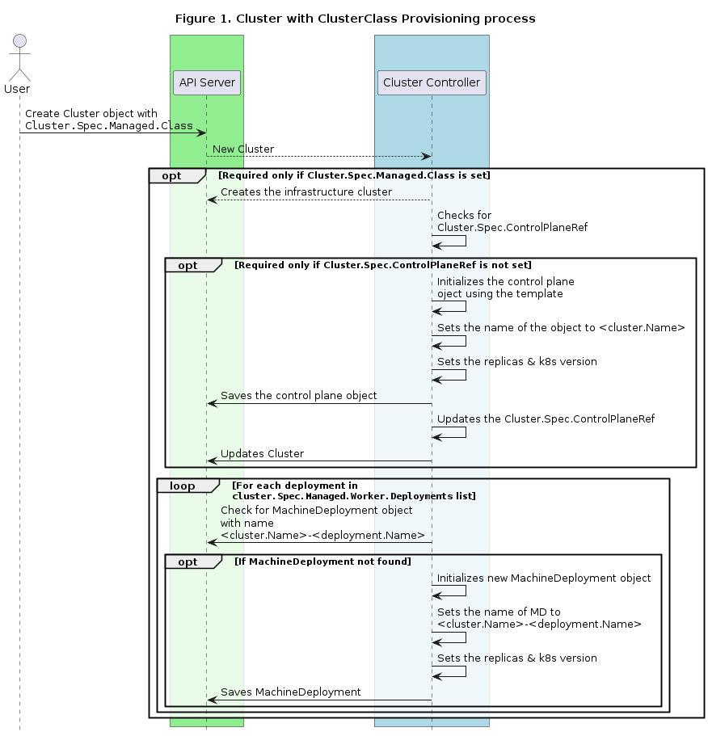
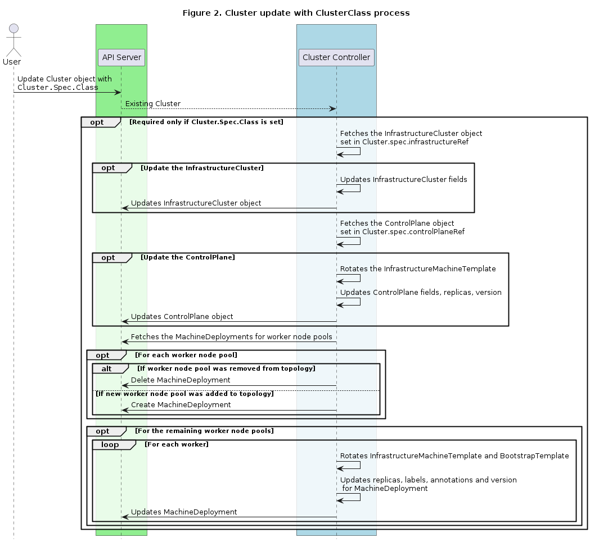

# ClusterClass and Managed Topologies

## Table of Contents

- [ClusterClass and Managed Topologies](#clusterclass-and-managed-topologies)
  - [Table of Contents](#table-of-contents)
  - [Glossary](#glossary)
      - [ClusterClass](#clusterclass)
      - [Topology](#topology)
      - [Worker class](#workerclass)
  - [Summary](#summary)
  - [Motivation](#motivation)
      - [Goals](#goals)
      - [Prospective future Work](#prospective-future-work)
  - [Proposal](#proposal)
      - [User Stories](#user-stories)
        - [Story 1 - Use ClusterClass to easily stamp clusters](#story-1---use-clusterclass-to-easily-stamp-clusters)
        - [Story 2 - Easier UX for kubernetes version upgrades](#story-2---easier-ux-for-kubernetes-version-upgrades)
        - [Story 3 - Easier UX for scaling workers nodes](#story-3---easier-ux-for-scaling-workers-nodes)
        - [Story 4 - Ability to customize individual clusters](#story-4---use-clusterclass-to-easily-modify-clusters-in-bulk)
        - [Story 5 - Provide powerful and flexible options to define ClusterClass customizations](#story-5---ability-to-define-clusterclass-customizations)
        - [Story 6 - Ability to customize individual Clusters via variables](#story-6---ability-to-customize-individual-clusters-via-variables)
        - [Story 7 - Ability to mutate variables](#story-7---ability-to-mutate-variables)

        - [Implementation Details/Notes/Constraints](#implementation-detailsnotesconstraints)
        - [New API types](#new-api-types)
            - [ClusterClass](#clusterclass-1)
        - [Modification to existing API Types](#modification-to-existing-api-types)
            - [Cluster](#cluster)
        - [Builtin variables](#builtin-variables)
        - [Validations](#validations)
            - [ClusterClass](#clusterclass-2)
            - [Cluster](#cluster-1)
        - [ClusterClass compatibility](#clusterclass-compatibility)
        - [Basic behaviors](#basic-behaviors)
            - [Create a new Cluster using ClusterClass object](#create-a-new-cluster-using-clusterclass-object)
            - [Update an existing Cluster using ClusterClass](#update-an-existing-cluster-using-clusterclass)
        - [Behavior with patches](#behavior-with-patches)
            - [Create a new ClusterClass with patches](#create-a-new-clusterclass-with-patches)
            - [Create a new Cluster with patches](#create-a-new-cluster-with-patches)
        - [Provider implementation](#provider-implementation)
        - [Conventions for template types implementation](#conventions-for-template-types-implementation)
        - [Notes on template <-> object reconciliation](#notes-on-template---object-reconciliation)
      - [Risks and Mitigations](#risks-and-mitigations)
  - [Alternatives](#alternatives)
  - [Upgrade Strategy](#upgrade-strategy)
  - [Additional Details](#additional-details)
      - [Test Plan [optional]](#test-plan-optional)
      - [Graduation Criteria [optional]](#graduation-criteria-optional)
  - [Implementation History](#implementation-history)

## Glossary

### ClusterClass
A collection of templates that define a topology (control plane and machine deployments) to be used to continuously reconcile one or more Clusters.

### Topology
A topology refers to a Cluster that provides a single control point to manage its own topology; the topology is defined by a ClusterClass.

### WorkerClass
A collection of templates that define a set of worker nodes in the cluster. A ClusterClass contains zero or more WorkerClass definitions.


## Summary

This proposal introduces a new ClusterClass object which will be used to provide easy stamping of clusters of similar shapes. It serves as a collection of template resources which are used to generate one or more clusters of the same flavor.

We're enhancing the Cluster CRD and controller to use a ClusterClass resource to provision the underlying objects that compose a cluster. Additionally, the Cluster provides a single control point to manage the Kubernetes version, worker pools, labels, replicas, and so on.

## Motivation

Currently, Cluster API does not expose a native way to provision multiple clusters of the same configuration. The ClusterClass object is supposed to act as a collection of template references which can be used to create managed topologies.

Today, the Cluster object is a logical grouping of components which describe an underlying cluster. The user experience to create a cluster requires the user to create a bunch of underlying resources such as KCP (control plane provider), MachineDeployments, and infrastructure or bootstrap templates for those resources which logically end up representing the cluster. Since the cluster configuration is spread around multiple components, upgrading the cluster version is hard as it requires changes to different fields in different resources to perform an upgrade. The ClusterClass object aims at reducing this complexity by delegating the responsibility of lifecycle managing these underlying resources to the Cluster controller.

This method of provisioning the cluster would act as a single control point for the entire cluster. Scaling the nodes, adding/removing sets of worker nodes and upgrading cluster kubernetes versions would be achievable by editing the topology. This would facilitate the maintenance of existing clusters as well as ease the creation of newer clusters.

### Goals

- Create the new ClusterClass CRD which can serve as a collection of templates to create clusters.
- Extend the Cluster object to use ClusterClass for creating managed topologies.
- Enhance the Cluster object to act as a single point of control for the topology.
- Extend the Cluster controller to create/update/delete managed topologies (this includes continuous reconciliation of the topology managed resources).
- Introduce mechanisms to allow Cluster-specific customizations of a ClusterClass 

### Prospective future Work

⚠️ The following points are mostly ideas and can change at any given time  ⚠️

We are fully aware that in order to exploit the potential of ClusterClass and managed topologies, the following class of problems still needs to be addressed:
- **Upgrade/rollback strategy**: Implement a strategy to upgrade and rollback the managed topologies.
- **Extensibility/Transformation**:
    - Extend ClusterClass patch variables by introducing support for complex types (e.g. object, array, map, type composition (e.g. int or string)).
    - Provide an external mechanism which allows to leverage the full power of a programming language to implement more complex customizations.
- **Adoption**: Providing a way to convert existing clusters into managed topologies.
- **Observability**: Build an SDK and enhance the Cluster object status to surface a summary of the status of the topology.
- **Lifecycle integrations**: Extend ClusterClass to include lifecycle management integrations such as MachineHealthCheck and Cluster Autoscaler to manage the state and health of the managed topologies.

However we are intentionally leaving them out from this initial iteration for the following reasons:
- We want the community to reach a consensus on cornerstone elements of the design before iterating on additional features.
- We want to enable starting the implementation of the required scaffolding and the initial support for managed topologies as soon as possible, so we can surface problems which are not easy to identify at this stage of the proposal.
- We would like the community to rally in defining use cases for the advanced features, help in prioritizing them, so we can chart a more effective roadmap for the next steps.

## Proposal

This proposal enhances the `Cluster` object to create topologies using the `ClusterClass` object.

### User Stories

#### Story 1 - Use ClusterClass to easily stamp Clusters
As a cluster operator, I want to use one `ClusterClass` to create multiple topologies of similar flavor.
- Rather than recreating the KCP and MD objects for every cluster that needs to be provisioned, the cluster operator can create a template once and reuse it to create multiple Clusters with similar configurations.

#### Story 2 - Easier UX for Kubernetes version upgrades
For a cluster operator, the UX to update the Kubernetes version of the control plane and worker nodes in the cluster should be easy.
- Instead of individually modifying the KCP and each MachineDeployment, updating a single option should result in k8s version updates for all the CP and worker nodes.

**Note**: In order to complete the user story for all the providers, some of the advanced features (such as Extensibility/Transformation) are required. However, getting this in place even only for a subset of providers allows us to build and test a big chunk of the entire machinery.

#### Story 3 - Easier UX for scaling workers nodes
As a cluster operator, I want to be able to easily scale up/down the number of replicas for each set of worker nodes in the cluster.
- Currently, (for a cluster with 3 machine deployments) this is possible by updating these three different objects representing the sets of worker nodes in the pool. An easier user experience would be to update a single object to enable the scaling of multiple sets of worker nodes.

#### Story 4 - Use ClusterClass to easily modify Clusters in bulk
As a cluster operator, I want to be able to easily change the configuration of all Clusters of a ClusterClass. For example, I want to be able to change the kube-apiserver 
command line flags (e.g. via `KubeadmControlPlane`) in the ClusterClass and this change should be rolled out to all Clusters of the ClusterClass. The same should be possible 
for all fields of all templates referenced in a ClusterClass.

**Notes**:
- Only compatible changes (as specified in [ClusterClass compatibility](#clusterclass-compatibility)) should be allowed.
- Changes to InfrastructureMachineTemplates and BootstrapTemplates should be rolled out according to the established operational practices documented in 
[Updating Machine Infrastructure and Bootstrap Templates](https://cluster-api.sigs.k8s.io/tasks/updating-machine-templates.html), i.e. "template rotation".
- There are provider-specific incompatible changes which cannot be validated in a "core" webhook, e.g. changing an immutable field of `KubeadmControlPlane`. Those changes 
  will inevitably lead to errors during topology reconciliation. Those errors should be surfaced on the Cluster resource.

#### Story 5 - Ability to define ClusterClass customizations
As a ClusterClass author (e.g. an infrastructure provider author), I want to be able to write a ClusterClass which covers a wide range of use cases. To make this possible, 
I want to make the CusterClass customizable, i.e. depending on configuration provided during Cluster creation, the managed topology should have a different shape.

**Note**: Without this feature all Clusters of the same ClusterClass would be the same apart from the properties that are already configure via the topology,
like Kubernetes version, labels and annotations. This would limit the number of variants a single ClusterClass could address, i.e. separate ClusterClasses would be 
required for deviations which cannot be achieved via the `Cluster.spec.topology` fields. 

**Example**: The ClusterAPI provider AWS project wants to provide a ClusterClass which cluster operators can then use to deploy a Cluster in a specific AWS region, 
which they can configure on the Cluster resource.

#### Story 6 - Ability to customize individual Clusters via variables
As a cluster operator, I want to customize individual Clusters simply by providing variables in the Cluster resource.

**Example**: A cluster operator wants to deploy CAPA Clusters using ClusterClass in different AWS regions. One option to achieve this is to duplicate the ClusterClass and its referenced templates.
The better option is to introduce a variable and a corresponding patch in the ClusterClass. Now, a user can simply set the AWS region via a variable in the Cluster spec, instead of 
having to duplicate the entire ClusterClass just to set a different region in the AWSCluster resource.

#### Story 7 - Ability to mutate variables
As a cluster operator, I want to be able to mutate variables in a Cluster, which should lead to a rollout of affected resources of the managed topology.

**Example**: Given a ClusterClass which exposes the `controlPlaneMachineType` variable to make the control plane machine type configurable, i.e. different Clusters using the same ClusterClass 
can use different machine types. A cluster operator initially chooses a `controlPlaneMachineType` on Cluster creation. Over time the Cluster grows and thus also the resource requirements 
of the control plane machines as the Kubernetes control plane components require more CPU and memory. The cluster operator now scales the control plane machines vertically by mutating 
the `controlPlaneMachineType` variable accordingly.

**Notes**: Same notes as in Story 4 apply.

### Implementation Details/Notes/Constraints

The following section provides details about the introduction of new types and modifications to existing types to implement the ClusterClass functionality.
If instead you are eager to see an example of ClusterClass and how the Cluster object will look like, you can jump to the Behavior paragraph.

#### New API types

##### ClusterClass

This CRD is a collection of templates that describe the topology for one or more clusters.
```golang
// +kubebuilder:object:root=true
// +kubebuilder:resource:path=clusterclasses,shortName=cc,scope=Namespaced,categories=cluster-api
// +kubebuilder:storageversion

// ClusterClass is a template which can be used to create managed topologies.
type ClusterClass struct {
  metav1.TypeMeta   `json:",inline"`
  metav1.ObjectMeta `json:"metadata,omitempty"`

  Spec ClusterClassSpec `json:"spec,omitempty"`
}

// ClusterClassSpec describes the desired state of the ClusterClass.
type ClusterClassSpec struct {
  // Infrastructure is a reference to a provider-specific template that holds
  // the details for provisioning infrastructure specific cluster
  // for the underlying provider.
  // The underlying provider is responsible for the implementation
  // of the template to an infrastructure cluster.
  Infrastructure LocalObjectTemplate `json:"infrastructure,omitempty"`

  // ControlPlane is a reference to a local struct that holds the details
  // for provisioning the Control Plane for the Cluster.
  ControlPlane ControlPlaneClass `json:"controlPlane,omitempty"`

  // Workers describes the worker nodes for the cluster.
  // It is a collection of node types which can be used to create
  // the worker nodes of the cluster.
  // +optional
  Workers WorkersClass `json:"workers,omitempty"`

  // Variables defines the variables which can be configured
  // in the Cluster topology and are then used in patches.
  // +optional
  Variables []ClusterClassVariable `json:"variables,omitempty"`

  // Patches defines the patches which are applied to customize
  // referenced templates of a ClusterClass.
  // Note: Patches will be applied in the order of the array.
  // +optional
  Patches []ClusterClassPatch `json:"patches,omitempty"`
}

// ControlPlaneClass defines the class for the control plane.
type ControlPlaneClass struct {
	Metadata ObjectMeta `json:"metadata,omitempty"`

	// LocalObjectTemplate contains the reference to the control plane provider.
	LocalObjectTemplate `json:",inline"`

	// MachineTemplate defines the metadata and infrastructure information
	// for control plane machines.
	//
	// This field is supported if and only if the control plane provider template
	// referenced above is Machine based and supports setting replicas.
	//
	// +optional
	MachineInfrastructure *LocalObjectTemplate `json:"machineInfrastructure,omitempty"`
}

// WorkersClass is a collection of deployment classes.
type WorkersClass struct {
  // MachineDeployments is a list of machine deployment classes that can be used to create
  // a set of worker nodes.
  MachineDeployments []MachineDeploymentClass `json:"machineDeployments,omitempty"`
}

// MachineDeploymentClass serves as a template to define a set of worker nodes of the cluster
// provisioned using the `ClusterClass`.
type MachineDeploymentClass struct {
  // Class denotes a type of worker node present in the cluster,
  // this name MUST be unique within a ClusterClass and can be referenced
  // in the Cluster to create a managed MachineDeployment.
  Class string `json:"class"`

  // Template is a local struct containing a collection of templates for creation of
  // MachineDeployment objects representing a set of worker nodes.
  Template MachineDeploymentClassTemplate `json:"template"`
}

// MachineDeploymentClassTemplate defines how a MachineDeployment generated from a MachineDeploymentClass
// should look like.
type MachineDeploymentClassTemplate struct {
  Metadata ObjectMeta `json:"metadata,omitempty"`

  // Bootstrap contains the bootstrap template reference to be used
  // for the creation of worker Machines.
  Bootstrap LocalObjectTemplate `json:"bootstrap"`

  // Infrastructure contains the infrastructure template reference to be used
  // for the creation of worker Machines.
  Infrastructure LocalObjectTemplate `json:"infrastructure"`
}

// LocalObjectTemplate defines a template for a topology Class.
type LocalObjectTemplate struct {
  // Ref is a required reference to a custom resource
  // offered by a provider.
  Ref *corev1.ObjectReference `json:"ref"`
}
```

**ClusterClassVariable**

```golang
// ClusterClassVariable defines a variable which can 
// be configured in the Cluster topology and used in patches.
type ClusterClassVariable struct {
  // Name of the variable.
  Name string `json:"name"`
 
  // Required specifies if the variable is required.
  // Note: this applies to the variable as a whole and thus the 
  // top-level object defined in the schema. If nested fields are 
  // required, this will be specified inside the schema.
  Required bool `json:"required"`
 
  // Schema defines the schema of the variable.
  Schema VariableSchema `json:"schema"`
}
 
// VariableSchema defines the schema of a variable.
type VariableSchema struct{
  // OpenAPIV3Schema defines the schema of a variable via OpenAPI v3
  // schema. The schema is a subset of the schema used in
  // Kubernetes CRDs.
  OpenAPIV3Schema JSONSchemaProps `json:"openAPIV3Schema"`
}
```

The schema implementation will be built on top of the [Open API schema embedded in Kubernetes CRDs](https://github.com/kubernetes/apiextensions-apiserver/blob/master/pkg/apis/apiextensions/types_jsonschema.go).
To keep the implementation as easy and user-friendly as possible we will only implement the following feature set 
for now (until further use cases emerge):
- Basic types:
    - boolean, integer, number, string
    - nullable, i.e. each of the basic types can be set to null
- Basic validation, e.g. format, minimum, maximum, pattern, required, ...
- Defaulting
    - Defaulting will be implemented based on the CRD structural schema library and thus will have the same feature set 
      as CRD defaulting. I.e., it will only be possible to use constant values as defaults.
    - Through clusterctl we have an additional layer of templating for the Cluster resource which allows defaulting of 
      Cluster variables via environment variables.

**ClusterClassPatch**

```golang
// ClusterClassPatch defines a patch which is applied to customize the referenced templates.
type ClusterClassPatch struct {
  // Name of the patch.
  Name string `json:"name"`
 
  // Definitions define the patches inline.
  // Note: Patches will be applied in the order of the array.
  Definitions []PatchDefinition `json:"definitions,omitempty"`
}
 
// PatchDefinition defines a patch which is applied to customize the referenced templates.
type PatchDefinition struct {
  // Selector defines on which templates the patch should be applied.
  Selector PatchSelector `json:"selector"`
 
  // JSONPatches defines the patches which should be applied on the templates
  // matching the selector.
  // Note: Patches will be applied in the order of the array.
  JSONPatches []JSONPatch `json:"jsonPatches"`
}
```

**Note**: We are considering to add a field to allow defining optional patches. This would allow
adding optional patches in the ClusterClass and then activating them on a per-cluster basis via opt-in.

**PatchSelector**

```golang
// PatchSelector defines on which templates the patch should be applied.
// Note: Matching on APIVersion and Kind is mandatory, to enforce that the patches are 
// written for the correct version. The version of the references may be automatically
// updated during reconciliation if there is a newer version for the same contract.
type PatchSelector struct {
  // APIVersion filters templates by apiVersion.
  APIVersion string `json:"apiVersion"`
 
  // Kind filters templates by kind.
  Kind string `json:"kind"`
 
  // MatchResources selects templates based on where they are referenced.
  MatchResources PatchSelectorMatch `json:"matchResources"`
}
 
// PatchSelectorMatch selects templates based on where they are referenced.
// Note: At least one of the fields must be set.
// Note: The results of selection based on the individual fields are ORed.
type PatchSelectorMatch struct {
  // ControlPlane selects templates referenced in .spec.ControlPlane.
  // Note: this will match the controlPlane and also the controlPlane 
  // machineInfrastructure (depending on the kind and apiVersion).
  // +optional
  ControlPlane *bool `json:"controlPlane,omitempty"`
 
  // InfrastructureCluster selects templates referenced in .spec.infrastructure.
  // +optional
  InfrastructureCluster *bool `json:"infrastructureCluster,omitempty"`
 
  // MachineDeploymentClass selects templates referenced in specific MachineDeploymentClasses in
  // .spec.workers.machineDeployments.
  // +optional
  MachineDeploymentClass *PatchSelectorMatchMachineDeploymentClass `json:"machineDeploymentClass,omitempty"`
}
 
// PatchSelectorMatchMachineDeploymentClass selects templates referenced
// in specific MachineDeploymentClasses in .spec.workers.machineDeployments.
type PatchSelectorMatchMachineDeploymentClass struct {
  // Names selects templates by class names.
  Names []string `json:"names"`
}
```

**JSONPatch**

```golang
// JSONPatch defines a JSON patch.
type JSONPatch struct {
  // Op defines the operation of the patch.
  // Note: Only `add`, `replace` and `remove` are supported.
  Op string `json:"op"`
 
  // Path defines the path of the patch.
  // Note: Only the spec of a template can be patched, thus the path has to start with /spec/.
  // Note: For now the only allowed array modifications are `append` and `prepend`, i.e.:
  // * for op: `add`: only index 0 (prepend) and - (append) are allowed
  // * for op: `replace` or `remove`: no indexes are allowed
  Path string `json:"path"`
 
  // Value defines the value of the patch.
  // Note: Either Value or ValueFrom is required for add and replace
  // operations. Only one of them is allowed to be set at the same time.
  // +optional
  Value *apiextensionsv1.JSON `json:"value,omitempty"`
 
  // ValueFrom defines the value of the patch.
  // Note: Either Value or ValueFrom is required for add and replace
  // operations. Only one of them is allowed to be set at the same time.
  // +optional
  ValueFrom *JSONPatchValue `json:"valueFrom,omitempty"`
}
 
// JSONPatchValue defines the value of a patch.
// Note: Only one of the fields is allowed to be set at the same time.
type JSONPatchValue struct {
  // Variable is the variable to be used as value.
  // Variable can be one of the variables defined in .spec.variables or a builtin variable.
  // +optional
  Variable *string `json:"variable,omitempty"`
 
  // Template is the Go template to be used to calculate the value.
  // A template can reference variables defined in .spec.variables and builtin variables.
  // Note: The template must evaluate to a valid YAML or JSON value.
  // +optional
  Template *string `json:"template,omitempty"`
}
```

Note: Builtin variables are defined in [Builtin variables](#builtin-variables) below.

#### Modification to existing API Types

##### Cluster

1.  Add `Cluster.Spec.Topology` defined as
    ```golang
    // This encapsulates the topology for the cluster.
	// NOTE: This feature is alpha; it is required to enable the ClusterTopology
	// feature gate flag to activate managed topologies support.
	// +optional
	Topology *Topology `json:"topology,omitempty"`
    ```
1.  The `Topology` object has the following definition:
    ```golang
    // Topology encapsulates the information of the managed resources.
    type Topology struct {
      // The name of the ClusterClass object to create the topology.
      Class string `json:"class"`

	  // The kubernetes version of the cluster.
	  Version string `json:"version"`

	  // RolloutAfter performs a rollout of the entire cluster one component at a time,
	  // control plane first and then machine deployments.
	  // +optional
	  RolloutAfter *metav1.Time `json:"rolloutAfter,omitempty"`

	  // The information for the Control plane of the cluster.
	  ControlPlane ControlPlaneTopology `json:"controlPlane"`

	  // Workers encapsulates the different constructs that form the worker nodes
	  // for the cluster.
	  // +optional
	  Workers *WorkersTopology `json:"workers,omitempty"`
    
      // Variables can be used to customize the ClusterClass through
	  // patches. They must comply to the corresponding
	  // ClusterClassVariable defined in the ClusterClass.
	  // +optional
	  Variables []ClusterVariable `json:"variables,omitempty"`
    }
    ```
    **Note**: We are intentionally using an array with named sub objects instead of a map, because:
    * it’s recommended by the [Kubernetes API conventions][]
    * we want to be able to extend the `ClusterVariable` struct in the future to get the values e.g. from secrets
    * the list matches the way the variables are defined in the ClusterClass (and it’s also very similar to how e.g. 
      env vars are defined on Pods)

1.  The `ControlPlaneTopology` object contains the parameters for the control plane nodes of the topology.
    ```golang
    // ControlPlaneTopology specifies the parameters for the control plane nodes in the cluster.
    type ControlPlaneTopology struct {
      Metadata ObjectMeta `json:"metadata,omitempty"`

      // The number of control plane nodes.
      // If the value is nil, the ControlPlane object is created without the number of Replicas
      // and it's assumed that the control plane controller does not implement support for this field.
      // When specified against a control plane provider that lacks support for this field, this value will be ignored.
      // +optional
      Replicas *int `json:"replicas,omitempty"`
    }
    ```
1.  The `WorkersTopology` object represents the sets of worker nodes of the topology.

    **Note**: In this proposal, a set of worker nodes is handled by a MachineDeployment object. In the future, this can be extended to include Machine Pools as another backing mechanism for managing worker node sets.
    ```golang
    // WorkersTopology represents the different sets of worker nodes in the cluster.
    type WorkersTopology struct {
      // MachineDeployments is a list of machine deployment in the cluster.
      MachineDeployments []MachineDeploymentTopology `json:"machineDeployments,omitempty"`
    }
    ```
1.  The `MachineDeploymentTopology` object represents a single set of worker nodes of the topology.
    ```golang
    // MachineDeploymentTopology specifies the different parameters for a set of worker nodes in the topology.
    // This set of nodes is managed by a MachineDeployment object whose lifecycle is managed by the Cluster controller.
    type MachineDeploymentTopology struct {
    Metadata ObjectMeta `json:"metadata,omitempty"`

      // Class is the name of the MachineDeploymentClass used to create the set of worker nodes.
      // This should match one of the deployment classes defined in the ClusterClass object
      // mentioned in the `Cluster.Spec.Class` field.
      Class string `json:"class"`

      // Name is the unique identifier for this MachineDeploymentTopology.
      // The value is used with other unique identifiers to create a MachineDeployment's Name
      // (e.g. cluster's name, etc). In case the name is greater than the allowed maximum length,
      // the values are hashed together.
      Name string `json:"name"`

      // The number of worker nodes belonging to this set.
      // If the value is nil, the MachineDeployment is created without the number of Replicas (defaulting to zero)
      // and it's assumed that an external entity (like cluster autoscaler) is responsible for the management
      // of this value.
      // +optional
      Replicas *int `json:"replicas,omitempty"`
    }
    ```
1.  The `ClusterVariable` object represents an instance of a variable.
    ```golang
    // ClusterVariable can be used to customize the ClusterClass through
    // patches. It must comply to the corresponding
    // ClusterClassVariable defined in the ClusterClass.
    type ClusterVariable struct {
      // Name of the variable.
      Name string `json:"name"`

      // Value of the variable.
      // Note: the value will be validated against the schema
      // of the corresponding ClusterClassVariable from the ClusterClass.
      Value apiextensionsv1.JSON `json:"value"`
    }
    ```

#### Builtin variables

It’s also possible to use so-called builtin variables in addition to user-defined variables. The following builtin variables are available:
- `builtin.cluster.{name,namespace}`
- `builtin.cluster.topology.{version,class}`
- `builtin.controlPlane.{replicas,version}`
    - **Note**: these variables are only available when patching control plane or control plane machine templates.
- `builtin.machineDeployment.{replicas,version,class,name,topologyName}`
    - **Note**: these variables are only available when patching MachineDeployment templates and contain the values 
      of the current `MachineDeploymentTopology`.

Builtin variables are available under the `builtin.` prefix. Some examples:
- Usage of `cluster.name` via variable:
   ```yaml
   jsonPatches:
   - op: replace
     path: “/spec/template/spec/kubeadmConfigSpec/clusterConfiguration/controllerManager/extraArgs/cluster-name”
     valueFrom:
       variable: builtin.cluster.name
   ```
- Usage of `cluster.name` via template:
   ```yaml
   jsonPatches:
   - op: replace
     path: “/spec/template/spec/kubeadmConfigSpec/files”
     valueFrom:
       template: |
         - contentFrom:
             secret:
               key: control-plane-azure.json
               name: {{ .builtin.cluster.name }}-control-plane-azure-json
   ```

#### Validations

##### ClusterClass
- For object creation:
  - (defaulting) if namespace field is empty for a reference, default it to `metadata.Namespace`
  - all the reference must be in the same namespace of `metadata.Namespace`
  - `spec.workers.machineDeployments[i].class` field must be unique within a ClusterClass.
  - `ClusterClassVariable`:
    - names must be unique, not empty and not equal to `builtin`
    - schemas must be valid
  - `ClusterClassPatch`:
    - names must be unique and not empty
  - `PatchDefinition`:
    - selector must have valid field values and match at least one template
    - jsonPatches:
      - `op`: one of: `add`, `replace` or `remove`
      - `path`:
        - must be a valid JSON pointer (RFC 6901) and start with `/spec/`
        - only the indexes `0` (prepend) and `-` (append) in combination with the `add` operation are allowed (append and prepend 
          are the only allowed array modifications).
        - the JSON pointer is not verified against the target CRD as that would require parsing the template CRD, which is impractical in a webhook.
      - either `value` or `valueFrom` have to be set when op is `add` or `replace`
        - `valueFrom`:
          - either `variable` or `template` have to be set
          - `variable` (if set): should be a valid variable
          - `template` (if set): should be a valid Go template
            - We consider validating the Go template by generating values for all variables used in the template, then evaluating 
              the template and validating if the result is a valid YAML or JSON value.
    - We will only implement syntax validation. A semantic validation is not possible as the patches will be applied 
      to provider templates. **It’s the responsibility of the ClusterClass author to ensure the patches are semantically valid**.

- For object updates:
  - all the reference must be in the same namespace of `metadata.Namespace`
  - `spec.workers.machineDeployments[i].class` field must be unique within a ClusterClass.
  - `spec.workers.machineDeployments` supports adding new deployment classes.
  - changes should be compliant with the compatibility rules defined in this doc.
  - `ClusterClassVariable`:
    - names must be unique, not empty and not equal to `builtin`
    - schemas must be valid
    - schemas are mutable
      - The current assumption is that we validate schema changes against existing clusters and block in case the changes are 
        not compatible. We are considering to implement a clusterctl command to allow the user to simulate the impact of schema and patch changes, 
        because the validation might be too complex for a webhook (but this is still TBD); this will be also useful for validation of changes in GitOps pipelines.
    - variables cannot be removed as long as they are used in Clusters
      - We are considering adding a field to allow deprecations of variables. When a variable would be deprecated no new usages of 
        this variable would be allowed.
  - `ClusterClassPatch` and `PatchDefinition`: same as for object creation

##### Cluster

- For object creation:
  - `spec.topology` and `spec.infrastructureRef` cannot be simultaneously set.
  - `spec.topology` and `spec.controlPlaneRef` cannot be simultaneously set.
  - If `spec.topology` is set, `spec.topology.class` cannot be empty.
  - If `spec.topology` is set, `spec.topology.version` cannot be empty and must be a valid semver.
  - `spec.topology.workers.machineDeployments[i].name` field must be unique within a Cluster
  - (defaulting) variables are defaulted according to the corresponding `ClusterClassVariable`
  - all required variables must exist and match the schema defined in the corresponding `ClusterClassVariable` in the ClusterClass

- For object updates:
  - If `spec.topology.class` is set it cannot be unset or modified, and if it's unset it cannot be set.
  - `spec.topology.version` cannot be unset and must be a valid semver, if being updated.
  - `spec.topology.version` cannot be downgraded.
  - `spec.topology.workers.machineDeployments[i].name` field must be unique within a Cluster
  - A set of worker nodes can be added to or removed from the `spec.topology.workers.machineDeployments` list.
  - (defaulting) variables are defaulted according to the corresponding `ClusterClassVariable`
  - all required variables must exist and match the schema defined in the corresponding `ClusterClassVariable` in the ClusterClass

#### ClusterClass compatibility

There are cases where we must consider whether two ClusterClasses are compatible:
1. Where a user chooses to replace an existing ClusterClass `cluster.spec.topology.class` with a new ClusterClass.
2. Where a user updates a ClusterClass currently in use by a Cluster.

To establish compatibility between two ClusterClasses:
  - All the references must be in the same namespace of `metadata.Namespace` - the same namespace as the existing clusterClass.
  - `spec.workers.machineDeployments` must not remove any deployment classes (adding new or modifying existing classes is supported).
  - `spec.controlPlane.localobjecttemplate`, `spec.controlplane.machineinfrastructure`, `spec.infrastructure`,  `spec.workers.machineDeployments[].template.infrastructure.ref` must not change apiGroup or Kind.
  - All variables used in Clusters must not be removed.
  - Schemas of variables used in Clusters must not be changed in an incompatible way, i.e. when the schema change would be reconciled, 
    applying patches to templates should not lead to incompatible changes when reconciling the objects inferred from those templates.

#### Basic behaviors

This section lists out the basic behavior for Cluster objects using a ClusterClass in case of creates and updates. The following examples 
intentionally use resources without patches and variables to focus on the simplest case.

##### Create a new Cluster using ClusterClass object
1. User creates a ClusterClass object.
   ```yaml
    apiVersion: cluster.x-k8s.io/v1alpha4
    kind: ClusterClass
    metadata:
      name: mixed
      namespace: bar
    spec:
      controlPlane:
        ref:
          apiVersion: controlplane.cluster.x-k8s.io/v1alpha4
          kind: KubeadmControlPlaneTemplate
          name: vsphere-prod-cluster-template-kcp
      workers:
        deployments:
        - class: linux-worker
          template:
            bootstrap:
              ref:
                apiVersion: bootstrap.cluster.x-k8s.io/v1alpha4
                kind: KubeadmConfigTemplate
                name: existing-boot-ref
            infrastructure:
              ref:
                apiVersion: infrastructure.cluster.x-k8s.io/v1alpha4
                kind: VSphereMachineTemplate
                name: linux-vsphere-template
        - class: windows-worker
          template:
            bootstrap:
              ref:
                apiVersion: bootstrap.cluster.x-k8s.io/v1alpha4
                kind: KubeadmConfigTemplate
                name: existing-boot-ref-windows
            infrastructure:
              ref:
                apiVersion: infrastructure.cluster.x-k8s.io/v1alpha4
                kind: VSphereMachineTemplate
                name: windows-vsphere-template
      infrastructure:
        ref:
          apiVersion: infrastructure.cluster.x-k8s.io/v1alpha4
          kind: VSphereClusterTemplate
          name: vsphere-prod-cluster-template
   ```
2. User creates a cluster using the class name and defining the topology.
   ```yaml
    apiVersion: cluster.x-k8s.io/v1alpha4
    kind: Cluster
    metadata:
      name: foo
      namespace: bar
    spec:
      topology:
        class: mixed
        version: v1.19.1
        controlPlane:
          replicas: 3
          labels: {}
          annotations: {}
        workers:
          machineDeployments:
          - class: linux-worker
            name: big-pool-of-machines-1
            replicas: 5
            labels:
              # This label is additive to the class' labels,
              # or if the same label exists, it overwrites it.
              custom-label: "production"
          - class: linux-worker
            name: small-pool-of-machines-1
            replicas: 1
          - class: windows-worker
            name: microsoft-1
            replicas: 3
   ```
3. The Cluster controller checks for the presence of the `spec.topology.class` field. If the field is missing, the Cluster controller behaves in the existing way. Otherwise the controller starts the creation process of the topology defined in the steps below.
4. Cluster and Control plane object creation
    1. Creates the infrastructure provider specific cluster using the cluster template referenced in the `ClusterClass.spec.infrastructure.ref` field.
    1. Add the topology label to the provider cluster object:
       ```yaml
        topology.cluster.x-k8s.io/owned: ""
       ```
    1. For the ControlPlane object in `cluster.spec.topology.controlPlane`
    1. Initializes a control plane object using the control plane template defined in the `ClusterClass.spec.controlPlane.ref field`. Use the name `<cluster-name>`.
    1. If `spec.topology.controlPlane.replicas` is set, set the number of replicas on the control plane object to that value.
    1. Sets the k8s version on the control plane object from the `spec.topology.version`.
    1. Add the following labels to the control plane object:
       ```yaml
        topology.cluster.x-k8s.io/owned: ""
       ```
    1. Creates the control plane object.
    1. Sets the `spec.infrastructureRef` and `spec.controlPlaneRef` fields for the Cluster object.
    1. Saves the cluster object in the API server.
5. Machine deployment object creation
    1. For each `spec.topology.workers.machineDeployments` item in the list
    1. Create a name `<cluster-name>-<worker-set-name>` (if too long, hash it)
    1. Initializes a new MachineDeployment object.
    1. Sets the `clusterName` field on the MD object
    1. Sets the `replicas` field on the MD object using `replicas` field for the set of worker nodes.
    1. Sets the `version` field on the MD object from the `spec.topology.version`.
    1. Sets the `spec.template.spec.bootstrap` on the MD object from the `ClusterClass.spec.workers.machineDeployments[i].template.bootstrap.ref` field.
    1. Sets the `spec.template.spec.infrastructureRef` on the MD object from the `ClusterClass.spec.workers.machineDeployments[i].template.infrastructure.ref` field.
    1. Generates the set of labels to be set on the MD object. The labels are additive to the class' labels list, and the value in the `spec.topology.workers.machineDeployments[i].labels` takes precedence over any set by the ClusterClass. Include the topology label as well as a label to track the name of the MachineDeployment topology:
       ```yaml
        topology.cluster.x-k8s.io/owned: ""
        topology.cluster.x-k8s.io/deployment-name: <machine-deployment-topology-name>
       ```
      Note: The topology label needs to be set on the individual Machine objects as well.
    1. Creates the Machine Deployment object in the API server.



##### Update an existing Cluster using ClusterClass
This section talks about updating a Cluster which was created using a `ClusterClass` object.
1. User updates the `cluster.spec.topology` field adhering to the update validation [criteria](#clusterclass-2).
2. For the InfrastructureCluster object, the cluster controller checks for the presence of the InfrastructureCluster object in `Cluster.spec.infrastructureRef`. If found,
    1. Compares and updates InfrastructureCluster fields, if necessary.
    1. Updates the InfrastructureCluster object in the API server.
3. For the ControlPlane object, the cluster controller checks for the presence of the ControlPlane object in `Cluster.spec.controlPlaneRef`. If found,
    1. Compares and rotates the InfrastructureMachineTemplate, if necessary.
    1. Compares and updates ControlPlane fields, replicas and version, if necessary.
    1. Updates the ControlPlane object in the API server.
4. The cluster controller reconciles the list of required MachineDeployments with the current list of managed MachineDeployments by:
    1. Adding/Removing MachineDeployment, if necessary.
    1. Comparing and rotating the InfrastructureMachineTemplate and BootstrapTemplate for the MachineDeployment, if necessary.
    1. Comparing and updating the replicas, labels, annotations and version of the MachineDeployment, if necessary.
    1. Updating the MachineDeployment object in the API server.



#### Behavior with patches

This section highlights how the above discussed basic behavior changes when patches are used. This is an important use case because without 
patches apart from a few properties every Cluster of a ClusterClass would be the same. Patches are used to customize individual Clusters, 
to avoid creating separate ClusterClasses for every small deviation, e.g. a different HTTP proxy configuration.

##### Create a new ClusterClass with patches

1. User creates a ClusterClass object with variables and patches (other fields are omitted for brevity).
   ```yaml
   apiVersion: cluster.x-k8s.io/v1alpha4
   kind: ClusterClass
   metadata:
     name: my-cluster-class
   spec:
     [...]
     variables:
     - name: region
       required: true
       schema:
         openAPIV3Schema:
           type: string
     - name: controlPlaneMachineType
       schema:
         openAPIV3Schema:
           type: string
           default: t3.large
     patches:
     - name: region
       definitions:
       - selector:
           apiVersion: infrastructure.cluster.x-k8s.io/v1alpha4
           kind: AWSClusterTemplate
         jsonPatches:
         - op: replace
           path: “/spec/template/spec/region”
           valueFrom:
             variable: region
     - name: controlPlaneMachineType
       definitions:
       - selector:
           apiVersion: infrastructure.cluster.x-k8s.io/v1alpha4
           kind: AWSMachineTemplate
           matchResources:
             controlPlane: true
         jsonPatches:
         - op: replace
           path: “/spec/template/spec/instanceType”
           valueFrom:
             variable: machineType
   ```

##### Create a new Cluster with patches

1. User creates a Cluster referencing the ClusterClass created above and defining variables (other fields are omitted for brevity).
   ```yaml
   apiVersion: cluster.x-k8s.io/v1alpha4
   kind: Cluster
   metadata:
     name: my-cluster
   spec:
     topology:
       class: my-cluster-class
       [...]
       variables:
       - name: region
         value: us-east-1
   ```
   **Note**: `controlPlaneMachineType` will be defaulted to `t3.large` through a mutating webhook based on the default value 
   specified in the corresponding schema in the ClusterClass.
3. During reconciliation the cluster topology controller uses the templates referenced in the ClusterClass to compute the desired state 
   of the InfrastructureCluster, ControlPlane, BootstrapTemplates and InfrastructureMachineTemplates. Before the computation, the 
   following steps will be additionally performed:
   - Validate the variables from the topology against the corresponding schema defined in the ClusterClass.
   - Calculate patches:
     - evaluate patch selector
     - evaluate patch values
   - Apply patches to our local copies of the templates. 
     <br>**Note**: Patches are applied in the order in which they are defined in the ClusterClass.

#### Provider implementation

**Impact on the bootstrap providers**:
- None.

**Impact on the controlPlane providers**:
- the provider implementers are required to implement the ControlPlaneTemplate type (e.g. `KubeadmControlPlaneTemplate` etc.).
- it is also important to notice that:
    - ClusterClass and managed topologies can work **only** with control plane providers implementing support for the `spec.version` field;
      Additionally, it is required to provide support for the `status.version` field reporting the minimum
      API server version in the cluster as required by the control plane contract.
    - ClusterClass and managed topologies can work both with control plane providers implementing support for
      machine infrastructures and with control plane providers not supporting this feature.
      Please refer to the control plane for the list of well known fields where the machine template
      should be defined (in case this feature is supported).
    - ClusterClass and managed topologies can work both with control plane providers implementing support for
      `spec.replicas` and with control plane provider not supporting this feature.

**Impact on the infrastructure providers**:

- the provider implementers are required to implement the InfrastructureClusterTemplate type (e.g. `AWSClusterTemplate`, `AzureClusterTemplate` etc.).

#### Conventions for template types implementation

Given that it is required to implement new templates, let's remind the conventions used for
defining templates and the corresponding objects:

Templates:

- Template fields must match or be a subset of the corresponding generated object.
- A template can't accept values which are not valid for the corresponding generated object,
  otherwise creating an object derived from a template will fail.
  
Objects generated from the template:

- For the fields existing both in the object and in the corresponding template:
    - The object can't have additional validation rules than the template,
      otherwise creating an object derived from a template could fail.
    - It is recommended to use the same defaulting rules implemented in the template,
      thus avoiding confusion in the users.
- For the fields existing only in the object but not in the corresponding template:
    - Fields must be optional or a default value must be automatically assigned,
      otherwise creating an object derived from a template will fail.

**Note:** The existing InfrastructureMachineTemplate and BootstrapMachineTemplate objects already
comply those conventions via explicit rules implemented in the code or via operational practices
(otherwise creating machines would not be working already today).

**Note:** As per this proposal, the definition of ClusterClass is immutable. The CC definition consists 
of infrastructure object references, say AWSMachineTemplate, which could be immutable. For such immutable
infrastructure objects, hard-coding the image identifiers leads to those templates being tied to a particular
Kubernetes version, thus making Kubernetes version upgrades impossible. Hence, when using CC, infrastructure
objects MUST NOT have mandatory static fields whose values prohibit version upgrades.

#### Notes on template <-> object reconciliation

One of the key points of this proposal is that cluster topologies are continuously
reconciled with the original templates to ensure consistency over time and to support changing the generated
topology when necessary.

Cluster Class and managed topologies reconciliation leverages on the conventions for template types documented in the previous
paragraph and on the [Kubernetes API conventions](https://github.com/kubernetes/community/blob/master/contributors/devel/sig-architecture/api-conventions.md)
in order to reconcile objects in the cluster with the corresponding templates in the ClusterClass.

The reconciliation process enforces that all the fields in the template for which a value is defined are reflected in the object.

In practice:
- If a field has a value in the template, but the users/another controller changes the value for this field in the object, the reconcile
  topology process will restore the field value from the template; please note that due to how merge patches works internally:
    - In case the field is a map, the reconcile process enforces the map entries from the template, but additional map entries
      are preserved.
    - In case the field is a slice, the reconcile process enforces the slice entries from the template, while additional values
      are deleted.

Please note that:
- If a field does not have a value in the template, but the users/another controller sets this value in the object,
  the reconcile topology process will preserve the field value.
- If a field does not exist in the template, but it exists only in the object, and the users/another controller
  sets this field's value, the reconcile topology process will preserve it.
- If a field is defined as `omitempty` but the field type is not a pointer or a type that has a built-in nil value, 
  e.g a `Field1 bool 'json:"field1,omitempty"'`, it won't be possible to enforce the zero value in the template for the field, 
  e.g `field1: false`, because the field is going to be removed and technically there is no way to distinguishing
  unset from the zero value for that type.
  NOTE: this is a combination not compliant with the recommendations in the [Kubernetes API conventions](https://github.com/kubernetes/community/blob/master/contributors/devel/sig-architecture/api-conventions.md#optional-vs-required)).
- If a field is defined as `omitempty` and the field type is a pointer or a type that has a built-in nil value,
  e.g a `Field1 *bool 'json:"field1,omitempty"'`, it will be possible to enforce the zero value in the template 
  for the field, e.g `field1: false` (but it won't be possible to enforce `field1: null`).

### Risks and Mitigations

This proposal tries to model the API design for ClusterClass with a narrow set of use cases. This initial implementation provides a baseline on which incremental changes can be introduced in the future. Instead of encompassing of all use cases under a single proposal, this proposal mitigates the risk of waiting too long to consider all required use cases under this topic.

## Alternatives

## Upgrade Strategy

Existing clusters created without ClusterClass cannot switch over to using ClusterClass for a topology.

## Additional Details

### Test Plan [optional]

TBD

### Graduation Criteria [optional]

The initial plan is to rollout Cluster Class and support for managed topologies under a feature flag which would be unset by default.

## Implementation History

- [x] 04/05/2021: Proposed idea in an [issue](https://github.com/kubernetes-sigs/cluster-api/issues/4430)
- [x] 05/05/2021: Compile a [Google Doc](https://docs.google.com/document/d/1lwxgBK3Q7zmNkOSFqzTGmrSys_vinkwubwgoyqSRAbI/edit#) following the CAEP template
- [ ] MM/DD/YYYY: First round of feedback from community
- [x] 05/19/2021: Present proposal at a [community meeting](https://docs.google.com/document/d/1LdooNTbb9PZMFWy3_F-XAsl7Og5F2lvG3tCgQvoB5e4/edit#heading=h.bz527cpoqorn)
- [x] 05/26/2021: Open proposal PR

<!-- Links -->
[community meeting]: https://docs.google.com/document/d/1Ys-DOR5UsgbMEeciuG0HOgDQc8kZsaWIWJeKJ1-UfbY
[Kubernetes API conventions]: https://github.com/kubernetes/community/blob/master/contributors/devel/sig-architecture/api-conventions.md#lists-of-named-subobjects-preferred-over-maps
