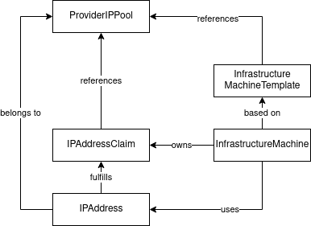
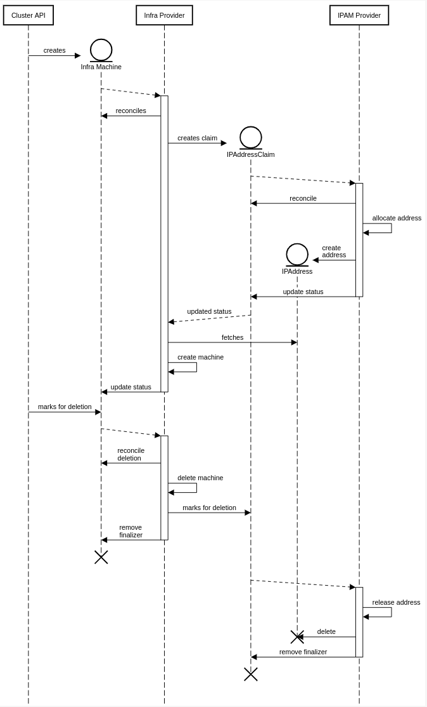

# IP Address Management Integration

## Table of Contents

<!-- START doctoc generated TOC please keep comment here to allow auto update -->
<!-- DON'T EDIT THIS SECTION, INSTEAD RE-RUN doctoc TO UPDATE -->

- [Glossary](#glossary)
  - [IPAM Provider](#ipam-provider)
  - [IPAddressClaim](#ipaddressclaim)
  - [IPAddress](#ipaddress)
  - [IP Pool](#ip-pool)
- [Summary](#summary)
- [Motivation](#motivation)
  - [Goals](#goals)
  - [Non-Goals/Future Work](#non-goalsfuture-work)
- [Proposal](#proposal)
  - [User Stories](#user-stories)
    - [Story 1](#story-1)
    - [Story 2](#story-2)
    - [Story 3](#story-3)
    - [Story 4](#story-4)
  - [IPAM API Contract](#ipam-api-contract)
  - [Pools & IPAM Providers](#pools--ipam-providers)
    - [Examples](#examples)
  - [Consumption](#consumption)
    - [Example](#example)
  - [Implementation Details/Notes/Constraints](#implementation-detailsnotesconstraints)
    - [New API Types](#new-api-types)
      - [IPAddressClaim](#ipaddressclaim-1)
      - [IPAddress](#ipaddress-1)
      - [New Reference Type](#new-reference-type)
    - [Implementing an IPAM Provider](#implementing-an-ipam-provider)
    - [Consuming as an Infrastructure Provider](#consuming-as-an-infrastructure-provider)
    - [Additional Notes](#additional-notes)
  - [Security Model](#security-model)
  - [Risks and Mitigations](#risks-and-mitigations)
- [Alternatives](#alternatives)
- [Implementation History](#implementation-history)

<!-- END doctoc generated TOC please keep comment here to allow auto update -->

## Glossary

Refer to the [Cluster API Book Glossary](https://cluster-api.sigs.k8s.io/reference/glossary.html).

### IPAM Provider

A controller that watches `IPAddressClaims` and fulfils them with `IPAddresses` that it allocates from an IP Pool. It comes with it's own IP Pool custom resource definition to provide parameters for allocating addresses. Providers can work in-cluster relying only on custom resources, or integrate with external systems like Netbox or Infoblox.

### IPAddressClaim

An `IPAddressClaim` is a custom resource that can be used by infrastructure providers to allocate IP addresses from IP Pools that are managed by IPAM providers.

### IPAddress

An `IPAddress` is a custom resource that gets created by an IPAM provider to fulfil an `IPAddressClaim`, which then gets consumed by the infrastructure provider that created the claim.

### IP Pool

An IP Pool is a custom resource that is provided by a IPAM provider, which holds configuration for a single pool of IP addresses that can be allocated from using an `IPAddressClaim`.

## Summary

This proposal adds an API contract for pluggable IP Address Management to CAPI that any infrastructure provider can choose to implement. It allows them to dynamically allocate and release IP Addresses from IP Address Pools following a similar concept as Kubernetes' PersistentVolumes. Pools are managed by IPAM Providers, which allow to integrate with external systems like Netbox or Infoblox.

## Motivation

IP address management for machines is currently left to the infrastructure providers for CAPI. Most on-premise providers (e.g. CAPV) allow the use of either DHCP or statically configured IPs. Since Machines are created from templates, static allocation would require a single template for each machine, which prevents dynamic scaling of nodes without custom controllers that create new templates.

While DHCP is a viable solution for dynamic IP assignment which also enables scaling, it can cause problems in conjunction with CAPI. Especially in smaller networks rolling cluster upgrades can exhaust the network in use. When multiple machines are replaced in quick succession, each of them will get a new DHCP lease. Unless the lease time is very short, at least twice as many IPs as the maximum number of nodes has to be allocated to a cluster.

Metal3 has an ip-address-manager component that allows for in-cluster management of IP addresses through custom resources, allowing to avoid DHCP. CAPV allows to ommit the address from the template while having DHCP disabled, and will wait until it is set manually, allowing to implement custom controllers to take care of IP assignments. At DTAG we've extended metal3's ip-address-manager and wrote a custom controller for CAPV to integrate both with Infoblox, our IPAM solution of choice. The CAPV project has shown interest, and there has been a proposal to allow integrating metal3's ip-address-manager with external systems.

All on-premise providers have a need for IP Address Management, since they can't leverage SDN features that are available in clouds such as AWS, Azure or GCP. We therefore propose to add an API contract to CAPI, which allows infrastructure providers to integrate with different IPAM systems. A similar approach to Kubernetes' PersistentVolumes should be used where infrastructure providers create Claims that reference a specific IP Pool, and IPAM providers fulfill claims to Pools managed by them.

### Goals

- Define an API contract that
    - allows infrastructure providers to dynamically allocate and release addresses
    - allows to write IPAM providers to integrate with any IPAM solution
    - supports both IPv4 and IPv6
    - allows to run multiple IPAM providers in parallel

### Non-Goals/Future Work

- IPAM providers should not be added to CAPI directly, but live as individual projects instead.
- `IPAddress` and `IPAddressClaim` will only have limited validation (e.g. that the referenced Pool exists and that IP address strings are valid addresses). Advanced validation (whether an IP is actually part of the correct subnet for example) needs to be handled by IPAM providers.
- This propsoal only focuses on integrating Machine creation with an IPAM provider.
  - Allocation of pools and addresses during cluster creation (e.g. the node network, the overlay network, API address etc.) is currently of scope of this proposal.
  - Support for allocating Pools could be added by extending the Proposal with an `IPPoolClaim` that can be used to divide IP Pools into smaller Pools. It would work the same way as `IPAddressClaims`, but yield new Pools of the same kind instead of an IPAddress.
- Moving network configuration from infrastructure templates to `MachineDeployments` should be discussed in a separate proposal. The IPAM integration proposed here can be reused when network configuration is moved, and would allow `IPAddressClaims` to be created by CAPI instead of having to re-implement it in all infrastructure providers that want to support it.

## Proposal

The chosen approach was heavily inspired by metal3's ip-address-manager, which in turn seems to have been inspired by Kubernetes' PersistentVolumes.

The Proposal suggests a way for infrastructure providers to integrate with different IPAM providers. It allows to allocate and release IP addresses in sync with the lifecycle of the Machines created by them. Releasing addresses as soon as Machines are deleted solves the shortcomings of DHCP and its time-based release of addresses, which can lead to temporary pool exhaustion.

The proposal is twofold and consists of the API contract that should be added to CAPI and two examples to better illustrate how the contract is used by IPAM and infrastructure providers.

### User Stories

#### Story 1

As a cluster operator I want to use static IP addresses with my Machines to avoid problems with DHCP lease duration during rolling cluster upgrades.

#### Story 2

As a cluster operator I want to integrate machines provisioned by CAPI with an external IPAM system and allocate IP addresses from it.

#### Story 3

As an infrastructure provider I want a single interface to integrate with multiple different IPAM providers.

#### Story 4

As an IPAM provider I want a single interface to integrate with all infrastructure providers that can benefit from IPAM integration.


### IPAM API Contract

The IPAM API contract provides a generic interface between CAPI infrastructure providers and to-be-developed IPAM providers. Any interested infrastructure is supposed to be able to request IP Addresses from a defined pool of addresses. IPAM providers should then be able to find and fulfil such requests using any custom logic to do so.

The contract consists of three resources:

- An IPAddressClaim, which is used to allocate addresses
- An `IPAddress` that IPAM providers use to fulfil IPAddressClaims
- IP Pools, which hold provider specific configuration on how addresses should be allocated, e.g. a specific subnet to use

Both **IPAddressClaims** and **IPAddresses** should be part of Cluster API, while **IPPools** are defined by the different IPAM providers.

An **IPAddressClaim** is used by infrastructure providers to request an IP Address. The claim contains a reference to an IP Pool. Because the pool is provider specific, the IPAM controllers can decide whether to handle a claim by inspecting the group and kind of the pool reference.

If a IPAM controller detects a Claim that references a Pool it controls, it allocates an IP address from that pool and creates an **IPAddress** to fulfil the claim. It also updates the status of the `IPAddressClaim` with a reference to the created Address.  
When allocation fails, the `Ready` condition of the claim should be set to false. Where applicable, the reasons specified in the IPAM api package should be used.


### Pools & IPAM Providers

In order for IPAM providers to fulfil IPAddressClaims, they likely require a few parameters, e.g. the network from which to allocate an IP address. If there are multiple different IPAM providers, they also need to know which claims they are supposed to fulfil, and which to ignore.

Therefore, IPAM providers are required to bring a custom IP Pool resource. The resource can have an arbitrary structure with the specific parameters for the IPAM system in use.

By inspecting the API group and kind of the pool reference held by IPAddressClaims, the provider can determine whether it is supposed to handle a claim or not. When an IPAM provider finds a `IPAddressClaim` that references one of its Pools, it allocates an IP address, creates an `IPAddress` resource and updates the status of the `IPAddressClaim` with a reference to this IPAddress.

#### Examples

A simple example for an IP Pool could look like this:

```yaml
apiVersion: ipam.cluster.x-k8s.io/v1alpha1
kind: InClusterIPPool
metadata:
  name: some-pool
spec:
  pools:
    - subnet: 10.10.10.0/24
      start: 10.10.10.100
      end: 10.10.10.200
```
A pool for an Infoblox Provider could look like this:

```yaml
apiVersion: ipam.cluster.x-k8s.io/v1alpha1
kind: InfobloxIPPool
metadata:
  name: ib-pool
spec:
  networkView: "some-view"
  dnsZone: "test.example.com."
  network: 10.10.10.0/24
```

### Consumption

The consumers of this API contract are the infrastructure providers. As mentioned in the introduction, not all providers will require integration with IPAM systems. In addition, DHCP may be a viable or even better option in some environments. Integration with this API should therefore be implemented as an optional feature.

To support IPAM integration, two things need to be implemented:

1. Users need to be able to specify the IP Pool to allocate addresses from.
2. The infrastructure provider needs to create `IPAddressClaims` for all ip addresses it requires, and then needs to wait until they are fulfilled.

The relationships between the provider and IPAM resources are shown in the diagram below.



More implementation details can be found [here](#consuming-as-an-infrastructure-provider).

#### Example

Using CAPV as an example, a template *could* look like this:

```yaml
apiVersion: infrastructure.cluster.x-k8s.io/v1alpha3
kind: VSphereMachineTemplate
metadata:
  name: example
  namespace: vsphere-site1
spec:
  template:
    spec:
      cloneMode: FullClone
      numCPUs: 8
      memoryMiB: 8192
      diskGiB: 45
      network:
        devices:
        - dhcp4: false
          fromPool: # reference to the pool
            group: ipam.cluster.x-k8s.io/v1alpha1
            kind: IPPool
            name: testpool
```

A Machine generated from that template could then look like this:

```yaml
apiVersion: infrastructure.cluster.x-k8s.io/v1alpha3
kind: VSphereMachine
metadata:
  name: example-1
  namespace: vsphere-site1
spec:
  cloneMode: FullClone
  numCPUs: 8
  memoryMiB: 8192
  diskGiB: 45
  network:
    devices:
    - dhcp4: false
      fromPool: # reference to the pool
        group: ipam.cluster.x-k8s.io/v1alpha1
        kind: IPPool
        name: testpool
  status:
  network:
    devices:
      - claim:
          name: example-1-1
```

### Implementation Details/Notes/Constraints

#### New API Types

The following API Types should be added to cluster-api. In the first iteration they will be added to the experimental API and will therefore live in the `cluster.x-k8s.io` group.

##### IPAddressClaim

The `IPAddressClaim` is used to request ip addresses from a pool. It gets reconciled by IPAM providers, which can filter based on the `Spec.Pool` reference.

After an `IPAddressClaim` is created, the `Spec.Pool` reference, and therefore essentially the entire `Spec` is immutable. Otherwise handing over a claim between providers would need to be supported, and that is an unlikely and complex use-case.

```go
// IPAddressClaimSpec describes the desired state of an IPAddressClaim
type IPAddressClaimSpec struct {
  // Pool is a reference to the pool from which an IP address should be allocated.
  Pool LocalObjectReference `json:"pool,omitempty"`
}

// IPAddressClaimStatus contains the status of an IPAddressClaim
type IPAddressClaimStatus struct {
  // Address is a reference to the address that was allocated for this claim.
  Address LocalObjectReference `json:"address,omitempty"`

  // Conditions provide details about the status of the claim.
	// +optional
	Conditions clusterv1.Conditions `json:"conditions,omitempty"`
}
 
// IPAddressClaim can be used to allocate IPAddresses from an IP Pool.
type IPAddressClaim struct {
  metav1.TypeMeta   `json:",inline"`
  metav1.ObjectMeta `json:"metadata,omitempty"`
  
  Spec   IPAddressClaimSpec   `json:"spec,omitempty"`
  Status IPAddressClaimStatus `json:"status,omitempty"`
}
```

##### IPAddress

`IPAddress` resources are created to fulfil an `IPAddressClaim`. They are created by the IPAM provider that reconciles the claim.

The `Spec` of `IPAddresses` is immutable.

```go
// IPAddressSpec describes an IPAddress
type IPAddressSpec struct {
  // Claim is a reference to the claim this IPAddress was created for.
  Claim LocalObjectReference `json:"claim,omitempty"`
 
  // Pool is a reference to the pool that this IPAddress was created from.
  Pool LocalObjectReference `json:"pool,omitempty"`
 
  // Address is the IP address.
  Address string `json:"address"`
 
  // Prefix is the prefix of the address.
  Prefix int `json:"prefix,omitempty"`
 
  // Gateway is the network gateway of network the address is from.
  Gateway string `json:"gateway,omitempty"`
}
 
// IPAddress is a representation of an IP Address that was allocated from an IP Pool.
type IPAddress struct {
  metav1.TypeMeta   `json:",inline"`
  metav1.ObjectMeta `json:"metadata,omitempty"`

  Spec IPAddressSpec `json:"spec,omitempty"`
}
```

##### New Reference Type

```go
type LocalObjectReference struct {
  Group string
  Kind string
  Name string
}
```

#### Implementing an IPAM Provider

IPAM providers have to provide an IP Pool resource. It serves two purposes: Selecting which provider to use, and configuring that provider. How configuration works exactly is up to the provider. The resource can allow to select a specific network to allocate addresses from, where different clusters might use different pools. Or there could only be a single object shared with all clusters, with the provider deciding what network to use on its own.

The primary task of the IPAM provider is fulfilling `IPAddressClaims`, usually issued by infrastructure providers. The provider therefore has to reconcile `IPAddressClaims` that are referencing one of its pools. It has to allocate IPs and create `IPAddress` objects for each claim.

A claim is fulfilled once an `IPAddress` object is created, and the status of the claim is updated with a reference to that `IPAddress` object. During the allocation process, the `.Status.Conditions` array of the `IPAddressClaim` should be used to reflect the status of the allocation process. Especially errors have to be visible.

The IPAM provider needs to ensure that address allocation is correct. Most importantly it must not assign the same IP address more than once within a pool. There is no validation on uniqueness on `IPAddress` objects.

When an `IPAddressClaim` that is reconciled by a provider is deleted, the provider needs to release the IP address belonging to the claim and delete the related `IPAddress` object. To do so a Finalzier should be added to the claim to prevent its deletion until the address is released.

`IPAddress` objects (as well as claims) are immutable. For each `IPAddressClaim`, one corresponding `IPAddress` object gets created. As long as the claim exists that `IPAddress` object must not change. When an `IPAddress` object is deleted while its claim still exists there are two options:
- The provider can re-create an `IPAddress` object with identical values as the previous object.
- If the provider is unable to reconstruct the object, it can add a Finalizer to the `IPAddress` to block its deletion indefinitely. It then needs to ensure that the Finalizer of the `IPAddress` is removed **before** removing the Finalizer of the `IPAddressClaim` to avoid orphaned `IPAddress` objects. This is similar to the [In Use Protection](https://kubernetes.io/docs/concepts/storage/persistent-volumes/#storage-object-in-use-protection) on PersistentVolumes.

#### Consuming as an Infrastructure Provider

In order to consume IP addresses from an IPAM provider, the infrastructure provider needs to know from which pool to allocate addresses. It is therefore necessary to allow to reference a pool in the Infrastructure Machine templates. The Pool must be in the same namespace as the cluster, which should be enforced by not providing a namespace field on the reference.

To consume IP addresses from a pool, the infrastructure machine controller then has to create `IPAddressClaims` for each address it needs. The claims should use a deterministic naming scheme that is derived from the name of the Infrastructure Machine they are created for, so it is easy to identify them, e.g. `<infra machine name>-<interface name>-<address index>`.

After the claim is created, the infrastructure provider needs to watch it until it's status contains a reference to the created IPAddress. The IP Address obtained through a claim will not change. Both the `IPAddressClaim` and the `IPAddress` are immutable. If a new address is required, the claim needs to be deleted and recreated. When a machine is deleted, the machine controller needs to delete the `IPAddressClaim` to release the address.

It is the responsibility of the Infrastructure Provider to ensure the `IPAddressClaim` is not deleted as long as the IP address is in use. It should block the deletion of the `IPAddressClaim` using a Finalizer until the Infrastructure Machine is destroyed. It has to make sure the Finalizer is removed before the Machine is deleted.

The `IPAddressClaim` must contain a owner reference to the Infrastructure Machine it was created for.

The Infrastructure Machine has to reflect IP Address allocation status in it's conditions, and this has to be incorporated into it's `Ready` condition. This is likely to be the case anyway, as the IP address will probably be required to provision the machine.

The used IP addresses must be reflected in `.Status.Addresses` of a Machine.

See the following picture for a sequence diagram of the allocation process.



#### Additional Notes

- An example provider that provides in-cluster IP Address management (also useful for testing, or when no other IPAM solution is available) should be implemented as a separate project in a separate repository.
- A shared library for providers and consumers should be implemented as part of that in-cluster IP Address provider.
  - helpers to create IPAddresses
  - a predicate to filter IPAddressClaims
  - ... anything else that can be shared between providers and consumers

### Security Model

- IPAddressClaim, `IPAddress` and Pools are required to be in the same namespace, and also in the same namespace as the Cluster.
  - For `IPAddressClaim` and `IPAddress` this is enforced by the lack of a namespace field on the reference
  - Infrastructure Providers need to ensure that only Pools in the same namespace can be referenced, ideally by excluding namespace from the reference.

### Risks and Mitigations

- Unresponsive IPAM providers can prevent successful creation of a cluster
- Wrong IP address allocations (e.g. duplicates) can brick a cluster’s network

## Alternatives

As an alternative to an official API contract, all interested providers could agree on an external contract, or an existing one like metal3-io/ip-address-manager. This would create a dependency on that project, which isn’t owned by the Kubernetes community (but it has been offered to donate that project to the community).

## Implementation History

- [x] 07/01/2021: Compile a Google Doc following the CAEP template (link here)
- [x] 08/18/2021: Present proposal at CAPI office hours
- [x] 01/26/2022: Open proposal PR
