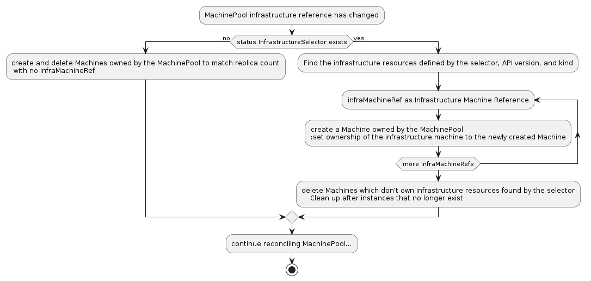

# MachinePool Machines

## Table of Contents

- [MachinePool Machines](#machinepool-machines)
  - [Table of Contents](#table-of-contents)
  - [Glossary](#glossary)
  - [Summary](#summary)
  - [Motivation](#motivation)
    - [Goals](#goals)
    - [Non-Goals/Future Work](#non-goalsfuture-work)
  - [Proposal](#proposal)
    - [User Stories](#user-stories)
      - [Story U1](#story-u1)
      - [Story U2](#story-u2)
      - [Story U3](#story-u3)
    - [Requirements](#requirements)
    - [Implementation Details/Notes/Constraints](#implementation-detailsnotesconstraints)
    - [Risks and Mitigations](#risks-and-mitigations)
  - [Alternatives](#alternatives)
  - [Upgrade Strategy](#upgrade-strategy)
  - [Additional Details](#additional-details)
    - [Test Plan [optional]](#test-plan-optional)
    - [Graduation Criteria [optional]](#graduation-criteria-optional)
  - [Implementation History](#implementation-history)

## Glossary

* **Machine**: a declarative specification for an infrastructure component that hosts a Kubernetes Node. Commonly, a Machine represents a VM instance.
* **MachinePool**: a spec for an infrastructure component that can scale a group of Machines. A MachinePool acts similarly to a [MachineDeployment][], but leverages scaling up resources that are specific to an infrastructure provider. However, while individual Machines in a MachineDeployment are visible and can be removed, individual Machines in a MachinePool are not represented.
* **MachinePool Machine**: a Machine that is owned by a MachinePool. It requires no special treatment in Cluster API in general; a Machine is a Machine without regard to ownership.

See also the [Cluster API Book Glossary][].

## Summary

MachinePools should be enhanced to own Machines that represent each of its `Replicas`.

These "MachinePool Machines" will open up the following opportunities:

- Share common behavior for Machines in MachinePools, which otherwise would need to be implemented by each infrastructure provider.
- Allow both Cluster API-driven and externally driven interactions with individual Machines in a MachinePool.
- Enable MachinePools to use deployment strategies similarly to MachineDeployments.

## Motivation

MachineDeployments and Machines provide solutions for common scenarios such as deployment strategy, machine health checks, and retired node deletion. Exposing MachinePool Machines at the CAPI level will enable similar integrations with external projects. 

For example, Cluster Autoscaler needs to delete individual Machines. Without a representation in the CAPI API of individual Machines in MachinePools, projects building integrations with Cluster API would need to be specialized to delete the cloud-specific resources for each MachinePool infrastructure provider. By exposing MachinePool Machines in CAPI, Cluster Autoscaler can treat Machines built by MachineDeployments and MachinePools in a uniform fashion through CAPI APIs.

As another example, currently each MachinePool infrastructure provider must implement their own node drain functionality. When MachinePool Machines become available in the CAPI API, all providers can use its existing node drain implementation.

### Goals

- Enable CAPI MachinePool to create Machines to represent infrastructure provider MachinePool Machines
- Ensure that Machines in MachinePools can participate in the same behaviors as MachineDeployment Machines (node drain, machine health checks, retired node deletion), although note that some implementations will not support node deletion.
- Enhance `clusterctl describe` to display MachinePool Machines

### Non-Goals/Future Work

- Implement Cluster Autoscaler MachinePool integration (a separate task, although we have a working POC)
- Allow CAPI MachinePool to include deployment strategies mirroring those of MachineDeployments
- Move the MachinePools implementation into a `exp/machinepools` package. The current code location makes its separation from `exp/addons` unclear and this would be an improvement.
- Improve bootstrap token handling for MachinePools. It would be preferable to have a single token for each Machine instead of the current shared token.

## Proposal

To create MachinePool Machines, a MachinePool in CAPI needs information about the instances or replicas associated with the provider's implementation of the MachinePool. This information is attached to the provider's MachinePool infrastructure resource in new status fields `InfrastructureMachineSelector` and `InfrastructureMachineKind`. These fields should be populated by the infrastructure provider.

```golang
// FooMachinePoolStatus defines the observed state of FooMachinePool.
type FooMachinePoolStatus struct {
	// InfrastructureMachineSelector is a label query over the infrastructure resources behind MachinePool Machines.
	// More info: https://kubernetes.io/docs/concepts/overview/working-with-objects/labels/#label-selectors
	// +optional
	InfrastructureMachineSelector metav1.LabelSelector `json:"infrastructureMachineSelector,omitempty"`
	// InfrastructureMachineKind is the kind of the infrastructure resources behind MachinePool Machines.
	// +optional
	InfrastructureMachineKind string `json:"infrastructureMachineKind,omitempty"`
}
```

These fields are an addition to the optional status fields of `InfrastructureMachinePool` in the [provider contract][].

If the fields are populated, CAPI's MachinePool controller will query for the provider-specific infrastructure resources. That query uses the Selector and Kind fields with the API version of the \<Provider\>MachinePool, which is assumed to match the API version of the infrastructure resources.

Once found, CAPI will create and connect MachinePool Machines to each resource. A MachinePool Machine is implemented as a Cluster API Machine that is owned by a MachinePool, with its BootstrapRef omitted. CAPI's MachinePool controller will loop through the \<Provider\>MachinePoolMachines found by the Selector and if needed, create a Machine and set its infrastructure reference to the \<Provider\>MachinePoolMachine, while setting the \<Provider\>MachinePoolMachine's owner reference to the newly created Machine.

If the field is empty, "CAPI-only" MachinePool Machines will be created. They will contain only basic information and exist to make a more consistent user experience across all MachinePools and MachineDeployments. These machines will not be connected to any infrastructure resources and a user will be prevented from deleting them. CAPI's MachinePool controller will reconcile their count with its replica count.

It is the responsibility of each provider to populate `InfrastructureMachineSelector` and `InfrastructureMachineKind`, and to create provider-specific MachinePool Machine resources behind each Machine. For example, the Docker provider may reuse the existing DockerMachine resource to represent the container instance behind the Machine in the infrastructure provider's MachinePool. It will also ensure that the DockerMachine is labeled such that the `InfrastructureMachineSelector` can be used to find it.



When a MachinePool Machine is deleted manually, the system will delete the corresponding provider-specific resource. The opposite is also true: when a provider-specific resource is deleted, the system will delete the corresponding MachinePool Machine. This happens by virtue of the infrastructureRef <-> ownerRef relationship.

In both cases, the MachinePool will notice the missing replica and create a new one in order to maintain the desired number of replicas. To scale down by removing a specific instance, that Machine should be given the "cluster.x-k8s.io/delete-machine" annotation and then the replicaCount on the MachinePool should be decremented.

### User Stories

--------------------------------------------
| ID | Story                               |
|----|-------------------------------------|
| U1 | Cluster Autoscaler                  |
| U2 | MachinePool Machine Remediation     |
| U3 | MachinePool Machine Rolling Updates |
--------------------------------------------

#### Story U1

A cluster admin is tasked with using Cluster Autoscaler to scale a MachinePool as required by machine load. The MachinePool should provide a mechanism for Cluster Autoscaler to increase replica count, and provide a mechanism for Cluster Autoscaler to reduce replica count by selecting an optimal machine for deletion.

#### Story U2

A cluster admin would like to configure CAPI to remediate unhealthy MachinePool Machines to ensure a healthy fleet of Machines.

#### Story U3

A cluster admin updates a MachinePool to a newer Kubernetes version and would like to configure the strategy for that deployment so that the MachinePool will progressively roll out the new version of the machines. They would like this operation to cordon and drain each node to minimize workload disruptions.

### Requirements

--------------------------------------
| ID | Requirement | Related Stories |
|----|-------------|-----------------|
| R1 | The MachinePool controller MUST create Machines representing the provider-specific resources in the MachinePool and enable cascading delete of infrastructure<br>machine resources upon delete of CAPI Machine. | U1 |
| R2 | The machine health check controller MUST be able to select machines by label which belong to a MachinePool and remediate. | U2 |
| R3 | The MachinePool API MUST provide an optional deployment strategy using the same type as MachineDeployment.Spec.Strategy. | U3 |
| R4 | The Machine Controller MUST handle node drain for Machine Pool Machines with the same behavior as MachineDeployment Machines. | U1, U3 |

### Implementation Details/Notes/Constraints

- As an alternative, the `InfrastructureMachineSelector` field could be attached to the CAPI MachinePool resource. Then the CAPI MachinePool controller could check it directly and it would be more clearly documented in code. Feedback seemed to prefer not changing the MachinePool API and putting it in the provider contract instead.

- Some existing MachinePool implementations cannot support deletion of individual replicas / instances. Specifically, AWSManagedMachinePool and AKSManagedMachinePool can only scale the number of replicas.

  To provide a more consistent UX, "CAPI-only" MachinePool Machines will be implemented for this case. This will allow a basic representation of each MachinePool Machine, but will not allow their deletion.

### Risks and Mitigations

- A previous version of this proposal suggested using a pre-populated `infrastructureRefList` instead of the `InfrastructureMachineSelector` and related fields. Effectively, this means the query "what provider resources exist for this MachinePool's instances?" would be pre-populated, rather than run as needed. This approach would not scale well to MachinePools with hundreds or thousands of instances, since that list becomes part of the representation of that MachinePool, possibly causing storage or network transfer issues.

  It was pointed out that the existing `providerIDList` suffers the same scalability issue as an `infrastructureRefList` would. It would be nice to refactor it away, but doing so is not considered a goal of this proposal effort.

- The logic to convey the intent of replicas in MachinePool (and MachineDeployment) is currently provider-agnostic and driven by the core controllers. The approach in this proposal inverts that, delegating the responsibility to the provider first to create the infrastructure resources, and then having the CAPI core controllers sync up with those resources by creating and deleting Machines.

  One goal of creating these resources first in the provider code is to allow responsiveness to a MachinePool's native resource. A provider's MachinePool controller can keep the infrastructure representation of the actual scalable resource more current, perhaps responding to native platform events.

  There is a potential that this approach creates a bad representation of intent with regard to MachinePool Machines depending on the provider's implementation. We assume that the number of implementors is small, and that the providers are well-known. A "reference implementation" of MachinePool Machines for Docker should guide providers towards reliable code.

## Alternatives

We could consider refactoring MachineDeployment/MachineSet to support the option of using cloud infrastructure-native scaling group resources. That is, merge MachinePool into MachineDeployment. MachinePool and MachineDeployment do overlap significantly, and this proposal aims to eliminate one of their major differences: that individual Machines aren’t represented in a MachinePool.

While it is valuable that MachineDeployments are provider-agnostic, MachinePools take advantage of scalable resources unique to an infra provider, which may have advantages in speed or reliability. MachinePools allow an infrastructure provider to decide which native features to use, while still conforming to some basic common behaviors.

 To merge MachinePool behavior — along with the changes proposed here — into MachineDeployment would effectively deprecate the experimental MachinePool API and would increase the overall scope of work significantly, while increasing challenges to maintaining backward compatibility in the stable API.

## Upgrade Strategy

MachinePool Machines will be a backward-compatible feature. Existing infrastructure providers can make no changes and will observe the same behavior with MachinePools they always have.

## Additional Details

### clusterctl client

The clusterctl client will be updated to discover and list MachinePool Machines.

### Graduation Criteria

This feature is linked to experimental MachinePools, and therefore awaits its graduation.

## Implementation History

- [x] 01/11/2021: Proposed idea in a [GitHub issue](https://github.com/kubernetes-sigs/cluster-api/issues/4063)
- [x] 01/11/2021: Proposed idea at a [community meeting](https://youtu.be/Un_KXV4be-E)
- [x] 06/23/2021: Compile a [Google Doc](https://docs.google.com/document/d/1y40ayUDX9myNPHvotnlWCvysDb81BhU_MQ7G9_yqK0A/edit?usp=sharing) following the CAEP template
- [x] 08/01/2021: First round of feedback from community
- [x] 10/06/2021: Present proposal at a [community meeting](https://www.youtube.com/watch?v=fCHx2iRWMLM)
- [x] 02/09/2022: Open proposal PR
- [x] 03/09/2022: Update proposal to be required implementation after six months, other edits
- [x] 03/20/2022: Use selector-based approach and remove six-month implementation deadline
- [x] 04/05/2022: Update proposal to address all outstanding feedback
- [x] 04/20/2022: Update proposal to address newer feedback
- [x] 04/29/2022: Zoom meeting to answer questions and collect feedback
- [x] 05/03/2022: Update proposal to address newer feedback
- [x] 05/11/2022: Lazy consensus started
- [x] 05/18/2022: Update proposal to address newer feedback

<!-- Links -->
[Cluster API Book Glossary]: https://cluster-api.sigs.k8s.io/reference/glossary.html
[MachineDeployment]: https://cluster-api.sigs.k8s.io/user/concepts.html#machinedeployment
[provider contract]: https://cluster-api.sigs.k8s.io/developer/architecture/controllers/machine-pool.html#infrastructure-provider
