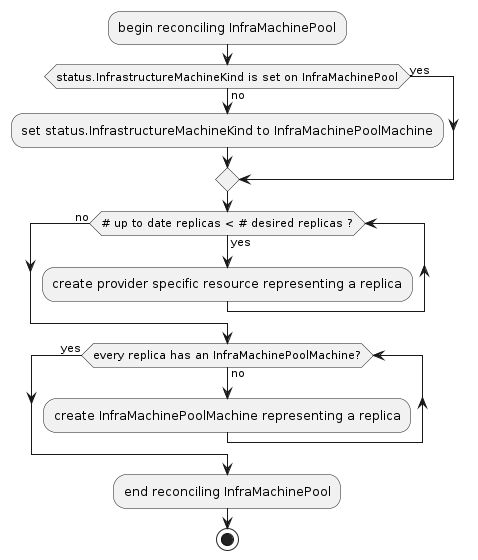
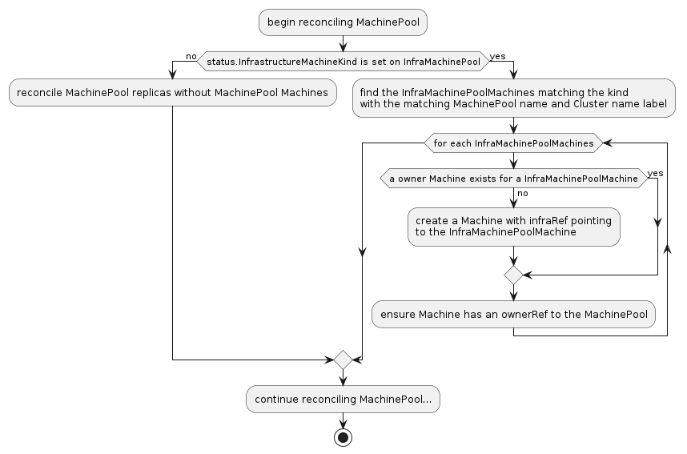
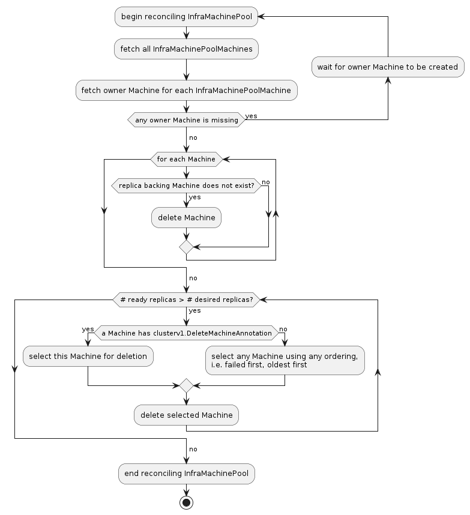
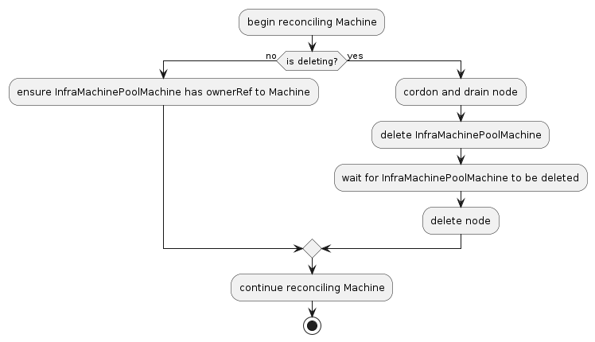

# MachinePool Machines

## Table of Contents

<!-- START doctoc generated TOC please keep comment here to allow auto update -->
<!-- DON'T EDIT THIS SECTION, INSTEAD RE-RUN doctoc TO UPDATE -->

- [Glossary](#glossary)
- [Summary](#summary)
- [Motivation](#motivation)
  - [Goals](#goals)
  - [Non-Goals/Future Work](#non-goalsfuture-work)
- [Proposal](#proposal)
  - [Enabling MachinePoolMachines](#enabling-machinepoolmachines)
  - [InfraMachinePoolMachine creation](#inframachinepoolmachine-creation)
  - [MachinePool Machine creation](#machinepool-machine-creation)
  - [InfraMachinePoolMachine deletion](#inframachinepoolmachine-deletion)
  - [Machine controller](#machine-controller)
  - [User Stories](#user-stories)
    - [Story U1](#story-u1)
    - [Story U2](#story-u2)
    - [Story U3](#story-u3)
  - [Requirements](#requirements)
  - [Implementation Details/Notes/Constraints](#implementation-detailsnotesconstraints)
  - [Risks and Mitigations](#risks-and-mitigations)
- [Alternatives](#alternatives)
- [Upgrade Strategy](#upgrade-strategy)
- [Additional Details](#additional-details)
  - [clusterctl client](#clusterctl-client)
  - [Graduation Criteria](#graduation-criteria)
- [Implementation History](#implementation-history)

<!-- END doctoc generated TOC please keep comment here to allow auto update -->

## Glossary

* **Machine**: a declarative specification for an infrastructure component that hosts a Kubernetes Node. Commonly, a Machine represents a VM instance.
* **MachinePool**: a spec for an infrastructure component that can scale a group of Machines. A MachinePool acts similarly to a [MachineDeployment][], but leverages scaling up resources that are specific to an infrastructure provider. However, while individual Machines in a MachineDeployment are visible and can be removed, individual Machines in a MachinePool are not represented.
* **MachinePool Machine**: a Machine that is owned by a MachinePool. It requires no special treatment in Cluster API in general; a Machine is a Machine without regard to ownership.

See also the [Cluster API Book Glossary][].

## Summary

MachinePools should be enhanced to own Machines that represent each of its `Replicas`.

These "MachinePool Machines" will open up the following opportunities:

- Share common behavior for Machines in MachinePools, which otherwise would need to be implemented by each infrastructure provider.
- Allow both Cluster API-driven and externally driven interactions with individual Machines in a MachinePool.
- Enable MachinePools to use deployment strategies similarly to MachineDeployments.

## Motivation

MachineDeployments and Machines provide solutions for common scenarios such as deployment strategy, machine health checks, and retired node deletion. Exposing MachinePool Machines at the CAPI level will enable similar integrations with external projects. 

For example, Cluster Autoscaler needs to delete individual Machines. Without a representation in the CAPI API of individual Machines in MachinePools, projects building integrations with Cluster API would need to be specialized to delete the cloud-specific resources for each MachinePool infrastructure provider. By exposing MachinePool Machines in CAPI, Cluster Autoscaler can treat Machines built by MachineDeployments and MachinePools in a uniform fashion through CAPI APIs.

As another example, currently each MachinePool infrastructure provider must implement their own node drain functionality. When MachinePool Machines become available in the CAPI API, all providers can use its existing node drain implementation.

### Goals

- Enable CAPI MachinePool to create Machines to represent infrastructure provider MachinePool Machines
- Ensure that Machines in MachinePools can participate in the same behaviors as MachineDeployment Machines (node drain, machine health checks, retired node deletion), although note that some implementations will not support node deletion.
- Enhance `clusterctl describe` to display MachinePool Machines

### Non-Goals/Future Work

- Implement Cluster Autoscaler MachinePool integration (a separate task, although we have a working POC)
- Allow CAPI MachinePool to include deployment strategies mirroring those of MachineDeployments
- Move the MachinePools implementation into a `exp/machinepools` package. The current code location makes its separation from `exp/addons` unclear and this would be an improvement.
- Improve bootstrap token handling for MachinePools. It would be preferable to have a single token for each Machine instead of the current shared token.

## Proposal


### Enabling MachinePoolMachines

To enable the MachinePool Machines feature, a MachinePool in CAPI needs to know the type of the instances or replicas associated with the provider's implementation of the MachinePool. This information is attached to the provider's MachinePool infrastructure resource in the new status field `InfrastructureMachineKind`. When this field is populated by the provider, it signals to the Cluster API MachinePool controller that this InfrastructureMachinePool is opted-in to support MachinePool Machines.

```golang
// InfraMachinePoolStatus defines the observed state of an InfraMachinePool.
type InfraMachinePoolStatus struct {
	// InfrastructureMachineKind is the kind of the infrastructure resources behind MachinePool Machines.
	// +optional
	InfrastructureMachineKind string `json:"infrastructureMachineKind,omitempty"`
}
```

This field is in addition to the optional status fields of `InfrastructureMachinePool` in the [provider contract][].

### InfraMachinePoolMachine creation

Like before, the InfraMachinePool controller is still responsible for creating the provider specific resources behind each MachinePool instance. The difference now, is that the InfraMachinePool controller must ensure that a InfraMachinePoolMachine is created for each instance. The instances should be created such that each contains the `clusterv1.ClusterNameLabel` set to `cluster.Name` and the `clusterv1.MachinePoolNameLabel` set to `format.MustFormatValue(machinePool.Name)` to indicate to CAPI that these InfraMachinePoolMachines are associated with the given MachinePool. The InfraMachinePoolMachines should also contain an owner reference to the InfraMachinePool and look as follows:

```golang
infraMachinePoolMachine := &infrav1.InfraMachinePoolMachine{
	ObjectMeta: metav1.ObjectMeta{
		Namespace:   infraMachinePool.Namespace,
		Name:        // ...,
		Labels:      map[string]string{
			clusterv1.ClusterNameLabel:     cluster.Name,
			clusterv1.MachinePoolNameLabel: format.MustFormatValue(machinePool.Name),
		},
		Annotations: make(map[string]string),
		OwnerReferences: []metav1.OwnerReference{
			{
				APIVersion: infraMachinePool.APIVersion,
				Kind:       infraMachinePool.Kind,
				Name:       infraMachinePool.Name,
				UID:        infraMachinePool.UID,
			},
			// Note: Since the MachinePool controller has not created its owner Machine yet, we want to set the InfraMachinePoool as the owner so it's not orphaned.
		},
	},
	Spec: infrav1.DockerMachineSpec{
		// ...
	},
}
```

**Note:** Depending on the provider specific implementation of MachinePools, it might make sense to reuse the existing InfraMachine type for both normal Machines and MachinePool Machines rather than creating a new InfraMachinePoolMachine type. This is the case for Docker as there is no difference in implementation of the instances, but most providers will still want to use a new InfraMachinePoolMachine.



### MachinePool Machine creation

The CAPI MachinePool controller is responsible for watching for the creation of InfraMachinePoolMachines and reacting by creating owner Machines for each InfraMachine. Each owner Machine will have its infrastructure reference pointing to the InfraMachinePoolMachine but will not have a bootstrap reference as the bootstrap object is shared among all instances. The MachinePool controller will also ensure each Machine has an owner reference to the MachinePool and replace it if the owner reference is removed. Similarly, Machine controller (not MachinePool) is also responsible for ensuring the the InfraMachinePoolMachine indicated by the infrastructure reference has a controller/owner reference to the Machine as well. The Machines will be created as similar to the following specification.

```golang
machine := &clusterv1.Machine{
	ObjectMeta: metav1.ObjectMeta{
		Name: names.SimpleNameGenerator.GenerateName(fmt.Sprintf("%s-", mp.Name)),
		OwnerReferences: []metav1.OwnerReference{*metav1.NewControllerRef(mp, mp.GroupVersionKind())},
		Namespace:       mp.Namespace,
		Labels:          make(map[string]string),
		Annotations:     make(map[string]string),
	},
	Spec: clusterv1.MachineSpec{
		ClusterName:       mp.Spec.ClusterName,
		InfrastructureRef: corev1.ObjectReference{
			APIVersion: infraMachine.GetAPIVersion(),
			Kind:       infraMachine.GetKind(),
			Name:       infraMachine.GetName(),
			Namespace:  infraMachine.GetNamespace(),
		},
	},
}
```

To reiterate, this behavior is already implemented by the MachinePool controller, and providers are not responsible for creating/updating these Machines.




### InfraMachinePoolMachine deletion

Unlike the creation flow, the InfraMachinePool is responsible for deleting both the InfraMachinePoolMachine and MachinePool Machines instead of the MachinePool controller.

The InfraMachinePool will scale down when it is overprovisioned, meaning the total number of ready replicas is greater than the desired replica count and then select a replica to delete. If any replica has an associated Machine containing the `clusterv1.DeleteMachineAnnotation`, the InfraMachinePool should prioritize that replica for deletion first. When deleting a replica, the InfraMachinePool controller should delete the owner Machine instead of deleting the InfraMachinePoolMachine or replica directly. This is so that the Machine deletion flow will cordon and drain the node and trigger deletion of the InfraMachinePoolMachine via its infrastructure reference. The InfraMachinePoolMachine should then delete the provider specific instance associated with the replica.

It is worth noting that when a MachinePool Machine is deleted manually, the Machine controller will delete the corresponding InfraMachinePoolMachine, and the InfraMachinePoolMachine will delete the provider-specific resource. On the other hand, if the provider specific instance backing a Machine and InfraMachinePoolMachine is deleted, the InfraMachinePool controller is responsible for deleting the "dangling" Machine and InfraMachinePoolMachine, and creating a new replica and InfraMachinePoolMachine to replace it.

Additionally, the InfraMachinePool must support surging to ensure it does maintains the desired number of ready replicas during a rolling update similar to a MachineDeployment. However, a `MaxSurge` field is not required and the decision of whether or not to implement it is left up to the provider. For example, a simple implementation could be to simply always delete outdated InfraMachines when overprovisioned.



### Machine controller

Once a MachinePool Machine is created, it is reconciled by the Machine controller. The Machine controller will fetch the InfraMachinePoolMachine in the Machine's infrastructure reference, and ensure the InfraMachinePoolMachine has an owner reference to the Machine. This is part of the existing behavior of the Machine controller.

When a MachinePool Machine is being deleted, the Machine controller will cordon and drain the node, delete the InfraMachinePoolMachine, and delete the node. The InfraMachinePoolMachine will then delete the provider specific instance.



### User Stories

--------------------------------------------
| ID | Story                               |
|----|-------------------------------------|
| U1 | Cluster Autoscaler                  |
| U2 | MachinePool Machine Remediation     |
| U3 | MachinePool Machine Rolling Updates |
--------------------------------------------

#### Story U1

A cluster admin is tasked with using Cluster Autoscaler to scale a MachinePool as required by machine load. The MachinePool should provide a mechanism for Cluster Autoscaler to increase replica count, and provide a mechanism for Cluster Autoscaler to reduce replica count by selecting an optimal machine for deletion.

#### Story U2

A cluster admin would like to configure CAPI to remediate unhealthy MachinePool Machines to ensure a healthy fleet of Machines.

#### Story U3

A cluster admin updates a MachinePool to a newer Kubernetes version and would like to configure the strategy for that deployment so that the MachinePool will progressively roll out the new version of the machines. They would like this operation to cordon and drain each node to minimize workload disruptions.

### Requirements

--------------------------------------
| ID | Requirement | Related Stories |
|----|-------------|-----------------|
| R1 | The MachinePool controller MUST create Machines representing the provider-specific resources in the MachinePool and enable cascading delete of infrastructure<br>machine resources upon delete of CAPI Machine. | U1 |
| R2 | The machine health check controller MUST be able to select machines by label which belong to a MachinePool and remediate. | U2 |
| R3 | The MachinePool API MUST provide an optional deployment strategy using the same type as MachineDeployment.Spec.Strategy. | U3 |
| R4 | The Machine Controller MUST handle node drain for Machine Pool Machines with the same behavior as MachineDeployment Machines. | U1, U3 |

### Implementation Details/Notes/Constraints

- As an alternative, the `InfrastructureMachineSelector` field could be attached to the CAPI MachinePool resource. Then the CAPI MachinePool controller could check it directly and it would be more clearly documented in code. Feedback seemed to prefer not changing the MachinePool API and putting it in the provider contract instead.

- Some existing MachinePool implementations cannot support deletion of individual replicas / instances. Specifically, AWSManagedMachinePool and AKSManagedMachinePool can only scale the number of replicas.

  To provide a more consistent UX, "CAPI-only" MachinePool Machines will be implemented for this case. This will allow a basic representation of each MachinePool Machine, but will not allow their deletion.

### Risks and Mitigations

- A previous version of this proposal suggested using a pre-populated `infrastructureRefList` instead of the `InfrastructureMachineSelector` and related fields. Effectively, this means the query "what provider resources exist for this MachinePool's instances?" would be pre-populated, rather than run as needed. This approach would not scale well to MachinePools with hundreds or thousands of instances, since that list becomes part of the representation of that MachinePool, possibly causing storage or network transfer issues.

  It was pointed out that the existing `providerIDList` suffers the same scalability issue as an `infrastructureRefList` would. It would be nice to refactor it away, but doing so is not considered a goal of this proposal effort.

- The logic to convey the intent of replicas in MachinePool (and MachineDeployment) is currently provider-agnostic and driven by the core controllers. The approach in this proposal inverts that, delegating the responsibility to the provider first to create the infrastructure resources, and then having the CAPI core controllers sync up with those resources by creating and deleting Machines.

  One goal of creating these resources first in the provider code is to allow responsiveness to a MachinePool's native resource. A provider's MachinePool controller can keep the infrastructure representation of the actual scalable resource more current, perhaps responding to native platform events.

  There is a potential that this approach creates a bad representation of intent with regard to MachinePool Machines depending on the provider's implementation. We assume that the number of implementors is small, and that the providers are well-known. A "reference implementation" of MachinePool Machines for Docker should guide providers towards reliable code.

## Alternatives

We could consider refactoring MachineDeployment/MachineSet to support the option of using cloud infrastructure-native scaling group resources. That is, merge MachinePool into MachineDeployment. MachinePool and MachineDeployment do overlap significantly, and this proposal aims to eliminate one of their major differences: that individual Machines aren’t represented in a MachinePool.

While it is valuable that MachineDeployments are provider-agnostic, MachinePools take advantage of scalable resources unique to an infra provider, which may have advantages in speed or reliability. MachinePools allow an infrastructure provider to decide which native features to use, while still conforming to some basic common behaviors.

 To merge MachinePool behavior — along with the changes proposed here — into MachineDeployment would effectively deprecate the experimental MachinePool API and would increase the overall scope of work significantly, while increasing challenges to maintaining backward compatibility in the stable API.

## Upgrade Strategy

MachinePool Machines will be a backward-compatible feature. Existing infrastructure providers can make no changes and will observe the same behavior with MachinePools they always have.

## Additional Details

### clusterctl client

The clusterctl client will be updated to discover and list MachinePool Machines.

### Graduation Criteria

This feature is linked to experimental MachinePools, and therefore awaits its graduation.

## Implementation History

- [x] 01/11/2021: Proposed idea in a [GitHub issue](https://github.com/kubernetes-sigs/cluster-api/issues/4063)
- [x] 01/11/2021: Proposed idea at a [community meeting](https://youtu.be/Un_KXV4be-E)
- [x] 06/23/2021: Compile a [Google Doc](https://docs.google.com/document/d/1y40ayUDX9myNPHvotnlWCvysDb81BhU_MQ7G9_yqK0A/edit?usp=sharing) following the CAEP template
- [x] 08/01/2021: First round of feedback from community
- [x] 10/06/2021: Present proposal at a [community meeting](https://www.youtube.com/watch?v=fCHx2iRWMLM)
- [x] 02/09/2022: Open proposal PR
- [x] 03/09/2022: Update proposal to be required implementation after six months, other edits
- [x] 03/20/2022: Use selector-based approach and remove six-month implementation deadline
- [x] 04/05/2022: Update proposal to address all outstanding feedback
- [x] 04/20/2022: Update proposal to address newer feedback
- [x] 04/29/2022: Zoom meeting to answer questions and collect feedback
- [x] 05/03/2022: Update proposal to address newer feedback
- [x] 05/11/2022: Lazy consensus started
- [x] 05/18/2022: Update proposal to address newer feedback

<!-- Links -->
[Cluster API Book Glossary]: https://cluster-api.sigs.k8s.io/reference/glossary.html
[MachineDeployment]: https://cluster-api.sigs.k8s.io/user/concepts.html#machinedeployment
[provider contract]: https://cluster-api.sigs.k8s.io/developer/architecture/controllers/machine-pool.html#infrastructure-provider
