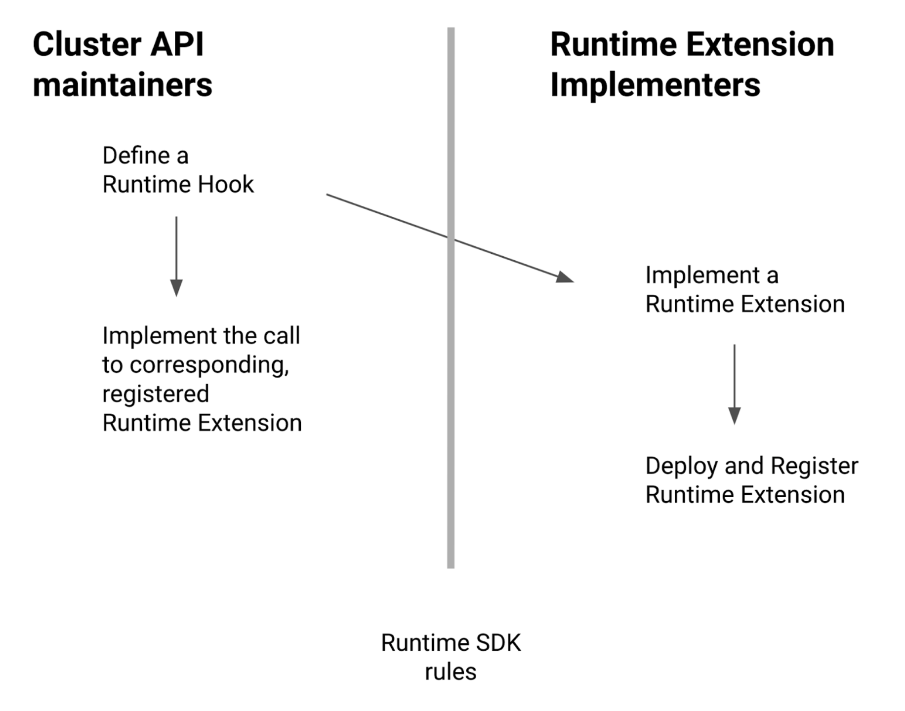
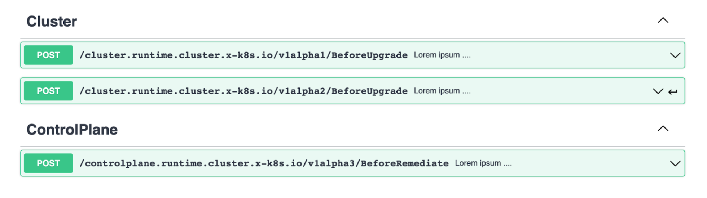

# Cluster API Runtime SDK

## Table of Contents

<!-- START doctoc generated TOC please keep comment here to allow auto update -->
<!-- DON'T EDIT THIS SECTION, INSTEAD RE-RUN doctoc TO UPDATE -->

- [Glossary](#glossary)
- [Summary](#summary)
- [Motivation](#motivation)
  - [Goals](#goals)
  - [Non-Goals](#non-goals)
  - [Future Work](#future-work)
- [Proposal](#proposal)
  - [User Stories](#user-stories)
  - [Implementation Details/Notes/Constraints](#implementation-detailsnotesconstraints)
    - [Cluster API Runtime Hooks vs Kubernetes admission webhooks](#cluster-api-runtime-hooks-vs-kubernetes-admission-webhooks)
    - [Runtime SDK rules](#runtime-sdk-rules)
- [Runtime Extensions developer guide](#runtime-extensions-developer-guide)
  - [Registering Runtime Extensions](#registering-runtime-extensions)
- [Runtime Hooks developer guide (CAPI internals)](#runtime-hooks-developer-guide-capi-internals)
  - [Runtime hook implementation](#runtime-hook-implementation)
  - [Discovering Runtime Extensions](#discovering-runtime-extensions)
  - [Calling Runtime Extensions](#calling-runtime-extensions)
- [Security Model](#security-model)
- [Risks and Mitigations](#risks-and-mitigations)
- [Alternatives](#alternatives)
- [Upgrade Strategy](#upgrade-strategy)
- [Additional Details](#additional-details)
  - [Test Plan](#test-plan)
  - [Graduation Criteria](#graduation-criteria)
  - [Version Skew Strategy](#version-skew-strategy)
- [Annex](#annex)
  - [Runtime SDK rules](#runtime-sdk-rules-1)
  - [Discovery hook](#discovery-hook)
- [Implementation History](#implementation-history)

<!-- END doctoc generated TOC please keep comment here to allow auto update -->
  
## Glossary

Refer to the [Cluster API Book Glossary](https://cluster-api.sigs.k8s.io/reference/glossary.html).

- **Cluster API Runtime**: identifies the Cluster API execution model, a set of controllers cooperating in managing the
  workload cluster’s lifecycle.
- **Runtime SDK**: a set of rules, recommendations and fundamental capabilities required to develop Runtime Hooks and
  Runtime Extensions.
- **Runtime Hook**: a single, well identified, extension point allowing applications built on top of Cluster API to hook
  into specific moments of the workload cluster’s lifecycle, e.g. `BeforeClusterUpgrade`, `BeforeMachineRemediation`.
- **Runtime Extension**: an external component which is part of a system/product built on top of Cluster API that can
  handle requests for a specific Runtime Hook.
- **Runtime Extension Provider**: a project that provides a runtime extension and the yaml for installing it as part of 
  its release artefacts.

## Summary

This proposal introduces the Cluster API Runtime SDK, a set of rules, recommendations, and fundamental capabilities
required to implement a new extensibility mechanism that allows systems, products, and services built on top of
Cluster API to hook into a workload cluster’s lifecycle.

## Motivation

Extensibility is at the core of Cluster API.

CAPI extensibility originally was designed to allow infrastructure providers to offer their services via the Cluster API
declarative model; over time the same model has been extended to support bootstrap providers, control plane providers,
and more recently external remediation strategies.

But this is not enough anymore.

All the above extensibility points are about allowing plug-in, swappable “low-level” components required to
provision/manage a Kubernetes cluster with Cluster API.
Instead, with the growing adoption of Cluster API as a common layer to manage fleets of Kubernetes Clusters, there is
now a new category of systems, products and services built on top of Cluster API that require strict interactions
with the lifecycle of Clusters, but at the same time they do not want to replace any “low-level” components in
Cluster API, because they happily benefit from all the features available in the existing providers (built on top vs
plug-in/swap).

A common approach for this problem has been to watch for Cluster API resources; another approach has been to implement
API Server admission webhooks to alter CAPI resources, but both approaches are limited by the fact that the system
built on top of Cluster API is forced to treat it as a opaque system and thus with limited visibility and almost
total lack of control, e.g. you can watch a Machine being provisioned, but not block the provisioning to start if
a quota management systems signals you have exhausted all the resources assigned to you.

A stop-gap solution to this problem has been introduced in Cluster API with the implementation of machine deletion
hooks, but this approach is tightly linked to the specific use case and it can not be re-used in other contexts/in
other lifecycle moments.

This proposal aims to solve the above problem in a more structured and generic way, by introducing the Runtime SDK,
a set of rules, recommendations and fundamental capabilities required to implement a new extensibility mechanism
that will allow systems, products and services built on top of Cluster API to hook in the workload cluster’s
lifecycle.

The key elements of the above extensibility mechanism are Runtime Hooks and Runtime Extensions.

Runtime Hooks and Runtime Extensions are designed to be powerful and flexible, and _by opportunity_ it will be also
possible to use this capability for allowing the user to hook into Cluster API reconcile loops at "low level", e.g.
by allowing a Runtime Extension providing external patches to be executed on every topology reconcile.

### Goals

To define the Runtime SDK and more specifically

- To define the rules ensuring Runtime Hooks can evolve over time:
  - When/how to create a new version;
  - When/how to modify the current version;
  - When/how to deprecate an old version, as well as mechanisms to inform users about versions being deprecated;
  - When/how to drop an old version, as well as providing a mechanism to prevent users to upgrade Cluster API when
    this will break installed Runtime Extensions;
- To define the fundamental capabilities/tooling to be implemented in CAPI in order to allow the implementation of
  Runtime Hooks.
- To provide an initial set of guidelines for Runtime Extension developers.
- To define how external Runtime Extensions can be registered within the Cluster API Runtime.

### Non-Goals

- To identify or specify the list of Runtime Hooks that should be implemented; some examples of possible Runtime Hooks
  will be eventually provided, but it is not in the scope of this document to define them in detail;
- To replace controllers or any other component of the Cluster API Runtime (including infrastructure providers,
  bootstrap providers, control plane providers and the CRD/contract based extension mechanism they rely on).

### Future Work

- Identify and specify the list of Runtime Hooks to be implemented; this will be addressed iteratively by a set of
  future proposals, all of them building on top of the foundational capabilities introduced by this document;
- Eventually consider deprecation of machine deletion hooks and replacement with a Runtime Hook;
- Improve the Runtime Extension developer guide based on experience and feedback;
- Add metrics about Runtime Extension calls (usage, usage vs deprecated versions, duration, error rate etc.);
- Allow providers to use the same SDK to define their own hooks.
- Improve clusterctl to deploy and manage runtime extension providers

## Proposal

### User Stories

- As a cluster operator I want to be able to execute a particular action in well-defined moments of the Workload
  Cluster’s lifecycle, e.g.
  - As a cluster operator I want to automatically install the external CPI addon Before Upgrading the Cluster.
  - As a cluster operator I want to automatically check my quota management systems Before Creating a cluster.
  - As a cluster operator I want to automatically run Kubernetes conformance tests After a Cluster upgrade completes.
  - As a cluster operator I want to automatically back up persistent volumes Before deleting a cluster.
  - As a cluster operator I want to plug in a component that can provide externally generated patches while
    computing the Cluster topology (as a fully customizable alternative to inline JSON patches available in ClusterClass).

- As a developer building systems on top of Cluster API, I would like to have guarantees about the Runtime Extensions
  versions support, thus making it predictable and sustainable to keep up with new versions.

- As a developer building systems on top of Cluster API, I would like to implement a Runtime Extension in a
  simple way (simpler than writing controllers).

- As a developer building systems on top of Cluster API, I would like Runtime Extension to provide a certain degree
  of control on Cluster’s lifecycle, like e.g. block/defer an operation to start (the exact definition of the
  kind of control each Runtime Extension can have must be part of the corresponding Runtime Hook definition).

- As a developer building systems on top of Cluster API using Golang as a development language, I would like to
  leverage sigs.k8s.io/cluster-api as a library to speed up/ensure consistency in the implementation of
  my Runtime Extensions.

- As a developer building systems on top of Cluster API, I would like to have a way to dynamically add/remove/replace
  my Runtime Extensions once they are deployed.

This proposal considers also a set of additional user stories from the PoV of the Cluster API project maintainers:

- As a Cluster API maintainer I would like to provide reliable guarantees about the Runtime Hooks version support,
  thus making it possible for the project to continue to evolve in a way that is predictable for the developers
  implementing Runtime Extensions.

- As a Cluster API maintainer I would like to have a set of tools, utilities and conventions making it possible
  to implement new Runtime Hooks quickly and consistently across the code base.

### Implementation Details/Notes/Constraints

The proposed solution is designed with the intent to make developing Runtime Extensions as simple as possible, because
the success of this feature depends on its speed/rate of adoption in the ecosystem.

Accordingly, the proposed solution relies on a well-known, battle tested integration pattern, RESTful APIs.
A nice side effect of this choice is the possibility to leverage on a set api-machinery tooling and practices the
Cluster API maintainers are well-used to.

It is also important to notice that the model based on Runtime Hooks and Runtime Extensions implies two separate
personas being involved, each one with its own responsibilities in the process:



The Runtime SDK rules defined in this document are a critical element of the above split of responsibilities,
defining expectations for each of the above personas.

#### Cluster API Runtime Hooks vs Kubernetes admission webhooks

Runtime Hooks are inspired by Kubernetes admission webhooks, but there is one key difference that splits them apart:

- Admission webhooks are strictly linked to Kubernetes API Server/etcd **CRUD operations** e.g. Create or Update
  Cluster in etcd.
- Runtime Hooks can be used to define **arbitrary operations**, e.g. `BeforeClusterUpgrade`, `BeforeMachineRemediation` etc.

In other words, Runtime Hooks are not concerned about “low-level” details of how Kubernetes handles objects in the
API Server/etcd; Runtime Hooks instead focus on “high-level” events of a Cluster’s lifecycle.

Please note that, no matter the similarities in some part of the design, users should not make assumptions about
Runtime Hooks having properties or behaviors typical of Kubernetes admission webhooks unless they are explicitly
defined in the following paragraphs.

#### Runtime SDK rules

As this proposal is based on RESTful APIs, we are using [OpenAPI Specification v3.0.0](https://swagger.io/specification/) [1]
to document Runtime Hooks supported by Cluster API.

Most specifically, a single OpenAPI document providing specification for all the Runtime Hooks supported by a
Cluster API release will be added to the release artifacts; users can rely on https://editor.swagger.io/ or similar
tools to view the specification, and during implementation we will consider adding similar view to the Cluster API
book as well e.g.



Each Runtime Hook will be defined by one (or more) RESTful APIs implemented as a `POST` operation; each operation
is going to receive a request parameter as a request body, and return a response value as response body, both
`application/json` encoded and with a schema of arbitrary complexity that should be considered an integral part of
the Runtime Hook definition.

It is also worth noting that more than one version of the same Runtime Hook might be supported at the same time;
e.g. in the example above the `BeforeClusterUpgrade` Hook exist in version `v1alpha1` (old version)
and `v1alpha2` (current).

Supporting more versions at the same time is a requirement in order to:

- Allow Cluster API maintainers to continue to develop and evolve Runtime Hooks in a predictable way.
- Provide a well-defined set of guarantees to Runtime Extension implementers they can rely on while developing
  solutions on top of CAPI.

In their simplest form guarantees for Runtime Hook versions are:

- Once a Runtime Hook version has been published, breaking changes are not allowed without bumping to a new version
  (e.g. fields removal/renaming)
- Before removing a Runtime Hook version, a deprecation period should be respected, with a duration depending
  on the maturity of the API itself (12 Months/3 Versions GA, 6M/2V beta, 0 alpha).

The formal definition of the Runtime SDK rules derived from https://kubernetes.io/docs/reference/using-api/deprecation-policy/,
can be found in the annex at the end of the document. Please note that during implementation we will consider a
mechanism allowing to:

- Inform admins about Runtime Extension using a deprecated version of a Runtime Hook (e.g. return a well known
  HTTP header, set a condition on the ExtensionConfig object defined in the following paragraphs,
  webhook warnings on ExtensionConfig create/update).
- Prevent upgrades to new Cluster API versions that makes configured Runtime Extension not functional due to
  the expiration of the deprecation period (e.g. implement a preflight check in the `clusterctl upgrade` command
  or a validation webhook, if possible).

[1] This is the most recent OpenAPI Specification supported by https://github.com/kubernetes/kube-openapi

## Runtime Extensions developer guide

The following sections have been moved to the Cluster API book to avoid duplication:

* [Implementing Runtime Extensions](../../docs/book/src/tasks/experimental-features/runtime-sdk/implement-extensions.md)
* [Deploying Runtime Extensions](../../docs/book/src/tasks/experimental-features/runtime-sdk/implement-extensions.md)

### Registering Runtime Extensions

_Important! Cluster administrators should carefully vet any Runtime Extension registration, thus preventing
malicious components from being added to the system._

_Creating ExtensionConfigs will be allowed only if the Runtime Extension feature flag is set to true._

By registering a Runtime Extension the Cluster API Runtime becomes aware of a Runtime Extension implementing a
Runtime Hook, and as a consequence the runtime starts calling the extension at well-defined moments of the
workload cluster’s lifecycle.

This process has many similarities with registering dynamic webhooks in Kubernetes, but some specific
behavior is introduced by this proposal:

The Cluster administrator is required to register available Runtime Extension server using the following CR:

```yaml
apiVersion: runtime.cluster.x-k8s.io/v1alpha1
kind: ExtensionConfig
metadata:
  name: "my-amazing-extensions"
spec:
  clientConfig:
    #`url` gives the location of the RuntimeExtension, in standard URL form (`scheme://host:port/path`). Exactly one of `url` or `service` must be specified.
    url: "..."
    service:
      namespace: "example-namespace"
      name: "example-service"
      # `path` is an optional path prefix path which can be sent in any request to this service.
      path: "runtime-extensions/"
      # If specified, the port on the service that hosts the RuntimeExtension. Default to 443. `port` should be a valid port number (1-65535, inclusive).
      port: 8082
    caBundle: "..."
  # NamespaceSelector decides whether to run the webhook on a Cluster based on whether the namespace for that Cluster matches the selector.
  # If not specified, the WebHook runs for all the namespaces.
  namespaceSelector: {}
  # settings is a map[string]string which is sent with each request to a Runtime Extension. These settings can be used by
  # to modify the behaviour of a Runtime Extension.
  settings: {}
```

Once the extension is registered the [discovery hook](#discovery-hook) is called and the above CR is updated with the list
of the Runtime Extensions supported by the server. The ExtensionConfig is Cluster scoped, meaning it has no namespace.
The `namespaceSelector` will enable targeting of a subset of Clusters.

```yaml

apiVersion: runtime.cluster.x-k8s.io/v1alpha1
kind: ExtensionConfig
metadata:
  name: "my-amazing-extensions"
spec:
  ...
status:
  handlers: ## Details of supported Runtime Extensions
  - name: "http-proxy.my-amazing-extensions" # unique name, computed
    requestHook:
      apiVersion: "hook.runtime.cluster.x-k8s.io/v1alpha1"
      hook: "generatePatches"
    timeoutSeconds: 5 # Timeout to be used when calling the extension. Max timeout allowed 10s.   
    failurePolicy: Fail # FailurePolicy defines how unrecognized errors from the admission endpoint are handled - allowed values are Ignore or Fail. Defaults to Fail.
  - ...
  conditions:
    ...
```

As you can notice, each Runtime Extension is given a unique identifier that can be used to reference it from other
part of the system, e.g. from ClusterClass. Additionally, it is documented the exact reference to the hook/version
the Runtime Extension is implementing as well as the failurePolicy and the timeout the system should use when
calling the extension.

If consensus is reached/in a follow-up iteration we consider to eventually add support for defining
Runtime Extensions that applies to a subset of Clusters/object only, by adding to the CR used for registration the
following field:

```yaml
# ObjectSelector decides whether to run the webhook on objects (e.g. Clusters) based on whether the Cluster object matches the selector.
# If not specified, the WebHook runs for all the objects.
objectSelector:
...

```

Instead, unless there's a strong and evident need for it, we are not considering adding support for defining
dependencies among Runtime Extensions, being it modeled with something similar to
[systemd unit options](https://www.freedesktop.org/software/systemd/man/systemd.unit.html) or alternative approaches.

The main reason behind that is that such type of feature introduces complexity and creates "pet" like relations across
components making the overall system more fragile. This is also consistent with the [avoid dependencies](#avoid-dependencies)
recommendation above.

## Runtime Hooks developer guide (CAPI internals)

_Following notes provide details about how Runtime Hook will be implemented in the Cluster API codebase;
if you are not interested in CAPI internals you can skip this section._

### Runtime hook implementation

The process of implementing the new Runtime Hooks is intentionally designed in order to mimic the steps currently
used to define API types, thus providing a familiar experience to the maintainers/the people used to look at the
Cluster API codebase. Most specifically:

- Runtime Hooks versions must be defined under the `/exp/runtime/hooks/api` folder.
- There must be one folder per apiVersion, e.g. `/v1alpha1`, `/v1alpha2` etc.

```
/exp/runtime/hooks/api
├── v1alpha1
└── v1alpha2
```

Each version folder must

- Define a group version
- Provide type definitions for the Runtime Hook and its request and response parameters.

```
/exp/runtime/hooks/api/v1alpha1
├── groupversion_info.go
└── lifecyclehooks_types.go
```

Type definitions are standard Golang type definitions with Golang JSON tags and a set of additional k8s/kubebuilder
markers triggering code generators for:

- DeepCopy functions, so that request and response parameter types satisfy the `runtime.Object` interface.
- Conversion functions from older apiVersions of the Runtime Hook request and response parameter types to the latest one.
- OpenAPI schema definitions for each type.

```go
// BeforeClusterUpgradeRequest is the request of the BeforeClusterUpgrade hook.
// +k8s:openapi-gen=true
// +kubebuilder:object:generate=true
// +kubebuilder:object:root=true
type BeforeClusterUpgradeRequest struct {
	metav1.TypeMeta `json:",inline"`

	...
}

// BeforeClusterUpgradeResponse is the response of the BeforeClusterUpgrade hook.
// +k8s:openapi-gen=true
// +kubebuilder:object:generate=true
// +kubebuilder:object:root=true
type BeforeClusterUpgradeResponse struct {
	metav1.TypeMeta `json:",inline"`

	...
}

// BeforeClusterUpgrade is the hook that will be called after a Cluster.spec.version is upgraded and
// before the updated version is propagated to the underlying objects.
func BeforeClusterUpgrade(*BeforeClusterUpgradeRequest, *BeforeClusterUpgradeResponse) {}
```

The code generators are https://github.com/kubernetes-sigs/controller-tools and https://github.com/kubernetes/kube-openapi;
the expected output will be similar to:

```
/runtime/contract/cluster/v1alpha1
├── groupversion_info.go
├── lifecyclehooks_types.go
├── zz_generated.conversion.go
├── zz_generated.deepcopy.go
└── zz_generated.openapi.go
```

Similarly to what happens for API types and api-machinery schema, the type definitions inside every version folder
have to be added to a `Catalog`, but with a few notable differences:

- The `Catalog` tracks mapping between a group/version/hook and its own corresponding request/response types
  (group/version/request-GVK and group/version/response-GVK).
- Type conversions are allowed between objects with the same group/hook (instead of being in a “flat type-space”
  like in the api-machinery schema).

`groupversion_info.go`:
```go
var (
	// GroupVersion is the group version identifying Runtime Hooks defined in this package
	// and their request and response types.
	GroupVersion = schema.GroupVersion{Group: "hooks.runtime.cluster.x-k8s.io", Version: "v1alpha1"}

	// catalogBuilder is used to add Runtime Hooks and their request and response types
	// to a Catalog.
	catalogBuilder = &runtimecatalog.Builder{GroupVersion: GroupVersion}

	// AddToCatalog adds Runtime Hooks defined in this package and their request and
	// response types to a catalog.
	AddToCatalog = catalogBuilder.AddToCatalog

	// localSchemeBuilder provide access to the SchemeBuilder used for managing Runtime Hooks
	// and their request and response types defined in this package.
	// NOTE: This object is required to allow registration of automatically generated
	// conversions func.
	localSchemeBuilder = catalogBuilder
)

func init() {
	// Add Open API definitions for RuntimeHooks request and response types in this package
	// NOTE: the GetOpenAPIDefinitions func is automatically generated by openapi-gen.
	catalogBuilder.RegisterOpenAPIDefinitions(GetOpenAPIDefinitions)
}
```

`lifecyclehooks_types.go`:
```go
func init() {
    // Register Runtime Hooks defined in this package.
	catalogBuilder.RegisterHook(BeforeClusterUpgrade, &runtimecatalog.HookMeta{
		Tags:        []string{"Lifecycle Hooks"},
		Summary:     "Called before the Cluster is upgraded.",
		Description: "This blocking hook is called after the Cluster object has been updated with a new spec.topology.version by the user, and immediately before the new version is propagated to the Control Plane.",
	})
}
```

Given the above definitions, a catalog can finally be created as follows:

```go
var c = catalog.NewCatalog()

func init() {
    v1alpha1.AddToCatalog(c)
    v1alpha2.AddToCatalog(c)
    v1alpha3.AddToCatalog(c)
}
```

The catalog provides the core knowledge required to manage all the Runtime Hooks supported by Cluster API;
the first application of such knowledge will be to retrieve all the info required to generate the OpenAPI specification
for Runtime Hooks with a dedicated tool under `hack/tools`.

### Discovering Runtime Extensions

_Note: the controller described in this paragraph will be executed only if the Runtime Extension feature flag is set to true._

Cluster API is going to implement a new controller that looks at Runtime Extension Configurations; the main
responsibility of this controller should be to maintain an internal, shared **registry** of available extensions
at a given time.

Please note that the Runtime Extensions registry also provides a single point to centralize a set of common behaviors
supporting interaction with those external components, thus making the adoption of this feature scalable -
in the sense of being used for an increasing numbers of use cases in Cluster API - while operating consistently
across the board.

A first behavior that falls into this category is the implementation of exponential backoff mechanisms
in case of errors, thus preventing Cluster API from creating pressure on HTTP Servers recovering from or with
ongoing operational issues.

Another cross-cutting concern is about ensuring that Runtime Extensions, which are external components triggered
in the middle of Cluster API controllers logic, do not block the reconciliation process indefinitely
(e.g by enforcing a maximum timeout for all the Runtime Extensions calls).

### Calling Runtime Extensions

_Note: the code described in this paragraph will be executed only if the Runtime Extension feature flag is set to true._

Cluster API is going to implement calls to registered Runtime Extensions at well-known moments of the Cluster’s lifecycle.

The two key elements that make the implementation of runtime extension calls simple and consistent across
the codebase are:

- The catalog, providing the info about all the defined Runtime Hooks, supported version and
  corresponding request/response types;
- The client, implementing the call to a Runtime Extension.

Given these two elements, the code for calling a Runtime Extension is:

`main.go`:
```go
var (
	// Create a Catalog.
	catalog  = runtimecatalog.New()
	...
)

func init() {
	...
	// Register the RuntimeHook types into the catalog.
	_ = runtimehooksv1.AddToCatalog(catalog)
	...
}

func setupReconcilers(ctx context.Context, mgr ctrl.Manager) {
	... 
	// Setup the runtime client.
	runtimeClient = runtimeclient.New(runtimeclient.Options{
		Catalog:  catalog,
		Registry: runtimeregistry.New(),
		Client:   mgr.GetClient(),
	})
	...
	// Pass the runtime client to a reconciler.
	if err := (&controllers.ClusterTopologyReconciler{
		Client:                    mgr.GetClient(),
		APIReader:                 mgr.GetAPIReader(),
		RuntimeClient:             runtimeClient,
		WatchFilterValue:          watchFilterValue,
	}).SetupWithManager(ctx, mgr, concurrency(clusterTopologyConcurrency)); err != nil {
		setupLog.Error(err, "Unable to create controller", "controller", "ClusterTopology")
		os.Exit(1)
	}
	...
}
```

`cluster_controller.go`:
```go
	// Call BeforeClusterCreate Runtime Extensions.
	hookRequest := &runtimehooksv1.BeforeClusterCreateRequest{
		Cluster: *s.Current.Cluster,
	}
	hookResponse := &runtimehooksv1.BeforeClusterCreateResponse{}
	if err := r.RuntimeClient.CallAllExtensions(ctx, runtimehooksv1.BeforeClusterCreate, s.Current.Cluster, hookRequest, hookResponse); err != nil {
		return ctrl.Result{}, err
	}
}
```

A couple of elements are worth noting:

- `CallAllExtensions` will call all registered Runtime Extensions of the corresponding group and hook.
  This will also include Runtime Extensions implementing older versions of the same Runtime Hook.
- The call is implemented using the latest version of the Runtime Hook/request/response types; the 
 `CallAllExtensions` function will take care of version conversions, if required.

## Security Model

Following threats were considered:

- Malicious Runtime Extensions being registered

Mitigation: The same mitigations used for avoiding malicious dynamic webhooks in Kubernetes apply
(defining RBAC rules for the ExtensionConfig assigning this responsibility to cluster admin only).

- Privilege escalation of HTTP Servers running Runtime Extensions

Mitigation: The same mitigations used for any HTTP server deployed in Kubernetes apply
(use distroless base image, do not use privileged pods etc.).

- Tampering of the communication channel between Cluster API controllers and HTTP Servers implementing Runtime Extensions.

Mitigation: The same mitigations used for any HTTP server deployed in Kubernetes apply (use SSL, Network policies etc.).

## Risks and Mitigations

- Building Runtime SDK, Runtime Hooks and Runtime Extensions in sequential steps might lead to reworks.

This is an accepted risk, given the importance of defining a robust SDK before external developers start relying
extensively on this feature.

## Alternatives

- Using in-process plugins vs calling external components

Plugins has been considered (golang native plugins, grpc plugins with https://github.com/hashicorp/go-plugin
and also webassembly) but the option has been discarded given that this approach could introduce instability –
due to external components running alongside Cluster API components – and also has a more complex threat model,
given that those components could potentially inherit and exploit the permission given to Cluster API components.

- Using grpc instead of RESTful APIs.

Even if grpc could provide some advantages in terms of performance, the option has been discarded given that
using RESTful APIs it is easier to implement a framework that mimics Kubernetes APIs (do not reinvent the wheel,
leverage on api-machinery, controller tools, kube-openapi, provide a familiar developer experience).

## Upgrade Strategy

This proposal does not affect Cluster API providers or Cluster API cluster’s upgrade strategy or version skew.
However, rules for evolving Runtime Hook across Cluster API versions are introduced.

## Additional Details

### Test Plan

While in alpha phase it is expected that the Runtime SDK will have unit tests covering all the main components:
catalog, discovery controller, tooling.

With the increasing adoption of this feature, we expect more unit tests, integration tests and E2E tests
to be added covering specific Runtime Hooks.

### Graduation Criteria

Main criteria for graduating this feature is adoption; further detail about graduation criteria will be added
in future iterations of this document.

### Version Skew Strategy

See upgrade strategy.

## Annex

### Runtime SDK rules

**Rule #1: Runtime Hooks and request/response parameter elements may only be removed by incrementing the version of the
Runtime Hook.**

Once a Runtime Hook or a Runtime Hook request/response parameter element has been added to a particular version,
it can not be removed from that version or have its behavior significantly changed.

**Rule #2 Runtime Hook’s request parameters must be down-convertible, response parameters must be up-convertible.
Most specifically**

- request parameters must be able to be down-converted from the latest version to previous versions of the same
  Runtime Hook; this might imply information loss, but the behavior of the previous version of the Runtime Hook
  must not be affected by this.
- response parameters must be able to be up-converted from previous versions to current versions of the same
  Runtime Hook; this means that new information should be nullable or have defaults.

For example assume that we have a `BeforeClusterUpgrade` Runtime Hook with version `v1alpha1` and `v1alpha2`;
In order to avoid duplicating code, Cluster API internally will always work at the latest version, `v1alpha2`
in the example, but there could be still a deployed Runtime Extension on `v1alpha1`.

This rule makes it possible to call the Runtime Extensions still using the `v1alpha1` by ensuring it is possible
to down-converting the request parameter for the `v1alpha2` call implemented in CAPI, make the call, and then
up-converting the `v1alpha1` response parameter to the v1alpha2 version `CAPI` expects.

**Rule #3: A Runtime Hook version in a given track may not be deprecated until a new version at least as stable
is released.**

GA Runtime Hook versions can replace GA or beta Runtime Hook versions; beta Runtime Hook versions may not replace
GA Runtime Hook API versions etc.

**Rule #4: Other than the most recent Runtime Hook versions in each track, older Runtime Hook versions must
be supported after their announced deprecation for a duration of no less than:

- GA: 12 months or 3 releases (whichever is longer)
- Beta: 6 months or 2 releases (whichever is longer)
- Alpha: 0 releases
  **

### Discovery hook

The Discovery hook must be implemented by all the Runtime Extensions servers, and it is responsible to
inform the system about the Runtime Extensions it implements.

When invoked the discovery hook is expected to provide the following answer:

```yaml
status: Success # or Failure
message: "error message if status == Failure"
handlers: # Info about implemented runtime extensions
- name: http-proxy     # Unique name identifying the runtime extension
  requestHook:
    apiVersion: "hook.runtime.cluster.x-k8s.io/v1alpha1"
    hook: "generatePatches"
  timeoutSeconds: 5    # Default value suggested by the RuntimeExtension developers
  failurePolicy: Fail  # Default value suggested by the RuntimeExtension developers 
- ...
```

Please note that the above struct supports defining more than one Runtime Extension for the same hook, e.g.
defining more than one "generatePatches" extensions.

## Implementation History

- [x] 2021-08-30: Proposed idea in an [issue](https://github.com/kubernetes-sigs/cluster-api/issues/5175)
- [x] 2022-02-08: Compile a [Google Doc](https://docs.google.com/document/d/15USA_Gxv3nWYa7bB_2JAtv4tODBNTrFHumg3lMG8WqI/edit?usp=sharing) following the CAEP template.
- [x] 2022-02-09: Present proposal at a [community meeting]
- [x] 2022-02-21: Open proposal PR

<!-- Links -->
[community meeting]: https://docs.google.com/document/d/1ushaVqAKYnZ2VN_aa3GyKlS4kEd6bSug13xaXOakAQI/edit#heading=h.pxsq37pzkbdq
