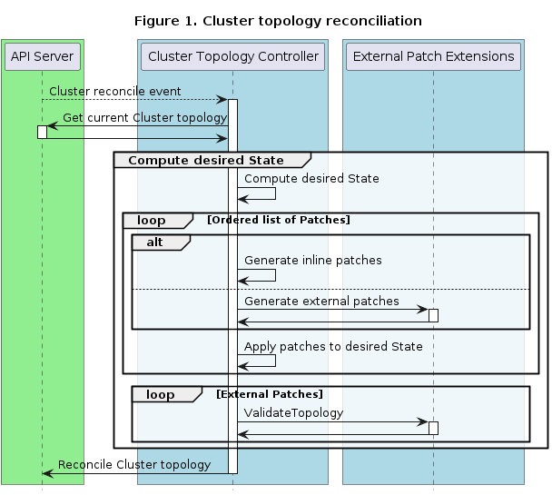

# Topology Mutation Hook

## Table of Contents

  * [Glossary](#glossary)
  * [Summary](#summary)
  * [Motivation](#motivation)
    * [Goals](#goals)
    * [Non-Goals](#non-goals)
    * [Future work](#future-work)
  * [Proposal](#proposal)
    * [User Stories](#user-stories)
    * [Cluster Operator guide](#cluster-operator-guide)
    * [ClusterClass author guide](#clusterclass-author-guide)
    * [Developer guide](#developer-guide)
      * [Cluster topology reconciliation](#cluster-topology-reconciliation)
      * [Definitions](#definitions)
      * [Guidelines](#guidelines)
      * [clusterctl alpha topology plan](#clusterctl-alpha-topology-plan)
    * [Security Model](#security-model)
    * [Risks and Mitigations](#risks-and-mitigations)
      * [Invalid Cluster topology](#invalid-cluster-topology)
      * [Infinite reconciles](#infinite-reconciles)
      * [External Patch extension slows down Cluster topology reconciliation](#external-patch-extension-slows-down-cluster-topology-reconciliation)
  * [Alternatives](#alternatives)
    * [Extending inline patches vs. introducing external patches](#extending-inline-patches-vs-introducing-external-patches)
  * [Upgrade Strategy](#upgrade-strategy)
    * [Cluster API version upgrade](#cluster-api-version-upgrade)
    * [Kubernetes version upgrade](#kubernetes-version-upgrade)
  * [Additional Details](#additional-details)
    * [Test Plan](#test-plan)
    * [Graduation Criteria](#graduation-criteria)
    * [Version Skew Strategy](#version-skew-strategy)
  * [Implementation History](#implementation-history)

## Glossary

Refer to the [Cluster API Book Glossary](https://cluster-api.sigs.k8s.io/reference/glossary.html).

- **Inline patches**: are defined inline in a ClusterClass and implemented by the core CAPI controller.
- **External patches**: are patches generated by an external component.
- **Topology Mutation Hook**: is a hook defined in this proposal that allows users to plug in an external component that generates patches.
- **External patch extension**: is an external component that generates patches.
- **Inline variables**: are variables defined inline in a ClusterClass.
- **External variables**: are variables defined by an external component.
- **Variable Discovery Hook**: is a hook defined in this proposal that allows an external component to supply variable definitions.

## Summary

This proposal introduces the Topology Mutation Hook, which makes it possible to mutate objects of the Cluster topology by generating patches externally. The patches are applied to templates defined in a ClusterClass.

## Motivation

A ClusterClass is used to create a set of Clusters of a similar shape, with the shape being defined by a set of templates. ClusterClasses are more valuable when they are flexible enough to be used for many variants of the same base Cluster shape. E.g. when they allow the deployment of Clusters in different regions or with different Machine types.

The current solution to make ClusterClasses flexible is to use inline patches based on the  [JSON Patch RFC6902](https://datatracker.ietf.org/doc/html/rfc6902) specification in order to customize templates for each Cluster. Inline patches are valuable for users approaching ClusterClass, or users not willing to develop and manage additional components. But the underlying technology has some limitations for the most complicated use cases:
* Inline patches are verbose and thus hard to understand
* Inline patches cannot be individually written, unit tested and released/versioned
* Inline patches cannot be reused across different ClusterClasses
* Inline patches cannot use external data
* JSON patch syntax might be unfamiliar to many users
* JSON patch has known limitations, e.g. for array modifications (as it is not a full programming language)

This proposal overcomes these limitations by introducing the Topology Mutation Hook, which makes it possible to mutate objects of the Cluster topology by providing externally generated patches to be applied to templates defined in a ClusterClass.

The main idea behind Topology Mutation Hook is to move the complexity that is currently encoded in YAML to a separate component where the user can leverage the full power of a programming language. This is achieved by leveraging the Runtime SDK and implementing a new Runtime Hook, the Topology Mutation Hook, that will allow users to create Runtime Extensions to provide externally generated patches (hereafter referred to as External Patch Extensions).

### Goals

* Define the OpenAPI specification of the Topology Mutation Hook
* Document when the corresponding External Patch Extensions are called
* Provide guidelines for developer implementing an External Patch Extension
* Define how to configure which External Patch Extensions apply to a ClusterClass
* Explore how External Patch Extensions can be validated using `clusterctl alpha topology plan`

### Non-Goals

* To replace or deprecate inline patches
* Prescribe how exactly an External Patch Extension has to be implemented

### Future work

* Explore a solution to detect and prevent an External Patch Extension to trigger infinite reconciles


## Proposal

### User Stories

As ClusterClass author:
* I want to enable an External Patch Extension which injects an HTTP proxy configuration into my Cluster topology.
* I want to enable an External Patch Extension which computes Machine images for my Cluster topology given the Kubernetes version and the region.
* I want to enable an External Patch Extension which enables image pulls from a private registry by injecting certificates into the Machines of my Cluster topology.
* I want to easily reuse an External Patch Extension in many ClusterClasses.

As an External Patch Extension developer:
* I want to use my preferred programming language to implement my External Patch Extension.
* I want to unit test the code/logic which generates external patches.
* I want to be able to generate external patches in either JSON Patch or JSON Merge Patch format.
* I want to generate external patches based on external data, for example by querying a cloud API.
* I want to supply the variable definitions, including schema and defaulting rules, for variables used in external patches. 
* I want to validate the templates after all patches have been applied, so I can be sure that other External Patch Extensions didn't overwrite my changes.

### Cluster Operator guide

As a Cluster operator, to use ClusterClasses with an External Patch Extension you have to deploy and register it. You can find the full documentation on how to deploy a Runtime Extension in the [Runtime SDK proposal](https://github.com/kubernetes-sigs/cluster-api/blob/75b39db545ae439f4f6203b5e07496d3b0a6aa75/docs/proposals/20220221-runtime-SDK.md#deploy-runtime-extensions).

An External Patch Extension can be registered by applying:
```yaml
apiVersion: runtime.cluster.x-k8s.io/v1beta1
kind: Extension
metadata:
  name: "my-awesome-patch"
spec:
  clientConfig:
    service:
      namespace: "capi-extensions"
      name: "my-awesome-patch"
```

Once the extension is registered the discovery hook is called and the Extension CR is updated with the list of the Runtime Extensions supported by the server. Most notably each Runtime Extension will get a unique name assigned, which is then used in the ClusterClass. For more details on discovery please see the [Runtime SDK proposal](https://github.com/kubernetes-sigs/cluster-api/blob/main/docs/proposals/20220221-runtime-SDK.md#registering-runtime-extensions).

### ClusterClass author guide

A ClusterClass author can use an External Patch Extension by referencing it in a ClusterClass.

A ClusterClass can have external patches, inline patches or both. The patches will then be applied in the order in which 
they are defined. The extension fields of the external patch must match the unique name of RuntimeExtensions assigned during discovery.
External patches can provide settings in map with key and string values. Settings and their usage are defined by GeneratePatch hook authors.

```yaml
apiVersion: cluster.x-k8s.io/v1beta1
kind: ClusterClass
metadata:
  name: quick-start
spec:
  patches:
  # external patch
  - name: external-patch-1
    external:
      generateExtension: "http-proxy.my-awesome-patch"
      discoverVariablesExtension: "variables.my-awesome-patch"
      validateExtension: "http-proxy-validate.my-awesome-patch"
      settings:
        firstSetting: "red"
        secondSettings: "blue"
    # inline patch
  - name: region
    definitions:
    ...
```

If the External Patch Extension requires variable definitions they must be defined and supplied using a Variable Discovery Hook. It is up to the External Patch Extension developer to define the variables, including their OpenAPI schema.

Note: In a previous version of this proposal variables defined inline in the ClusterClass `.spec` could be used in external patches.
With the introduction of Variable Discovery variables used in an external patch must come from an associated DiscoverVariables hook.

### Developer guide

This section provides guidance for developers on the implementation of an External Patch Extension. We are assuming that this extension will be implemented following the general guidelines in the [Runtime SDK proposal](https://github.com/kubernetes-sigs/cluster-api/blob/main/docs/proposals/20220221-runtime-SDK.md).

#### Cluster topology reconciliation

This section documents when the Topology Mutation Hook is going to be called during each Cluster topology reconciliation.



The remainder of this section has been moved to the Cluster API [book](../../docs/book/src/tasks/experimental-features/runtime-sdk/implement-topology-mutation-hook.md#introduction)
to avoid duplication.

#### Definitions

This section has been moved to the Cluster API [book](../../docs/book/src/tasks/experimental-features/runtime-sdk/implement-topology-mutation-hook.md#definitions)
to avoid duplication.

#### Guidelines

This section has been moved to the Cluster API [book](../../docs/book/src/tasks/experimental-features/runtime-sdk/implement-topology-mutation-hook.md#guidelines)
to avoid duplication.

#### clusterctl alpha topology plan

We want to be able to use `clusterctl alpha topology plan` to validate External Patch Extensions. To make this possible we will extend the command so users can point to locally running External Patch Extensions without having to deploy a full management cluster.

### Security Model

For the general Runtime Extension security model please refer to the [developer guide in the Runtime SDK proposal](https://github.com/kubernetes-sigs/cluster-api/blob/75b39db545ae439f4f6203b5e07496d3b0a6aa75/docs/proposals/20220221-runtime-SDK.md#security-model).

### Risks and Mitigations

#### Invalid Cluster topology

Externally generated patches just like inline patches can lead to an invalid Cluster topology. For example, a patch might set a field to an invalid value.

Mitigations:
* An External Patch Extension should be extensively unit and e2e tested to ensure it behaves as expected.
* Variable schemas should be used to configure validation on variable values provided by users on the Cluster.

#### Infinite reconciles

An infinite reconcile state occurs when the Cluster topology controller is unable to reconcile to the desired state, e.g. because the desired state changes on each reconciliation. This can occur when an External Patch Extension is non-deterministic, e.g. if it sets a field to a random generated value.

Mitigations:
* An External Patch Extension should be extensively unit and e2e tested to ensure it behaves as expected.
* Infinite reconciles can be triggered independent of external patching, thus we will explore a generic mechanism to detect infinite reconciles as future work.

#### External Patch extension slows down Cluster topology reconciliation

A slow External Patch Extension slows down the entire Cluster topology reconciliation. This can even lead to congestion in the Cluster topology controller.

Mitigations:
* External Patch Extension developers should ensure fast responses under all circumstances.
* Cluster operators can set a timeout on the RuntimeExtensionConfiguration to ensure Cluster topology reconciliation for all Clusters is not slowed down by one slow External Patch Extension. This only helps if the slow External Patch Extension is not used for all Clusters.

#### Clashing external variable definitions
Variable definitions supplied externally by an External Patch Extension through a Variable Discovery Hook can change when the definition in the External Patch Extension changes. This can lead to a clash where variables that previously had the same name and definition no longer have the same definition.

Mitigations:
* Variable Discovery Hooks allow addressing conflicting variables individually by specifying the source of the variable's definition when setting the variable value in the Cluster.
* ClusterClass authors should pro-actively test any changes to ClusterClasses and associated Runtime Extensions to avoid clashing variable definitions.
* External Patch extension authors should extensively document their patches, variables and their usage.

## Alternatives

### Extending inline patches vs. introducing external patches

As outlined in [Motivation](#motivation) inline patches have limitations. An alternative to implementing external patches would have been to extend inline patches to make them more powerful. But we think that is not possible given the inherent limitations of JSON patches. YAML is not a programming language.

## Upgrade Strategy

#### Cluster API version upgrade

This proposal does not affect the Cluster API upgrade strategy.

If a new ClusterAPI version introduces a new Topology Mutation Hook version, External Patch Extensions should be adapted, to avoid issues when older Topology Mutation Hook versions are eventually removed. For details about the deprecation rules please refer to the [Runtime SDK](https://github.com/kubernetes-sigs/cluster-api/blob/75b39db545ae439f4f6203b5e07496d3b0a6aa75/docs/proposals/20220221-runtime-SDK.md#runtime-sdk-rules-1).

If a new ClusterAPI or ClusterAPI provider version introduces a new version of their API, External Patch extensions should be adapted to be able to handle the new APIs.

#### Kubernetes version upgrade

This proposal does not affect the Cluster API cluster upgrade strategy. However External Patch Extensions should be able to handle different Kubernetes versions.

## Additional Details

### Test Plan

While in alpha phase it is expected that the Topology Mutation Hook will have unit and integration tests covering the topology reconciliation with external patches.

With the increasing adoption of this feature we expect E2E test coverage for topology reconciliation with a Runtime Extension generating external patches.

### Graduation Criteria

Main criteria for graduating this feature is adoption; further detail about graduation criteria will be added in future iterations of this document.

### Version Skew Strategy

See [upgrade strategy](#upgrade-strategy).

## Implementation History

* [x] 2022-03-15: Compiled a [CAEP Google Doc](https://docs.google.com/document/d/1CMqFklLFfK6jP84Yk5ec2suANThPZ6WgRwZgEiosQMY)
* [x] 2022-03-21: Opened corresponding [issue](https://github.com/kubernetes-sigs/cluster-api/issues/6319)
* [x] 2022-03-23: Presented proposal at a [community meeting]
* [x] 2022-03-30: Opened proposal PR

<!-- Links -->
[community meeting]: https://docs.google.com/document/d/1ushaVqAKYnZ2VN_aa3GyKlS4kEd6bSug13xaXOakAQI/edit#heading=h.pxsq37pzkbdq
