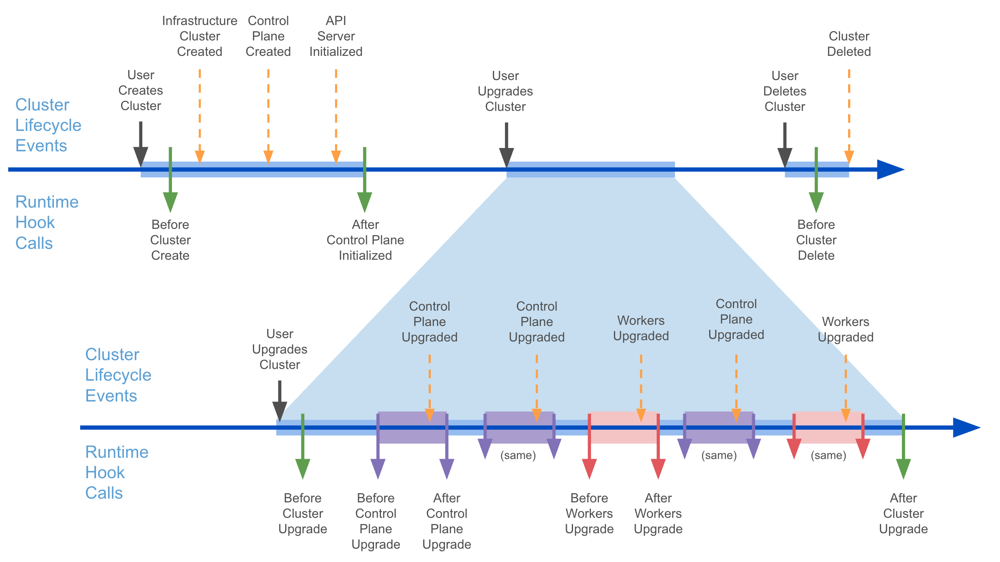

# Runtime hooks for Add-on Management

## Table of Contents

<!-- START doctoc generated TOC please keep comment here to allow auto update -->
<!-- DON'T EDIT THIS SECTION, INSTEAD RE-RUN doctoc TO UPDATE -->

- [Glossary](#glossary)
- [Summary](#summary)
- [Motivation](#motivation)
  - [Goals](#goals)
  - [Non-Goals](#non-goals)
- [Proposal](#proposal)
  - [User Stories](#user-stories)
  - [Runtime hook definitions](#runtime-hook-definitions)
  - [Runtime Extensions developer guide](#runtime-extensions-developer-guide)
  - [Security Model](#security-model)
  - [Risks and Mitigations](#risks-and-mitigations)
    - [Runtime Extension blocks Cluster lifecycle indefinitely](#runtime-extension-blocks-cluster-lifecycle-indefinitely)
- [Alternatives](#alternatives)
  - [External components watching CAPI resources without hooks](#external-components-watching-capi-resources-without-hooks)
  - [OpenAPI spec implementation alternatives](#openapi-spec-implementation-alternatives)
    - [Adding Cluster info to request vs providing only the Cluster name](#adding-cluster-info-to-request-vs-providing-only-the-cluster-name)
    - [Embedding CAPI types in request vs using runtime.RawExtension](#embedding-capi-types-in-request-vs-using-runtimerawextension)
- [Upgrade strategy](#upgrade-strategy)
    - [Cluster API version upgrade](#cluster-api-version-upgrade)
    - [Kubernetes version upgrade](#kubernetes-version-upgrade)
- [Additional Details](#additional-details)
  - [Test Plan](#test-plan)
  - [Graduation Criteria](#graduation-criteria)
  - [Version Skew Strategy](#version-skew-strategy)
- [Implementation History](#implementation-history)

<!-- END doctoc generated TOC please keep comment here to allow auto update -->

## Glossary

Refer to the [Cluster API Book Glossary](https://cluster-api.sigs.k8s.io/reference/glossary.html).

* Add-on: an application that extends the functionality of Kubernetes.


## Summary

This proposal introduces a set of Runtime Hooks designed for providing the foundation for the implementation of add-on orchestration solutions on top of Cluster API.
However, given that the hooks defined in this proposal are going to model common events in the Cluster lifecycle they could be used for other use cases beyond add-on 
management, but for the sake of having a focused and actionable scope, we are not exploring those option in this document. 

## Motivation

Cluster Resource Set (CRS) is the current add-on management tool packaged with Cluster API, but many users rely on their own package management tool like helm, kapp, ArgoCD or flux, because those tools have a broad range of capabilities that are not currently available in CRS.

The ability to orchestrate add-ons in line with events in the cluster lifecycle is becoming a requirement for many CAPI users, but in order to make this possible a mechanism to plug into the cluster lifecycle is required. This proposal introduces a set of Runtime Hooks designed to meet the need for add-on management orchestration including:

* Operations for installing add-ons during the cluster provisioning workflow
* Operations for upgrading add-ons during the cluster upgrade workflow
* Operations for handling add-ons during the cluster deletion workflow

Runtime Hooks enable the Cluster Lifecycle to trigger these processes based on the current state of the cluster, allowing them to start after some state has been reached or waiting for them to complete before moving on with Cluster-wide operations such as Cluster creation or deletion.

Once these hooks are in place, it will be possible to build a comprehensive add-on orchestration solution on top of Cluster API that can leverage external tools such as helm, kapp, ArgoCD, flux or eventually CRS as an alternative.

### Goals

* Identify a set of Runtime Hooks that enable management of the entire add-on lifecycle 
* Define the OpenAPI specification of these Runtime Hooks
* Document when the corresponding Runtime Extensions are called
* Provide guidelines for developers implementing a corresponding Runtime Extension

### Non-Goals

* Defining all possible Runtime Hooks in Cluster API; this proposal defines only a subset of hooks required for add-on orchestration.
* Define a full add-on management solution or define detailed steps for solving add-on related problems like CPI migration from in-tree to out-of-tree; this proposal is focused only in providing the foundational capabilities to do so. 

## Proposal

This proposal adds a set of Runtime Hooks specifically designed for Cluster created from a ClusterClass and thus leveraging the idea of managed topology. 

The main reason for this choice is because a managed topology has a set of capabilities required for lifecycle hooks implementation:

* A managed topology has the overarching view of the entire Cluster (vs other components in CAPI which are limited to controlling single resources or a subset of them).
* A managed topology already has the capability to control all resources in a Cluster, thus making it possible to orchestrate lifecycle workflows like e.g. upgrades.

In practice, if we look at the six lifecycle hooks introduced by this proposal, we should recognize that four of them cannot be implemented outside of the topology controller
because there is no viable point to be used in an alternative (BeforeClusterCreate, BeforeClusterUpgrade, AfterControlPlaneUpgrade, and AfterClusterUpgrade). 

Also, by working in the topology controller it is possible to implement hooks allowing to block the cluster from transitioning from one state to another, which is a capability
required to properly orchestrate the addon lifecycle.

###  User Stories

These user stories are based on a concrete example of an add-on - a metrics database -  to illustrate the use of each Runtime Hook.

As a developer of an add-ons orchestration solution:

* **Before a Cluster is Created** I want to automatically check if enough disk space is available for allocation to the cluster for persistent storage of collected metrics values.
* **After the Control Plane** **is Initialized** I want to automatically install a metrics database and associated add-ons in the workload cluster.
* **Before the Cluster is Upgraded** I want to install a new version of the metrics database with a new version of the custom metrics apiservice to interact directly with the Kubernetes apiserver.
* **Before the ControlPlane is Upgraded** I want to install a new version of the metrics database with a new version of the custom metrics apiservice to interact directly with the Kubernetes apiserver.
* **After the ControlPlane is Upgraded** I want to install new versions of metrics collectors to each upgraded node in the cluster.
* **Before workers are Upgraded** I want to install a new version of the metrics database with a new version of the custom metrics apiservice to interact directly with the Kubernetes apiserver.
* **After workers are Upgraded** I want to install new versions of metrics collectors to each upgraded node in the cluster
* **After the Cluster is Upgraded** I want to install new versions of metrics collectors to each upgraded node in the cluster.
* **Before the Cluster is Deleted** I want to automatically back up persistent volumes used by the metrics database.

### Runtime hook definitions

Below is a description for the Runtime Hooks introduced by this proposal.



The remainder of this section has been moved to the Cluster API [book](../../docs/book/src/tasks/experimental-features/runtime-sdk/implement-lifecycle-hooks.md#definitions)
to avoid duplication.

Note: Following change will be applied to the hooks with the ongoing work for [Chained and efficient upgrades](./20250513-chained-and-efficient-upgrades-for-clusters-with-managed-topologies.md); the
documentation in the book will be aligned as soon as the work completes:

#### BeforeClusterUpgrade (modified)

Request message will be extended with the info about the upgrade plane. e.g.

##### Example Request:
```yaml
apiVersion: hooks.runtime.cluster.x-k8s.io/v1alpha1
kind: BeforeClusterUpgradeRequest
settings: <Runtime Extension settings>
cluster:
  apiVersion: cluster.x-k8s.io/v1beta1
  kind: Cluster
  metadata:
   name: test-cluster
   namespace: test-ns
  spec:
   ...
  status:
   ...
fromKubernetesVersion: "v1.30.0"
toKubernetesVersion: "v1.33.0"
upgradePlan:
  controlPlane:
  - v1.30.0
  - v1.31.0
  - v1.32.3
  - v1.33.0
  workers:
  - v1.32.3
  - v1.33.0
```

####  BeforeControlPlaneUpgrade (new hook)

This hook is called before a new version is propagated to the control plane object. Runtime Extension implementers
can use this hook to execute pre-upgrade add-on tasks and block upgrades of the ControlPlane.

Note:
- When an upgrade is starting, BeforeControlPlaneUpgrade will be called after BeforeClusterUpgrade is completed.
- When an upgrade is in progress BeforeControlPlaneUpgrade will be called for each intermediate version that will
  be applied to the control plane (instead BeforeClusterUpgrade will be called only once at the beginning of the upgrade).

##### Example Request:

```yaml
apiVersion: hooks.runtime.cluster.x-k8s.io/v1alpha1
kind: BeforeControlPlaneUpgradeRequest
settings: <Runtime Extension settings>
cluster:
  apiVersion: cluster.x-k8s.io/v1beta1
  kind: Cluster
  metadata:
   name: test-cluster
   namespace: test-ns
  spec:
   ...
  status:
   ...
fromKubernetesVersion: "v1.30.0"
toKubernetesVersion: "v1.33.0"
upgradePlan:
  controlPlane:
  - v1.30.0
  - v1.31.0
  - v1.32.3
  - v1.33.0
  workers:
  - v1.32.3
  - v1.33.0
```

Note: The upgrade plan in the request contains only missing steps to reach the target version.

##### Example Response:

```yaml
apiVersion: hooks.runtime.cluster.x-k8s.io/v1alpha1
kind: BeforeControlPlaneUpgradeResponse
status: Success # or Failure
message: "error message if status == Failure"
retryAfterSeconds: 10
```

####  AfterControlPlaneUpgrade (modified)

This hook is called after the control plane has been upgraded to the version specified in `spec.topology.version`
or to an intermediate version in the upgrade plan and:
- if workers upgrade can be skipped for this version, immediately before the next intermediate version is applied to the control plane
- if workers upgrade must be performed for this version, immediately before the new version is going to be propagated to the MachineDeployments of the Cluster.

Runtime Extension implementers can use this hook to execute post-upgrade add-on tasks and block upgrades to the next
version of the control plane or to workers until everything is ready.

Note: While the MachineDeployments upgrade is blocked changes made to existing MachineDeployments and creating new MachineDeployments
will be delayed while the object is waiting for upgrade. Example: modifying MachineDeployments (think scale up),
or creating new MachineDeployments will be delayed until the target MachineDeployment is ready to pick up the upgrade.
This ensures that the MachineDeployments do not perform a rollout prematurely while waiting to be rolled out again for the version upgrade (no double rollouts).
This also ensures that any version specific changes are only pushed to the underlying objects also at the correct version.

##### Example Request:

```yaml
apiVersion: hooks.runtime.cluster.x-k8s.io/v1alpha1
kind: AfterControlPlaneUpgradeRequest
settings: <Runtime Extension settings>
cluster:
  apiVersion: cluster.x-k8s.io/v1beta1
  kind: Cluster
  metadata:
   name: test-cluster
   namespace: test-ns
  spec:
   ...
  status:
   ...
kubernetesVersion: "v1.30.0"
upgradePlan:
  controlPlane:
    - v1.31.0
    - v1.32.3
    - v1.33.0
  workers:
    - v1.32.3
    - v1.33.0
```

Note: The upgrade plan in the request contains only missing steps to reach the target version, if any.

##### Example Response:

```yaml
apiVersion: hooks.runtime.cluster.x-k8s.io/v1alpha1
kind: AfterControlPlaneUpgradeResponse
status: Success # or Failure
message: "error message if status == Failure"
retryAfterSeconds: 10
```

####  BeforeWorkersUpgrade (new hook)

This hook is called before a new version is propagated to workers. Runtime Extension implementers
can use this hook to execute pre-upgrade add-on tasks and block upgrades of Workers.

Note:
- This hook will be called only if workers upgrade must be performed for an intermediate version of a chained upgrade
  or when upgrading to the target `spec.topology.version`.

##### Example Request:

```yaml
apiVersion: hooks.runtime.cluster.x-k8s.io/v1alpha1
kind: BeforeWorkersUpgradeRequest
settings: <Runtime Extension settings>
cluster:
  apiVersion: cluster.x-k8s.io/v1beta1
  kind: Cluster
  metadata:
   name: test-cluster
   namespace: test-ns
  spec:
   ...
  status:
   ...
fromKubernetesVersion: "v1.30.0"
toKubernetesVersion: "v1.33.0"
upgradePlan:
  controlPlane:
  - v1.30.0
  - v1.31.0
  - v1.32.3
  - v1.33.0
  workers:
  - v1.32.3
  - v1.33.0
```

Note: The upgrade plan in the request contains only missing steps to reach the target version.

##### Example Response:

```yaml
apiVersion: hooks.runtime.cluster.x-k8s.io/v1alpha1
kind: BeforeWorkersUpgradeResponse
status: Success # or Failure
message: "error message if status == Failure"
retryAfterSeconds: 10
```

####  AfterWorkersUpgrade (new hook)

This hook is called after all the workers have been upgraded to the version specified in `spec.topology.version`
or to an intermediate version in the upgrade plan, and:
- if the upgrade plan is completed and the entire cluster is at `spec.topology.version`, immediately before calling the AfterClusterUpgrade hook
- if the upgrade plan is not complete and the entire cluster is now at one of the intermediate versions, immediately before calling BeforeControlPlaneUpgrade hook for the next intermediate step

Runtime Extension implementers can use this hook to execute post-upgrade add-on tasks; if the upgrade plan is not completed,
this hook allows to block upgrades to the next version of the control plane until everything is ready.

##### Example Request:

```yaml
apiVersion: hooks.runtime.cluster.x-k8s.io/v1alpha1
kind: AfterWorkersUpgradeRequest
settings: <Runtime Extension settings>
cluster:
  apiVersion: cluster.x-k8s.io/v1beta1
  kind: Cluster
  metadata:
   name: test-cluster
   namespace: test-ns
  spec:
   ...
  status:
   ...
kubernetesVersion: "v1.30.0"
upgradePlan:
  controlPlane:
    - v1.31.0
    - v1.32.3
    - v1.33.0
  workers:
    - v1.32.3
    - v1.33.0
```

Note: The upgrade plan in the request contains only missing steps to reach the target version, if any.

##### Example Response:

```yaml
apiVersion: hooks.runtime.cluster.x-k8s.io/v1alpha1
kind: AfterWorkersUpgradeResponse
status: Success # or Failure
message: "error message if status == Failure"
retryAfterSeconds: 10
```

Note: retryAfterSeconds is ignored when workers version is equal to `spec.topology.version`.

###  Runtime Extensions developer guide

This section has been moved to the Cluster API [book](../../docs/book/src/tasks/experimental-features/runtime-sdk/implement-lifecycle-hooks.md#guidelines)
to avoid duplication.

###  Security Model

For the general Runtime Extension security model please refer to the [developer guide in the Runtime SDK proposal](https://github.com/kubernetes-sigs/cluster-api/blob/75b39db545ae439f4f6203b5e07496d3b0a6aa75/docs/proposals/20220221-runtime-SDK.md#security-model).

###  Risks and Mitigations

####  Runtime Extension blocks Cluster lifecycle indefinitely

Cluster lifecycle can be blocked indefinitely when a Runtime Extension either blocks or fails indefinitely. Mitigation:

* Surface errors from the Runtime Extension that is blocking reconciliation in Conditions to drive necessary action needed by the user.
* A Runtime Extension should be extensively unit and e2e tested to ensure it behaves as expected.
* Users should be able to manually intervene and unblock the reconciliation.

As future work, we will explore more options like circuit breaker and timeout to unblock reconciliation.


## Alternatives

Alternatives to Runtime Hooks for comprehensive add-on management in Cluster API include:

### External components watching CAPI resources without hooks

This is the current pattern used by Cluster Resource Set. The implementers can only react to changes on CAPI resources, e.g. a Cluster being created, but they have no control over the cluster lifecycle.

This and similar solutions based on scripting or git ops approaches are considered inadequate for comprehensive, integrated add-on management as they have limited insight into the state of the Cluster and can not easily influence reconciliation based on add-on state.

More details about why watching Cluster API resources without hooks is not considered a valid alternative can be found in the [Cluster Addon Proposal](https://docs.google.com/document/d/1TdbfXC2_Hhg0mH7-7hXcT1Gg8h6oXKrKbnJqbpFFvjw/edit).

### OpenAPI spec implementation alternatives

For the implementation detail of Open API spec, we considered following alternative approaches:
#### Adding Cluster info to request vs providing only the Cluster name

In the proposed Open API specification for request type we have a full Cluster object. We considered an alternative of only including the Cluster name and namespace to reduce the size of the message. It was rejected based on the assumption that most extensions will require at least some additional information from the Cluster. Sending the full object reduces calls to the API server.

#### Embedding CAPI types in request vs using runtime.RawExtension

In the proposed Open API specification we are including the Cluster API object in requests. We considered using runtime.RawExtension in order to avoid having to bump the version of lifecycle hooks when bumping the version of the CAPI types. It was rejected as sending another version of the CAPI type via runtime.RawExtension would always be a breaking change. Embedding the type directly makes the version of the API used explicit.

## Upgrade strategy

####  Cluster API version upgrade

This proposal does not affect the Cluster API upgrade strategy.

If a new ClusterAPI version introduces a new Lifecycle Hook version, Runtime Extensions should be adapted, to avoid issues when older Lifecycle Hook versions are eventually removed. For details about the deprecation rules please refer to the [Runtime SDK](https://github.com/kubernetes-sigs/cluster-api/blob/75b39db545ae439f4f6203b5e07496d3b0a6aa75/docs/proposals/20220221-runtime-SDK.md#runtime-sdk-rules-1).


#### Kubernetes version upgrade

This proposal does not affect the Cluster API cluster upgrade strategy.

However Runtime Extension will be able to tap into the upgrade process at defined stages.

## Additional Details

### Test Plan

While in alpha phase it is expected that the Runtime Hooks will have unit and integration tests covering the topology reconciliation with calls to Runtime Extensions.

With the increasing adoption of this feature we expect E2E test coverage for topology reconciliation with a Runtime Extension generating Runtime Hook Responses.

### Graduation Criteria

Main criteria for graduating this feature is adoption; further detail about graduation criteria will be added in future iterations of this document.

### Version Skew Strategy

See [upgrade strategy](#upgrade-strategy).

## Implementation History

* [x] 2022-03-29: Compiled a [CAEP Google Doc](https://docs.google.com/document/d/1vMwzGBi6XbIwKzP5aA7Mj9UdhAWKYqI-QmdDtcxWnA4)
* [x] 2022-04-04: Opened corresponding [issue](https://github.com/kubernetes-sigs/cluster-api/issues/6374)
* [x] 2022-04-06: Presented proposal at a [community meeting]
* [x] 2022-04-14: Opened proposal PR
* [x] 2025-05-13: Added runtime hooks for chained upgrades; see [proposal: Chained and efficient upgrades for Clusters with managed topologies](20250513-chained-and-efficient-upgrades-for-clusters-with-managed-topologies.md)

<!-- Links -->
[community meeting]: https://docs.google.com/document/d/1ushaVqAKYnZ2VN_aa3GyKlS4kEd6bSug13xaXOakAQI/edit#heading=h.pxsq37pzkbdq
