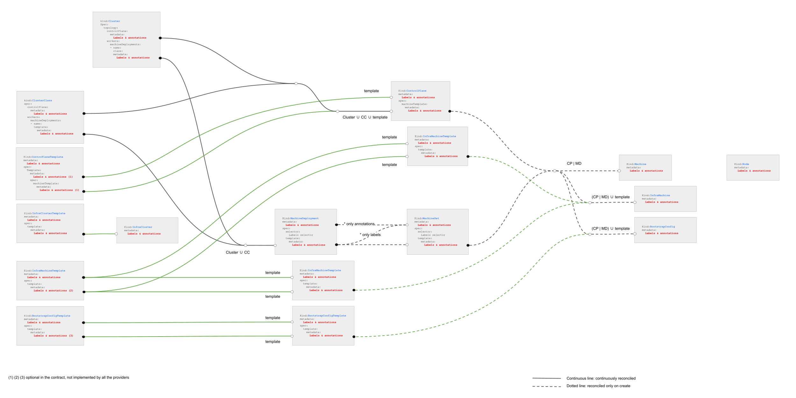
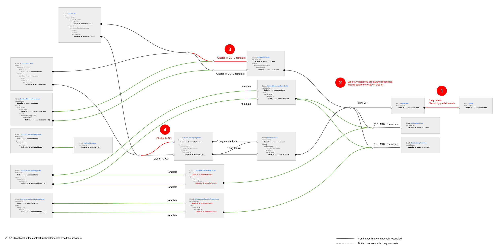

# In place propagation of changes affecting Kubernetes objects only

## Table of Contents

<!-- START doctoc generated TOC please keep comment here to allow auto update -->
<!-- DON'T EDIT THIS SECTION, INSTEAD RE-RUN doctoc TO UPDATE -->

- [Glossary](#glossary)
- [Summary](#summary)
- [Motivation](#motivation)
  - [Goals](#goals)
  - [Non-Goals](#non-goals)
  - [Future-Goals](#future-goals)
- [Proposal](#proposal)
  - [User Stories](#user-stories)
    - [Story 1](#story-1)
    - [Story 2](#story-2)
    - [Story 3](#story-3)
    - [Story 4](#story-4)
  - [Implementation Details/Notes/Constraints](#implementation-detailsnotesconstraints)
  - [Metadata propagation](#metadata-propagation)
    - [1. Label Sync Between Machine and underlying Kubernetes Nodes](#1-label-sync-between-machine-and-underlying-kubernetes-nodes)
    - [2. Labels/Annotations always reconciled](#2-labelsannotations-always-reconciled)
    - [3. and 4. Set top level labels/annotations for ControlPlane and MachineDeployment created from a ClusterClass](#3-and-4-set-top-level-labelsannotations-for-controlplane-and-machinedeployment-created-from-a-clusterclass)
  - [Propagation of fields impacting only Kubernetes objects or controller behaviour](#propagation-of-fields-impacting-only-kubernetes-objects-or-controller-behaviour)
  - [In-place propagation](#in-place-propagation)
    - [MachineDeployment rollouts](#machinedeployment-rollouts)
      - [What about the hash label](#what-about-the-hash-label)
    - [KCP rollouts](#kcp-rollouts)
    - [Avoiding conflicts with other components](#avoiding-conflicts-with-other-components)
- [Alternatives](#alternatives)
  - [To not use SSA for in-place propagation and be authoritative on labels and annotations](#to-not-use-ssa-for-in-place-propagation-and-be-authoritative-on-labels-and-annotations)
  - [To not use SSA for in-place propagation and do not delete labels/annotations](#to-not-use-ssa-for-in-place-propagation-and-do-not-delete-labelsannotations)
  - [To not use SSA for in-place propagation and use status fields to track labels previously applied by CAPI](#to-not-use-ssa-for-in-place-propagation-and-use-status-fields-to-track-labels-previously-applied-by-capi)
  - [Change more propagation rules](#change-more-propagation-rules)
  - [Change more propagation rules](#change-more-propagation-rules-1)
- [Implementation History](#implementation-history)

<!-- END doctoc generated TOC please keep comment here to allow auto update -->

## Glossary

Refer to the [Cluster API Book Glossary](https://cluster-api.sigs.k8s.io/reference/glossary.html).

**In-place mutable fields**: fields which changes would only impact Kubernetes objects or/and controller behaviour
but they won't mutate in any way provider infrastructure nor the software running on it. In-place mutable fields
are propagated in place by CAPI controllers to avoid the more elaborated mechanics of a replace rollout.
They include metadata, MinReadySeconds, NodeDrainTimeout, NodeVolumeDetachTimeout and NodeDeletionTimeout but are
not limited to be expanded in the future.

## Summary

This document discusses how labels, annotation and other fields impacting only Kubernetes objects or controller behaviour (e.g NodeDrainTimeout)
propagate from ClusterClass to KubeadmControlPlane/MachineDeployments and ultimately to Machines.

## Motivation

Managing labels on Kubernetes nodes has been a long standing [issue](https://github.com/kubernetes-sigs/cluster-api/issues/493) in Cluster API.

The following challenges have been identified through various iterations:

- Define how labels propagate from Machine to Node.
- Define how labels and annotations propagate from ClusterClass to KubeadmControlPlane/MachineDeployments and ultimately to Machines.
- Define how to prevent that label and annotation propagation triggers unnecessary rollouts.

The first point is being addressed by [Label Sync Between Machine and underlying Kubernetes Nodes](./20220927-label-sync-between-machine-and-nodes.md),
while this document tackles the remaining two points.

During a preliminary exploration we identified that the two above challenges apply also to other fields impacting only Kubernetes objects or
controller behaviour (see e.g. [Support to propagate properties in-place from MachineDeployments to Machines](https://github.com/kubernetes-sigs/cluster-api/issues/5880)).

As a consequence we have decided to expand this work to consider how to propagate labels, annotations and fields impacting only Kubernetes objects or
controller behaviour, as well as this related issue: [Labels and annotations for MachineDeployments and KubeadmControlPlane created by topology controller](https://github.com/kubernetes-sigs/cluster-api/issues/7006).

### Goals

- Define how labels and annotations propagate from ClusterClass to KubeadmControlPlane/MachineDeployments and ultimately to Machines.
- Define how fields impacting only Kubernetes objects or controller behaviour propagate from ClusterClass to KubeadmControlPlane
  MachineDeployments, and ultimately to Machines.
- Define how to prevent that propagation of labels, annotations and other fields impacting only Kubernetes objects or controller behaviour
  triggers unnecessary rollouts.

### Non-Goals

- Discuss the immutability core design principle in Cluster API (on the contrary, this proposal makes immutability even better by improving
  the criteria on when we trigger Machine rollouts).
- To support in-place mutation for components or settings that exist on Machines (this proposal focuses only on labels, annotations and other
  fields impacting only Kubernetes objects or controller behaviour).

### Future-Goals

- Expand propagation rules including MachinePools after the [MachinePools Machine proposal](./20220209-machinepool-machines.md) is implemented.

## Proposal

### User Stories

#### Story 1

As a cluster admin/user, I would like a declarative and secure means by which to assign roles to my nodes via Cluster topology metadata
(for Clusters with ClusterClass).

As a cluster admin/user, I would like a declarative and secure means by which to assign roles to my nodes via KubeadmControlPlane and
MachineDeployments (for Clusters without ClusterClass).

#### Story 2

As a cluster admin/user, I would like to change labels or annotations on Machines without triggering Machine rollouts.

#### Story 3

As a cluster admin/user, I would like to change nodeDrainTimeout on Machines without triggering Machine rollouts.

#### Story 4

As a cluster admin/user, I would like to set autoscaler labels for MachineDeployments by changing Cluster topology metadata
(for Clusters with ClusterClass).

### Implementation Details/Notes/Constraints

### Metadata propagation

The following schema represent how metadata propagation works today (also documented in [book](https://cluster-api.sigs.k8s.io/developer/architecture/controllers/metadata-propagation.html)).



With this proposal we are suggesting to improve metadata propagation as described in the following schema:



Following paragraphs provide more details about the proposed changes.

#### 1. Label Sync Between Machine and underlying Kubernetes Nodes

As discussed in [Label Sync Between Machine and underlying Kubernetes Nodes](./20220927-label-sync-between-machine-and-nodes.md) we are propagating only
labels with a well-known prefix or a well-known domain from the Machine to the corresponding Kubernetes Node.

#### 2. Labels/Annotations always reconciled

All the labels/annotations previously set only on creation are now going to be always reconciled;
in order to prevent unnecessary rollouts, metadata propagation should happen in-place;
see [in-place propagation](#in-place-propagation) down in this document for more details. 

Note: As of today the topology controller already propagates ClusterClass and Cluster topology metadata changes in-place when possible
in order to avoid unnecessary template rotation with the consequent Machine rollout; we do not foresee changes to this logic.

#### 3. and 4. Set top level labels/annotations for ControlPlane and MachineDeployment created from a ClusterClass

Labels and annotations from ClusterClass and Cluster.topology are going to be propagated to top-level level labels  and annotations in
ControlPlane and MachineDeployment.

This addresses [Labels and annotations for MachineDeployments and KubeadmControlPlane created by topology controller](https://github.com/kubernetes-sigs/cluster-api/issues/7006).

Note: The proposed solution avoids to add additional metadata fields in ClusterClass and Cluster.topology, but
this has the disadvantage that it is not possible to differentiate top-level labels/annotations from Machines,
but given the discussion on the above issue this isn't a requirement.

### Propagation of fields impacting only Kubernetes objects or controller behaviour

In addition to labels and annotations, there are also other fields that flow down from ClusterClass to KubeadmControlPlane/MachineDeployments and
ultimately to Machines.

Some of them can be considered like labels and annotations, because they have impacts only on Kubernetes objects or controller behaviour, but
not on the actual Machine itself - including infrastructure and the software running on it  (in-place mutable fields).
Examples are `MinReadySeconds`, `NodeDrainTimeout`, `NodeVolumeDetachTimeout`, `NodeDeletionTimeout`.

Propagation of changes to those fields will be implemented using the same [in-place propagation](#in-place-propagation) mechanism implemented
for metadata.

### In-place propagation

With in-place propagation we are referring to a mechanism that updates existing Kubernetes objects, like MachineSets or Machines, instead of
creating a new object with the updated fields and then deleting the current Kubernetes object.

The main benefit of this approach is that it prevents unnecessary rollouts of the corresponding infrastructure, with the consequent creation/
deletion of a Kubernetes node and drain/scheduling of workloads hosted on the Machine being deleted.

**Important!** In-place propagation of changes as defined above applies only to metadata changes or to fields impacting only Kubernetes objects
or controller behaviour. This approach can not be used to apply changes to the infrastructure hosting a Machine, to the OS or any software
installed on it, Kubernetes components included (Kubelet, static pods, CRI etc.).

Implementing in-place propagation has two distinct challenges:

- Current rules defining when MachineDeployments or KubeadmControlPlane trigger a rollout should be modified in order to ignore metadata and
  other fields that are going to be propagated in-place.

- When implementing the reconcile loop that performs in-place propagation, it is required to avoid impact on other components applying
  labels or annotations to the same object. For example, when reconciling labels to a Machine, Cluster API should take care of reconciling
  only the labels it manages, without changing any label applied by the users/by another controller on the same Machine.

#### MachineDeployment rollouts

The MachineDeployment controller determines when a rollout is required using a "semantic equality" comparison between current MachineDeployment
spec and the corresponding MachineSet spec.

While implementing this proposal we should change the definition of "semantic equality" in order to exclude metadata and fields that
should be updated in-place.

On top of that we should also account for the use case where, after deploying the new "semantic equality" rule, there is already one or more
MachineSet(s) matching the MachineDeployment. Today in this case Cluster API deterministically picks the oldest of them.

When exploring the solution for this proposal we discovered that the above approach can cause turbulence in the Cluster because it does not
take into account to which MachineSets existing Machines belong. As a consequence a Cluster API upgrade could lead to a rollout with Machines moving from
a "semantically equal" MachineSet to another, which is an unnecessary operation.

In order to prevent this we are modifying the MachineDeployment controller in order to pick the "semantically equal" MachineSet with more
Machines, thus avoiding or minimizing turbulence in the Cluster.

##### What about the hash label

The MachineDeployment controller relies on a label with a hash value to identify Machines belonging to a MachineSet; also, the hash value
is used as suffix for the MachineSet name.

Currently the hash is computed using an algorithm that considers the same set of fields used to determine "semantic equality" between current
MachineDeployment spec and the corresponding MachineSet spec.

When exploring the solution for this proposal, we decided above algorithm can be simplified by using a simple random string
plus a check that ensures that the random string is not already taken by an existing MachineSet (for this MachineDeployment).

The main benefit of this change is that we are going to decouple "semantic equality" from computing a UID to be used for identifying Machines
belonging to a MachineSet. Thus making the code easier to understand and simplifying future changes on rollout rules.

#### KCP rollouts

The KCP controller determines when a rollout is required using a "semantic equality" comparison between current KCP
object and the corresponding Machine object.

The "semantic equality" implementation is pretty complex, but for the sake of this proposal only a few detail are relevant:

- Rollout is triggered if a Machine doesn't have all the labels and the annotations in spec.machineTemplate.Metadata.
- Rollout is triggered if the KubeadmConfig linked to a Machine doesn't have all the labels and the annotations in spec.machineTemplate.Metadata.

While implementing this proposal, above rule should be dropped, and replaced by in-place update of label & annotations.
Please also note that the current rule does not detect when a label/annotation is removed from spec.machineTemplate.Metadata
and thus users are required to remove labels/annotation manually; this is considered a bug and the new implementation
should account for this use case.

Also, according to the current "semantic equality" rules, changes to nodeDrainTimeout, nodeVolumeDetachTimeout, nodeDeletionTimeout are
applied only to new machines (they don't trigger rollout). While implementing this proposal, we should make sure that
those changes are propagated to existing machines, without triggering rollout.

#### Avoiding conflicts with other components

While doing [in-place propagation](#in-place-propagation), and thus continuously reconciling info from a Kubernetes
object to another we are also reconciling values in a map, like e.g. Labels or Annotations.

This creates some challenges. Assume that:

We want to reconcile following labels form MachineDeployment to Machine:

```yaml
labels:
  a: a 
  b: b
```

After the first reconciliation, the Machine gets above labels.
Now assume that we remove label `b` from the MachineDeployment; The expected set of labels is 

```yaml
labels:
  a: a 
```

But the machine still has the label `b`, and the controller cannot remove it, because at this stage there is not 
a clear signal allowing to detect if this label has been applied by Cluster API or by the user or another controllers.

In order to manage properly this use case, that is co-authored maps, the solution available in API server is
to use [Server Side Apply patches](https://kubernetes.io/docs/reference/using-api/server-side-apply/).

Based on previous experience in introducing SSA in the topology controller this change requires a lot of testing
and validation. Some cases that should be specifically verified includes:

- introducing SSA patches on an already existing object (and ensure that SSA takes over ownership of managed labels/annotations properly)
- using SSA patches on objects after move or velero backup/restore (and ensure that SSA takes over ownership of managed labels/annotations properly)

However, despite those use case to be verified during implementation, it is assumed that using API server 
build in capabilities is a stronger, long term solution than any other alternative.

## Alternatives

### To not use SSA for [in-place propagation](#in-place-propagation) and be authoritative on labels and annotations

If Cluster API uses regular patches instead of SSA patches, a well tested path in Cluster API, Cluster API can
be implemented in order to be authoritative on label and annotations, that means that all the labels and annotations should
be propagated from higher level objects (e.g. all the Machine's labels should be set on the MachineSet, and going
on up the propagation chain).

This is not considered acceptable, because users and other controller must be capable to apply their own 
labels to any Kubernetes object, included the ones managed by Cluster API.

### To not use SSA for [in-place propagation](#in-place-propagation) and do not delete labels/annotations

If Cluster API uses regular patches instead of SSA patches, but without being authoritative, Cluster API can
be implemented in order to add new labels from higher level objects (e.g. a new label added to MachineSet is added to
the corresponding Machine) and to enforce labels values from higher level objects. 

But, as explained in [avoiding conflicts with other components](#avoiding-conflicts-with-other-components), using
this approach there is no way to determine if label/annotation has been applied by Cluster API or by the user or another controllers,
and thus automatic label/annotation deletion cannot be implemented.

This approach is not considered ideal, because it is transferring the ownership of labels and annotations deletion
to users or other controllers, and this is not considered a nice user experience.

### To not use SSA for [in-place propagation](#in-place-propagation) and use status fields to track labels previously applied by CAPI

If Cluster API uses regular patches instead of SSA patches, without being authoritative, it is possible to implement
a DIY solution for tracking label ownership based on status fields or annotations.

This approach is not considered ideal, because e.g. status field do not survive move/backup and restore, and tacking
a step back, this is sort of re-implementing SSA or a subset of it.

### Change more propagation rules

While working on the set of changes proposed above a set of optional changes to the existing propagation rules have been
identified; however, considering that the more complex part of this proposal is implementing [in-place propagation](#in-place-propagation),
it was decided to implement only the few, most critical changes to propagation rules. 

Nevertheless we are documenting optional changes dropped from the scope of this iteration for future reference.


Optional changes:

- 4b: Simplify MachineDeployment to MachineSet label propagation
  Leveraging on changed introduced 4, it is possible to simplify MachineDeployment to MachineSet label propagation,
  which currently mimics Deployment to ReplicaSet label propagation. The backside of this chance is that it wouldn't be
  possible anymore to have different labels/annotations on MachineDeployment & MachineSet.

- 5a and 5b: Propagate ClusterClass and Cluster.topology to templates
  This changes make ClusterClass and Cluster.topology labels/annotation to be propagated to templates as well.
  Please note that this change requires further discussions, because
  - Contract with providers should be extended to add optional metadata fields where necessary
  - It should be defined how to detect if a template for a specific provider has the optional metadata fields,
    and this is tricky because Cluster API doesn't have detailed knowledge of provider's types.
  - InfrastructureMachineTemplates are immutable in a lot of providers, so we have to discuss how/if we should
    be able to mutate the InfrastructureMachineTemplates.spec.template.metadata.

### Change more propagation rules


## Implementation History

- [ ] 10/03/2022: First Draft of this document
